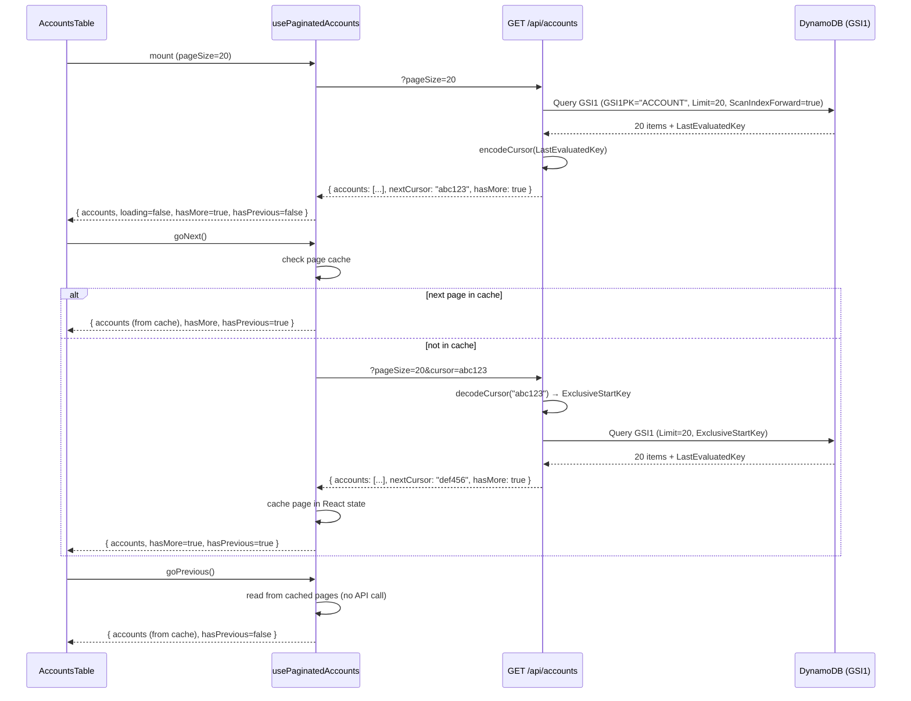

# Design Document

## Overview

This design refactors the accounts data model and pagination strategy across three layers: infrastructure (DynamoDB table + GSI), backend (import process + list API), and frontend (pagination hook + controls). The primary key shifts from `ACCOUNT#<zero_padded_number>` to `ACCOUNT#<uuid>`, a new overloaded GSI (`GSI1`) provides sorted access for cursor-based pagination, the list API replaces a full-table Scan with a targeted Query, and the frontend adopts forward/backward cursor navigation with in-memory page caching.

## Architecture

### Data Flow



### Key Design Decisions

1. **UUID-based PK**: `PK = "ACCOUNT#<uuid>"` decouples identity from the business-visible account number. The account number becomes a regular attribute (`shopUid`) projected into `GSI1SK` for sort access.

2. **Overloaded GSI pattern**: `GSI1` uses generic attribute names (`GSI1PK`, `GSI1SK`) so future entity types (items, sales) can reuse the same index with different partition key values (e.g., `ITEM`, `SALE`).

3. **Cursor = base64(LastEvaluatedKey)**: The cursor is an opaque token. The client never interprets it — it simply passes the previous response's `nextCursor` back on the next request.

4. **Frontend page cache**: Pages are stored in a simple ordered array. Backward navigation reads from the cache; forward navigation fetches only when the page isn't already cached. Changing page size invalidates the entire cache.

## Components and Interfaces

### 1. Infrastructure (Terraform)

**File:** `infrastructure/dynamodb.tf`

Add a `global_secondary_index` block for `GSI1` and declare the two new String attributes (`GSI1PK`, `GSI1SK`). The existing `sourceId-index` GSI remains unchanged.

### 2. Import Process

**File:** `projects/shop-api/src/import/sync-to-shop-table.ts`

Changes to the creation path:

- Generate a v4 UUID via `crypto.randomUUID()`
- Write `PK = "ACCOUNT#<uuid>"`, `SK = "METADATA"`
- Write `uuid = <uuid>` (same value, without prefix)
- Write `shopUid = <zero_padded_account_number>`
- Write `GSI1PK = "ACCOUNT"`, `GSI1SK = <zero_padded_account_number>`
- Write `sourceId` for change-detection (unchanged)

Changes to the update path:

- Preserve existing `PK`, `GSI1PK`, `GSI1SK` (do not overwrite keys)
- Update only mutable attributes (name, street, place, etc.)

### 3. List Accounts API

**File:** `projects/shop-api/src/routes/list-accounts.ts`

Complete rewrite from Scan-based to Query-based pagination:

- Accept `pageSize` (20|50|100, default 20) and `cursor` (optional base64 string)
- Reject legacy params (`pageIndex`, `sortColumn`, `sortDirection`) — return 400 or ignore
- Query `GSI1` with `GSI1PK = "ACCOUNT"`, `ScanIndexForward = true`, `Limit = pageSize`
- If `cursor` provided, decode base64 → JSON → `ExclusiveStartKey`
- Return `{ accounts, nextCursor, hasMore }`

### 4. Frontend API Client

**File:** `projects/shop/src/features/accounts/accounts-api.ts`

Replace `buildPaginatedAccountsUrl` / `fetchPaginatedAccounts`:

- New function accepts `{ pageSize, cursor? }` and returns `{ accounts, nextCursor, hasMore }`
- Remove sort-related parameters

### 5. Frontend Pagination Hook

**File:** `projects/shop/src/features/accounts/use-paginated-accounts.ts`

Replace offset-based state with cursor-based state:

- Maintain a page cache: `Array<{ accounts: Account[]; nextCursor: string | null }>`
- Track `currentPageIndex` into the cache
- `goNext`: if cache has next page, use it; otherwise fetch with stored `nextCursor`
- `goPrevious`: decrement index, read from cache
- `setPageSize`: clear cache, fetch first page with new size

### 6. Frontend Pagination Controls

**File:** `projects/shop/src/features/accounts/pagination-controls.tsx`

Simplify:

- Remove "Page X of Y" display (no total count available)
- Previous disabled when `currentPageIndex === 0`
- Next disabled when `hasMore === false` and no cached next page
- Retain page size selector (20, 50, 100)

### 7. Accounts Table

**File:** `projects/shop/src/features/accounts/accounts-table.tsx`

- Remove sorting state, `onSortingChange`, `SortIndicator` component
- Remove `manualSorting` and sort-related TanStack Table config
- Display data in received order (account number ascending from API)

### Interfaces

#### API Request

```typescript
// GET /api/accounts?pageSize=20&cursor=<base64_token>
interface ListAccountsQueryParams {
  pageSize?: "20" | "50" | "100";
  cursor?: string;
}
```

#### API Response

```typescript
interface ListAccountsResponse {
  accounts: Account[];
  nextCursor: string | null;
  hasMore: boolean;
}
```

#### Account Record (DynamoDB)

```typescript
interface AccountRecord {
  PK: string;        // "ACCOUNT#<uuid>"
  SK: string;        // "METADATA"
  uuid: string;      // same UUID without prefix
  shopUid: string;   // zero-padded account number (e.g., "0000042")
  name: string;
  street?: string;
  place?: string;
  postcode?: string;
  canton?: string;
  email?: string;
  telephone?: string;
  company?: string;
  sourceId: string;
  GSI1PK: string;    // "ACCOUNT"
  GSI1SK: string;    // zero-padded account number (same as shopUid)
  createdAt: string;
}
```

#### Frontend Types

```typescript
type PageSize = 20 | 50 | 100;

interface CursorPaginationParams {
  pageSize: PageSize;
  cursor?: string;
}

interface CursorPaginatedResponse {
  accounts: Account[];
  nextCursor: string | null;
  hasMore: boolean;
}

interface CachedPage {
  accounts: Account[];
  nextCursor: string | null;
}

interface UseCursorPaginatedAccountsResult {
  accounts: Account[];
  loading: boolean;
  error: string | null;
  hasMore: boolean;
  hasPrevious: boolean;
  pageSize: PageSize;
  goNext: () => void;
  goPrevious: () => void;
  setPageSize: (size: PageSize) => void;
  retry: () => void;
}
```

#### Cursor Encoding/Decoding (Backend)

```typescript
function encodeCursor(lastEvaluatedKey: Record<string, unknown>): string {
  return Buffer.from(JSON.stringify(lastEvaluatedKey)).toString("base64url");
}

function decodeCursor(cursor: string): Record<string, unknown> {
  const json = Buffer.from(cursor, "base64url").toString("utf-8");
  return JSON.parse(json) as Record<string, unknown>;
}
```

## Data Models

### DynamoDB Table Schema (after migration)

| Attribute | Type | Role |
|-----------|------|------|
| PK | S | Table partition key — `"ACCOUNT#<uuid>"` |
| SK | S | Table sort key — `"METADATA"` for account records |
| GSI1PK | S | GSI1 partition key — `"ACCOUNT"` for all account records |
| GSI1SK | S | GSI1 sort key — zero-padded account number |
| uuid | S | Same UUID used in PK (without prefix) |
| shopUid | S | Zero-padded account number (business identifier) |
| sourceId | S | External system ID for change detection |
| name | S | Account name |
| street | S | Optional address field |
| place | S | Optional city field |
| postcode | S | Optional postal code |
| canton | S | Optional canton/state |
| email | S | Optional email |
| telephone | S | Optional phone |
| company | S | Optional company name |
| createdAt | S | ISO 8601 creation timestamp |

### GSI1 Access Pattern

| GSI1PK | GSI1SK | Use Case |
|--------|--------|----------|
| `"ACCOUNT"` | `"0000001"` | List all accounts sorted by account number |
| `"ITEM"` (future) | `"<sort_value>"` | List items (reusable pattern) |
| `"SALE"` (future) | `"<sort_value>"` | List sales (reusable pattern) |

### Frontend Page Cache Structure

```
pageCache: CachedPage[] = [
  { accounts: [...page0...], nextCursor: "abc123" },
  { accounts: [...page1...], nextCursor: "def456" },
  { accounts: [...page2...], nextCursor: null },
]
currentPageIndex: 0 | 1 | 2
```

## Error Handling

### Backend

| Condition | HTTP Status | Response |
|-----------|-------------|----------|
| Invalid `pageSize` (not 20/50/100) | 400 | `{ error: "pageSize must be one of 20, 50, 100" }` |
| Invalid `cursor` (not valid base64 or not valid JSON) | 400 | `{ error: "Invalid cursor" }` |
| Legacy params provided (`pageIndex`, `sortColumn`, `sortDirection`) | 400 | `{ error: "Unsupported parameter: <name>" }` |
| DynamoDB error | 500 | `{ error: "internal_error" }` |

### Frontend

| Condition | Behavior |
|-----------|----------|
| API returns error | Display error message with retry button |
| Network failure | Display "Unable to load accounts" with retry |
| Request timeout (30s) | Display "Request timed out" with retry |
| Request aborted (navigation away) | Silently ignore |

### Cursor Validation Strategy

The cursor is treated as an opaque token. Validation on decode:

1. Attempt base64url decode → if fails, return 400
2. Attempt JSON.parse → if fails, return 400
3. Pass decoded object as `ExclusiveStartKey` to DynamoDB — if DynamoDB rejects it, it throws a `ValidationException` which maps to 400

## Testing Strategy

### Property-Based Tests (fast-check)

Property-based tests target the pure logic and data transformation layers:

- **Cursor codec** (encode/decode round-trip) — pure function, large input space
- **Record builder** (import process record shape) — pure transformation, many input combinations
- **Page size validation** — small but exhaustively testable domain
- **Pagination sequential consistency** — varies with dataset size and page size
- **Frontend cache behavior** — stateful but deterministic navigation sequences

### Unit Tests (vitest)

Example-based tests for specific integration points and UI behaviors:

- DynamoDB Query construction (correct GSI, parameters)
- API response shape with mocked DynamoDB
- Component rendering (button states, absence of sort UI)
- Error handling paths (network failure, timeout, invalid responses)

### Infrastructure Validation

- Terraform plan validation (GSI1 declared with correct attributes)
- Existing sourceId-index GSI preserved unchanged

## Correctness Properties

*A property is a characteristic or behavior that should hold true across all valid executions of a system — essentially, a formal statement about what the system should do. Properties serve as the bridge between human-readable specifications and machine-verifiable correctness guarantees.*

### Property 1: Account record shape invariant

*For any* valid import input (account number and associated fields), the produced Account_Record SHALL have: `PK` matching the pattern `ACCOUNT#<valid-v4-uuid>`, `SK` equal to `"METADATA"`, `shopUid` equal to the zero-padded account number, `GSI1PK` equal to `"ACCOUNT"`, `GSI1SK` equal to the zero-padded account number, `sourceId` present, and `uuid` equal to the UUID portion of `PK`.

**Validates: Requirements 1.1, 1.2, 1.3, 2.2, 2.3, 7.1, 7.2, 7.4, 7.5**

### Property 2: Update preserves immutable fields

*For any* existing Account_Record and any set of mutable field changes, applying an update SHALL preserve the original `PK`, `GSI1PK`, and `GSI1SK` values unchanged.

**Validates: Requirements 1.5, 7.3**

### Property 3: Page size validation

*For any* integer value provided as `pageSize`, the List_Accounts_API SHALL accept it if and only if it is one of 20, 50, or 100; all other values SHALL result in an HTTP 400 response.

**Validates: Requirements 3.1, 3.10**

### Property 4: Cursor round-trip encoding

*For any* valid DynamoDB `LastEvaluatedKey` object (containing string-valued `PK`, `SK`, `GSI1PK`, `GSI1SK` keys), encoding it as a cursor and then decoding that cursor SHALL produce an object deeply equal to the original.

**Validates: Requirements 3.7**

### Property 5: Invalid cursor rejection

*For any* string that is not a valid base64url-encoded JSON object, the List_Accounts_API SHALL return HTTP 400.

**Validates: Requirements 3.9**

### Property 6: Pagination sequential consistency

*For any* dataset of N accounts and any valid page size, fetching all pages sequentially (starting without a cursor, then using each response's `nextCursor`) SHALL yield every account exactly once in ascending account-number order, with no gaps or duplicates.

**Validates: Requirements 3.4, 3.6**

### Property 7: Page cache avoids redundant fetches

*For any* sequence of forward navigations followed by backward navigations, re-visiting a previously fetched page SHALL use the cached data without making an additional API request.

**Validates: Requirements 4.5, 4.6**

### Property 8: Page size change invalidates cache

*For any* page size change from the current value to a different allowed value, the page cache SHALL be cleared and the first page SHALL be fetched with the new page size.

**Validates: Requirements 4.7, 5.3**

### Property 9: Navigation button state reflects position

*For any* pagination state, the "Previous" button SHALL be disabled if and only if the user is on the first page, and the "Next" button SHALL be disabled if and only if the current page's `hasMore` is false and no cached next page exists.

**Validates: Requirements 4.3, 4.4**

### Property 10: Display order preserves API order

*For any* array of accounts returned by the API, the accounts table SHALL render rows in the same order as the array, which is ascending by account number.

**Validates: Requirements 6.1**
