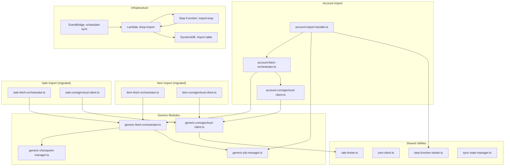

# Design Document: Account Sync Refactor

## Overview

This design extracts shared fetch-stage-sync plumbing from the existing Item and Sale import modules into generic, parameterized modules, then implements a new Account import using those generics. The refactoring follows the "extract and wrap" pattern: generic modules provide the core logic, while entity-specific modules become thin wrappers supplying configuration and type-specific behavior.

The Account import fetches all accounts (with full includes/expands) from ConsignCloud, stages them in the import DynamoDB table, and stops at the "paused" state. No transform/sync-to-shop-table phase is implemented.

### Design Rationale

The existing `job-manager.ts` and `sale-job-manager.ts` are nearly identical — differing only in DynamoDB key prefix. Same for `checkpoint-manager.ts` and `sale-checkpoint-manager.ts`. The HTTP retry/rate-limit logic in `item-consigncloud-client.ts` and `sale-consigncloud-client.ts` is duplicated verbatim (~150 lines). Extracting these into parameterized generics eliminates ~400 lines of duplication and makes adding new import types trivial.

## Architecture



### Key Design Decisions

1. **Parameterization over inheritance**: Generic modules accept configuration objects and callback functions rather than using class hierarchies. This matches the existing functional style of the codebase.

2. **Thin wrappers preserve existing exports**: After migration, `item-fetch-orchestrator.ts` still exports `runFetchLoop` with the same signature. Internal implementation delegates to the generic. This maintains backward compatibility with `item-import-handler.ts`.

3. **Single Lambda, extended routing**: The existing import Lambda already handles multiple import types via action/route dispatching. Account import adds new routes to the same Lambda rather than creating a separate function. This keeps infrastructure simple and shares the SSM/DynamoDB client initialization.

4. **`updated:gt` for incremental sync**: The ConsignCloud accounts API supports filtering by update time. Since we want accounts modified since last sync (not just created), we use `updated:gt` as the filter parameter for incremental sync.

## Components and Interfaces

### Generic ConsignCloud Client (`generic-consigncloud-client.ts`)

Extracted from the duplicated retry/backoff logic in `item-consigncloud-client.ts` and `sale-consigncloud-client.ts`.

```typescript
export interface ConsignCloudClientConfig {
  apiKey: string;
  baseUrl: string;
  rateLimiter: RateLimiter;
  requestTimeoutMs?: number;
}

export interface FetchPageResult<T> {
  data: T[];
  nextCursor: string | null;
}

/**
 * Executes a GET request with full retry logic:
 * - 429: exponential backoff, respects Retry-After, max 5 consecutive
 * - 5xx: up to 3 retries with exponential backoff
 * - Timeout: AbortSignal.timeout, default 30s
 * - Other 4xx: throws immediately with status + body
 */
export async function fetchWithRetry(
  url: string,
  config: ConsignCloudClientConfig,
): Promise<Response>;
```

Entity-specific clients become thin wrappers that build a URL (with their specific `include`, `expand`, and filter params) and call `fetchWithRetry`, then parse the JSON response.

### Generic Job Manager (`generic-job-manager.ts`)

Parameterized by import type prefix. Extracts the identical logic from `job-manager.ts` and `sale-job-manager.ts`.

```typescript
export type JobState = "running" | "paused" | "failed" | "complete";
export type ImportPhase = "fetch" | "sync";

export interface ProgressCounts {
  processed: number;
  imported: number;
  skipped: number;
  failed: number;
}

export interface ImportJob {
  jobId: string;
  state: JobState;
  phase: ImportPhase;
  startedAt: string;
  lastUpdatedAt: string;
  filterParams: { createdAfter?: string };
  error?: string;
  progress: ProgressCounts;
}

export interface GenericJobManagerConfig {
  prefix: string; // e.g. "ITEM_IMPORT", "SALE_IMPORT", "ACCOUNT_IMPORT"
}

export function createJobManager(config: GenericJobManagerConfig): {
  createJob(filterParams: { createdAfter?: string }): Promise<ImportJob>;
  getJob(jobId: string): Promise<ImportJob | null>;
  getRunningOrPausedJob(): Promise<ImportJob | null>;
  transitionJob(jobId: string, state: JobState, progress: ProgressCounts, error?: string): Promise<void>;
  updateJobPhase(jobId: string, phase: ImportPhase): Promise<void>;
};
```

State transitions enforced:
- `running` → `complete`, `paused`, `failed`
- `paused` → `running`
- `failed` → `running`
- `complete` → (none)

DynamoDB key pattern: `PK: "<PREFIX>#<jobId>"`, `SK: "METADATA"`.

### Generic Checkpoint Manager (`generic-checkpoint-manager.ts`)

Parameterized by import type prefix. Extracts the identical logic from `checkpoint-manager.ts` and `sale-checkpoint-manager.ts`.

```typescript
export interface Checkpoint {
  jobId: string;
  cursor: string | null;
  progress: ProgressCounts;
  lastUpdatedAt: string;
}

export interface GenericCheckpointManagerConfig {
  prefix: string; // e.g. "ITEM_IMPORT", "SALE_IMPORT", "ACCOUNT_IMPORT"
}

export function createCheckpointManager(config: GenericCheckpointManagerConfig): {
  saveCheckpoint(checkpoint: Checkpoint): Promise<void>;
  loadCheckpoint(jobId: string): Promise<Checkpoint | null>;
};
```

Key pattern: `PK: "<PREFIX>#<jobId>"`, `SK: "CHECKPOINT"`.
Retry logic: 3 attempts with 500ms delay between failures on save.

### Generic Fetch Orchestrator (`generic-fetch-orchestrator.ts`)

Parameterized by a page-fetch function and a record-staging function. Extracts the loop/checkpoint/timeout logic from `item-fetch-orchestrator.ts` and `sale-fetch-orchestrator.ts`.

```typescript
export interface GenericFetchOrchestratorConfig<T> {
  jobId: string;
  startTime: number;
  timeoutThresholdMs: number;
  pageLimit: number;
  fetchPage: (cursor: string | null, limit: number) => Promise<FetchPageResult<T>>;
  stageRecords: (records: T[]) => Promise<{ staged: number; skipped: number }>;
  jobManager: {
    getJob(jobId: string): Promise<ImportJob | null>;
    transitionJob(jobId: string, state: JobState, progress: ProgressCounts): Promise<void>;
  };
  checkpointManager: {
    saveCheckpoint(checkpoint: Checkpoint): Promise<void>;
    loadCheckpoint(jobId: string): Promise<Checkpoint | null>;
  };
}

export interface FetchLoopResult {
  status: "continue" | "complete";
  jobId: string;
}

export async function runGenericFetchLoop<T>(
  config: GenericFetchOrchestratorConfig<T>,
): Promise<FetchLoopResult>;
```

The generic loop:
1. Loads checkpoint (resume) or starts fresh
2. Calls `fetchPage(cursor, limit)` in a loop
3. Calls `stageRecords(records)` for each page
4. Saves checkpoint after each page
5. On cursor exhaustion → transitions job to "paused", returns "complete"
6. On timeout threshold → returns "continue" (Step Function will re-invoke)

### Account ConsignCloud Client (`account-consigncloud-client.ts`)

Thin wrapper over `fetchWithRetry` from the generic client.

```typescript
export interface ConsignCloudAccount {
  id: string;
  name: string;
  email?: string | null;
  phone?: string | null;
  default_split?: number | null;
  last_settlement?: string | null;
  number_of_purchases?: number | null;
  default_inventory_type?: string | null;
  default_terms?: string | null;
  last_item_entered?: string | null;
  number_of_items?: number | null;
  created_by?: { id: string; name: string } | null;
  last_activity?: string | null;
  locations?: Array<{ id: string; name: string }> | null;
  recurring_fees?: Array<{ id: string; amount: number; description: string }> | null;
  tags?: string[] | null;
  is_vendor?: boolean | null;
  has_pending_invite?: boolean | null;
  created: string;
  updated?: string | null;
  [key: string]: unknown; // preserve all raw fields
}

export interface FetchAccountPageResult {
  accounts: ConsignCloudAccount[];
  nextCursor: string | null;
}

export interface AccountClientConfig {
  apiKey: string;
  baseUrl: string;
  rateLimiter: RateLimiter;
  updatedAfter?: string;
  requestTimeoutMs?: number;
}
```

Query parameters:
- `include=default_split,last_settlement,number_of_purchases,default_inventory_type,default_terms,last_item_entered,number_of_items,created_by,last_activity,locations,recurring_fees,tags,is_vendor,has_pending_invite`
- `expand=created_by,locations,recurring_fees`
- `limit=<pageLimit>`
- `cursor=<cursor>` (when resuming)
- `updated:gt=<timestamp>` (when incremental sync)

### Account Fetch Orchestrator (`account-fetch-orchestrator.ts`)

Wires the generic fetch orchestrator with account-specific configuration.

```typescript
export interface AccountFetchOrchestratorConfig {
  jobId: string;
  apiKey: string;
  baseUrl: string;
  rateLimiter: RateLimiter;
  startTime: number;
  timeoutThresholdMs: number;
}

export async function runAccountFetchLoop(
  config: AccountFetchOrchestratorConfig,
): Promise<FetchLoopResult>;
```

Staging logic writes to DynamoDB with:
- `PK: "IMPORT#CONSIGNCLOUD#ACCOUNT#<account_id>"`
- `SK: "METADATA"`
- Full raw ConsignCloud response payload spread onto the item
- `importedAt: <ISO 8601 timestamp>`
- Batch writes in groups of 25

### Account Import Handler (`account-import-handler.ts`)

API handlers following the same pattern as `sale-import-handler.ts`:

```typescript
export async function handleAccountImportStart(event): Promise<APIGatewayProxyResultV2>;
export async function handleAccountImportStatus(event): Promise<APIGatewayProxyResultV2>;
export async function handleAccountImportResume(event): Promise<APIGatewayProxyResultV2>;
export async function handleAccountImportCancel(event): Promise<APIGatewayProxyResultV2>;
export async function handleAccountResumeInternal(jobId, phase): Promise<AccountResumeInternalResult>;
```

Key behaviors:
- `start`: Rejects if running/paused account job exists (409). Creates job with `ACCOUNT_IMPORT` prefix. Starts Step Function.
- `status`: Returns job state, progress, phase.
- `resume`: Transitions failed/paused → running, starts Step Function.
- `cancel`: Deletes job + checkpoint records for paused/failed jobs.
- `resume-internal`: Called by Step Function loop. Only runs fetch phase (no sync phase for accounts).

### Step Function Starter Update

The `ImportJobType` union extends to include `"account"`:

```typescript
export type ImportJobType = "item" | "sale" | "account";
```

### Sync State Manager Update

Already supports `lastAccountSyncAt` field. The account import handler will:
1. On scheduled trigger: read `getSyncState()` → use `lastAccountSyncAt` as `updatedAfter`
2. On successful fetch completion: call `updateSyncStateField("lastAccountSyncAt", timestamp)`

## Data Models

### Import Table Records

#### Account Import Job
```
PK: "ACCOUNT_IMPORT#<uuid>"
SK: "METADATA"
jobId: string (UUID)
state: "running" | "paused" | "failed" | "complete"
phase: "fetch"  (always "fetch" for accounts — no sync phase)
startedAt: ISO 8601
lastUpdatedAt: ISO 8601
filterParams: { createdAfter?: string }
error?: string
progress: { processed, imported, skipped, failed }
```

#### Account Import Checkpoint
```
PK: "ACCOUNT_IMPORT#<uuid>"
SK: "CHECKPOINT"
jobId: string
cursor: string | null
progress: { processed, imported, skipped, failed }
lastUpdatedAt: ISO 8601
```

#### Staged Account Record
```
PK: "IMPORT#CONSIGNCLOUD#ACCOUNT#<account_id>"
SK: "METADATA"
id: string (ConsignCloud account ID)
name: string
... (all raw ConsignCloud fields preserved)
importedAt: ISO 8601
```

#### Sync State (existing, no changes)
```
PK: "SYNC_STATE"
SK: "METADATA"
lastAccountSyncAt: string | null
lastItemSyncAt: string | null
lastSaleSyncAt: string | null
updatedAt: ISO 8601
```

### Infrastructure Additions

#### API Gateway Routes (added to existing import module)
- `POST /api/import/accounts/start` → account import start
- `POST /api/import/accounts/status` → account import status
- `POST /api/import/accounts/resume` → account import resume
- `POST /api/import/accounts/cancel` → account import cancel

#### EventBridge Integration
The existing `scheduled-sync` EventBridge rule already triggers the import Lambda with `{ action: "scheduled-sync" }`. The handler will be extended to also trigger account import alongside item/sale imports. The scheduled sync handler will:
1. Check if an account import is already running → skip if so
2. Read `lastAccountSyncAt` from sync state
3. Create a new account import job with `createdAfter: lastAccountSyncAt`
4. Start the Step Function

No separate EventBridge rule is needed — accounts piggyback on the existing 15-minute schedule.

#### Lambda Environment (no changes)
The existing Lambda already has `IMPORT_TABLE_NAME`, `SSM_API_KEY_PATH`, `CONSIGNCLOUD_BASE_URL`, and `STATE_MACHINE_ARN` environment variables, which are sufficient for the account import.

## Error Handling

### API Layer
- **409 Conflict**: Returned when attempting to start an account import while one is already running/paused.
- **400 Bad Request**: Invalid JSON body or missing required fields.
- **404 Not Found**: Job ID doesn't exist.
- **500 Internal Server Error**: Step Function start failure (job transitions to "failed" with error message preserved).

### Fetch Layer (handled by generic client)
- **Rate limiting (429)**: Exponential backoff with Retry-After header respect. After 5 consecutive 429s, job pauses with error (not fails — allows manual resume).
- **Server errors (5xx)**: 3 retries with exponential backoff. After exhaustion, error propagates up and job pauses.
- **Timeout**: 30s per request. Throws immediately, job pauses.
- **Non-retryable 4xx**: Throws immediately with HTTP status and body. Job pauses.

### Orchestrator Layer
- **Lambda timeout approaching**: Saves checkpoint and returns "continue" so Step Function re-invokes. No data loss.
- **Unexpected errors in fetch loop**: Caught by handler, job transitions to "paused" (not "failed") so it can be resumed.
- **Checkpoint save failure**: Retried 3 times with 500ms delay. If all retries fail, error propagates up and job pauses. On resume, work since last successful checkpoint is repeated (idempotent staging via PK overwrites).

### Idempotency
Staged records use the ConsignCloud account ID in the PK (`IMPORT#CONSIGNCLOUD#ACCOUNT#<id>`). Re-staging the same account overwrites the previous record rather than creating duplicates. This makes checkpoint-based resumption safe.

## Testing Strategy

### Unit Tests
- **Generic modules**: Test each generic module in isolation with mocked DynamoDB calls.
  - `generic-job-manager`: state transitions (valid/invalid), job creation, concurrent job rejection.
  - `generic-checkpoint-manager`: save/load/retry behavior, null return for missing checkpoint.
  - `generic-consigncloud-client`: 429 backoff, 5xx retry, timeout, non-retryable 4xx.
  - `generic-fetch-orchestrator`: pagination loop, checkpoint saves, timeout detection, completion transition.
- **Account-specific modules**: Test URL construction, query parameter assembly, response parsing.
  - `account-consigncloud-client`: correct include/expand params, `updated:gt` filter, cursor forwarding.
  - `account-import-handler`: route handling, job lifecycle, error responses.

### Integration Tests
- **Backward compatibility**: After migration, run existing item/sale import test suites unchanged to confirm no regressions.
- **Account import end-to-end**: Mock ConsignCloud API responses, verify staged records in DynamoDB have correct key pattern and full payload.
- **Scheduled sync flow**: Verify sync state read → job creation → Step Function invocation → sync state update on completion.

### Why Property-Based Testing Does Not Apply

This feature is primarily:
1. **Infrastructure as Code** (Terraform routes, IAM policies) — verified by `terraform plan` and integration tests.
2. **CRUD operations with no transformation logic** — staging raw ConsignCloud payloads without mapping or computation.
3. **Orchestration wiring** — connecting existing retry/pagination patterns to a new entity type.
4. **Refactoring with extraction** — the behavior is unchanged; only the code organization changes.

There are no pure functions with meaningful input variation where property-based testing would find more bugs than example-based tests. The retry logic, for instance, depends on HTTP response codes (a small finite set), not on unbounded input. The generic modules are parameterized by callbacks, making them best tested via example-based integration tests with mocked dependencies.

Unit tests with representative examples (specific 429 sequences, checkpoint recovery scenarios, concurrent job rejection) provide better coverage for this feature than randomized property tests.
