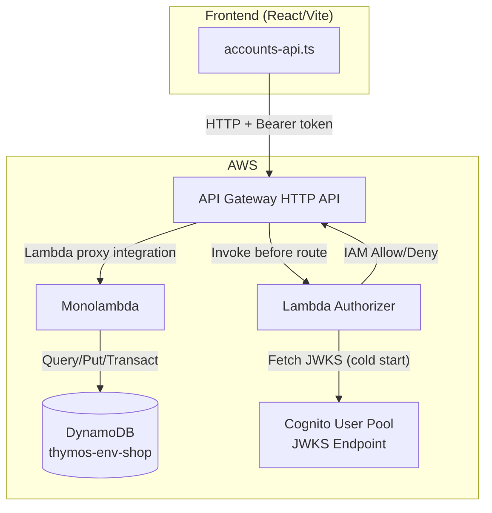

# Design Document: Accounts API Backend

## Overview

This feature implements the backend API that powers the existing accounts page frontend. It provides three HTTP endpoints served by a monolambda behind an API Gateway HTTP API, with authorization enforced by a Lambda authorizer that inspects Cognito JWT group claims.

The system follows a straightforward request flow: API Gateway receives HTTP requests, the Lambda authorizer validates the JWT and maps Cognito groups to IAM policies, and the monolambda handles all route logic internally by inspecting the `routeKey` from the API Gateway event.

### Key Design Decisions

1. **Monolambda pattern** — A single Lambda function handles all routes via internal routing. This reduces cold starts (one function stays warm for all endpoints), simplifies deployment, and keeps the DynamoDB client initialization shared across routes.
2. **Lambda authorizer over Cognito authorizer** — API Gateway's built-in Cognito authorizer only validates tokens; it cannot perform group-based route authorization. A custom Lambda authorizer inspects the `cognito:groups` claim and produces route-specific IAM policies.
3. **JWKS caching in authorizer** — The authorizer fetches the Cognito JWKS once per cold start and caches it in module-level scope. Combined with API Gateway's 300-second response cache, this minimizes latency.
4. **TransactWriteItems for account creation** — Atomically creates the account and updates the sequence counter in one operation, preventing race conditions between concurrent creates.
5. **esbuild for bundling** — Produces small, fast-loading Lambda artifacts. Each Lambda function gets its own entry point and output zip.
6. **Local file-based Lambda deployment** — Terraform references zip artifacts from `/projects/shop-api/dist/`. No S3 bucket needed for Lambda code at this stage.

## Architecture



### Request Flow

1. Frontend sends HTTP request with `Authorization: Bearer <access_token>`
2. API Gateway invokes the Lambda authorizer with the token
3. Authorizer validates JWT signature against Cognito JWKS, checks expiry/issuer/token_use
4. Authorizer extracts `cognito:groups` claim and returns IAM allow/deny policy for the requested route
5. If allowed, API Gateway invokes the monolambda with the full event (including `routeKey`)
6. Monolambda routes internally based on `routeKey`, executes DynamoDB operations, returns HTTP response

## Components and Interfaces

### Lambda Authorizer

**Entry point:** `/projects/shop-api/src/authorizer.ts`

Responsible for JWT validation and group-based authorization.

```typescript
import type {
  APIGatewayRequestAuthorizerEventV2,
  APIGatewaySimpleAuthorizerResult,
} from "aws-lambda";

export async function handler(
  event: APIGatewayRequestAuthorizerEventV2
): Promise<APIGatewaySimpleAuthorizerResult>;
```

Internal modules:

- `jwt-validator.ts` — Decodes and validates JWT (signature, expiry, issuer, token_use)
- `jwks-client.ts` — Fetches and caches JWKS from Cognito endpoint
- `policy-builder.ts` — Maps group claims to IAM allow/deny decisions

**Authorization logic:**

| Group Claim | GET routes | POST routes |
|-------------|-----------|-------------|
| `admin` | ✅ Allow | ✅ Allow |
| `readonly` | ✅ Allow | ❌ Deny |
| Neither | ❌ Deny | ❌ Deny |

**Note on authorizer type:** The authorizer uses the API Gateway HTTP API "simple response" format (`isAuthorized: true/false` with optional context), not the REST API IAM policy format. This is simpler and appropriate for HTTP APIs.

### Monolambda

**Entry point:** `/projects/shop-api/src/handler.ts`

Single Lambda function handling all API routes via internal routing.

```typescript
import type {
  APIGatewayProxyEventV2,
  APIGatewayProxyResultV2,
} from "aws-lambda";

export async function handler(
  event: APIGatewayProxyEventV2
): Promise<APIGatewayProxyResultV2>;
```

Internal modules:

- `router.ts` — Maps `routeKey` to route handler functions
- `routes/list-accounts.ts` — GET /api/accounts handler
- `routes/next-number.ts` — GET /api/accounts/next-number handler
- `routes/create-account.ts` — POST /api/accounts handler
- `validation.ts` — Request body validation functions
- `dynamodb-client.ts` — Shared DynamoDB DocumentClient instance
- `pk-utils.ts` — PK construction and parsing utilities
- `response.ts` — HTTP response builder helpers

### Router

**File:** `/projects/shop-api/src/router.ts`

```typescript
import type {
  APIGatewayProxyEventV2,
  APIGatewayProxyResultV2,
} from "aws-lambda";

type RouteHandler = (
  event: APIGatewayProxyEventV2
) => Promise<APIGatewayProxyResultV2>;

const routes: Record<string, RouteHandler> = {
  "GET /api/accounts": listAccounts,
  "GET /api/accounts/next-number": nextNumber,
  "POST /api/accounts": createAccount,
};

export function routeRequest(
  event: APIGatewayProxyEventV2
): Promise<APIGatewayProxyResultV2>;
```

### Validation Module

**File:** `/projects/shop-api/src/validation.ts`

```typescript
export interface CreateAccountInput {
  accountNumber: number;
  name: string;
  address: string;
  telephone: string;
}

export interface ValidationError {
  field: string;
  message: string;
}

export type ValidationResult =
  | { valid: true; data: CreateAccountInput }
  | { valid: false; errors: ValidationError[] };

export function validateCreateAccount(body: unknown): ValidationResult;
```

Validation rules:

- `accountNumber`: integer, 1 ≤ n ≤ 9999999
- `name`: non-empty string, max 100 chars, at least one non-whitespace character
- `address`: string, max 500 chars (optional — empty string allowed)
- `telephone`: string, max 30 chars (optional — empty string allowed)

### PK Utilities

**File:** `/projects/shop-api/src/pk-utils.ts`

```typescript
/** Constructs a DynamoDB PK from an account number: ACCOUNT#0000042 */
export function buildAccountPk(accountNumber: number): string;

/** Parses an account number from a DynamoDB PK: ACCOUNT#0000042 → 42 */
export function parseAccountPk(pk: string): number;

/** Formats an account number as a 7-digit zero-padded string */
export function formatAccountNumber(accountNumber: number): string;
```

### Response Helpers

**File:** `/projects/shop-api/src/response.ts`

```typescript
import type { APIGatewayProxyResultV2 } from "aws-lambda";

export function jsonResponse(statusCode: number, body: unknown): APIGatewayProxyResultV2;
export function textResponse(statusCode: number, body: string): APIGatewayProxyResultV2;
export function errorResponse(): APIGatewayProxyResultV2; // Always 500 + { error: "internal_error" }
```

## Data Models

### DynamoDB Item Schemas

The monolambda operates on the existing `thymos-<env>-shop` DynamoDB table using the single-table design documented in the accounts-page spec.

**Account Metadata Item:**

| Attribute | Type | Example |
|-----------|------|---------|
| PK | String | `ACCOUNT#0000042` |
| SK | String | `METADATA` |
| uuid | String | `550e8400-e29b-41d4-a716-446655440000` |
| name | String | `Jane Smith` |
| address | String | `123 Main St` |
| telephone | String | `555-0100` |
| createdAt | String | `2024-01-15T09:30:00.000Z` |

**Account Comment Item:**

| Attribute | Type | Example |
|-----------|------|---------|
| PK | String | `ACCOUNT#0000042` |
| SK | String | `COMMENT#2024-01-15T09:30:00.000Z` |
| text | String | `Customer prefers pickup` |
| author | String | `admin@shop.com` |

**Account Tag Item:**

| Attribute | Type | Example |
|-----------|------|---------|
| PK | String | `ACCOUNT#0000042` |
| SK | String | `TAG#vip` |
| label | String | `vip` |

**Sequence Counter Item:**

| Attribute | Type | Example |
|-----------|------|---------|
| PK | String | `SEQUENCE#ACCOUNT` |
| SK | String | `COUNTER` |
| nextValue | Number | `43` |

### DynamoDB Operations by Endpoint

**GET /api/accounts:**

1. Scan table with FilterExpression `SK = :metadata` (where `:metadata` = `METADATA`)
2. For each account item, Query with `PK = <account_pk>` and `SK begins_with COMMENT#` → count results
3. For each account item, Query with `PK = <account_pk>` and `SK begins_with TAG#` → extract labels
4. Map items to response shape

**GET /api/accounts/next-number:**

1. GetItem with `PK = SEQUENCE#ACCOUNT`, `SK = COUNTER`
2. If item exists, return `nextValue`; if not, return `1`

**POST /api/accounts:**

1. Validate request body
2. Generate UUID v4, set createdAt to `new Date().toISOString()`
3. Build PK: `ACCOUNT#` + zero-padded accountNumber
4. Execute TransactWriteItems:
   - Put Account_Item with ConditionExpression `attribute_not_exists(PK)`
   - Update Sequence_Counter: SET `nextValue = :newValue` if accountNumber >= current nextValue
5. Return 201 with created account

### API Response Shapes

**GET /api/accounts → 200:**

```json
{
  "accounts": [
    {
      "uuid": "550e8400-e29b-41d4-a716-446655440000",
      "shopUid": 42,
      "name": "Jane Smith",
      "address": "123 Main St",
      "telephone": "555-0100",
      "commentCount": 3,
      "tags": ["vip", "wholesale"]
    }
  ]
}
```

**GET /api/accounts/next-number → 200:**

```json
{ "nextNumber": 43 }
```

**POST /api/accounts → 201:**

```json
{
  "uuid": "generated-uuid",
  "shopUid": 42,
  "name": "Jane Smith",
  "address": "123 Main St",
  "telephone": "555-0100",
  "commentCount": 0,
  "tags": []
}
```

## Terraform Resource Layout

### New Files

**`infrastructure/api-gateway.tf`** — API Gateway HTTP API, stage, routes, integrations, authorizer attachment, CORS configuration.

**`infrastructure/lambda.tf`** — Both Lambda functions (monolambda + authorizer), IAM roles, IAM policies, Lambda permissions for API Gateway invocation.

### Resources in `api-gateway.tf`

| Resource | Name Pattern |
|----------|-------------|
| `aws_apigatewayv2_api.shop_api` | `${var.project_name}-${var.environment}-shop-api` |
| `aws_apigatewayv2_stage.default` | `$default` (auto-deploy) |
| `aws_apigatewayv2_authorizer.cognito` | Lambda authorizer, simple response, 300s TTL |
| `aws_apigatewayv2_integration.monolambda` | Lambda proxy integration |
| `aws_apigatewayv2_route.get_accounts` | `GET /api/accounts` |
| `aws_apigatewayv2_route.get_next_number` | `GET /api/accounts/next-number` |
| `aws_apigatewayv2_route.post_accounts` | `POST /api/accounts` |

**CORS Configuration:**

```hcl
cors_configuration {
  allow_origins = ["*"]  # Tighten to frontend origin in production
  allow_methods = ["GET", "POST", "OPTIONS"]
  allow_headers = ["Authorization", "Content-Type"]
  max_age       = 3600
}
```

### Resources in `lambda.tf`

| Resource | Purpose |
|----------|---------|
| `aws_lambda_function.shop_api` | Monolambda (Node.js 20.x, 256 MB, 30s timeout) |
| `aws_lambda_function.shop_api_authorizer` | Authorizer (Node.js 20.x, 128 MB, 5s timeout) |
| `aws_iam_role.shop_api_lambda` | Execution role for monolambda |
| `aws_iam_role.shop_api_authorizer` | Execution role for authorizer |
| `aws_iam_role_policy.shop_api_dynamodb` | DynamoDB permissions for monolambda |
| `aws_iam_role_policy.shop_api_logs` | CloudWatch Logs permission for monolambda |
| `aws_iam_role_policy.shop_api_authorizer_logs` | CloudWatch Logs permission for authorizer |
| `aws_lambda_permission.shop_api_apigw` | Allow API Gateway to invoke monolambda |
| `aws_lambda_permission.shop_api_authorizer_apigw` | Allow API Gateway to invoke authorizer |

**DynamoDB IAM Policy (monolambda):**

```json
{
  "Effect": "Allow",
  "Action": [
    "dynamodb:GetItem",
    "dynamodb:PutItem",
    "dynamodb:UpdateItem",
    "dynamodb:Query",
    "dynamodb:Scan",
    "dynamodb:TransactWriteItems"
  ],
  "Resource": "${aws_dynamodb_table.shop.arn}"
}
```

### Outputs (added to `outputs.tf`)

```hcl
output "shop_api_url" {
  description = "API Gateway invoke URL for the shop API"
  value       = aws_apigatewayv2_stage.default.invoke_url
}
```

## Project Structure

```
/projects/shop-api/
├── package.json
├── tsconfig.json
├── esbuild.config.mjs
├── src/
│   ├── handler.ts              # Monolambda entry point
│   ├── authorizer.ts           # Lambda authorizer entry point
│   ├── router.ts               # Route key → handler mapping
│   ├── routes/
│   │   ├── list-accounts.ts    # GET /api/accounts
│   │   ├── next-number.ts      # GET /api/accounts/next-number
│   │   └── create-account.ts   # POST /api/accounts
│   ├── validation.ts           # Request validation functions
│   ├── pk-utils.ts             # PK construction/parsing
│   ├── response.ts             # HTTP response helpers
│   ├── dynamodb-client.ts      # Shared DynamoDB client
│   └── auth/
│       ├── jwt-validator.ts    # JWT decode + validate
│       ├── jwks-client.ts      # JWKS fetch + cache
│       └── policy-builder.ts   # Group → simple auth response
├── tests/
│   ├── validation.test.ts
│   ├── validation.property.test.ts
│   ├── pk-utils.test.ts
│   ├── pk-utils.property.test.ts
│   ├── router.test.ts
│   ├── routes/
│   │   ├── list-accounts.test.ts
│   │   ├── next-number.test.ts
│   │   └── create-account.test.ts
│   ├── auth/
│   │   ├── jwt-validator.test.ts
│   │   ├── policy-builder.test.ts
│   │   └── policy-builder.property.test.ts
│   └── response.property.test.ts
└── dist/
    ├── handler.zip             # Monolambda deployment artifact
    └── authorizer.zip          # Authorizer deployment artifact
```

### Build Configuration

**`esbuild.config.mjs`:**

- Two entry points: `src/handler.ts` and `src/authorizer.ts`
- Target: `node20`
- Platform: `node`
- Format: `esm`
- Bundle: `true` (tree-shakes unused code)
- External: `@aws-sdk/*` (provided by Lambda runtime)
- Output: `dist/` directory, then zip each output

**`package.json` scripts:**

```json
{
  "scripts": {
    "build": "node esbuild.config.mjs",
    "test": "vitest run",
    "test:watch": "vitest",
    "lint": "eslint src/"
  }
}
```

**Dependencies:**

- `@aws-sdk/client-dynamodb` — DynamoDB client
- `@aws-sdk/lib-dynamodb` — DynamoDB DocumentClient
- `jose` — JWT validation (JWKS fetch, signature verification, claims validation)

**Dev Dependencies:**

- `typescript`
- `esbuild`
- `vitest`
- `fast-check` — Property-based testing
- `@types/aws-lambda` — Lambda event/response types
- `eslint`

## Correctness Properties

*A property is a characteristic or behavior that should hold true across all valid executions of a system — essentially, a formal statement about what the system should do. Properties serve as the bridge between human-readable specifications and machine-verifiable correctness guarantees.*

### Property 1: Account PK round-trip

*For any* integer N in the range [1, 9999999], constructing a DynamoDB PK with `buildAccountPk(N)` and then parsing it back with `parseAccountPk` SHALL produce the original integer N. Additionally, the constructed PK SHALL match the pattern `ACCOUNT#` followed by exactly 7 digits.

**Validates: Requirements 1.2, 3.3**

### Property 2: Sequence counter update logic

*For any* current sequence counter value C in [1, 9999999] and any account number N in [1, 9999999]: if N ≥ C, the new counter value SHALL be N + 1; if N < C, the counter value SHALL remain C.

**Validates: Requirements 3.5, 3.6**

### Property 3: Account number validation

*For any* value V, the account number validation SHALL accept V if and only if V is an integer with no fractional part and its numeric value is between 1 and 9999999 inclusive.

**Validates: Requirements 4.1**

### Property 4: Name validation

*For any* string S, the name validation SHALL accept S if and only if S has length between 1 and 100 inclusive and contains at least one non-whitespace character.

**Validates: Requirements 4.2**

### Property 5: Optional field length validation

*For any* string S and maximum length L (where L is 500 for address, 30 for telephone), the field validation SHALL accept S if and only if S has length ≤ L.

**Validates: Requirements 4.3, 4.4**

### Property 6: Authorization group-to-policy mapping

*For any* set of Cognito group claims G extracted from a valid JWT: if G contains `admin`, the authorizer SHALL return `isAuthorized: true`; if G contains `readonly` but not `admin`, the authorizer SHALL return `isAuthorized: true` with context indicating read-only access; if G contains neither `admin` nor `readonly`, the authorizer SHALL return `isAuthorized: false`.

**Validates: Requirements 5.1, 5.2, 5.3, 5.4**

### Property 7: JWT claims validation rejects invalid tokens

*For any* JWT where the `iss` claim does not match the configured Cognito User Pool URL, or the `token_use` claim is not `access`, or the token is expired, the authorizer SHALL return `isAuthorized: false`.

**Validates: Requirements 5.6, 5.7**

### Property 8: Error responses contain no internal details

*For any* error produced by the monolambda (DynamoDB failures, validation errors, unexpected exceptions), the HTTP response body SHALL NOT contain substrings matching AWS ARN patterns, DynamoDB table names, file paths, or stack trace patterns (lines containing ` at ` followed by file references).

**Validates: Requirements 9.2**

### Property 9: Comment count aggregation

*For any* account with N comment items (items where SK begins with `COMMENT#`), the list accounts response SHALL include `commentCount` equal to N (including N = 0).

**Validates: Requirements 10.1, 10.3**

### Property 10: Tag extraction

*For any* account with a set of tag items (items where SK begins with `TAG#`), the list accounts response SHALL include a `tags` array containing exactly the label values from those items, with no duplicates and no missing entries (including the empty set case).

**Validates: Requirements 10.2, 10.4**

## Error Handling

### Error Response Matrix

| Scenario | Status | Body | Content-Type |
|----------|--------|------|-------------|
| DynamoDB service error | 500 | `{"error":"internal_error"}` | application/json |
| Validation failure | 400 | `{"error":"validation_error","fields":[...]}` | application/json |
| Duplicate account number | 409 | `duplicate` | text/plain |
| Account number exceeds max | 422 | `max_reached` | text/plain |
| Unknown route | 404 | `{"error":"not_found"}` | application/json |
| Malformed JSON body | 400 | `{"error":"invalid_json"}` | application/json |
| Missing/invalid auth token | 401 | (API Gateway default) | — |
| Insufficient permissions | 403 | (API Gateway default) | — |

### Error Handling Strategy

1. **Catch-all in handler** — The monolambda wraps each route handler in a try/catch. Any unhandled exception produces a 500 `internal_error` response. No stack traces leak to the client.

2. **DynamoDB errors** — All DynamoDB operations are wrapped with specific error type detection:
   - `TransactionCanceledException` with `ConditionalCheckFailed` → 409 duplicate
   - All other DynamoDB errors → 500 internal_error

3. **Validation errors** — Detected before any DynamoDB operation. Returns 400 with a structured error listing each invalid field and its constraint violation.

4. **Authorizer errors** — If JWT validation fails for any reason (expired, bad signature, missing claims), the authorizer returns `isAuthorized: false`. API Gateway translates this to a 401 response automatically.

5. **Logging** — Errors are logged to CloudWatch via `console.error` with the original error object for debugging. The log output never reaches the client.

### Security Considerations

- Error responses use fixed strings (`internal_error`, `duplicate`, `max_reached`) — never interpolated error messages
- Stack traces and AWS SDK error details are logged but never returned in response bodies
- The authorizer does not reveal whether a token is expired vs. invalid vs. missing — all produce the same deny result

## Testing Strategy

### Property-Based Tests (fast-check)

The project uses `fast-check` for property-based testing. Each property test runs a minimum of 100 iterations.

| Property | Test File | Description |
|----------|-----------|-------------|
| Property 1 | `pk-utils.property.test.ts` | PK round-trip (build → parse → original) |
| Property 2 | `routes/create-account.property.test.ts` | Sequence counter update logic |
| Property 3 | `validation.property.test.ts` | accountNumber accepts only integers in [1, 9999999] |
| Property 4 | `validation.property.test.ts` | name accepts non-whitespace strings ≤ 100 chars |
| Property 5 | `validation.property.test.ts` | Optional fields accept strings within max length |
| Property 6 | `auth/policy-builder.property.test.ts` | Group claims → authorization decision mapping |
| Property 7 | `auth/jwt-validator.property.test.ts` | Invalid claims produce deny |
| Property 8 | `response.property.test.ts` | Error responses contain no internal details |
| Property 9 | `routes/list-accounts.property.test.ts` | Comment count matches item count |
| Property 10 | `routes/list-accounts.property.test.ts` | Tags array matches tag item labels |

**Tag format:** `Feature: accounts-api-backend, Property {N}: {description}`

### Unit Tests (vitest)

Example-based tests for specific scenarios:

- Router dispatches correct handler for each routeKey
- List accounts returns empty array for no items
- Next number returns 1 when counter doesn't exist
- Create account returns 409 on duplicate
- Create account returns 422 when accountNumber > 9999999
- Validation rejects missing required fields
- Validation rejects non-integer accountNumber
- Error response helper produces correct structure
- Authorizer returns deny for expired tokens
- Authorizer returns deny for missing Authorization header

### Integration Tests

- Full create → list flow against DynamoDB Local
- TransactWriteItems atomicity verification
- Authorizer with real (test-signed) JWTs

### Test Configuration

```json
{
  "test": {
    "globals": true,
    "environment": "node",
    "include": ["tests/**/*.test.ts", "tests/**/*.property.test.ts"]
  }
}
```

### Test File Naming Convention

- `*.test.ts` — unit tests (example-based)
- `*.property.test.ts` — property-based tests

### CORS Testing

CORS configuration is validated at the Terraform level (correct `cors_configuration` block). No runtime CORS tests needed since API Gateway handles CORS headers automatically for HTTP APIs.
