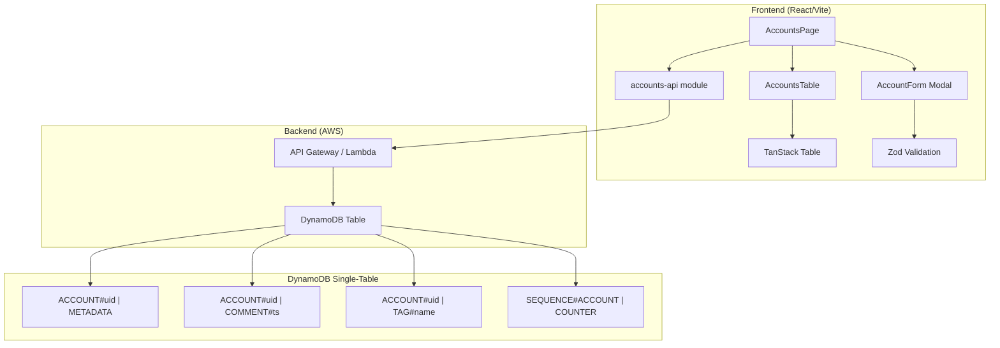
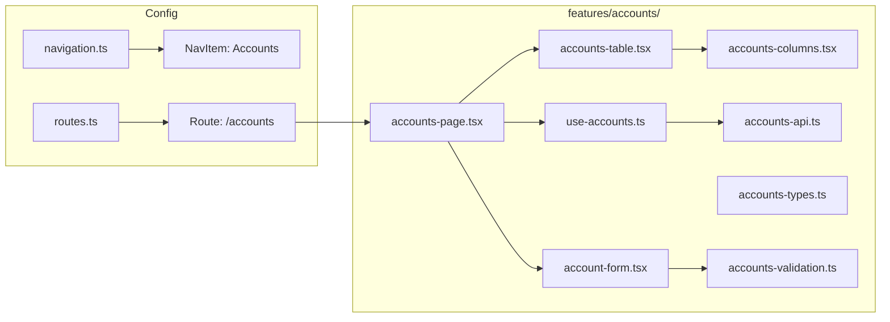

# Design Document: Accounts Page

## Overview

The Accounts Page feature adds a full-featured data table for managing consigner accounts in the shop application. It introduces the first "shop entity" backed by a DynamoDB single-table design, establishing reusable patterns (comments, tags, sequence counters) for future entity types.

The frontend is a React page at `/accounts` behind the existing `AuthGuard`, rendering a sortable data table (shadcn/ui data table pattern with TanStack Table) and a modal form for creating new accounts. The backend consists of a DynamoDB table with composite keys and an API layer (to be defined in a future API spec — this design focuses on the frontend data layer abstraction and the DynamoDB schema).

### Key Design Decisions

1. **TanStack Table for data table** — The shadcn/ui data table pattern uses `@tanstack/react-table` for headless table logic (sorting, column definitions). This aligns with the existing shadcn/ui approach.
2. **Zod for form validation** — Already in the project dependencies; used for client-side validation schemas.
3. **Single-table DynamoDB design** — All shop entities share one table with composite keys, enabling future entity types (products, orders) to reuse the same infrastructure and access patterns.
4. **API abstraction layer** — Frontend talks to an `accounts-api` module that returns typed responses. The actual transport (REST, GraphQL, direct SDK) is abstracted behind this interface.
5. **Optimistic sequence counter** — The "Add Account" form fetches the next available UID from the sequence counter endpoint and pre-fills the field, but the user can override it.

## Architecture



### Frontend Architecture



## Components and Interfaces

### Page Component: `AccountsPage`

**File:** `src/features/accounts/accounts-page.tsx`

The top-level page component rendered at `/accounts`. Coordinates the data table and the creation modal.

```typescript
export function AccountsPage(): React.ReactNode
```

Responsibilities:

- Renders the page header with title and "Add Account" button
- Manages modal open/close state
- Hosts `AccountsTable` and `AccountForm` (in a dialog)
- Triggers data refresh after successful account creation
- Manages focus return to "Add Account" button after modal close

### Table Component: `AccountsTable`

**File:** `src/features/accounts/accounts-table.tsx`

Renders the data table using TanStack Table with shadcn/ui table primitives.

```typescript
export interface AccountsTableProps {
  data: Account[]
  loading: boolean
  error: string | null
}

export function AccountsTable(props: AccountsTableProps): React.ReactNode
```

Responsibilities:

- Defines column configuration via `accounts-columns.tsx`
- Handles sorting state (single-column sort, toggle asc/desc)
- Displays loading skeleton, error state, or empty state
- Applies proper table semantics and ARIA attributes for accessibility

### Column Definitions: `accountsColumns`

**File:** `src/features/accounts/accounts-columns.tsx`

```typescript
import type { ColumnDef } from "@tanstack/react-table"
import type { Account } from "./accounts-types"

export const accountsColumns: ColumnDef<Account>[]
```

Columns (in order):

| Column | Accessor | Sortable | Display |
|--------|----------|----------|---------|
| Account # | `shopUid` | Yes (numeric) | 7-digit zero-padded |
| Name | `name` | Yes (alpha) | Raw string |
| Address | `address` | Yes (alpha) | Raw string |
| Telephone | `telephone` | Yes (alpha) | Raw string |
| Comments | `commentCount` | No | Numeric count |
| Tags | `tags` | No | Comma-separated |

### Form Component: `AccountForm`

**File:** `src/features/accounts/account-form.tsx`

Modal dialog form for creating a new account.

```typescript
export interface AccountFormProps {
  open: boolean
  onClose: () => void
  onSuccess: () => void
  defaultAccountNumber: number | null
}

export function AccountForm(props: AccountFormProps): React.ReactNode
```

Responsibilities:

- Renders input fields: account number, name, address, telephone
- Validates using Zod schema (see Validation section)
- Formats account number on blur (zero-padded display)
- Manages submission state (idle, submitting, error)
- Handles 30-second timeout
- Disables all inputs and submit button during submission
- Returns focus management to parent on close

### Validation Schema: `accountFormSchema`

**File:** `src/features/accounts/accounts-validation.ts`

```typescript
import { z } from "zod"

export const accountNumberSchema: z.ZodType<number>
export const accountFormSchema: z.ZodType<AccountFormData>

export interface AccountFormData {
  accountNumber: number
  name: string
  address: string
  telephone: string
}
```

Validation rules:

- `accountNumber`: integer, 1–9999999, no decimals/negatives/non-digits
- `name`: required, 1–100 characters, at least one non-whitespace character
- `address`: optional, max 500 characters
- `telephone`: optional, max 30 characters

### API Module: `accounts-api`

**File:** `src/features/accounts/accounts-api.ts`

```typescript
export interface AccountsApiResponse {
  accounts: Account[]
}

export interface CreateAccountRequest {
  accountNumber: number
  name: string
  address: string
  telephone: string
}

export type CreateAccountResult =
  | { success: true; account: Account }
  | { success: false; error: "duplicate" | "max_reached" | "network" | "server" | "timeout" }

export function fetchAccounts(): Promise<AccountsApiResponse>
export function fetchNextAccountNumber(): Promise<number>
export function createAccount(data: CreateAccountRequest): Promise<CreateAccountResult>
```

### Custom Hook: `useAccounts`

**File:** `src/features/accounts/use-accounts.ts`

```typescript
export interface UseAccountsResult {
  accounts: Account[]
  loading: boolean
  error: string | null
  refresh: () => void
}

export function useAccounts(): UseAccountsResult
```

### Utility: `formatShopUid`

**File:** `src/features/accounts/accounts-utils.ts`

```typescript
/** Formats a numeric shop UID as a 7-digit zero-padded string */
export function formatShopUid(uid: number): string
```

## Data Models

### Frontend Types

**File:** `src/features/accounts/accounts-types.ts`

```typescript
export interface Account {
  uuid: string
  shopUid: number
  name: string
  address: string
  telephone: string
  commentCount: number
  tags: string[]
}
```

### DynamoDB Item Schemas

**Account Metadata Item:**

```
PK: ACCOUNT#0000042
SK: METADATA
uuid: "550e8400-e29b-41d4-a716-446655440000"
name: "Jane Smith"
address: "123 Main St"
telephone: "555-0100"
createdAt: "2024-01-15T09:30:00.000Z"
```

**Account Comment Item:**

```
PK: ACCOUNT#0000042
SK: COMMENT#2024-01-15T09:30:00.000Z
text: "Customer prefers pickup"
author: "admin@shop.com"
```

**Account Tag Item:**

```
PK: ACCOUNT#0000042
SK: TAG#vip
label: "vip"
```

**Sequence Counter Item:**

```
PK: SEQUENCE#ACCOUNT
SK: COUNTER
nextValue: 43
```

### DynamoDB Access Patterns

| Access Pattern | Key Condition | Use |
|---|---|---|
| Get account metadata | PK = `ACCOUNT#<uid>`, SK = `METADATA` | Load single account |
| List all accounts | Scan with SK = `METADATA` filter | Accounts table |
| Get account comments | PK = `ACCOUNT#<uid>`, SK begins_with `COMMENT#` | Comment count / list |
| Get account tags | PK = `ACCOUNT#<uid>`, SK begins_with `TAG#` | Tag list |
| Get next UID | PK = `SEQUENCE#ACCOUNT`, SK = `COUNTER` | Pre-fill form |
| Create account | PutItem with condition | New account |

### Terraform Resources (DynamoDB Table)

**File:** `infrastructure/dynamodb.tf`

```hcl
resource "aws_dynamodb_table" "shop" {
  name         = "${var.project_name}-${var.environment}-shop"
  billing_mode = "PAY_PER_REQUEST"
  hash_key     = "PK"
  range_key    = "SK"

  attribute {
    name = "PK"
    type = "S"
  }

  attribute {
    name = "SK"
    type = "S"
  }

  tags = {
    Environment = var.environment
    Project     = var.project_name
  }
}
```

## Correctness Properties

*A property is a characteristic or behavior that should hold true across all valid executions of a system — essentially, a formal statement about what the system should do. Properties serve as the bridge between human-readable specifications and machine-verifiable correctness guarantees.*

### Property 1: Shop UID formatting preserves numeric value and produces fixed-width output

*For any* integer N in the range [1, 9999999], `formatShopUid(N)` SHALL produce a string of exactly 7 characters, consisting only of digit characters, whose numeric value equals N.

**Validates: Requirements 2.3, 5.4**

### Property 2: Account number validation accepts only natural numbers in valid range

*For any* string S, the account number validation SHALL accept S if and only if S represents a positive integer (no decimal points, negative signs, leading/trailing whitespace, or non-digit characters) with numeric value between 1 and 9999999 inclusive.

**Validates: Requirements 5.1, 5.3**

### Property 3: Name validation requires non-whitespace content within length bounds

*For any* string S, the name validation SHALL accept S if and only if S contains at least one non-whitespace character and has a total length of no more than 100 characters.

**Validates: Requirements 6.1, 6.2**

### Property 4: Invalid form data prevents API submission

*For any* form state where at least one field fails validation, submitting the form SHALL NOT trigger an API call to the backend.

**Validates: Requirements 6.4**

### Property 5: Sort ordering correctness

*For any* list of accounts and any sortable column, after sorting: (a) the account number column SHALL be in numeric order, and (b) all other sortable columns (name, address, telephone) SHALL be in case-insensitive alphabetical order.

**Validates: Requirements 3.1, 3.2, 3.3, 3.4, 3.10**

### Property 6: Sort toggle behavior

*For any* sortable column, clicking the column header when it is not the currently sorted column SHALL produce ascending order. Clicking the currently sorted column header SHALL toggle between ascending and descending order.

**Validates: Requirements 3.7, 3.8**

### Property 7: Sequence counter update logic

*For any* current sequence value C and specified account UID U where both are in [1, 9999999]: (a) if U equals C (default sequential), the new counter SHALL be C + 1; (b) if U > C, the new counter SHALL be U + 1; (c) if U < C, the counter SHALL remain C.

**Validates: Requirements 9.2, 9.3, 9.4**

### Property 8: Form error state preserves field values

*For any* set of form field values and any error type (network, server, duplicate, timeout), after an error occurs the form SHALL contain the same field values that were present before submission, and all inputs and the submit button SHALL be re-enabled.

**Validates: Requirements 7.6**

### Property 9: Aria-sort attribute correctness

*For any* sort state (column, direction), the sorted column header SHALL have `aria-sort` set to "ascending" or "descending" matching the direction, and all other sortable column headers SHALL have `aria-sort` set to "none".

**Validates: Requirements 10.2**

### Property 10: Error messages use accessible attributes

*For any* field with a validation error, the corresponding input SHALL have `aria-invalid="true"` and an `aria-describedby` attribute referencing the error message element. *For any* displayed error message (validation or submission), the error element SHALL have `role="alert"`.

**Validates: Requirements 10.4, 10.5**

## Error Handling

### Frontend Error States

| Scenario | Handling | User Feedback |
|----------|----------|---------------|
| Accounts fetch fails (network) | `useAccounts` sets error state | Table shows "Unable to load accounts. Please try again." with retry option |
| Accounts fetch fails (server) | `useAccounts` sets error state | Table shows "Something went wrong. Please try again." |
| Account creation — duplicate UID | API returns `duplicate` error | Form shows "Account number is already in use" on account number field |
| Account creation — max reached | API returns `max_reached` error | Form shows "Maximum account number (9999999) has been reached" |
| Account creation — network error | API returns `network` error | Form shows "Connection failed. Check your internet connection." |
| Account creation — server error | API returns `server` error | Form shows "An unexpected error occurred. Please try again." |
| Account creation — timeout (30s) | AbortController cancels request | Form shows "Request timed out. Please try again." |
| Next UID fetch fails | Form defaults to empty account number field | User must manually enter account number |

### Error Recovery

- All form errors preserve field values and re-enable inputs
- Table errors provide a retry mechanism (refresh button)
- Network errors are distinguished from server errors for better user guidance
- Timeout uses `AbortController` with a 30-second signal

### Error Message Security

- Backend error details are not exposed to users
- Error messages use predefined user-friendly strings (same pattern as `mapAuthError` in auth-provider)
- No stack traces, request IDs, or internal URLs are displayed

## Testing Strategy

### Property-Based Tests (fast-check)

The project uses `fast-check` (already installed as a dev dependency) for property-based testing. Each property test runs a minimum of 100 iterations.

| Property | Test File | Description |
|----------|-----------|-------------|
| Property 1 | `accounts-utils.property.test.ts` | formatShopUid produces 7-char zero-padded strings |
| Property 2 | `accounts-validation.property.test.ts` | Account number validation accepts/rejects correctly |
| Property 3 | `accounts-validation.property.test.ts` | Name validation accepts/rejects correctly |
| Property 4 | `account-form.property.test.tsx` | Invalid forms never trigger API calls |
| Property 5 | `accounts-table.property.test.tsx` | Sort ordering correctness (numeric and alphabetical) |
| Property 6 | `accounts-table.property.test.tsx` | Sort toggle behavior |
| Property 7 | `sequence-counter.property.test.ts` | Sequence counter update logic |
| Property 8 | `account-form.property.test.tsx` | Error state preserves field values |
| Property 9 | `accounts-table.property.test.tsx` | Aria-sort attribute correctness |
| Property 10 | `account-form.property.test.tsx` | Error accessibility attributes |

**Tag format:** `Feature: accounts-page, Property {N}: {description}`

### Unit Tests (vitest + testing-library)

Example-based tests for specific scenarios:

- Route configuration (accounts route under AuthGuard)
- Navigation item presence (label, icon)
- Column order and visibility (UUID hidden)
- Loading/error/empty states
- Form field presence and required indicators
- Modal open/close behavior
- Focus management (open → first field, close → trigger button)
- Backend error responses (duplicate, network, server, timeout)
- Account number on-blur formatting

### Integration Tests

- Full form submission flow (valid data → API call → table refresh)
- Auth redirect for unauthenticated users
- DynamoDB item structure verification (backend, separate test suite)

### Test File Naming Convention

Following the existing project pattern:

- `*.test.ts` / `*.test.tsx` — unit tests
- `*.property.test.ts` / `*.property.test.tsx` — property-based tests
- `src/__tests__/*.integration.test.tsx` — integration tests
