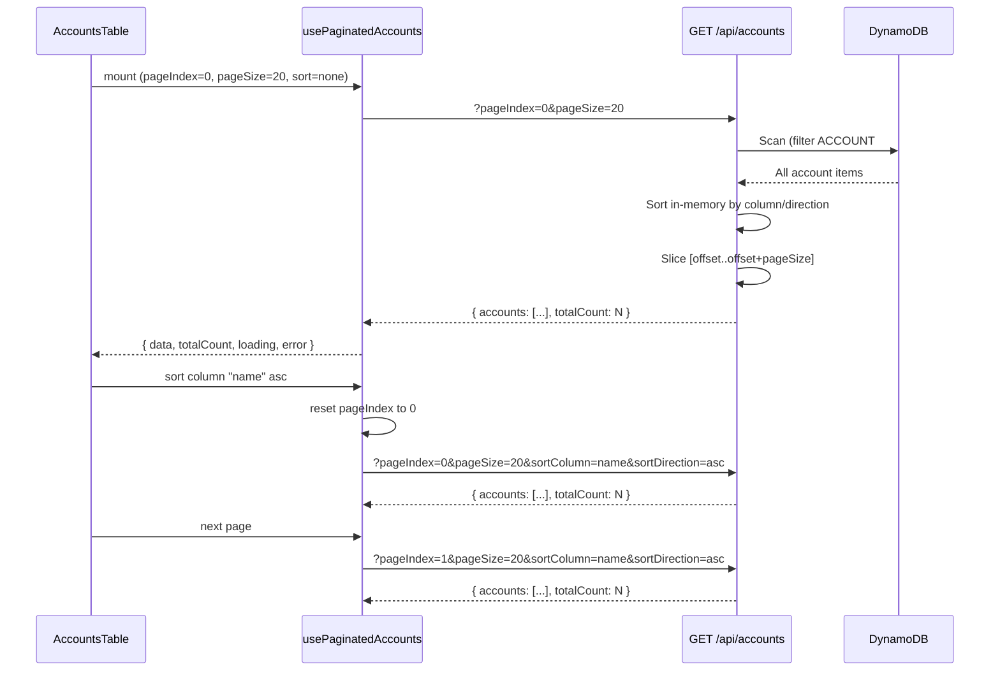

# Design Document: Accounts Table Pagination

## Overview

This design converts the accounts table from loading all records client-side to a server-side paginated and sorted approach. Currently, the `listAccounts` Lambda handler performs a full DynamoDB table scan and returns all account records, while the frontend uses TanStack Table's built-in `getSortedRowModel` for client-side sorting.

The new design introduces:

- A paginated API endpoint that accepts page index, page size, sort column, and sort direction
- Server-side sorting via DynamoDB Scan with in-memory sort (accounts are stored with `ACCOUNT#` PK pattern, no GSI supports sorted access)
- A `usePaginatedAccounts` hook managing pagination state and data fetching
- Pagination controls (page navigation + page size selector) integrated into the existing table

**Key constraint:** DynamoDB's single-table design with `PK=ACCOUNT#<number>` and `SK=METADATA` does not support native sorted queries across arbitrary columns. The API will scan all account items, sort in-memory, and return the requested page slice. This is acceptable for the expected dataset size (hundreds to low thousands of accounts per shop).

## Architecture



### Design Decision: In-Memory Sort vs GSI

Given that:

- DynamoDB does not support ad-hoc sorting across arbitrary attributes without dedicated GSIs
- Adding a GSI per sortable column (7 columns) would be expensive and complex
- The accounts dataset per tenant is bounded (typically < 5,000 records)
- A full scan is already performed today

The chosen approach is to scan all matching records, sort in-memory on the Lambda, and return the requested page. This keeps infrastructure simple while providing correct, consistent server-side sorting.

## Components and Interfaces

### Backend: Updated `list-accounts` Route

The existing `GET /api/accounts` endpoint is extended with query parameters:

```typescript
interface PaginationQueryParams {
  pageIndex: number;   // 0-based page index, default 0
  pageSize: number;    // 20 | 50 | 100, default 20
  sortColumn?: string; // column accessor key (e.g., "name", "shopUid")
  sortDirection?: "asc" | "desc"; // default "asc" when sortColumn is present
}

interface PaginatedAccountsResponse {
  accounts: Account[];
  totalCount: number;
}
```

**Validation rules:**

- `pageIndex`: integer >= 0, default 0
- `pageSize`: must be one of [20, 50, 100], default 20
- `sortColumn`: must be one of the allowed column names, or omitted
- `sortDirection`: must be "asc" or "desc" when sortColumn is present, default "asc"
- Invalid parameters return 400 with error details

**Allowed sort columns:** `shopUid`, `name`, `street`, `place`, `postcode`, `canton`, `email`, `telephone`

### Frontend: `usePaginatedAccounts` Hook

Replaces the existing `useAccounts` hook for the accounts table:

```typescript
interface PaginationState {
  pageIndex: number;
  pageSize: PageSize;
  sortColumn: string | null;
  sortDirection: "asc" | "desc" | null;
}

type PageSize = 20 | 50 | 100;

interface UsePaginatedAccountsResult {
  accounts: Account[];
  totalCount: number;
  loading: boolean;
  error: string | null;
  pagination: PaginationState;
  setPageIndex: (index: number) => void;
  setPageSize: (size: PageSize) => void;
  setSorting: (column: string | null, direction: "asc" | "desc" | null) => void;
  retry: () => void;
}
```

**Behavior:**

- `setPageSize` resets `pageIndex` to 0 and triggers a fetch
- `setSorting` resets `pageIndex` to 0 and triggers a fetch
- `setPageIndex` triggers a fetch with current sort/size params
- A fetch is triggered on mount and whenever pagination state changes

### Frontend: `PaginationControls` Component

A new component rendered below the table:

```typescript
interface PaginationControlsProps {
  pageIndex: number;
  pageSize: PageSize;
  totalCount: number;
  onPageChange: (pageIndex: number) => void;
  onPageSizeChange: (pageSize: PageSize) => void;
  disabled?: boolean;
}
```

Renders:

- Page size selector (dropdown/select with options 20, 50, 100)
- Previous/Next page buttons
- Current page / total pages display (e.g., "Page 1 of 5")

### Frontend: Updated `AccountsTable` Component

The table component changes from client-side sorting to server-side sorting:

- Removes `getSortedRowModel()` from TanStack Table config
- Sets `manualSorting: true` on the table instance
- Delegates `onSortingChange` to the hook's `setSorting`
- Receives data and pagination state from the hook rather than the full dataset

### Frontend: Updated `accounts-api.ts`

New function alongside existing `fetchAccounts`:

```typescript
export async function fetchPaginatedAccounts(
  params: PaginationQueryParams,
): Promise<PaginatedAccountsResponse> { ... }
```

The existing `fetchAccounts` function remains for backward compatibility (used by other features if needed).

## Data Models

### API Query Parameters

| Parameter | Type | Required | Default | Constraints |
|-----------|------|----------|---------|-------------|
| `pageIndex` | integer | No | 0 | >= 0 |
| `pageSize` | integer | No | 20 | 20, 50, 100 |
| `sortColumn` | string | No | — | One of allowed column names |
| `sortDirection` | string | No | "asc" | "asc" or "desc" |

### API Response

```typescript
{
  accounts: Account[];  // Page slice of accounts (max pageSize items)
  totalCount: number;   // Total number of accounts matching the query
}
```

### Pagination State (Client)

```typescript
{
  pageIndex: number;         // Current 0-based page
  pageSize: 20 | 50 | 100;  // Selected page size
  sortColumn: string | null; // Active sort column or null
  sortDirection: "asc" | "desc" | null; // Sort direction or null
}
```

### Computed Values

- `totalPages = Math.ceil(totalCount / pageSize)`
- `isFirstPage = pageIndex === 0`
- `isLastPage = pageIndex >= totalPages - 1`

## Correctness Properties

*A property is a characteristic or behavior that should hold true across all valid executions of a system — essentially, a formal statement about what the system should do. Properties serve as the bridge between human-readable specifications and machine-verifiable correctness guarantees.*

### Property 1: API Request Construction

*For any* valid pagination state (pageIndex, pageSize, sortColumn, sortDirection), the fetch function SHALL construct a request URL containing all state parameters as query string values matching the state exactly.

**Validates: Requirements 1.2**

### Property 2: API Parameter Parsing and Validation

*For any* query string containing pageIndex, pageSize, sortColumn, and sortDirection values, the API handler SHALL parse them into the correct internal types (number for pageIndex/pageSize, string for sortColumn, enum for sortDirection), and reject invalid values with a 400 status.

**Validates: Requirements 1.3**

### Property 3: Pagination Slice Correctness

*For any* list of accounts and valid pagination parameters (pageIndex, pageSize), the API SHALL return exactly the items at positions `[pageIndex * pageSize, pageIndex * pageSize + pageSize)` from the sorted list, and `totalCount` SHALL equal the total number of accounts.

**Validates: Requirements 1.4**

### Property 4: Page Size Change Resets Page

*For any* current pagination state where pageIndex > 0, changing the page size to a different valid value SHALL reset pageIndex to 0 and trigger a fetch with the new page size.

**Validates: Requirements 2.3**

### Property 5: Total Pages Calculation

*For any* totalCount >= 0 and valid pageSize, the displayed total pages SHALL equal `Math.ceil(totalCount / pageSize)`, and the displayed current page SHALL equal `pageIndex + 1`.

**Validates: Requirements 3.1**

### Property 6: Page Navigation

*For any* current page that is not the last page, clicking next SHALL fetch with `pageIndex + 1`. *For any* current page > 0, clicking previous SHALL fetch with `pageIndex - 1`. The page size and sort parameters SHALL remain unchanged.

**Validates: Requirements 3.5, 3.6**

### Property 7: Sort State Cycle

*For any* sortable column, the sort state SHALL cycle through: unsorted → ascending → descending → unsorted. At any point in time, at most one column SHALL be in a sorted state (single-sort invariant).

**Validates: Requirements 4.2, 4.3, 4.4, 4.5**

### Property 8: Sort Change Resets Page

*For any* current pagination state where pageIndex > 0, changing the sort column or sort direction SHALL reset pageIndex to 0 and trigger a fetch with page index 0 and the new sort parameters.

**Validates: Requirements 5.1, 5.2, 5.3**

### Property 9: ARIA Attributes Reflect Pagination State

*For any* pagination state (currentPage, totalPages, isFirstPage, isLastPage), the pagination controls SHALL render ARIA attributes that correctly convey the current page, total pages, and disabled states to assistive technology.

**Validates: Requirements 6.2**

## Error Handling

| Scenario | Behavior |
|----------|----------|
| API returns non-2xx status | Display error message with retry button; preserve last known pagination state |
| Network failure (TypeError) | Display "Unable to load accounts" with retry button |
| Request timeout (30s) | Abort request, display timeout error with retry button |
| Invalid page index (beyond total) | API returns empty accounts array with correct totalCount; UI shows "No accounts on this page" |
| Invalid query parameters | API returns 400 with validation errors; frontend treats as server error |

**Retry behavior:** Retry uses the exact same pagination state that caused the error (same page, size, sort). The user can also navigate away from the errored state (e.g., go to page 1) which triggers a new fetch.

**Loading state:** While a fetch is in-flight, the table displays a loading indicator. Navigation controls remain interactive but trigger abort of the in-flight request before starting a new one (stale request cancellation via AbortController).

## Testing Strategy

### Property-Based Tests (fast-check)

Property-based testing applies well to this feature because:

- Pagination logic involves pure computations (slice indices, page counts, parameter construction)
- Sort state transitions follow deterministic rules across all columns
- API parameter parsing and validation are pure functions with large input spaces

**Configuration:** Each property test runs a minimum of 100 iterations using `fast-check`.

**Library:** `fast-check` (already in devDependencies of both `shop` and `shop-api`)

**Tag format:** Each test is tagged with `Feature: accounts-table-pagination, Property N: <text>`

**Test files:**

- `projects/shop-api/src/routes/list-accounts.property.test.ts` — Properties 2, 3
- `projects/shop/src/features/accounts/pagination-logic.property.test.ts` — Properties 1, 4, 5, 6, 7, 8, 9

### Unit Tests (example-based)

- Initial load fetches with default params (Req 1.1)
- Loading indicator shown during fetch (Req 1.5)
- Error state displays message and retry button (Req 1.6)
- Page size selector shows 20, 50, 100 options (Req 2.1)
- Default page size is 20 (Req 2.2)
- Page size selector updates visually (Req 2.4)
- Previous/Next buttons exist (Req 3.2)
- Previous disabled on first page (Req 3.3)
- Next disabled on last page (Req 3.4)
- Sort indicator displays correctly (Req 4.6)
- Keyboard navigation works on controls (Req 6.1)
- Focus moves to table after navigation (Req 6.3)
- Page size selector has accessible label (Req 6.4)

### Integration Tests

- Full flow: mount page → verify API call → render data → paginate → verify next API call
- Sort + paginate flow: sort a column → verify reset → navigate pages → verify params
- Error recovery: error → retry → success
