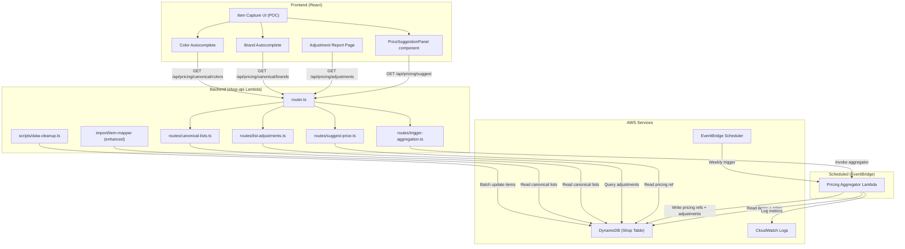
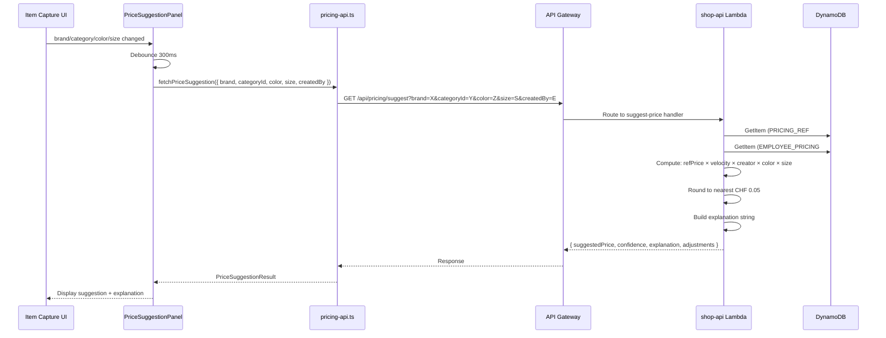
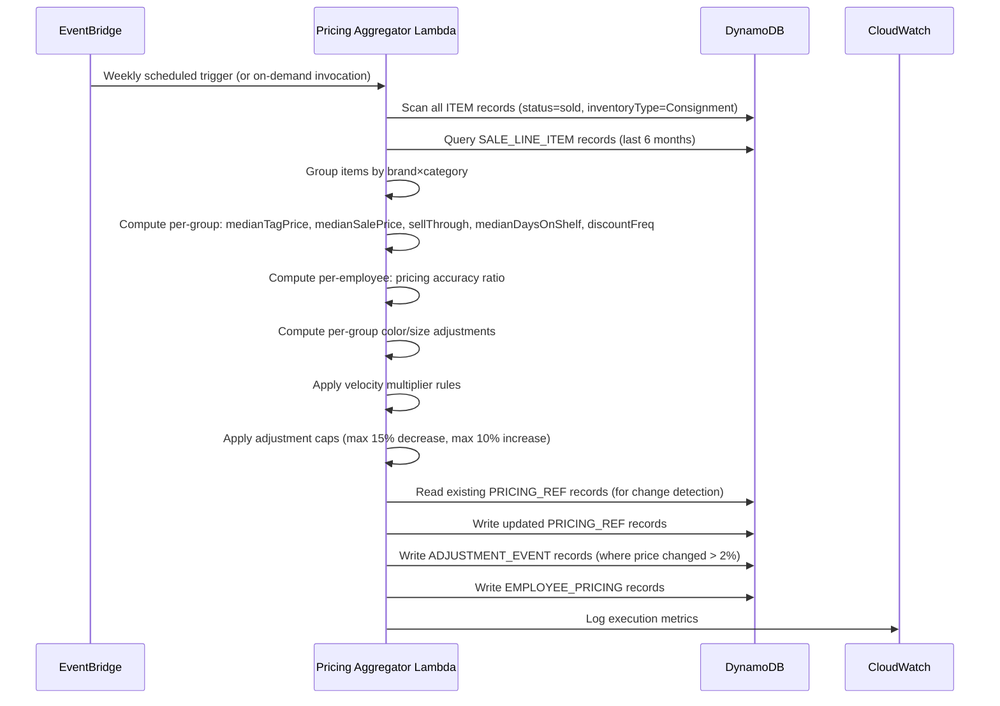

# Design Document: Auto Tag Price

## Overview

This feature adds AI-driven tag price suggestions to the consignment shop. The system:

1. Cleans existing data (brand and colour normalisation) to enable accurate grouping
2. Integrates canonical mappings into the ConsignCloud import pipeline for ongoing data cleanliness
3. Aggregates pricing statistics from historical item and sale data on a weekly schedule (also runnable on demand)
4. Suggests a tag price at item entry time based on comparable sold items
5. Tracks and reports when reference pricing changes, with full explanations
6. Provides a new standalone Item Capture UI (POC) optimised for rapid item entry with AI suggestions

The design introduces three new architectural components: a scheduled Pricing Aggregator Lambda (also invocable on demand), a Price Suggestion Service (function within the shop-api), and a Pricing section in the frontend with the Item Capture UI. It adds new DynamoDB entities to the existing single-table design for pricing references, adjustment events, and canonical lists. All sales data (including clearance) is included in pricing calculations.

## Architecture



### Request Flow: Price Suggestion



### Request Flow: Pricing Aggregator



## Components and Interfaces

### Backend Components

| File | Route/Purpose |
|------|---------------|
| `src/routes/suggest-price.ts` | `GET /api/pricing/suggest` — compute and return price suggestion |
| `src/routes/trigger-aggregation.ts` | `POST /api/pricing/aggregate` — trigger aggregator on demand |
| `src/routes/list-adjustments.ts` | `GET /api/pricing/adjustments` — paginated adjustment history |
| `src/routes/canonical-lists.ts` | `GET /api/pricing/canonical/brands`, `GET /api/pricing/canonical/colors` — canonical list retrieval |
| `src/pricing/price-calculator.ts` | Pure function: compute suggested price from reference data + item attributes |
| `src/pricing/explanation-builder.ts` | Pure function: build human-readable explanation string |
| `src/pricing/swiss-rounding.ts` | Pure function: round to nearest CHF 0.05 |
| `src/pricing/velocity-multiplier.ts` | Pure function: compute velocity multiplier from sell-through rate |
| `src/import/canonical-mapper.ts` | Import-time mapping: apply canonical brand/colour mappings during CC import |
| `projects/shop-api/src/aggregator/handler.ts` | Lambda entry point for the Pricing Aggregator |
| `projects/shop-api/src/aggregator/statistics.ts` | Compute median, sell-through, discount frequency |
| `projects/shop-api/src/aggregator/grouping.ts` | Group items by brand×category, compute per-group stats |
| `projects/shop-api/src/aggregator/employee-accuracy.ts` | Compute per-employee pricing accuracy |
| `projects/shop-api/src/aggregator/adjustment-detector.ts` | Detect and cap reference price changes |
| `scripts/data-cleanup/extract-brands.ts` | Extract distinct brands, cluster by similarity |
| `scripts/data-cleanup/extract-colors.ts` | Extract distinct colours, map to canonical |
| `scripts/data-cleanup/apply-mappings.ts` | Batch-update items with approved mappings |

### Frontend Components

| File | Purpose |
|------|---------|
| `features/pricing/adjustment-report-page.tsx` | Page with adjustment table, filters, summary banner |
| `features/pricing/adjustment-report-table.tsx` | Table component with expandable rows for detail metrics |
| `features/pricing/adjustment-report-filters.tsx` | Filter controls (direction, brand, category, date range) |
| `features/pricing/pricing-api.ts` | API client for all pricing endpoints |
| `features/pricing/pricing-types.ts` | TypeScript interfaces for pricing entities |
| `features/pricing/use-adjustments.ts` | Pagination hook for adjustment report |
| `features/item-capture/item-capture-page.tsx` | Standalone POC page for rapid item entry with AI pricing |
| `features/item-capture/item-capture-form.tsx` | Minimal focused form for item attributes |
| `features/item-capture/price-suggestion-panel.tsx` | Panel showing AI suggestion prominently |
| `features/item-capture/brand-autocomplete.tsx` | Autocomplete input for brand field |
| `features/item-capture/color-autocomplete.tsx` | Autocomplete input for color field |
| `components/shared/autocomplete-input.tsx` | Generic autocomplete component (reusable) |

### API Interfaces

```typescript
// --- Price Suggestion ---

// GET /api/pricing/suggest?brand=X&categoryId=Y&color=Z&size=S&createdBy=E
interface PriceSuggestionRequest {
  brand?: string;
  categoryId?: string;
  color?: string;
  size?: string;
  createdBy?: string; // Employee UUID
}

interface PriceSuggestionResponse {
  suggestedPrice: number | null; // CHF, rounded to 0.05, null if insufficient data
  confidence: "high" | "medium" | "low" | null;
  explanation: string;
  adjustments: {
    referencePrice: number; // Base price before adjustments
    velocityMultiplier: number; // 0.90–1.10
    creatorAdjustment: number; // multiplier, 1.0 = no adjustment
    colorAdjustment: number; // multiplier, 1.0 = no adjustment
    sizeAdjustment: number; // multiplier, 1.0 = no adjustment
  } | null;
  groupInfo: {
    brand: string | null;
    category: string | null;
    sampleSize: number;
    sellThroughRate: number;
    medianDaysOnShelf: number;
  } | null;
}

// --- Adjustment Report ---

// GET /api/pricing/adjustments?direction=decrease&brand=X&category=Y&fromDate=...&toDate=...&pageSize=20&cursor=...
interface AdjustmentEvent {
  id: string; // UUID
  brand: string;
  category: string;
  previousPrice: number; // CHF
  newPrice: number; // CHF
  direction: "increase" | "decrease";
  percentageChange: number; // e.g., -8.5 or +5.2
  reason: string;
  metrics: {
    sellThroughRate: number;
    medianDaysOnShelf: number;
    sampleSize: number;
    discountFrequency: number;
    priceRatio: number; // median(salePrice) / median(tagPrice)
  };
  timestamp: string; // ISO 8601
}

interface AdjustmentListResponse {
  adjustments: AdjustmentEvent[];
  nextCursor: string | null;
  hasMore: boolean;
}

// --- Canonical Lists ---

// GET /api/pricing/canonical/brands
interface CanonicalBrandListResponse {
  brands: string[]; // Sorted alphabetically
}

// GET /api/pricing/canonical/colors
interface CanonicalColorListResponse {
  colors: string[]; // Sorted alphabetically, English canonical names
}

// --- On-Demand Aggregation ---

// POST /api/pricing/aggregate
interface TriggerAggregationResponse {
  success: true;
  message: string; // e.g., "Aggregation triggered"
}

// --- Frontend Result Types ---

type PriceSuggestionResult =
  | { success: true; data: PriceSuggestionResponse }
  | { success: false; error: "network" | "server" | "timeout" };

type AdjustmentListResult =
  | { success: true; data: AdjustmentListResponse }
  | { success: false; error: "network" | "server" | "timeout" };

type TriggerAggregationResult =
  | { success: true }
  | { success: false; error: "network" | "server" | "timeout" };

type CanonicalListResult =
  | { success: true; values: string[] }
  | { success: false; error: "network" | "server" | "timeout" };
```

## Data Models

### DynamoDB Entities (Shop Table)

| Entity | PK | SK | GSI1PK | GSI1SK | Purpose |
|--------|----|----|--------|--------|---------|
| Pricing Reference | `PRICING_REF#<brand>#<categoryId>` | `METADATA` | `PRICING_REFS` | `PRICING_REF#<brand>#<categoryId>` | Per-group pricing statistics |
| Pricing Reference (category-only) | `PRICING_REF#_NONE_#<categoryId>` | `METADATA` | `PRICING_REFS` | `PRICING_REF#_NONE_#<categoryId>` | Fallback when brand unknown |
| Employee Pricing | `EMPLOYEE_PRICING#<employeeUuid>` | `METADATA` | — | — | Per-employee accuracy stats |
| Adjustment Event | `ADJUSTMENT#<uuid>` | `METADATA` | `ADJUSTMENTS` | `ADJUSTMENT#<timestamp>` | Historical price change record |
| Canonical Brand | `CANONICAL#BRANDS` | `BRAND#<canonicalName>` | — | — | Brand reference list |
| Canonical Color | `CANONICAL#COLORS` | `COLOR#<canonicalName>` | — | — | Colour reference list |

### Pricing Reference Record

| Attribute | Type | Description |
|-----------|------|-------------|
| PK | String | `PRICING_REF#<brand>#<categoryId>` |
| SK | String | `METADATA` |
| GSI1PK | String | `PRICING_REFS` |
| GSI1SK | String | `PRICING_REF#<brand>#<categoryId>` |
| brand | String | Canonical brand name (or `_NONE_` for category-only) |
| categoryId | String | Category UUID |
| categoryName | String | Category display name |
| referencePrice | Number | Current suggested base price (CHF) |
| previousReferencePrice | Number | Previous cycle's reference price (CHF) |
| originalBaseline | Number | First-ever computed reference price (for cumulative cap) |
| medianTagPrice | Number | Median tag price of sold items in group (CHF) |
| medianSalePrice | Number | Median actual sale price (CHF) |
| sellThroughRate | Number | 0-1 decimal |
| medianDaysOnShelf | Number | Median days on shelf for sold items |
| discountFrequency | Number | 0-1 decimal, fraction of sales with discounts |
| sampleSize | Number | Number of sold items in the 6-month window |
| velocityMultiplier | Number | Computed multiplier (0.90–1.10) |
| lowConfidence | Boolean | True if sample size < 5 |
| colorAdjustments | Map | `{ "Black": 1.05, "Red": 0.92, ... }` |
| sizeAdjustments | Map | `{ "M": 1.02, "XXL": 0.95, ... }` |
| computedAt | String | ISO 8601 timestamp of last computation |
| updatedAt | String | ISO 8601 timestamp |

### Employee Pricing Record

| Attribute | Type | Description |
|-----------|------|-------------|
| PK | String | `EMPLOYEE_PRICING#<employeeUuid>` |
| SK | String | `METADATA` |
| employeeId | String | Employee UUID |
| employeeName | String | Employee display name |
| pricingAccuracy | Number | Median ratio of salePrice/tagPrice (1.0 = perfect) |
| sampleSize | Number | Number of priced-and-sold items |
| creatorAdjustment | Number | Inverse multiplier to apply (e.g., 0.85 if employee overprices by 15%) |
| computedAt | String | ISO 8601 timestamp |

### Adjustment Event Record

| Attribute | Type | Description |
|-----------|------|-------------|
| PK | String | `ADJUSTMENT#<uuid>` |
| SK | String | `METADATA` |
| GSI1PK | String | `ADJUSTMENTS` |
| GSI1SK | String | `ADJUSTMENT#<ISO8601 timestamp>` |
| id | String | UUID |
| brand | String | Brand name |
| category | String | Category name |
| categoryId | String | Category UUID |
| previousPrice | Number | CHF |
| newPrice | Number | CHF |
| direction | String | `"increase"` or `"decrease"` |
| percentageChange | Number | Signed percentage (e.g., -8.5) |
| reason | String | Human-readable reason |
| metrics | Map | `{ sellThroughRate, medianDaysOnShelf, sampleSize, discountFrequency, priceRatio }` |
| timestamp | String | ISO 8601 |

### Canonical Brand Record

| Attribute | Type | Description |
|-----------|------|-------------|
| PK | String | `CANONICAL#BRANDS` |
| SK | String | `BRAND#<canonicalName>` |
| name | String | Canonical brand name |
| aliases | List | Known misspellings/variants that map to this brand |
| createdAt | String | ISO 8601 |

### Canonical Color Record

| Attribute | Type | Description |
|-----------|------|-------------|
| PK | String | `CANONICAL#COLORS` |
| SK | String | `COLOR#<canonicalName>` |
| name | String | Canonical English colour name |
| aliases | List | German equivalents + misspellings |
| createdAt | String | ISO 8601 |

## Design Decisions

### Why a Heuristic Model (Not ML)

A weighted heuristic model is chosen over a machine learning approach because:

- The dataset is relatively small (thousands of items, not millions)
- The model needs to be explainable to operators (weighted factors with clear reasons)
- No training pipeline or model deployment infrastructure exists
- The heuristic can be upgraded to ML later when more data exists and patterns emerge from AI-suggested prices

### Why Weekly Aggregation (Not Real-Time)

- Pricing references change slowly — weekly is sufficient granularity
- Avoids hot-path latency at item creation (suggestion is a simple lookup, not a computation)
- Reduces DynamoDB read costs (aggregator reads once, suggestion service reads pre-computed result)
- Operators need stable prices — daily changes would create confusion

### Why Store Pricing References in the Shop Table

- Follows existing single-table design pattern
- No additional table/GSI provisioning needed
- Pricing data is small (one record per brand×category group, likely < 1000 records)
- Access patterns are simple (point reads for suggestion, GSI1 scan for report)

### Why Include All Sales Data (No Clearance Exclusion)

- End-of-season clearance sales represent real market behaviour — they reflect what customers will pay
- Excluding clearance data would artificially inflate reference prices
- The velocity multiplier already accounts for poor-performing groups — additional exclusion would double-count
- Simpler implementation with no clearance period management overhead

### Why a Standalone Item Capture UI (Not Enhancing Existing Form)

- The existing item creation form is designed for full CRUD with all fields and validation
- The capture UI is a POC optimised for speed — minimal fields, prominent AI suggestion, no persistence
- Separation allows iterating on the capture UX without risk to the working item management feature
- Future CC API integration (creating items via ConsignCloud) has different requirements than local creation

### Why Import-Time Mapping

- Data cleanup is a one-time catch-up; ongoing cleanliness requires preventing new dirty data
- The CC import is the primary source of new items — mapping at import time keeps the pipeline clean
- Canonical lists are already in DynamoDB for the cleanup scripts — reusing them in the mapper is trivial
- Mapping at import is more reliable than periodic batch cleanup (no window of dirty data)

### Swiss Rounding (CHF 0.05)

Switzerland does not use 1-centime or 2-centime coins. All cash prices are rounded to the nearest 5 centimes. The formula: `Math.round(price * 20) / 20`

### Creator Adjustment Decay

Employee pricing accuracy will become less meaningful over time as AI suggestions replace manual pricing. The aggregator uses a time-decay weighting: items from the last 3 months are weighted 3x vs items from 3-6 months ago. This naturally phases out the creator signal as the system matures.

## Correctness Properties

### Property 1: Swiss rounding

*For any* non-negative number `price`, `roundToSwiss5(price)` SHALL produce a value that is a multiple of 0.05 and differs from `price` by at most 0.025.

**Validates: Requirement 5.13**

### Property 2: Velocity multiplier bounds

*For any* sell-through rate in [0, 1], `computeVelocityMultiplier(sellThrough)` SHALL produce a value in [0.90, 1.10]. Specifically: sell-through < 0.30 → result in [0.90, 0.95]; sell-through in [0.30, 0.70] → result = 1.0; sell-through > 0.80 → result in [1.0, 1.10] (increase only if price ratio conditions met).

**Validates: Requirements 5.2, 7.4, 7.5**

### Property 3: Adjustment cap enforcement (decrease)

*For any* previous reference price `prev` and computed new price `new` where `new < prev`, the capped result SHALL satisfy: `cappedPrice >= prev * 0.85` (max 15% single-cycle decrease) AND `cappedPrice >= originalBaseline * 0.70` (max 30% cumulative decrease).

**Validates: Requirements 7.4, 7.5**

### Property 4: Adjustment cap enforcement (increase)

*For any* previous reference price `prev` and computed new price `new` where `new > prev`, the capped result SHALL satisfy: `cappedPrice <= prev * 1.10` (max 10% single-cycle increase). Additionally, an increase SHALL only be applied when sell-through > 0.80, price ratio >= 1.0, median days-on-shelf < 14, and sample size >= 10.

**Validates: Requirements 7.6, 7.7**

### Property 5: Price suggestion composition

*For any* valid pricing reference record and item attributes, the suggested price SHALL equal: `referencePrice × velocityMultiplier × creatorAdjustment × colorAdjustment × sizeAdjustment`, rounded to the nearest CHF 0.05. Each adjustment factor defaults to 1.0 when data is insufficient.

**Validates: Requirements 5.2, 5.7, 5.9, 5.10**

### Property 6: Confidence level classification

*For any* sample size `n`: if `n >= 20` then confidence = "high"; if `5 <= n < 20` then confidence = "medium"; if `n < 5` then confidence = "low". If no pricing reference exists at all, confidence = null and suggested price = null.

**Validates: Requirements 5.11, 5.6**

### Property 7: Fallback chain

*For any* item with brand B and category C: if `PRICING_REF#B#C` exists, use it. If not, if `PRICING_REF#_NONE_#C` exists, use it. If neither exists, return null suggestion with reason "insufficient data". The fallback SHALL never skip a level (never use brand-only without category).

**Validates: Requirements 5.4, 5.5, 5.6**

### Property 8: Adjustment event detection

*For any* pricing reference update where `|newPrice - previousPrice| / previousPrice > 0.02`, an adjustment event SHALL be created. If the change is <= 2%, no event is created.

**Validates: Requirement 7.1**

### Property 9: Import mapping correctness

*For any* item imported with a brand value that has an exact match or alias in the canonical brand list, the stored brand SHALL be the canonical name and `sourceBrand` SHALL contain the original CC value. For brand values with no match, the stored brand SHALL be the original value unchanged and no `sourceBrand` is set.

**Validates: Requirements 4.1, 4.2, 4.3**

### Property 10: Brand fuzzy matching

*For any* input brand string and canonical brand where Levenshtein distance <= 2, the fuzzy matcher SHALL include the canonical brand in its suggestion list. For distances > 2, the canonical brand SHALL NOT be suggested.

**Validates: Requirement 11.3**

## Error Handling

### Backend Error Handling

| Scenario | HTTP Status | Response Body | Notes |
|----------|-------------|---------------|-------|
| Suggestion: no pricing data available | 200 | `{ suggestedPrice: null, confidence: null, explanation: "..." }` | Not an error — valid "no data" response |
| Suggestion: invalid query params | 400 | `{ error: "validation_error", fields: [...] }` | Missing required params |
| Adjustments: invalid filter params | 400 | `{ error: "validation_error", fields: [...] }` | Bad date format, unknown direction |
| Trigger aggregation: success | 200 | `{ success: true, message: "Aggregation triggered" }` | Async — returns immediately |
| Not authenticated | 401 | `{ message: "Unauthorized" }` | Cognito authorizer |
| Aggregator: DynamoDB read failure | — | Logged to CloudWatch | Lambda retries via EventBridge DLQ |
| Aggregator: partial write failure | — | Logged to CloudWatch | Idempotent — next run overwrites |
| Unexpected server error | 500 | `{ error: "internal_error" }` | Never expose internals |

### Frontend Error Handling

| Scenario | UI Behavior |
|----------|-------------|
| Price suggestion request fails | "Unable to load suggestion" text, non-blocking |
| Price suggestion loading | Skeleton/spinner next to tag price field |
| Adjustment report fetch fails | Error message with Retry button |
| Canonical list fetch fails | Autocomplete degrades to plain text input (no suggestions) |
| Network timeout on any pricing endpoint | "Request timed out" message, non-blocking |

## Testing Strategy

### Property-Based Tests

Property-based testing is appropriate for this feature because it contains pure mathematical functions (rounding, multiplier computation, cap enforcement, composition) that operate over continuous numeric ranges.

**Library**: `fast-check`

**Configuration**: Minimum 100 iterations per property test.

| Property | Test File | What It Tests |
|----------|-----------|---------------|
| Property 1 | `tests/pricing/swiss-rounding.property.test.ts` | `roundToSwiss5` always produces multiple of 0.05, within 0.025 of input |
| Property 2 | `tests/pricing/velocity-multiplier.property.test.ts` | `computeVelocityMultiplier` output bounds by sell-through band |
| Property 3 | `tests/pricing/adjustment-caps.property.test.ts` | Decrease cap: max 15% per cycle, max 30% cumulative |
| Property 4 | `tests/pricing/adjustment-caps.property.test.ts` | Increase cap: max 10% per cycle, conditions enforced |
| Property 5 | `tests/pricing/price-calculator.property.test.ts` | Suggestion = reference × velocity × creator × color × size, rounded |
| Property 6 | `tests/pricing/confidence-level.property.test.ts` | Correct classification by sample size |
| Property 7 | `tests/pricing/fallback-chain.property.test.ts` | Correct fallback order: brand×category → category-only → null |
| Property 8 | `tests/pricing/adjustment-detector.property.test.ts` | Event created iff change > 2% |
| Property 9 | `tests/pricing/import-mapping.property.test.ts` | Canonical match → stored as canonical + sourceBrand; no match → stored as-is |
| Property 10 | `tests/pricing/brand-fuzzy-match.property.test.ts` | Levenshtein ≤ 2 → suggested, > 2 → not |

### Unit Tests (Example-Based)

- **Backend** (`projects/shop-api/tests/`):
  - `routes/suggest-price.test.ts`: Happy path (full suggestion), missing brand fallback, missing category (null), retail item (no suggestion), employee with insufficient data
  - `routes/list-adjustments.test.ts`: Pagination, filters (direction, brand, date range), empty results
  - `routes/trigger-aggregation.test.ts`: Authenticated trigger (200), unauthenticated (401)
  - `routes/canonical-lists.test.ts`: Return sorted brand list, return sorted color list
  - `aggregator/statistics.test.ts`: Median computation with odd/even counts, empty arrays
  - `aggregator/grouping.test.ts`: Correct grouping by brand×category, handling missing brands
  - `aggregator/employee-accuracy.test.ts`: Accuracy ratio computation, time-decay weighting
  - `aggregator/adjustment-detector.test.ts`: Change detection threshold, cap enforcement, cumulative cap
  - `import/canonical-mapper.test.ts`: Brand mapping (exact match, alias, no match), colour mapping, sourceBrand/sourceColor preservation

- **Frontend** (`projects/shop/src/features/`):
  - `pricing/adjustment-report-page.test.tsx`: Table rendering, filter interaction, expandable rows, pagination
  - `item-capture/item-capture-page.test.tsx`: Form rendering, suggestion panel integration, "Preview Mode" indicator, no item creation
  - `item-capture/price-suggestion-panel.test.tsx`: Displays suggestion, confidence badge, explanation, "Use Suggestion" button populates field, loading state, error state, no-data state
  - `item-capture/brand-autocomplete.test.tsx`: Filters on input, fuzzy suggestion display, keyboard navigation, free-text entry
  - `item-capture/color-autocomplete.test.tsx`: Filters on input, English canonical display, keyboard navigation

### Integration Tests

- **Aggregator end-to-end**: Seed items + sales in DynamoDB → run aggregator → verify pricing reference records are correct
- **Suggestion flow**: Seed pricing reference → call suggest endpoint → verify response matches expected calculation
- **Import mapping**: Seed canonical lists → run item import with mixed clean/dirty brands → verify mappings applied correctly
