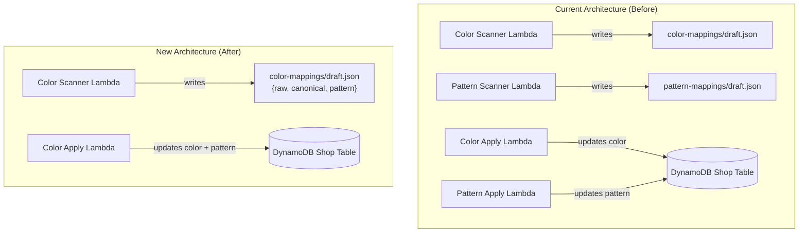
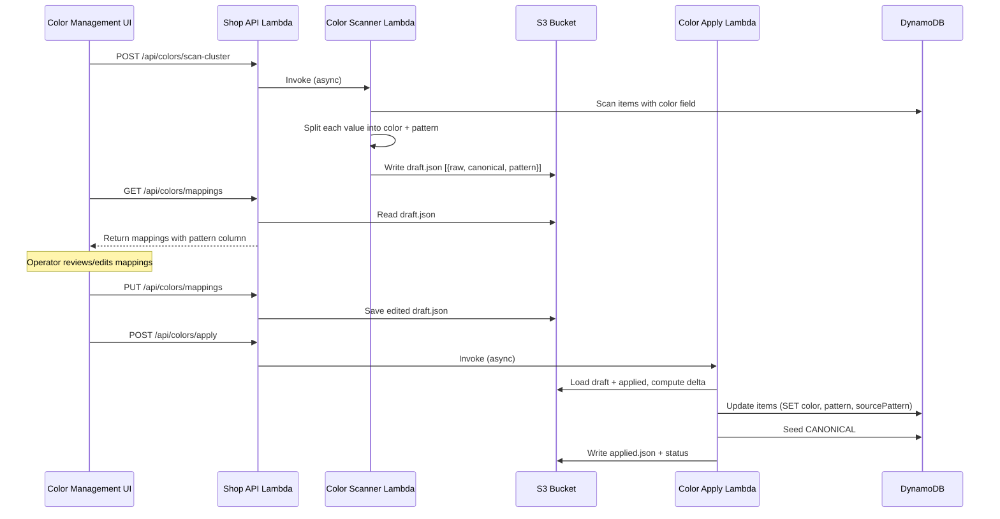

# Design Document: Color-Pattern Integration

## Overview

This feature merges the standalone pattern detection system into the existing color management pipeline. Instead of two separate scan-cluster + apply pipelines (one for colors, one for patterns), a single color pipeline handles both. The color scanner detects embedded pattern keywords, splits compound values (e.g., "blau gestreift" → color: "Blau", pattern: "Gestreift"), and the apply step writes both fields to DynamoDB. The standalone pattern system (Lambdas, API routes, frontend page, Terraform resources) is removed entirely.

The key insight is that pattern information is already derived from the raw `color` field on items — the pattern scanner was just re-scanning the same data. By integrating pattern detection into the color scanner, we eliminate duplicate table scans, simplify the architecture, and give operators a single page to manage both assignments.

## Architecture



### Execution Flow



## Components and Interfaces

### 1. Color Scanner (`scan-cluster.ts`)

**Changes:**
- Remove `isPurePattern()` function and the skip logic — pattern values are no longer excluded
- Replace `ColorMapping` type with extended `MappingEntry { raw, canonical, pattern }`
- Integrate `splitColorPattern()` algorithm from the existing pattern scanner
- Import and maintain the `PATTERN_MAP` keyword dictionary
- For each distinct raw color value:
  - Run `splitColorPattern(raw)` to detect any pattern keyword
  - If pattern detected: set `canonical` to resolved color (or null for pure patterns), `pattern` to resolved Canonical_Pattern
  - If no pattern: set `canonical` via existing `lookupCanonical()`, `pattern` to null
- Write draft as `Array<{ raw: string, canonical: string | null, pattern: string | null }>`

**Interface:**
```typescript
export interface MappingEntry {
  raw: string;
  canonical: string | null;
  pattern: string | null;
}

export function splitColorPattern(rawValue: string): { color: string | null; pattern: string | null };
export function clusterColors(colors: ColorEntry[]): MappingEntry[];
export async function handler(): Promise<void>;
```

### 2. Color Applier (`apply-mappings.ts`)

**Changes:**
- Update `MappingEntry` interface to include `pattern: string | null`
- Update delta computation to compare all three fields (`raw`, `canonical`, `pattern`)
- Update DynamoDB write logic with three branches:
  1. `canonical != null && pattern != null` → SET color, pattern, sourcePattern
  2. `canonical == null && pattern != null` → SET pattern, sourcePattern; REMOVE color
  3. `canonical != null && pattern == null` → SET color, sourceColor (existing behavior)
- Add canonical pattern seeding (`PK: "CANONICAL#PATTERNS"`, `SK: "PATTERN#<name>"`)
- Update status reporting to include `canonicalPatternsSeeded` count

**Interface:**
```typescript
interface MappingEntry {
  raw: string;
  canonical: string | null;
  pattern: string | null;
}

interface ApplyStatus {
  status: "running" | "complete" | "error";
  startedAt: string;
  completedAt?: string;
  delta: number;
  itemsUpdated: number;
  errors: number;
  canonicalColorsSeeded: number;
  canonicalPatternsSeeded: number;
  message?: string;
}
```

### 3. Color Management Route (`routes/color-management.ts`)

**Changes:**
- Update `MappingEntry` interface to `{ raw: string; canonical: string | null; pattern: string | null }`
- Update validation in `saveColorMappings` to accept nullable `canonical` and nullable `pattern` fields
- No changes to scan-cluster or apply trigger logic (same Lambda invocations)

### 4. Color Management Frontend

**Type changes (`colors-types.ts`):**
```typescript
export interface ColorMapping {
  raw: string;
  canonical: string | null;
  pattern: string | null;
}
```

**Page changes (`color-management-page.tsx`):**
- Add "Pattern" column to the virtualized grid between "Canonical" and the delete button
- Add an `<Input>` for pattern editing (same pattern as canonical field editing)
- Update `handleMappingChange` to handle pattern field edits
- Include pattern in save payload (already handled if types are correct)
- Update status message to show `canonicalPatternsSeeded` count

**API changes (`colors-api.ts`):**
- No URL changes needed — the response shape just gains a `pattern` field
- `saveMappings` already sends the full mapping objects

### 5. Infrastructure Removal (Terraform)

**lambda.tf removals:**
- `aws_lambda_function.pattern_cluster` resource
- `aws_lambda_function.pattern_apply` resource
- Remove `pattern_cluster` and `pattern_apply` from `aws_iam_role_policy.shop_api_invoke_aggregator` Resource list
- Remove `PATTERN_CLUSTER_FUNCTION_NAME` and `PATTERN_APPLY_FUNCTION_NAME` env vars from `aws_lambda_function.shop_api`
- Remove `pattern-mappings/*` from `aws_iam_role_policy.shop_api_s3_items` (both Resource entries and ListBucket condition)
- Remove `pattern-mappings/*` from `aws_iam_role_policy.pricing_aggregator_s3` (PutObject/GetObject statement and ListBucket condition)

**api-gateway.tf removals:**
- `aws_apigatewayv2_route.post_patterns_scan_cluster`
- `aws_apigatewayv2_route.get_patterns_mappings`
- `aws_apigatewayv2_route.put_patterns_mappings`
- `aws_apigatewayv2_route.post_patterns_apply`
- `aws_apigatewayv2_route.get_patterns_apply_status`

### 6. Application Code Removal

**Backend:**
- Delete `src/patterns/` directory (scan-cluster.ts, apply-mappings.ts)
- Delete `src/pattern-cluster-handler.ts`
- Delete `src/pattern-apply-handler.ts`
- Delete `src/routes/pattern-management.ts`
- Remove pattern route imports and entries from `src/router.ts`
- Remove `pattern-cluster-handler.ts` and `pattern-apply-handler.ts` from esbuild entry points and zip commands

**Frontend:**
- Delete `src/features/patterns/` directory
- Remove pattern import and route from `src/config/routes.ts`
- Remove pattern navigation entry from `src/config/navigation.ts`

## Data Models

### Mapping Entry (S3 `color-mappings/draft.json`)

**Before:**
```json
[
  { "raw": "blau", "canonical": "Blau" },
  { "raw": "dunkelrot", "canonical": "Dunkelrot" }
]
```

**After:**
```json
[
  { "raw": "blau", "canonical": "Blau", "pattern": null },
  { "raw": "blau gestreift", "canonical": "Blau", "pattern": "Gestreift" },
  { "raw": "gestreift", "canonical": null, "pattern": "Gestreift" },
  { "raw": "dunkelrot", "canonical": "Dunkelrot", "pattern": null }
]
```

### DynamoDB Item Fields (after apply)

| Field | Type | Description |
|-------|------|-------------|
| `color` | string \| removed | Canonical color name (removed for pure patterns) |
| `sourceColor` | string | Original raw value before color mapping (set via `if_not_exists`) |
| `pattern` | string | Canonical pattern name |
| `sourcePattern` | string | Original raw value before pattern mapping (set via `if_not_exists`) |

### Canonical Pattern List (DynamoDB)

```
PK: "CANONICAL#PATTERNS"
SK: "PATTERN#Gestreift"
name: "Gestreift"
aliases: ["gestreift", "stripes", "striped"]
createdAt: "2024-01-01T00:00:00.000Z"
```

### Apply Status (S3 `color-mappings/apply-status.json`)

```json
{
  "status": "complete",
  "startedAt": "2024-01-01T00:00:00.000Z",
  "completedAt": "2024-01-01T00:00:05.000Z",
  "delta": 42,
  "itemsUpdated": 150,
  "errors": 0,
  "canonicalColorsSeeded": 25,
  "canonicalPatternsSeeded": 8
}
```

## Correctness Properties

*A property is a characteristic or behavior that should hold true across all valid executions of a system — essentially, a formal statement about what the system should do. Properties serve as the bridge between human-readable specifications and machine-verifiable correctness guarantees.*

### Property 1: Pattern keyword splitting produces valid components

*For any* raw color string that contains exactly one Pattern_Keyword as a token (separated by space, slash, or hyphen), `splitColorPattern` SHALL return a non-null `pattern` matching the Canonical_Pattern for that keyword, and a `color` component equal to the remaining portion of the string.

**Validates: Requirements 1.1, 6.3**

### Property 2: Pure pattern values produce null canonical color

*For any* raw color string that consists entirely of a single Pattern_Keyword (normalized to lowercase), `splitColorPattern` SHALL return `{ color: null, pattern: <Canonical_Pattern> }`.

**Validates: Requirements 1.2, 6.1**

### Property 3: Non-pattern values produce null pattern

*For any* raw color string that contains no Pattern_Keyword as a token or substring, `splitColorPattern` SHALL return `{ color: <input>, pattern: null }`.

**Validates: Requirements 1.4**

### Property 4: Mapping entry round-trip serialization

*For any* valid `MappingEntry` object (with string `raw`, string-or-null `canonical`, string-or-null `pattern`), serializing to JSON and deserializing back SHALL produce an equivalent object with identical field values.

**Validates: Requirements 2.1, 6.5**

### Property 5: Delta computation detects all field changes

*For any* pair of mapping arrays (draft and applied) where at least one entry differs in `canonical` or `pattern` for the same `raw` key, the delta computation SHALL include that entry. Conversely, entries where all three fields are identical SHALL NOT appear in the delta.

**Validates: Requirements 3.4**

### Property 6: Color prefix resolution is consistent with splitting

*For any* compound value "prefix + base + pattern" (e.g., "dunkelblau gestreift"), the color component resolved by `splitColorPattern` SHALL equal the result of applying the prefix lookup to the base color (e.g., "Dunkelblau").

**Validates: Requirements 6.2**

## Error Handling

| Scenario | Handling |
|----------|----------|
| S3 `draft.json` does not exist | GET /api/colors/mappings returns `{ mappings: [], lastModified: null }` |
| Invalid mapping entry in PUT body | Return 400 with specific field validation error |
| Pattern keyword appears twice in raw value | First occurrence wins (leftmost token match) |
| Raw value is empty or whitespace-only | Scanner skips the entry (no mapping produced) |
| Lambda invoke fails | Route returns 500, logs error details |
| DynamoDB update fails for a single item | Increment `errors` counter, continue with remaining items |
| Apply finds no matching items for a mapping | Skip silently (delta was computed correctly, items may have been deleted) |
| Applied.json does not exist | Treat as empty (full draft becomes the delta) |

## Testing Strategy

### Property-Based Tests (via fast-check)

The pattern detection algorithm and mapping format are pure functions suitable for property-based testing. Tests should use the `fast-check` library (already available in the ecosystem) with a minimum of 100 iterations per property.

**Target functions:**
- `splitColorPattern(raw: string)` — the core splitting logic
- `clusterColors(colors: ColorEntry[])` — the full clustering pipeline
- Delta computation logic (comparing draft vs applied arrays)
- Mapping entry serialization round-trip

**Tag format:** `Feature: color-pattern-integration, Property N: <description>`

### Unit Tests

- Specific examples for each canonical pattern keyword and its variants
- Edge cases: empty string, whitespace-only, very long strings, unicode characters
- Compound values with multiple separators (spaces, slashes, hyphens)
- Substring-based fallback splitting (pattern keyword not a separate token)
- Validation logic in `saveColorMappings` route handler
- Apply step branching (all three branches for color/pattern combinations)

### Integration Tests

- End-to-end scan-cluster invocation with a seeded DynamoDB table
- Apply step verifying correct DynamoDB writes for each branch
- API route tests verifying request/response shapes
- Frontend component renders pattern column and handles edits

### Infrastructure Validation

- `terraform plan` verifies clean removal of pattern resources without affecting other resources
- Verify no dangling references to removed resources
