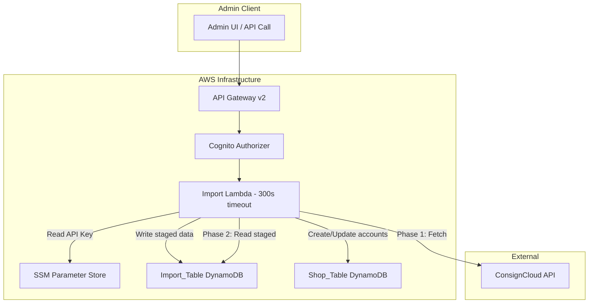
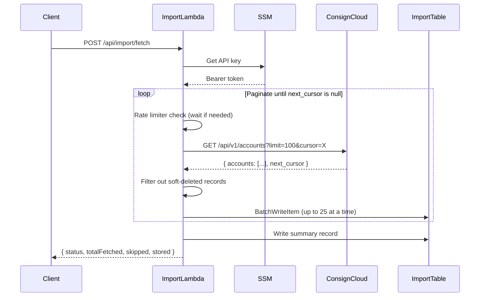
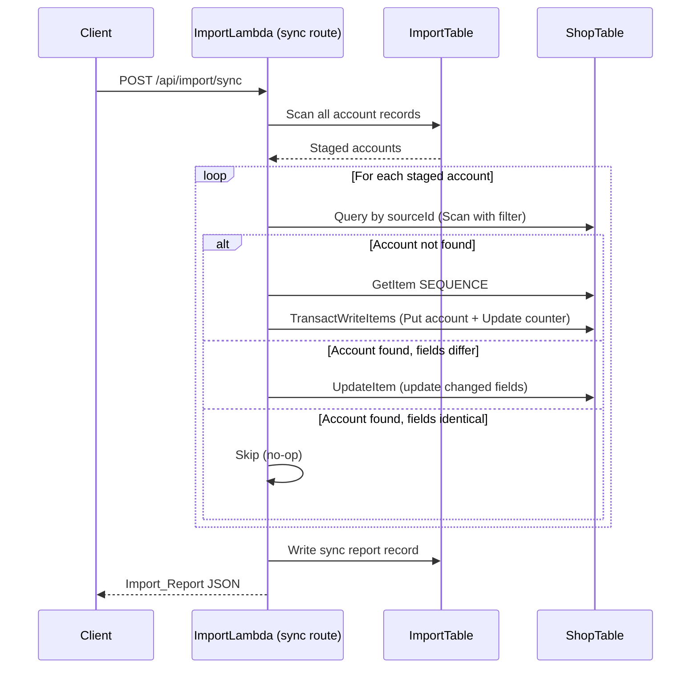

# Design Document: ConsignCloud Import

## Overview

This feature adds a two-phase import pipeline that fetches customer accounts from the ConsignCloud external API and syncs them into the shop's DynamoDB table. Phase 1 (Import) fetches all active accounts from ConsignCloud via paginated API calls and stages them in a dedicated Import_Table. Phase 2 (Sync) reads the staged data and creates or updates accounts in the existing Shop_Table, producing a report of the results.

The implementation introduces two new API routes on the existing shop-api Lambda (matching the monolambda pattern), a new DynamoDB import table, and supporting infrastructure (SSM parameter, IAM policies).

### Key Design Decisions

1. **Monolambda routes (not separate Lambdas)** — The existing architecture uses a single Lambda with a router. Adding two new routes (`POST /api/import/fetch` and `POST /api/import/sync`) keeps the deployment simple. The 300-second timeout requirement means the main Lambda's timeout must be increased (currently 30s), so instead we'll add a **dedicated import Lambda** with a 300s timeout, keeping the main API Lambda fast at 30s.
2. **Dedicated Import Lambda** — A separate Lambda function (`shop-import`) with 300s timeout handles both the fetch and sync operations. This isolates long-running import work from the fast API routes, while sharing the same codebase via a separate esbuild entry point.
3. **Token bucket rate limiter** — A simple in-memory token bucket implementation respects the ConsignCloud leaky bucket rate limit (100 capacity, 10/sec drain). No external dependencies needed for a single Lambda invocation.
4. **Sequential sync processing** — Records are processed one at a time during sync to avoid race conditions on the sequence counter. This is acceptable given the operation is admin-initiated and runs infrequently.
5. **Field mapping with `sourceId`** — Each imported account stores the ConsignCloud UUID as a `sourceId` attribute in the Shop_Table, enabling matching on subsequent syncs.
6. **Idempotent upsert to Import_Table** — Using DynamoDB PutItem with the ConsignCloud UUID in the key ensures re-running the import simply overwrites with fresh data.

## Architecture



### Import Flow (Phase 1)



### Sync Flow (Phase 2)



## Components and Interfaces

### Entry Point: `import-handler.ts`

**File:** `projects/shop-api/src/import-handler.ts`

Separate Lambda entry point for import operations.

```typescript
import type { APIGatewayProxyEventV2, APIGatewayProxyResultV2 } from "aws-lambda";

export async function handler(event: APIGatewayProxyEventV2): Promise<APIGatewayProxyResultV2>;
```

Routes:

- `POST /api/import/fetch` → `fetchFromConsignCloud`
- `POST /api/import/sync` → `syncToShopTable`

### ConsignCloud Client: `consigncloud-client.ts`

**File:** `projects/shop-api/src/import/consigncloud-client.ts`

Handles communication with the ConsignCloud API including authentication, pagination, and rate limiting.

```typescript
export interface ConsignCloudAccount {
  id: string;            // UUID
  number: string;
  first_name: string;
  last_name: string;
  company: string;
  email: string;
  balance: number;
  email_notifications_enabled: boolean;
  created: string;       // ISO timestamp
  deleted?: string;      // ISO timestamp if soft-deleted, null otherwise
}

export interface FetchPageResult {
  accounts: ConsignCloudAccount[];
  nextCursor: string | null;
}

export interface ConsignCloudClientConfig {
  apiKey: string;
  baseUrl: string;
  rateLimiter: RateLimiter;
}

export async function fetchAccountPage(
  config: ConsignCloudClientConfig,
  cursor: string | null,
  limit: number
): Promise<FetchPageResult>;

export async function fetchAllAccounts(
  config: ConsignCloudClientConfig
): Promise<{ accounts: ConsignCloudAccount[]; skipped: number }>;
```

### Rate Limiter: `rate-limiter.ts`

**File:** `projects/shop-api/src/import/rate-limiter.ts`

Token bucket implementation matching ConsignCloud's leaky bucket parameters.

```typescript
export interface RateLimiter {
  acquire(): Promise<void>;
}

export interface RateLimiterConfig {
  capacity: number;      // max tokens (100)
  drainRate: number;     // tokens per second (10)
}

export function createRateLimiter(config: RateLimiterConfig): RateLimiter;
```

The `acquire()` method returns immediately if a token is available, otherwise waits (via setTimeout promise) until one drains back.

### Fetch Route: `fetch-from-consigncloud.ts`

**File:** `projects/shop-api/src/import/fetch-from-consigncloud.ts`

Orchestrates the full import flow.

```typescript
export interface FetchResult {
  status: "success" | "partial_failure";
  totalFetched: number;
  skipped: number;
  stored: number;
  timestamp: string;
  error?: string;
}

export async function fetchFromConsignCloud(
  event: APIGatewayProxyEventV2
): Promise<APIGatewayProxyResultV2>;
```

### Sync Route: `sync-to-shop-table.ts`

**File:** `projects/shop-api/src/import/sync-to-shop-table.ts`

Orchestrates the sync from Import_Table to Shop_Table.

```typescript
export interface ImportReport {
  added: number;
  updated: number;
  skipped: number;
  errored: number;
  errors: ImportError[];
  startedAt: string;
  completedAt: string;
}

export interface ImportError {
  consignCloudId: string;
  message: string;
}

export async function syncToShopTable(
  event: APIGatewayProxyEventV2
): Promise<APIGatewayProxyResultV2>;
```

### Field Mapper: `field-mapper.ts`

**File:** `projects/shop-api/src/import/field-mapper.ts`

Maps ConsignCloud account fields to Shop_Table account fields.

```typescript
export interface MappedAccountFields {
  name: string;
  company: string;
  telephone: string;
}

export function mapConsignCloudToShop(source: ConsignCloudAccount): MappedAccountFields;

export function hasFieldChanges(
  existing: { name: string; company?: string; telephone: string },
  mapped: MappedAccountFields
): boolean;
```

Mapping rules:

- `name` = `first_name` + " " + `last_name` (trimmed)
- `company` = `company`
- `telephone` = `email` (used as contact when no phone is available)

### SSM Client: `ssm-client.ts`

**File:** `projects/shop-api/src/import/ssm-client.ts`

Retrieves the ConsignCloud API key from SSM Parameter Store.

```typescript
export async function getConsignCloudApiKey(): Promise<string>;
```

Path: `/{project_name}/{environment}/consigncloud-api-key`

### Import Table Client: `import-table-client.ts`

**File:** `projects/shop-api/src/import/import-table-client.ts`

DynamoDB operations specific to the Import_Table.

```typescript
export async function writeImportedAccounts(accounts: ConsignCloudAccount[], importedAt: string): Promise<void>;
export async function writeSummaryRecord(summary: FetchResult): Promise<void>;
export async function scanImportedAccounts(): Promise<ImportedAccountRecord[]>;
export async function writeSyncReport(report: ImportReport): Promise<void>;
```

## Data Models

### Import_Table Records

**Table name:** `${var.project_name}-${var.environment}-import`

#### Account Record

| Attribute | Type | Description |
|-----------|------|-------------|
| PK | String | `IMPORT#CONSIGNCLOUD#{id}` where `id` is the ConsignCloud UUID |
| SK | String | `METADATA` |
| id | String | ConsignCloud UUID |
| number | String | ConsignCloud account number |
| firstName | String | First name |
| lastName | String | Last name |
| company | String | Company name |
| email | String | Email address |
| balance | Number | Account balance |
| emailNotificationsEnabled | Boolean | Email notification preference |
| created | String | ISO timestamp from ConsignCloud |
| importedAt | String | ISO timestamp when record was fetched |

**Key example:** `PK = "IMPORT#CONSIGNCLOUD#550e8400-e29b-41d4-a716-446655440000"`, `SK = "METADATA"`

#### Summary Record

| Attribute | Type | Description |
|-----------|------|-------------|
| PK | String | `IMPORT#CONSIGNCLOUD#SUMMARY` |
| SK | String | `LATEST` |
| totalFetched | Number | Total accounts returned from API |
| skipped | Number | Accounts skipped (soft-deleted) |
| stored | Number | Accounts written to Import_Table |
| timestamp | String | ISO timestamp of import completion |
| status | String | `"success"` or `"partial_failure"` |

#### Sync Report Record

| Attribute | Type | Description |
|-----------|------|-------------|
| PK | String | `SYNC#REPORT` |
| SK | String | ISO timestamp of sync start |
| added | Number | Accounts created in Shop_Table |
| updated | Number | Accounts updated in Shop_Table |
| skipped | Number | Accounts unchanged (no-op) |
| errored | Number | Accounts that failed to process |
| errors | List | Array of `{ consignCloudId, message }` objects |
| startedAt | String | ISO timestamp |
| completedAt | String | ISO timestamp |

### Shop_Table Account Record (extended)

Existing fields plus new `sourceId` and `company` attributes:

| Attribute | Type | Description |
|-----------|------|-------------|
| PK | String | `ACCOUNT#0000042` |
| SK | String | `METADATA` |
| uuid | String | Internal UUID |
| name | String | `first_name` + " " + `last_name` |
| address | String | (empty string for imported accounts) |
| telephone | String | Email from ConsignCloud (contact fallback) |
| company | String | Company name from ConsignCloud |
| sourceId | String | ConsignCloud UUID for matching |
| createdAt | String | ISO timestamp |

### Infrastructure Additions

#### New DynamoDB Table (`infrastructure/dynamodb.tf`)

```hcl
resource "aws_dynamodb_table" "import" {
  name         = "${var.project_name}-${var.environment}-import"
  billing_mode = "PAY_PER_REQUEST"
  hash_key     = "PK"
  range_key    = "SK"

  attribute {
    name = "PK"
    type = "S"
  }

  attribute {
    name = "SK"
    type = "S"
  }

  tags = {
    Environment = var.environment
    Project     = var.project_name
  }
}
```

#### New SSM Parameter (`infrastructure/ssm.tf`)

```hcl
resource "aws_ssm_parameter" "consigncloud_api_key" {
  name  = "/${var.project_name}/${var.environment}/consigncloud-api-key"
  type  = "SecureString"
  value = "placeholder"

  lifecycle {
    ignore_changes = [value]
  }

  tags = {
    Environment = var.environment
    Project     = var.project_name
  }
}
```

#### New Lambda Function (`infrastructure/lambda.tf`)

```hcl
resource "aws_lambda_function" "shop_import" {
  function_name    = "${var.project_name}-${var.environment}-shop-import"
  role             = aws_iam_role.shop_import_lambda.arn
  handler          = "import-handler.handler"
  runtime          = "nodejs20.x"
  memory_size      = 256
  timeout          = 300
  filename         = "../projects/shop-api/dist/import-handler.zip"
  source_code_hash = filebase64sha256("../projects/shop-api/dist/import-handler.zip")

  environment {
    variables = {
      TABLE_NAME        = aws_dynamodb_table.shop.name
      IMPORT_TABLE_NAME = aws_dynamodb_table.import.name
      SSM_API_KEY_PATH  = aws_ssm_parameter.consigncloud_api_key.name
      CONSIGNCLOUD_BASE_URL = "https://api.consigncloud.com/api/v1"
    }
  }

  tags = {
    Environment = var.environment
    Project     = var.project_name
  }
}
```

#### IAM Role and Policies

```hcl
resource "aws_iam_role" "shop_import_lambda" {
  name = "${var.project_name}-${var.environment}-shop-import-lambda-role"

  assume_role_policy = jsonencode({
    Version = "2012-10-17"
    Statement = [{
      Effect    = "Allow"
      Principal = { Service = "lambda.amazonaws.com" }
      Action    = "sts:AssumeRole"
    }]
  })
}

# Permissions: Import_Table read/write
resource "aws_iam_role_policy" "shop_import_import_table" {
  name = "${var.project_name}-${var.environment}-shop-import-import-table"
  role = aws_iam_role.shop_import_lambda.id

  policy = jsonencode({
    Version = "2012-10-17"
    Statement = [{
      Effect   = "Allow"
      Action   = [
        "dynamodb:GetItem", "dynamodb:PutItem", "dynamodb:UpdateItem",
        "dynamodb:Query", "dynamodb:Scan", "dynamodb:BatchWriteItem"
      ]
      Resource = aws_dynamodb_table.import.arn
    }]
  })
}

# Permissions: Shop_Table read/write (for sync)
resource "aws_iam_role_policy" "shop_import_shop_table" {
  name = "${var.project_name}-${var.environment}-shop-import-shop-table"
  role = aws_iam_role.shop_import_lambda.id

  policy = jsonencode({
    Version = "2012-10-17"
    Statement = [{
      Effect   = "Allow"
      Action   = [
        "dynamodb:GetItem", "dynamodb:PutItem", "dynamodb:UpdateItem",
        "dynamodb:Query", "dynamodb:Scan", "dynamodb:TransactWriteItems"
      ]
      Resource = aws_dynamodb_table.shop.arn
    }]
  })
}

# Permissions: SSM read
resource "aws_iam_role_policy" "shop_import_ssm" {
  name = "${var.project_name}-${var.environment}-shop-import-ssm"
  role = aws_iam_role.shop_import_lambda.id

  policy = jsonencode({
    Version = "2012-10-17"
    Statement = [{
      Effect   = "Allow"
      Action   = ["ssm:GetParameter"]
      Resource = aws_ssm_parameter.consigncloud_api_key.arn
    }]
  })
}

# Permissions: CloudWatch Logs
resource "aws_iam_role_policy" "shop_import_logs" {
  name = "${var.project_name}-${var.environment}-shop-import-logs"
  role = aws_iam_role.shop_import_lambda.id

  policy = jsonencode({
    Version = "2012-10-17"
    Statement = [{
      Effect   = "Allow"
      Action   = ["logs:CreateLogGroup", "logs:CreateLogStream", "logs:PutLogEvents"]
      Resource = "arn:aws:logs:*:*:*"
    }]
  })
}
```

#### API Gateway Routes (`infrastructure/api-gateway.tf`)

```hcl
resource "aws_apigatewayv2_integration" "import_lambda" {
  api_id                 = aws_apigatewayv2_api.shop_api.id
  integration_type       = "AWS_PROXY"
  integration_uri        = aws_lambda_function.shop_import.invoke_arn
  integration_method     = "POST"
  payload_format_version = "2.0"
}

resource "aws_apigatewayv2_route" "post_import_fetch" {
  api_id    = aws_apigatewayv2_api.shop_api.id
  route_key = "POST /api/import/fetch"
  target    = "integrations/${aws_apigatewayv2_integration.import_lambda.id}"

  authorization_type = "CUSTOM"
  authorizer_id      = aws_apigatewayv2_authorizer.cognito.id
}

resource "aws_apigatewayv2_route" "post_import_sync" {
  api_id    = aws_apigatewayv2_api.shop_api.id
  route_key = "POST /api/import/sync"
  target    = "integrations/${aws_apigatewayv2_integration.import_lambda.id}"

  authorization_type = "CUSTOM"
  authorizer_id      = aws_apigatewayv2_authorizer.cognito.id
}

resource "aws_lambda_permission" "shop_import_apigw" {
  statement_id  = "AllowAPIGatewayInvoke"
  action        = "lambda:InvokeFunction"
  function_name = aws_lambda_function.shop_import.function_name
  principal     = "apigateway.amazonaws.com"
  source_arn    = "${aws_apigatewayv2_api.shop_api.execution_arn}/*/*"
}
```

## Correctness Properties

*A property is a characteristic or behavior that should hold true across all valid executions of a system — essentially, a formal statement about what the system should do. Properties serve as the bridge between human-readable specifications and machine-verifiable correctness guarantees.*

### Property 1: Pagination follows cursors until termination

*For any* sequence of API page responses where each page has a `next_cursor` value (either a non-null string or null), the fetch client SHALL make exactly N requests where N equals the number of pages until a null cursor is encountered, and each request after the first SHALL pass the previous page's `next_cursor` as the cursor parameter.

**Validates: Requirements 1.3, 1.4**

### Property 2: Rate limiter respects capacity and drain rate

*For any* sequence of `acquire()` calls, the rate limiter SHALL never permit more than 100 calls without any delay (burst capacity), and over any 1-second window the sustained throughput SHALL not exceed 10 calls per second.

**Validates: Requirements 1.5**

### Property 3: Soft-deleted accounts are excluded from import

*For any* list of ConsignCloud accounts where some have a non-null `deleted` field and some have a null `deleted` field, the filtered output SHALL contain exactly those accounts with a null `deleted` field, preserving their order.

**Validates: Requirements 1.8**

### Property 4: Import record construction preserves all fields with correct keys

*For any* valid ConsignCloud account object and any timestamp, the constructed Import_Table record SHALL have PK equal to `IMPORT#CONSIGNCLOUD#{id}`, SK equal to `METADATA`, all original fields (id, number, first_name, last_name, company, email, balance, email_notifications_enabled, created) mapped to their corresponding attributes, and an `importedAt` field matching the provided timestamp.

**Validates: Requirements 2.1, 2.2, 2.3**

### Property 5: Import summary counts are accurate

*For any* import run that fetches N total accounts, skips S soft-deleted accounts, and stores W accounts to the Import_Table, the summary record SHALL have `totalFetched` equal to N, `skipped` equal to S, `stored` equal to W, and W SHALL equal N minus S.

**Validates: Requirements 2.5**

### Property 6: Field mapping from ConsignCloud to Shop format

*For any* ConsignCloud account with `first_name` F, `last_name` L, `company` C, and `email` E, the mapped output SHALL have `name` equal to the trimmed concatenation of F + " " + L, `company` equal to C, and `telephone` equal to E.

**Validates: Requirements 3.5**

### Property 7: Change detection triggers update if and only if fields differ

*For any* pair of existing Shop_Table account fields and mapped imported fields, the sync SHALL produce an update if and only if at least one of (name, company, telephone) differs between the existing and mapped values. When all fields are identical, the sync SHALL skip with no modification.

**Validates: Requirements 3.3, 3.4**

### Property 8: Sync continues processing after individual record failures

*For any* set of N import records where K records (K < N) fail during processing, the sync SHALL attempt to process all N records, the report SHALL show `errored` equal to K, and the sum of (added + updated + skipped + errored) SHALL equal N.

**Validates: Requirements 3.7**

### Property 9: Sync report accurately aggregates outcomes

*For any* sync run that adds A accounts, updates U accounts, skips S accounts, and encounters E errors with specific ConsignCloud IDs, the Import_Report SHALL have `added` equal to A, `updated` equal to U, `skipped` equal to S, `errored` equal to E, and `errors` containing exactly E entries each with a valid `consignCloudId` and non-empty `message`.

**Validates: Requirements 4.1, 4.2**

## Error Handling

### Import Phase Errors

| Scenario | Handling | Recovery |
|----------|----------|----------|
| SSM parameter not found | Log error, terminate with descriptive message | Admin fixes SSM configuration |
| HTTP 429 from ConsignCloud | Backoff and retry (respect Retry-After header if present) | Automatic recovery |
| HTTP 5xx from ConsignCloud | Retry up to 3 times with exponential backoff (1s, 2s, 4s) | Auto-retry, then fail |
| HTTP 4xx (non-429) from ConsignCloud | Log error, terminate (non-retryable) | Admin investigates |
| Network timeout / connection error | Treat as 5xx, retry up to 3 times | Auto-retry, then fail |
| DynamoDB write failure (Import_Table) | Log error, terminate | Admin investigates table status |
| Lambda timeout approaching | Not handled (300s should be sufficient for ~10k accounts at 10 req/s) | Increase timeout if needed |

### Sync Phase Errors

| Scenario | Handling | Recovery |
|----------|----------|----------|
| Import_Table scan fails | Log error, return error response | Admin investigates |
| Individual account write fails | Record error, continue processing remaining | Errors listed in report |
| Sequence counter contention | Use same TransactWriteItems pattern as create-account | Automatic via conditional write |
| Unexpected/catastrophic error | Log error, produce partial report, return with error status | Admin reviews partial report |

### Retry Strategy

```typescript
interface RetryConfig {
  maxRetries: number;       // 3
  baseDelayMs: number;      // 1000
  maxDelayMs: number;       // 10000
  retryableStatuses: number[]; // [429, 500, 502, 503, 504]
}
```

Exponential backoff formula: `delay = min(baseDelay * 2^attempt, maxDelay)`

For HTTP 429 specifically: use `Retry-After` header value if present, otherwise fall back to exponential backoff.

## Testing Strategy

### Property-Based Tests (fast-check)

The project already uses `fast-check` (v4.8.0) for property-based testing. Each property test runs a minimum of 100 iterations.

| Property | Test File | Description |
|----------|-----------|-------------|
| Property 1 | `consigncloud-client.property.test.ts` | Pagination follows cursors correctly |
| Property 2 | `rate-limiter.property.test.ts` | Rate limiter respects bounds |
| Property 3 | `consigncloud-client.property.test.ts` | Soft-deleted accounts excluded |
| Property 4 | `import-table-client.property.test.ts` | Import record construction |
| Property 5 | `fetch-from-consigncloud.property.test.ts` | Summary counts accuracy |
| Property 6 | `field-mapper.property.test.ts` | Field mapping correctness |
| Property 7 | `field-mapper.property.test.ts` | Change detection logic |
| Property 8 | `sync-to-shop-table.property.test.ts` | Error resilience |
| Property 9 | `sync-to-shop-table.property.test.ts` | Report aggregation accuracy |

**Tag format:** `Feature: consigncloud-import, Property {N}: {description}`

**Configuration:** Each property test uses `fc.assert(fc.property(...), { numRuns: 100 })` minimum.

### Unit Tests (vitest)

Example-based tests for specific scenarios and edge cases:

- **Authentication**: Verify Bearer token is set in request headers
- **Pagination limit**: Verify `limit=100` query parameter
- **HTTP 429 retry**: Mock 429 response, verify backoff and retry
- **HTTP 5xx retry**: Mock 500 response, verify 3 retries with exponential backoff
- **Non-retryable errors**: Mock 400/401/403, verify immediate failure
- **Empty import**: No accounts returned from ConsignCloud, verify empty summary
- **Summary record excluded from sync scan**: Verify SUMMARY PK is filtered
- **New account creation**: Verify sequence counter increment and TransactWriteItems
- **Sync report persistence**: Verify report written with correct PK/SK format
- **Logging**: Verify structured log messages at start/end of operations

### Integration Tests

- **End-to-end fetch**: Mock ConsignCloud API server, verify records written to DynamoDB Local
- **End-to-end sync**: Pre-populate Import_Table, run sync, verify Shop_Table state
- **Idempotent re-import**: Run fetch twice, verify Import_Table has latest data without duplicates
- **Auth requirement**: Verify API Gateway rejects unauthenticated calls

### Test File Naming Convention

Following existing project patterns:

- `*.test.ts` — unit tests
- `*.property.test.ts` — property-based tests
- `*.integration.test.ts` — integration tests

All test files located at: `projects/shop-api/src/import/__tests__/`
