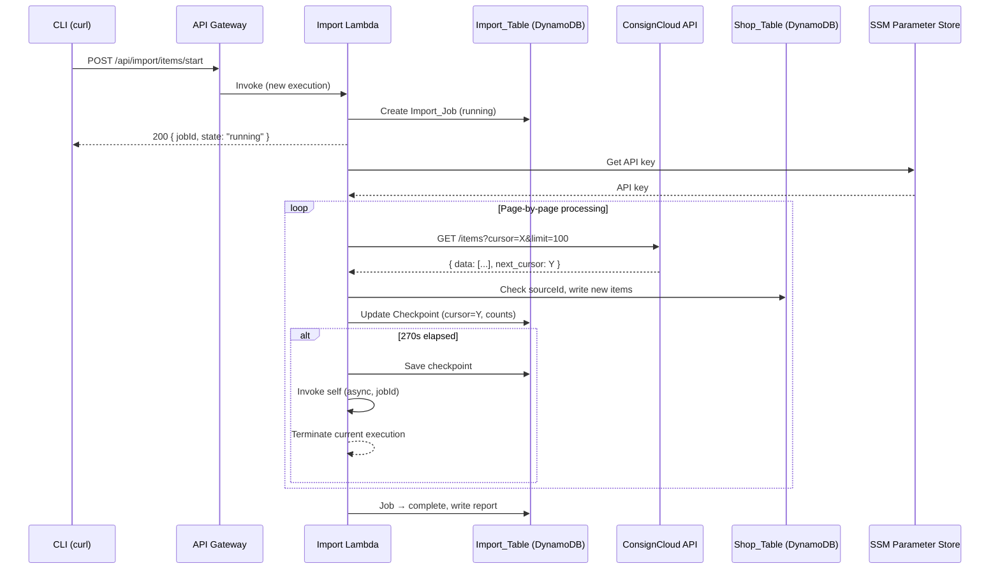
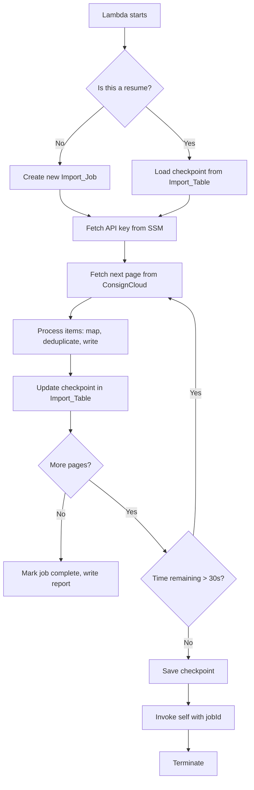
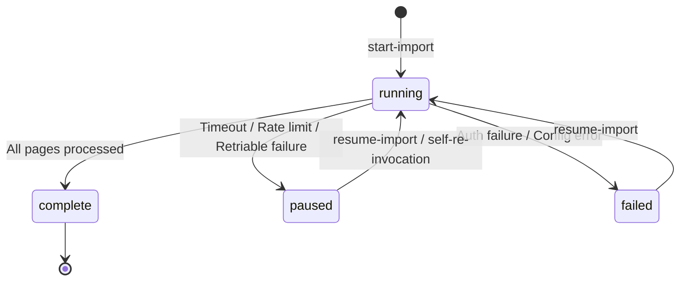

# Design Document: ConsignCloud Item Import

## Overview

This design describes how items are imported from the ConsignCloud API into the shop system's DynamoDB table. The core challenge is handling 100,000+ items within Lambda's 300-second timeout constraint. The solution uses a self-re-invocation loop: the Lambda processes items page-by-page, checkpoints progress after each page, and invokes itself before timeout to continue from where it left off. This creates an automatic chain of Lambda executions that completes the full import without operator intervention.

The design reuses existing infrastructure (Import DynamoDB table, Import Lambda, API Gateway, rate limiter, SSM client) and follows the patterns established by the account import, but replaces the "load all into memory" approach with streaming page-by-page processing and checkpoint-based resumability.

### Key Design Decisions

1. **Page-by-page processing over batch loading**: Items are processed and written to the Shop_Table one page at a time (100 items), never accumulating the full dataset in memory.
2. **Self-re-invocation over Step Functions**: The Lambda invokes itself before timeout rather than introducing Step Functions. This keeps the architecture simple and avoids new infrastructure.
3. **Checkpoint in Import_Table**: Progress is stored in the same DynamoDB table used for account imports, using a dedicated key pattern for item import jobs.
4. **Single-job concurrency control**: Only one item import job can be `running` or `paused` at a time, preventing duplicate processing.
5. **Conditional writes for idempotency**: Each item write uses a DynamoDB condition expression on `sourceId` to prevent duplicates even if a page is reprocessed.

## Architecture



### Self-Re-Invocation Loop



## Components and Interfaces

### New Components

| Component | File | Responsibility |
|-----------|------|----------------|
| Item Import Handler | `src/import/item-import-handler.ts` | Route dispatcher for item import endpoints |
| Item ConsignCloud Client | `src/import/item-consigncloud-client.ts` | Fetches item pages from ConsignCloud API with rate limiting and retry |
| Item Mapper | `src/import/item-mapper.ts` | Transforms ConsignCloud items to Shop_Table item format |
| Job Manager | `src/import/job-manager.ts` | Creates, updates, and queries Import_Job records |
| Checkpoint Manager | `src/import/checkpoint-manager.ts` | Reads/writes checkpoint records in Import_Table |
| Self Invoker | `src/import/self-invoker.ts` | Invokes the Lambda function asynchronously |
| Item Import Orchestrator | `src/import/item-import-orchestrator.ts` | Main processing loop coordinating all components |

### Reused Components

| Component | File | How Reused |
|-----------|------|------------|
| Rate Limiter | `src/import/rate-limiter.ts` | Same token bucket (100 capacity, 10/s drain) |
| SSM Client | `src/import/ssm-client.ts` | Same `getConsignCloudApiKey()` function |
| DynamoDB Client | `src/dynamodb-client.ts` | Same `docClient` and `TABLE_NAME` |
| Import Table Client | `src/import/import-table-client.ts` | Extended with new functions for job/checkpoint records |

### Component Interfaces

```typescript
// item-consigncloud-client.ts
export interface ConsignCloudItem {
  id: string;
  name: string;
  price: number;
  quantity: number;
  consignor_split: number;
  account_id: string;
  category?: { name: string } | null;
  tags?: string[];
  description?: string;
  brand?: string;
  color?: string;
  size?: string;
  shelf?: { name: string } | null;
  location?: { name: string } | null;
  tax_exempt?: boolean;
  images?: Array<{ url: string }>;
  created: string;
  deleted?: string | null;
}

export interface FetchItemPageResult {
  items: ConsignCloudItem[];
  nextCursor: string | null;
}

export interface ItemClientConfig {
  apiKey: string;
  baseUrl: string;
  rateLimiter: RateLimiter;
  createdAfter?: string;
  requestTimeoutMs?: number;
}

export function fetchItemPage(
  config: ItemClientConfig,
  cursor: string | null,
  limit: number,
): Promise<FetchItemPageResult>;
```

```typescript
// item-mapper.ts
export interface MappedItemFields {
  title: string;
  tagPrice: number;
  quantity: number;
  split: number;
  inventoryType: "Consignment";
  terms: "Return To Consignor";
  taxExempt: boolean;
  category?: string;
  tags?: string[];
  description?: string;
  brand?: string;
  color?: string;
  size?: string;
  shelf?: string;
  imageKeys?: string[];
}

export type ItemMappingResult =
  | { success: true; mapped: MappedItemFields }
  | { success: false; error: string };

export function mapConsignCloudItem(item: ConsignCloudItem): ItemMappingResult;
```

```typescript
// job-manager.ts
export type JobState = "running" | "paused" | "failed" | "complete";

export interface ImportJob {
  jobId: string;
  state: JobState;
  startedAt: string;
  lastUpdatedAt: string;
  filterParams: { createdAfter?: string };
  error?: string;
  progress: ProgressCounts;
}

export interface ProgressCounts {
  processed: number;
  imported: number;
  skipped: number;
  failed: number;
}

export function createJob(filterParams: { createdAfter?: string }): Promise<ImportJob>;
export function getJob(jobId: string): Promise<ImportJob | null>;
export function getRunningOrPausedJob(): Promise<ImportJob | null>;
export function transitionJob(jobId: string, state: JobState, progress: ProgressCounts, error?: string): Promise<void>;
```

```typescript
// checkpoint-manager.ts
export interface Checkpoint {
  jobId: string;
  cursor: string | null;
  progress: ProgressCounts;
  lastUpdatedAt: string;
}

export function saveCheckpoint(checkpoint: Checkpoint): Promise<void>;
export function loadCheckpoint(jobId: string): Promise<Checkpoint | null>;
```

```typescript
// self-invoker.ts
export interface SelfInvokePayload {
  action: "resume-internal";
  jobId: string;
}

export function invokeSelf(jobId: string): Promise<void>;
```

```typescript
// item-import-orchestrator.ts
export interface OrchestratorConfig {
  jobId: string;
  apiKey: string;
  baseUrl: string;
  rateLimiter: RateLimiter;
  startTime: number;
  timeoutThresholdMs: number; // 270_000
}

export function runImportLoop(config: OrchestratorConfig): Promise<void>;
```

## Data Models

### Import_Table Key Patterns

| Record Type | PK | SK | Purpose |
|-------------|----|----|---------|
| Import Job | `ITEM_IMPORT#<jobId>` | `METADATA` | Job state, progress, filter params |
| Checkpoint | `ITEM_IMPORT#<jobId>` | `CHECKPOINT` | Cursor position and cumulative counts |
| Import Report | `ITEM_IMPORT#REPORT` | `<jobId>` | Final report for completed jobs |

### Import_Job Record Schema

```typescript
{
  PK: "ITEM_IMPORT#<uuid>",
  SK: "METADATA",
  jobId: string,           // v4 UUID
  state: JobState,         // "running" | "paused" | "failed" | "complete"
  startedAt: string,       // ISO 8601 UTC
  lastUpdatedAt: string,   // ISO 8601 UTC
  filterParams: {
    createdAfter?: string  // ISO 8601 date, optional
  },
  progress: {
    processed: number,
    imported: number,
    skipped: number,
    failed: number
  },
  error?: string           // max 500 chars, present when state is "failed"
}
```

### Checkpoint Record Schema

```typescript
{
  PK: "ITEM_IMPORT#<uuid>",
  SK: "CHECKPOINT",
  jobId: string,
  cursor: string | null,   // next_cursor from last processed page, null if starting
  progress: {
    processed: number,
    imported: number,
    skipped: number,
    failed: number
  },
  lastUpdatedAt: string    // ISO 8601 UTC
}
```

### Import Report Record Schema

```typescript
{
  PK: "ITEM_IMPORT#REPORT",
  SK: "<jobId>",
  jobId: string,
  totalProcessed: number,
  imported: number,
  skipped: number,
  failed: number,
  elapsedSeconds: number,
  failures: Array<{ itemId: string; error: string }>,  // max 100 entries
  truncated: boolean,
  totalFailures: number,
  completedAt: string      // ISO 8601 UTC
}
```

### Shop_Table Item Record (target)

Per the data model, items are written with:

```typescript
{
  PK: "ITEM#<uuid>",
  SK: "METADATA",
  uuid: string,            // v4 UUID (synthetic key)
  GSI1PK: "ITEMS",
  GSI1SK: `ITEM#<sku>`,    // sequential SKU from counter
  accountId: string,       // UUID of owning Account
  title: string,
  tagPrice: number,
  quantity: number,
  split: number,
  inventoryType: "Consignment",
  terms: "Return To Consignor",
  taxExempt: boolean,
  sourceId: string,        // ConsignCloud item UUID for deduplication
  category?: string,
  brand?: string,
  color?: string,
  size?: string,
  shelf?: string,
  description?: string,
  tags?: string[],
  imageKeys?: string[],
  createdAt: string,
  updatedAt: string
}
```

### API Route Design

Three new POST endpoints on the existing import Lambda:

| Endpoint | Purpose | Request Body |
|----------|---------|-------------|
| `POST /api/import/items/start` | Start a new item import | `{ "createdAfter"?: "2026-01-01" }` |
| `POST /api/import/items/resume` | Resume a paused/failed job | `{ "jobId": "<uuid>" }` |
| `POST /api/import/items/status` | Get job status/report | `{ "jobId": "<uuid>" }` |

The import handler (`import-handler.ts`) is extended with these three routes, delegating to `item-import-handler.ts`.

### Self-Re-Invocation Mechanism

When the Lambda detects it has been running for 270 seconds (checked after each page completes):

1. Save the current checkpoint (cursor + progress counts) to Import_Table
2. Call `Lambda.invoke()` with:
   - `FunctionName`: The Lambda's own ARN (from `AWS_LAMBDA_FUNCTION_NAME` env var)
   - `InvocationType`: `"Event"` (asynchronous, fire-and-forget)
   - `Payload`: `{ "action": "resume-internal", "jobId": "<uuid>" }`
3. Log the handoff (cursor, progress counts)
4. Return immediately from the current invocation (no further page processing)

The new invocation detects the `resume-internal` action in the event payload, bypasses API Gateway routing, loads the checkpoint, and continues the loop.

### IAM Permission Addition

The Lambda role requires a new policy statement:

```hcl
resource "aws_iam_role_policy" "self_invoke" {
  name = "${var.project_name}-${var.environment}-shop-import-self-invoke"
  role = aws_iam_role.lambda.id

  policy = jsonencode({
    Version = "2012-10-17"
    Statement = [
      {
        Effect   = "Allow"
        Action   = ["lambda:InvokeFunction"]
        Resource = aws_lambda_function.import.arn
      }
    ]
  })
}
```

A new environment variable `FUNCTION_NAME` is added (set to the Lambda function name) for the self-invoke call. Alternatively, `AWS_LAMBDA_FUNCTION_NAME` is available at runtime automatically.

### Integration with Existing Infrastructure

| Existing Resource | How Item Import Uses It |
|-------------------|------------------------|
| Import_Table | Stores Import_Job, Checkpoint, and Report records alongside existing account import records (different PK prefix) |
| Import Lambda | Extended handler with 3 new routes; same deployment artifact |
| API Gateway | 3 new route resources pointing to the same integration |
| Rate Limiter | Same `createRateLimiter({ capacity: 100, drainRate: 10 })` instance |
| SSM Parameter | Same API key, same `getConsignCloudApiKey()` |
| Shop_Table | Write target for mapped items; also queried for account UUID resolution (sourceId lookup) and deduplication |

### Account Resolution Strategy

The item mapper needs to resolve ConsignCloud `account_id` to an internal account UUID. The approach:

1. Query the Shop_Table GSI (or scan by `sourceId`) for an account where `sourceId` matches the ConsignCloud account ID
2. Cache resolved account mappings in memory for the duration of a single Lambda invocation (items from the same account appear frequently on consecutive pages)
3. If no account is found, record the item as failed and continue

This in-memory cache resets between re-invocations, which is acceptable since DynamoDB lookups are fast and the cache rebuilds quickly.

## Correctness Properties

*A property is a characteristic or behavior that should hold true across all valid executions of a system — essentially, a formal statement about what the system should do. Properties serve as the bridge between human-readable specifications and machine-verifiable correctness guarantees.*

### Property 1: Item mapping preserves required fields

*For any* valid ConsignCloud item with all required fields present and within valid ranges, mapping it through `mapConsignCloudItem` SHALL produce a `MappedItemFields` result where `title` equals the source name (truncated to 200 chars), `tagPrice` equals the source price, `quantity` equals the source quantity, `split` equals the source consignor_split, and `description` is truncated to 2000 chars.

**Validates: Requirements 5.1**

### Property 2: Invalid items are rejected with field-specific errors

*For any* ConsignCloud item where at least one required field (title, tagPrice, quantity, split) is null, missing, or outside the valid range (tagPrice: 0–999,999.99, quantity: 1–9999, split: 0–100), mapping SHALL produce a failure result containing an error message that names the invalid field.

**Validates: Requirements 5.4, 5.5**

### Property 3: Deleted items are always skipped

*For any* ConsignCloud item with a non-null `deleted` field, processing SHALL skip the item and increment the skipped count, regardless of other field values.

**Validates: Requirements 5.6**

### Property 4: Deduplication prevents duplicates and preserves SKU sequence

*For any* page of items containing a mix of new items and items whose ConsignCloud UUID already exists as a `sourceId` in the Shop_Table, processing SHALL skip duplicate items without creating records or consuming sequence numbers, and the item sequence counter SHALL advance by exactly the count of newly imported items.

**Validates: Requirements 5.7, 8.1, 8.2, 8.5**

### Property 5: Checkpoint cursor consistency

*For any* sequence of pages processed where page K returns `next_cursor` value C_K and contains items resulting in I_K imports, S_K skips, and F_K failures, after checkpointing page N the stored cursor SHALL equal C_N and the stored progress counts SHALL satisfy: processed = Σ(I_k + S_k + F_k) for k=1..N, imported = Σ(I_k), skipped = Σ(S_k), failed = Σ(F_k).

**Validates: Requirements 4.1, 4.3, 8.4**

### Property 6: Job state transitions are valid

*For any* Import_Job, state transitions SHALL only follow the valid paths: `running → complete`, `running → paused`, `running → failed`, `paused → running`, `failed → running`. No other transitions are permitted.

**Validates: Requirements 6.1, 6.3, 6.4, 6.5**

### Property 7: Single active job invariant

*For any* start-import request, if an Import_Job already exists in `running` or `paused` state, the request SHALL be rejected with the existing job's identifier and no new job record SHALL be created.

**Validates: Requirements 1.2, 6.7**

### Property 8: Rate limiter respects capacity and drain rate

*For any* sequence of N requests issued through the rate limiter configured with capacity C and drain rate R, the time elapsed SHALL be at least `max(0, (N - C) / R)` seconds, ensuring sustained throughput never exceeds the configured drain rate.

**Validates: Requirements 3.1**

### Property 9: Exponential backoff on 429 responses

*For any* sequence of consecutive HTTP 429 responses without a `Retry-After` header, the wait time before attempt K (1-indexed) SHALL be `min(2^(K-1) * 1000, 60000)` milliseconds.

**Validates: Requirements 3.3**

### Property 10: Report failure list is bounded and ordered

*For any* completed import with F total failures where each failure has an error description of arbitrary length, the report's failure list SHALL contain `min(F, 100)` entries in processing order with each error truncated to 200 characters, `truncated` set to `true` if and only if F > 100, and `totalFailures` equal to F.

**Validates: Requirements 7.2, 7.5**

### Property 11: New item creation invariants

*For any* ConsignCloud item that passes validation, has a resolvable account, is not deleted, and does not already exist in the Shop_Table, the created record SHALL have a sequential SKU from the item counter, store the ConsignCloud UUID as `sourceId`, set `inventoryType` to `"Consignment"`, and set `terms` to `"Return To Consignor"`.

**Validates: Requirements 5.8, 5.9, 5.10**

### Property 12: Page processing continues after individual failures

*For any* page of N items where item at index J fails (due to write error, validation failure, or missing account), all items at indices J+1 through N-1 SHALL still be processed, and the final page counts SHALL reflect the correct totals for imported, skipped, and failed items.

**Validates: Requirements 8.3, 5.3**

## Error Handling

### Error Categories and Responses

| Error Type | Response | State Transition |
|------------|----------|-----------------|
| Authentication failure (invalid API key) | 500 + error message | Job → `failed` |
| Missing env var (SSM path, table name) | 500 + config error | Job → `failed` |
| ConsignCloud 4xx (non-429) | Log error, fail current page | Job → `paused` |
| ConsignCloud 5xx (after 3 retries) | Save checkpoint | Job → `paused` |
| ConsignCloud 429 (5 consecutive) | Save checkpoint | Job → `paused` |
| Individual item write failure | Log + increment failed count | Continue processing |
| Checkpoint write failure (after 3 retries) | Preserve in-memory counts | Job → `paused` |
| Self-invocation failure | Log error | Job → `paused` |
| Account resolution failure | Log + increment failed count | Continue processing |

### State Transition Diagram



### Retry Strategy

| Scenario | Max Retries | Backoff | Max Wait |
|----------|-------------|---------|----------|
| HTTP 5xx from ConsignCloud | 3 | Exponential (1s, 2s, 4s) | 4s |
| HTTP 429 with Retry-After header | 5 consecutive | Header value | 60s |
| HTTP 429 without Retry-After | 5 consecutive | Exponential (1s, 2s, 4s, 8s, 16s) | 60s |
| Checkpoint write failure | 3 | Fixed 500ms | 1.5s |
| Self-invocation failure | 1 | None | — |
| Individual item DynamoDB write | 0 (fail fast) | — | — |

## Testing Strategy

### Property-Based Tests (fast-check)

Each correctness property is implemented as a property-based test using `fast-check` with minimum 100 iterations. Each test is tagged with the format: `Feature: consigncloud-item-import, Property N: <property_text>`

| Property | Generator Strategy |
|----------|-------------------|
| 1: Mapping preserves fields | Generate random ConsignCloud items with valid fields of varying lengths |
| 2: Invalid items rejected | Generate items with randomly nulled/out-of-range required fields |
| 3: Deleted items skipped | Generate items with random non-null `deleted` values |
| 4: Deduplication + SKU | Generate pages with controlled mix of new and pre-existing sourceIds |
| 5: Checkpoint consistency | Generate sequences of pages with random item counts and outcomes |
| 6: State transitions | Generate random transition attempts from each state, verify validity |
| 7: Single job invariant | Generate start requests against various existing job states |
| 8: Rate limiter timing | Generate request counts (1–500), verify elapsed time formula |
| 9: Backoff calculation | Generate attempt numbers (1–10), verify delay = min(2^(K-1)*1000, 60000) |
| 10: Report bounds | Generate failure lists of varying sizes (0–500) with long error strings |
| 11: New item invariants | Generate valid items, verify SKU, sourceId, inventoryType, terms |
| 12: Continue after failure | Generate pages with failures at random indices, verify remaining items processed |

### Unit Tests (example-based)

- Account resolution: specific scenarios (found, not found, in-memory cache hit)
- Item mapping: concrete edge cases (exactly 200-char title, boundary prices 0.00 and 999,999.99)
- Route handling: request validation, method checking, 404/405 responses
- Self-invocation payload construction and async invoke call
- Timer threshold detection (269s → continue, 270s → self-invoke)
- Checkpoint write retry (1, 2, 3 failures then pause)
- 429 with Retry-After header parsing
- ConsignCloud 5xx retry exhaustion flow
- createdAfter parameter forwarding to API URL

### Integration Tests

- End-to-end page processing against mocked ConsignCloud API (multi-page)
- DynamoDB writes: verify item record structure, conditional expression behavior
- Checkpoint save/load round trip
- Job state transitions across simulated re-invocations
- Full self-re-invocation flow with mocked Lambda client
- Deduplication with actual DynamoDB conditional writes

### Test Configuration

- Property-based tests: `fast-check` library, 100+ iterations per property
- Unit tests: `vitest` with mocked AWS SDK clients
- Integration tests: `vitest` with `@aws-sdk/client-dynamodb` against DynamoDB Local or mocks
- All tests run via `vitest --run` (no watch mode)
