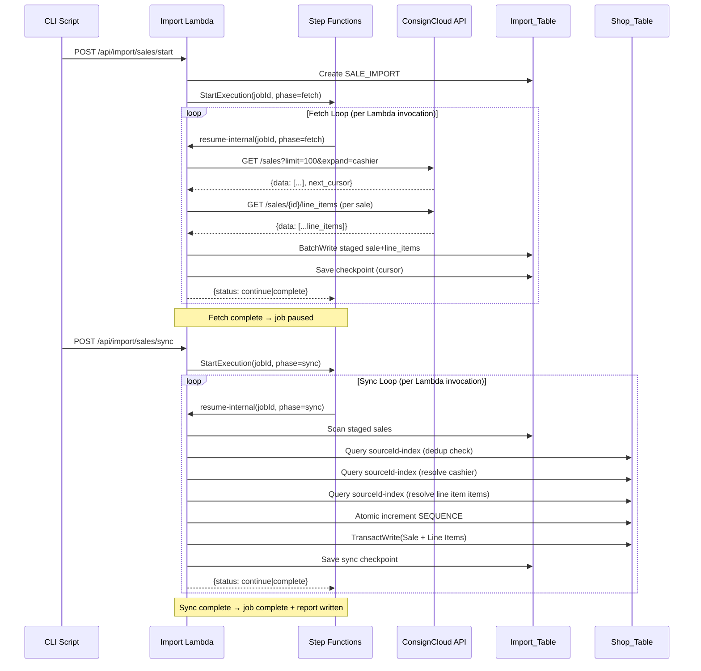

# Design Document: ConsignCloud Sale Import

## Overview

This feature adds sale import capability to the existing ConsignCloud import infrastructure. It follows the same two-phase architecture (fetch → sync) established by the item import, reusing the same Lambda function, Step Functions state machine, Import_Table, and rate limiter.

**Phase 1 (Fetch)**: Pages through the ConsignCloud Sales API (`GET /sales`), filters out non-finalized sales, fetches line items for each sale (`GET /sales/{id}/line_items`), and stages the combined sale+line_items JSON in the Import_Table.

**Phase 2 (Sync)**: Scans staged sales from the Import_Table, maps fields to the Shop_Table schema, resolves cashier references to Employee entities, resolves line item references to Item entities, generates sequential sale numbers, and writes Sale + Sale_Line_Item records atomically via DynamoDB transactions.

The import is triggered via CLI (`import-consigncloud.sh sales <action>`), tracks job state via a `SALE_IMPORT#<jobId>` record in the Import_Table, and uses checkpoint-based resumability identical to the item import pattern.

## Architecture



### Key Design Decisions

1. **Reuse existing Lambda + Step Functions**: No new Lambda functions or state machines. The same handler routes sale import requests via path-based dispatch (`/api/import/sales/*`).

2. **Line items fetched during fetch phase**: The ConsignCloud sale list endpoint does NOT include line items. They must be fetched separately via `GET /sales/{id}/line_items`. This is done during the fetch phase so that the sync phase never calls the external API (preserving the two-phase contract).

3. **Job PK prefix `SALE_IMPORT#`**: Distinguishes sale import jobs from item import jobs (`ITEM_IMPORT#`), allowing both to run independently.

4. **Sale number auto-generated**: The ConsignCloud `number` field is stored as `sourceNumber` for reference. The primary `number` is generated from `SEQUENCE#SALE` / `COUNTER` using the same atomic increment pattern as items/accounts.

5. **Monetary values stored as-is in cents**: No division or formatting. The frontend handles display.

## Components and Interfaces

### New Files

| File | Responsibility |
|------|---------------|
| `sale-consigncloud-client.ts` | API client for `GET /sales` and `GET /sales/{id}/line_items` |
| `sale-fetch-orchestrator.ts` | Fetch loop: pages sales, fetches line items, stages to Import_Table |
| `sale-sync-orchestrator.ts` | Sync loop: scans staged sales, maps, resolves references, writes to Shop_Table |
| `sale-mapper.ts` | Pure mapping from ConsignCloud sale fields to Shop_Table Sale fields |
| `sale-import-handler.ts` | HTTP handler functions for sale import endpoints (start, sync, status, resume, cancel) |
| `sale-job-manager.ts` | Job CRUD with `SALE_IMPORT#` prefix (mirrors job-manager.ts for items) |
| `sale-checkpoint-manager.ts` | Checkpoint persistence with `SALE_IMPORT#` prefix |

### Modified Files

| File | Change |
|------|--------|
| `handler.ts` (router) | Add route dispatch for `/api/import/sales/*` paths |
| `import-consigncloud.sh` | Add `sales` subcommand with fetch/sync/status/resume/cancel |
| `infrastructure/modules/import/main.tf` | Add API Gateway routes for sale import endpoints |

### Interfaces

```typescript
// sale-consigncloud-client.ts
export interface ConsignCloudSale {
  id: string;
  number: string;
  status: string; // "open" | "finalized" | "voided"
  subtotal: number; // cents
  total: number; // cents
  store_portion: number; // cents
  consignor_portion: number; // cents
  change: number; // cents
  memo: string | null;
  cashier: { id: string; name: string } | null;
  created: string; // ISO 8601
  finalized: string | null; // ISO 8601
  voided: string | null; // ISO 8601
}

export interface ConsignCloudLineItem {
  id: string;
  item: string | { id: string }; // UUID or expanded object
  price: number; // cents
  consignor_portion: number; // cents
  store_portion: number; // cents
  quantity: number;
  discount: number; // cents
}

export interface FetchSalePageResult {
  sales: ConsignCloudSale[];
  nextCursor: string | null;
}

export interface FetchLineItemsResult {
  lineItems: ConsignCloudLineItem[];
}

export interface SaleClientConfig {
  apiKey: string;
  baseUrl: string;
  rateLimiter: RateLimiter;
  createdAfter?: string;
  requestTimeoutMs?: number;
}
```

```typescript
// sale-mapper.ts
export interface MappedSaleFields {
  sourceNumber: string;
  status: "finalized";
  subtotal: number; // cents
  total: number; // cents
  storePortion: number; // cents
  consignorPortion: number; // cents
  change: number; // cents
  memo: string | null;
  finalizedAt: string | null;
  voidedAt: null;
  sourceId: string;
  createdAt: string;
}

export interface MappedLineItemFields {
  salePrice: number; // cents
  discount: number; // cents
  consignorPortion: number; // cents
  storePortion: number; // cents
}

export type SaleMappingResult =
  | { success: true; mapped: MappedSaleFields; lineItems: MappedLineItemFields[] }
  | { success: false; error: string };
```

```typescript
// sale-fetch-orchestrator.ts
export interface SaleFetchOrchestratorConfig {
  jobId: string;
  apiKey: string;
  baseUrl: string;
  rateLimiter: RateLimiter;
  startTime: number;
  timeoutThresholdMs: number;
}

export interface SaleFetchLoopResult {
  status: "continue" | "complete";
  jobId: string;
}
```

```typescript
// sale-sync-orchestrator.ts
export interface SaleSyncOrchestratorConfig {
  jobId: string;
  startTime: number;
  timeoutThresholdMs: number;
}

export interface SaleSyncLoopResult {
  status: "continue" | "complete";
  jobId: string;
}
```

### Staging Format in Import_Table

Each staged sale record:

```
PK: IMPORT#CONSIGNCLOUD#SALE#<sale-id>
SK: METADATA
Item: { ...saleFields, line_items: [...lineItemFields], importedAt: ISO8601 }
```

The `line_items` array is embedded directly in the staged record so the sync phase has everything it needs without additional API calls.

## Data Models

### Sale Record (Shop_Table)

| Attribute | Type | Source |
|-----------|------|--------|
| PK | `SALE#<uuid>` | Generated |
| SK | `METADATA` | Constant |
| GSI1PK | `SALES` | Constant |
| GSI1SK | `SALE#<zero-padded-number>` | Generated from SEQUENCE#SALE |
| uuid | string | Generated v4 UUID |
| number | number | Auto-generated sequential |
| sourceNumber | string | ConsignCloud `number` field |
| status | `"finalized"` | Constant (only finalized sales imported) |
| cashierId | string \| null | Resolved Employee UUID |
| subtotal | number | cents, from `subtotal` |
| total | number | cents, from `total` |
| storePortion | number | cents, from `store_portion` |
| consignorPortion | number | cents, from `consignor_portion` |
| change | number | cents, from `change` |
| memo | string \| null | from `memo` |
| finalizedAt | string \| null | ISO 8601, from `finalized` |
| voidedAt | null | Always null (only finalized imported) |
| sourceId | string | ConsignCloud sale UUID |
| createdAt | string | ISO 8601, from `created` |

### Sale Line Item Record (Shop_Table)

| Attribute | Type | Source |
|-----------|------|--------|
| PK | `SALE#<uuid>` | Same as parent Sale |
| SK | `LINE_ITEM#<zero-padded-index>` | e.g., `LINE_ITEM#0000` |
| itemId | string \| null | Resolved Item UUID via sourceId lookup |
| salePrice | number | cents, from line item `price` |
| discount | number | cents, from line item `discount` |
| consignorPortion | number | cents, from line item `consignor_portion` |
| storePortion | number | cents, from line item `store_portion` |

### Job Record (Import_Table)

| Attribute | Type | Description |
|-----------|------|-------------|
| PK | `SALE_IMPORT#<jobId>` | Job partition key |
| SK | `METADATA` | Constant |
| jobId | string | v4 UUID |
| state | `running` \| `paused` \| `failed` \| `complete` | Current state |
| phase | `fetch` \| `sync` | Current phase |
| startedAt | string | ISO 8601 |
| lastUpdatedAt | string | ISO 8601 |
| filterParams | `{ createdAfter?: string }` | Query filters |
| error | string \| undefined | Error description (max 500 chars) |
| progress | `{ processed, imported, skipped, failed }` | Cumulative counts |

### Checkpoint Record (Import_Table)

| Attribute | Type | Description |
|-----------|------|-------------|
| PK | `SALE_IMPORT#<jobId>` | Job partition key |
| SK | `CHECKPOINT` | Constant |
| cursor | string \| null | ConsignCloud pagination cursor |
| progress | ProgressCounts | Cumulative counts |
| lastUpdatedAt | string | ISO 8601 |

### Sync Checkpoint Record (Import_Table)

| Attribute | Type | Description |
|-----------|------|-------------|
| PK | `SALE_IMPORT#<jobId>` | Job partition key |
| SK | `SYNC_CHECKPOINT` | Constant |
| exclusiveStartKey | Record \| null | DynamoDB scan position |
| progress | ProgressCounts | Cumulative counts |
| failures | FailureEntry[] | First 100 failures |
| lineItemsImported | number | Total line items written |
| lastUpdatedAt | string | ISO 8601 |

### Import Report Record (Import_Table)

| Attribute | Type | Description |
|-----------|------|-------------|
| PK | `SALE_IMPORT#REPORT` | Report partition key |
| SK | `<jobId>` | Job identifier |
| totalProcessed | number | Total sales processed |
| imported | number | Sales successfully imported |
| skipped | number | Duplicates skipped |
| failed | number | Sales that failed |
| lineItemsImported | number | Total line items written |
| elapsedSeconds | number | Whole seconds |
| failures | FailureEntry[] | First 100 failures |
| truncated | boolean | Whether failures list was truncated |
| totalFailures | number | Actual count of failures |
| completedAt | string | ISO 8601 |

### Sale Number Generation

Uses the same atomic increment pattern as items:

```typescript
// Read current value from SEQUENCE#SALE / COUNTER
// Attempt TransactWrite to increment with condition check
// Retry up to 3 times on TransactionCanceledException
// Return next number, format as zero-padded for GSI1SK: SALE#0000042
```

## Correctness Properties

*A property is a characteristic or behavior that should hold true across all valid executions of a system — essentially, a formal statement about what the system should do. Properties serve as the bridge between human-readable specifications and machine-verifiable correctness guarantees.*

### Property 1: Only finalized sales pass the status filter

*For any* ConsignCloud sale with a `status` field, the filter function SHALL return true if and only if `status === "finalized"`. For any sale with status `"open"`, `"voided"`, or any other string value, the filter SHALL return false.

**Validates: Requirements 3.4**

### Property 2: Sale mapping preserves monetary values and produces valid output

*For any* valid ConsignCloud sale object with numeric `subtotal`, `total`, `store_portion`, `consignor_portion`, and `change` fields, the Sale_Mapper SHALL produce a mapped result where: `subtotal` equals the input `subtotal`, `total` equals the input `total`, `storePortion` equals the input `store_portion`, `consignorPortion` equals the input `consignor_portion`, `change` equals the input `change`, `sourceId` equals the input `id`, `sourceNumber` equals the input `number`, and `createdAt` equals the input `created` timestamp.

**Validates: Requirements 6.1**

### Property 3: Sale key construction follows the defined patterns

*For any* valid UUID string and any positive integer sale number, the constructed Sale record keys SHALL satisfy: PK equals `SALE#<uuid>`, SK equals `METADATA`, GSI1PK equals `SALES`, and GSI1SK equals `SALE#` followed by the number zero-padded to 7 digits.

**Validates: Requirements 6.2**

### Property 4: Line item mapping produces correctly indexed records with preserved values

*For any* list of ConsignCloud line items (length 0 to N), the mapping SHALL produce exactly N mapped line item records where: the SK for index `i` equals `LINE_ITEM#` followed by `i` zero-padded to 4 digits, `salePrice` equals the input `price`, `discount` equals the input `discount`, `consignorPortion` equals the input `consignor_portion`, and `storePortion` equals the input `store_portion`.

**Validates: Requirements 7.1, 7.2**

### Property 5: Error descriptions are bounded to 500 characters

*For any* error string of length L, the stored error description SHALL have length equal to `min(L, 500)` and SHALL be a prefix of the original error string.

**Validates: Requirements 10.5**

### Property 6: Import report failure list is bounded and truncated correctly

*For any* list of failure entries of length F, the Import_Report SHALL contain at most 100 failure entries. Each entry's error description SHALL have length at most 200 characters. If F > 100, the report SHALL have `truncated` set to true and `totalFailures` set to F.

**Validates: Requirements 11.2, 11.5**

## Error Handling

### Fetch Phase Errors

| Error | Handling | Recovery |
|-------|----------|----------|
| SSM parameter not found | Log ERROR, transition to `failed` | Fix SSM parameter, resume |
| HTTP 429 (rate limit) | Exponential backoff, retry up to 5 consecutive | After 5th: checkpoint + pause |
| HTTP 5xx (server error) | Retry 3 times with backoff (1s, 2s, 4s) | After retries: checkpoint + pause |
| HTTP 4xx (not 429) | Non-retryable, throw immediately | Checkpoint + pause |
| Line item fetch failure | Log WARN, store sale with empty `line_items` array | Sale will sync without line item data |
| Lambda timeout approaching (270s) | Save checkpoint, return `continue` | Step Functions re-invokes |

### Sync Phase Errors

| Error | Handling | Recovery |
|-------|----------|----------|
| Sale mapping failure | Log WARN, record in failures list, skip sale | Continue with next sale |
| SKU/number generation failure | Retry 3 times (conditional write contention) | After retries: record failure, skip |
| Transaction write failure (conditional) | Treat as duplicate (skip) | Continue |
| Transaction write failure (other) | Record in failures list, skip sale | Continue with next sale |
| Cashier resolution/creation failure | Log WARN, set cashierId to null | Sale written without cashierId |
| Item reference resolution failure | Set itemId to null, log WARN | Line item written with null itemId |
| Lambda timeout approaching (270s) | Save sync checkpoint, return `continue` | Step Functions re-invokes |

### Error Propagation Strategy

- **Fetch phase**: Errors that prevent fetching ANY data (auth failure, persistent 5xx) pause the job. Per-page errors that occur after partial success save checkpoint and pause.
- **Sync phase**: Individual sale failures are recorded but do NOT stop processing. The sync continues through all staged records. Only infrastructure failures (DynamoDB service outage) would cause an unhandled exception that the outer try/catch turns into a pause.
- **Non-recoverable errors**: Auth failures, missing configuration, and schema errors transition the job to `failed` state with error description.

## Testing Strategy

### Unit Tests (Example-Based)

Focus on specific scenarios and edge cases:

- **Sale import handler**: Test each endpoint (start, sync, status, resume, cancel) with mocked dependencies
  - Start with/without createdAfter parameter
  - Start rejected when active job exists (409)
  - Resume from paused/failed states
  - Resume rejected for invalid states
  - Status returns report for completed jobs
- **Sale fetch orchestrator**: Test page processing with mocked API client
  - Single page (cursor null after first fetch)
  - Multiple pages with cursor propagation
  - Timeout threshold triggers continue
- **Sale sync orchestrator**: Test record processing with mocked DynamoDB
  - Deduplication skip (sourceId exists)
  - Successful sale + line items write
  - Transaction failure → skip as duplicate
  - Cashier resolution (existing vs create new)
- **Checkpoint manager**: Test save/load round-trip
- **Rate limiter**: Already tested, reused as-is

### Property-Based Tests

Using `fast-check` library with minimum 100 iterations per property:

1. **Status filter property** (Property 1): Generate random status strings, verify only "finalized" passes
2. **Sale mapping property** (Property 2): Generate random ConsignCloud sale objects with valid fields, verify output field mapping
3. **Key construction property** (Property 3): Generate random UUIDs and positive integers, verify key patterns
4. **Line item mapping property** (Property 4): Generate random line item arrays (0-50 items), verify indexing and field preservation
5. **Error truncation property** (Property 5): Generate random strings (0-2000 chars), verify truncation to 500
6. **Report failure truncation property** (Property 6): Generate random failure lists (0-500 entries, error strings 0-1000 chars), verify bounds

Each property test tagged with:

```
// Feature: consigncloud-sale-import, Property N: <property text>
```

### Integration Tests

Using mocked DynamoDB (dynamodb-local or mocked DocumentClient):

- Full fetch→pause→sync→complete lifecycle
- Resume from checkpoint (fetch phase)
- Resume from sync checkpoint
- Deduplication across multiple sync runs
- TransactWrite with sale + line items atomicity
- Line item fetch failure graceful degradation

### Test Configuration

- Property tests: minimum 100 iterations via `fast-check` `fc.assert(property, { numRuns: 100 })`
- Unit tests: Vitest with mocked AWS SDK clients
- Integration tests: Vitest with DynamoDB local or mocked DocumentClient
