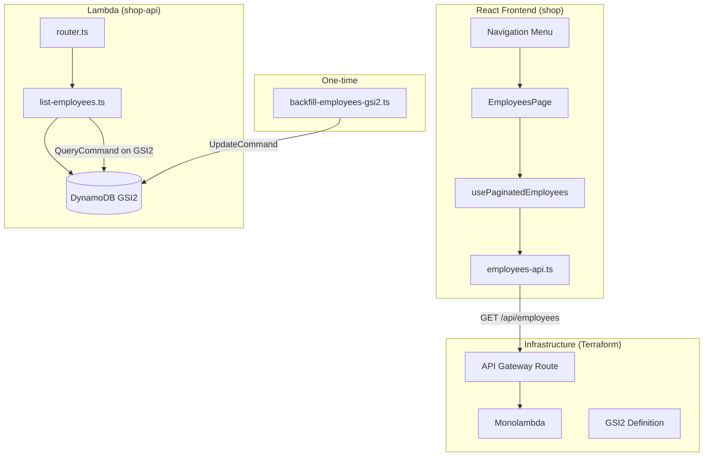

# Design Document: Employees Page

## Overview

The Employees Page feature adds a read-only admin page for viewing employees with a new backend list endpoint and supporting infrastructure. It follows the established Accounts page pattern: a Lambda route handler querying a DynamoDB GSI with cursor-based pagination, a React page with TanStack Table and shadcn/ui components, and Terraform for the GSI and API Gateway route.

Employees are auto-created by the import pipeline (item-sync-orchestrator, sale-sync-orchestrator, upsert-service) and cannot be manually managed. The page is purely informational.

## Architecture



### Design Decisions

1. **GSI2 for employee collection queries**: Employees currently have no GSI for listing all records. A new GSI2 (GSI2PK: `EMPLOYEES`, GSI2SK: `EMPLOYEE#<uuid>`) enables efficient pagination without table scans. Using UUID in the sort key provides stable ordering (lexicographic by UUID) without requiring sequential numbering.

2. **Reuse existing pagination infrastructure**: The `cursor-utils.ts` (encode/decode), `pagination-types.ts`, and the `usePaginatedAccounts` hook pattern are proven. The employees version will be a simplified copy (no CRUD operations).

3. **Read-only page**: No create/edit/delete UI or API endpoints. Employees are managed exclusively by the import pipeline.

4. **Backfill script**: Existing Employee records lack GSI2 attributes. A one-time script scans by PK prefix and adds the attributes, making them queryable via the new index.

## Components and Interfaces

### Backend

#### `list-employees.ts` — Lambda Route Handler

```typescript
// GET /api/employees?pageSize=20&cursor=<opaque>
export async function listEmployees(
  event: APIGatewayProxyEventV2,
): Promise<APIGatewayProxyResultV2>;
```

Follows the same structure as `list-accounts.ts`:
- Validates `pageSize` (20 | 50 | 100, default 20)
- Decodes optional `cursor` via `decodeCursor()`
- Queries GSI2 with `GSI2PK = "EMPLOYEES"`, `ScanIndexForward: true`
- Maps DynamoDB items to API response shape via `mapEmployeeRecord()`
- Encodes `LastEvaluatedKey` as `nextCursor`

Response shape:
```typescript
interface ListEmployeesResponse {
  employees: EmployeeRecord[];
  nextCursor: string | null;
  hasMore: boolean;
}

interface EmployeeRecord {
  uuid: string;
  name: string;
  sourceId: string;
  createdAt: string;
  updatedAt: string;
}
```

#### Router Registration

Add `"GET /api/employees": listEmployees` to the `routes` map in `router.ts`.

### Frontend

#### `employees-types.ts` — Type Definitions

```typescript
import type { PageSize } from "@/lib/pagination-types";
export type { PageSize, CursorPaginationParams } from "@/lib/pagination-types";

export interface Employee {
  uuid: string;
  name: string;
  sourceId: string;
  createdAt: string;
  updatedAt: string;
}

export interface CursorPaginatedEmployeesResponse {
  employees: Employee[];
  nextCursor: string | null;
  hasMore: boolean;
}

export interface CachedEmployeePage {
  employees: Employee[];
  nextCursor: string | null;
}

export interface UsePaginatedEmployeesResult {
  employees: Employee[];
  loading: boolean;
  error: string | null;
  hasMore: boolean;
  hasPrevious: boolean;
  pageSize: PageSize;
  goNext: () => void;
  goPrevious: () => void;
  setPageSize: (size: PageSize) => void;
  retry: () => void;
}
```

#### `employees-api.ts` — API Client

```typescript
export async function fetchPaginatedEmployees(
  params: CursorPaginationParams,
  options?: { signal?: AbortSignal },
): Promise<CursorPaginatedEmployeesResponse>;
```

Same pattern as `fetchCursorPaginatedAccounts`: auth headers, timeout, abort signal handling.

#### `use-paginated-employees.ts` — Pagination Hook

Same pattern as `usePaginatedAccounts`: page cache, cursor-based navigation, page size changes reset to first page.

#### `employees-columns.tsx` — Column Definitions

```typescript
export const employeesColumns: ColumnDef<Employee>[] = [
  { accessorKey: "name", header: "Name" },
  { accessorKey: "sourceId", header: "Source ID" },
  {
    accessorKey: "createdAt",
    header: "Created At",
    cell: ({ row }) => formatDate(row.getValue("createdAt")),
  },
];
```

No actions column (read-only).

#### `employees-page.tsx` — Page Component

Simplified version of `AccountsPage`:
- Heading "Employees"
- DataTable with pagination controls
- No add/edit/delete buttons or dialogs
- Loading and error states

#### Navigation Integration

Add to `navigation.ts`:
```typescript
{ label: "Employees", path: "/employees", icon: UserCheck }
```

Positioned after "Accounts" and before "Sales".

### Infrastructure

#### DynamoDB GSI2 (Terraform)

Add to `dynamodb.tf`:
- Two new `attribute` blocks: `GSI2PK` (S), `GSI2SK` (S)
- A new `global_secondary_index` block: name `GSI2`, hash_key `GSI2PK`, range_key `GSI2SK`, projection `ALL`

#### API Gateway Route (Terraform)

Add `aws_apigatewayv2_route.get_employees`:
- route_key: `GET /api/employees`
- target: monolambda integration
- authorization_type: `CUSTOM`
- authorizer_id: cognito authorizer

### Migration

#### `backfill-employees-gsi2.ts` — One-time Script

Scans the DynamoDB table for items matching `PK begins_with "EMPLOYEE#"` and `SK = "METADATA"` that are missing `GSI2PK`. For each, performs an UpdateCommand to set `GSI2PK = "EMPLOYEES"` and `GSI2SK = "EMPLOYEE#<uuid>"`.

#### Write Path Updates

All employee creation paths must be updated to include GSI2 attributes:
- `projects/shop-api/src/stream/upsert-service.ts` → `resolveOrCreateEmployee()`
- `projects/shop-api/src/import/item-sync-orchestrator.ts` → inline employee creation
- `projects/shop-api/src/import/sale-sync-orchestrator.ts` → inline employee creation

Each PutCommand Item gains:
```typescript
GSI2PK: "EMPLOYEES",
GSI2SK: `EMPLOYEE#${uuid}`,
```

## Data Models

### DynamoDB Employee Record (Updated)

| Attribute  | Type   | Value                    | Notes                        |
|-----------|--------|--------------------------|------------------------------|
| PK        | String | `EMPLOYEE#<uuid>`        | Partition key                |
| SK        | String | `METADATA`               | Sort key                     |
| uuid      | String | v4 UUID                  | Synthetic primary identifier |
| name      | String | Employee name            | Required                     |
| sourceId  | String | External system ID       | ConsignCloud employee UUID   |
| GSI2PK    | String | `EMPLOYEES`              | **New** — collection key     |
| GSI2SK    | String | `EMPLOYEE#<uuid>`        | **New** — sort within collection |
| createdAt | String | ISO 8601 UTC             |                              |
| updatedAt | String | ISO 8601 UTC             |                              |

### GSI2 Access Pattern

| Query                  | GSI2PK      | GSI2SK                     | Use Case                |
|-----------------------|-------------|----------------------------|-------------------------|
| List all employees    | `EMPLOYEES` | (range scan)               | Paginated listing       |
| Start after cursor    | `EMPLOYEES` | ExclusiveStartKey from cursor | Cursor pagination     |

### API Response Shape

```json
{
  "employees": [
    {
      "uuid": "550e8400-e29b-41d4-a716-446655440000",
      "name": "Jane Smith",
      "sourceId": "cc-employee-abc123",
      "createdAt": "2024-01-15T10:30:00.000Z",
      "updatedAt": "2024-01-15T10:30:00.000Z"
    }
  ],
  "nextCursor": "eyJQSyI6IkVNUExPWUVFIy4uLiJ9",
  "hasMore": true
}
```

## Correctness Properties

*A property is a characteristic or behavior that should hold true across all valid executions of a system — essentially, a formal statement about what the system should do. Properties serve as the bridge between human-readable specifications and machine-verifiable correctness guarantees.*

### Property 1: Response structure invariant

*For any* valid request to the list employees endpoint (with any valid combination of pageSize and cursor parameters), the response SHALL always contain an `employees` array, a `nextCursor` that is either a string or null, and a `hasMore` boolean.

**Validates: Requirements 1.1**

### Property 2: Page size limit

*For any* valid pageSize value (20, 50, or 100) and any dataset of employee records, the number of employees returned in a single response SHALL be less than or equal to the requested pageSize.

**Validates: Requirements 1.2**

### Property 3: Invalid pageSize rejection

*For any* pageSize value that is not one of [20, 50, 100] (including negative numbers, zero, decimals, non-numeric strings), the endpoint SHALL return a 400 status code.

**Validates: Requirements 1.4**

### Property 4: Invalid cursor rejection

*For any* string that is not a valid base64url-encoded JSON object, the endpoint SHALL return a 400 status code when provided as the cursor parameter.

**Validates: Requirements 1.6**

### Property 5: Employee record mapping completeness

*For any* DynamoDB employee record containing arbitrary additional attributes (PK, SK, GSI2PK, GSI2SK, or other internal fields), the response mapper SHALL extract exactly `uuid`, `name`, `sourceId`, `createdAt`, and `updatedAt` — no internal attributes leak into the API response.

**Validates: Requirements 1.9**

## Error Handling

### Backend (list-employees.ts)

| Condition                  | Status | Response Body                                    |
|---------------------------|--------|--------------------------------------------------|
| Invalid pageSize          | 400    | `{ "error": "pageSize must be one of 20, 50, 100" }` |
| Invalid cursor            | 400    | `{ "error": "Invalid cursor" }`                  |
| DynamoDB error            | 500    | `{ "error": "internal_error" }`                  |
| Missing/invalid auth token| 401/403| Handled by API Gateway authorizer                |

All DynamoDB errors are logged with error details (message, name) and return a generic error response to avoid leaking internals.

### Frontend (employees-page.tsx)

| Condition         | Behavior                                           |
|------------------|----------------------------------------------------|
| Network error    | Display "Unable to load employees" with retry button |
| Timeout (30s)    | Display "Request timed out" with retry button      |
| HTTP error       | Display "Failed to fetch employees: {status}" with retry button |
| Abort (navigation) | Silently cancel, no error displayed              |

## Testing Strategy

### Property-Based Tests (fast-check, minimum 100 iterations)

The following properties are suitable for PBT because they test pure mapping/validation logic in the backend handler:

| Property | What It Tests | Location |
|----------|--------------|----------|
| Property 1: Response structure | Handler always returns correct shape | `list-employees.test.ts` |
| Property 2: Page size limit | Array length <= pageSize | `list-employees.test.ts` |
| Property 3: Invalid pageSize | Rejection of bad input | `list-employees.test.ts` |
| Property 4: Invalid cursor | Rejection of malformed cursors | `list-employees.test.ts` |
| Property 5: Record mapping | Exact field extraction | Already exists: `employee-mapping.property.test.ts` (covers `mapEmployeeRecord`) |

Each property test uses `fast-check` with `{ numRuns: 200 }` and is tagged with:
```
Feature: employees-page, Property {N}: {property_text}
```

**Note**: Property 5 is already implemented in `employee-mapping.property.test.ts`. The existing test covers the `mapEmployeeRecord` function which will be reused by `list-employees.ts`. No new property test needed for this one.

### Unit Tests (example-based)

| Test | What It Verifies |
|------|-----------------|
| Default pageSize is 20 | Requirement 1.3 |
| GSI2 query parameters correct | Requirement 2.2 |
| Column headers render correctly | Requirement 3.1 |
| Page heading is "Employees" | Requirement 3.2 |
| Loading state displayed | Requirement 3.3 |
| Error state with retry button | Requirement 3.4 |
| No CRUD action buttons | Requirement 3.5 |
| ARIA table semantics | Requirement 3.6 |
| Next/Previous button states | Requirements 4.1, 4.2 |
| Page size selector options | Requirement 4.5 |
| Navigation entry presence and order | Requirements 5.1, 5.3 |
| Router maps route key to handler | Requirement 6.3 |

### Integration Tests

| Test | What It Verifies |
|------|-----------------|
| Cursor pagination returns non-overlapping pages | Requirements 1.5, 1.7, 1.8 |
| Authorization required | Requirement 1.10 |

### Infrastructure Validation

| Check | What It Verifies |
|-------|-----------------|
| Terraform plan includes GSI2 | Requirement 2.3 |
| Terraform plan includes API Gateway route | Requirements 6.1, 6.2 |
| Backfill script updates existing records | Requirement 2.4 |
