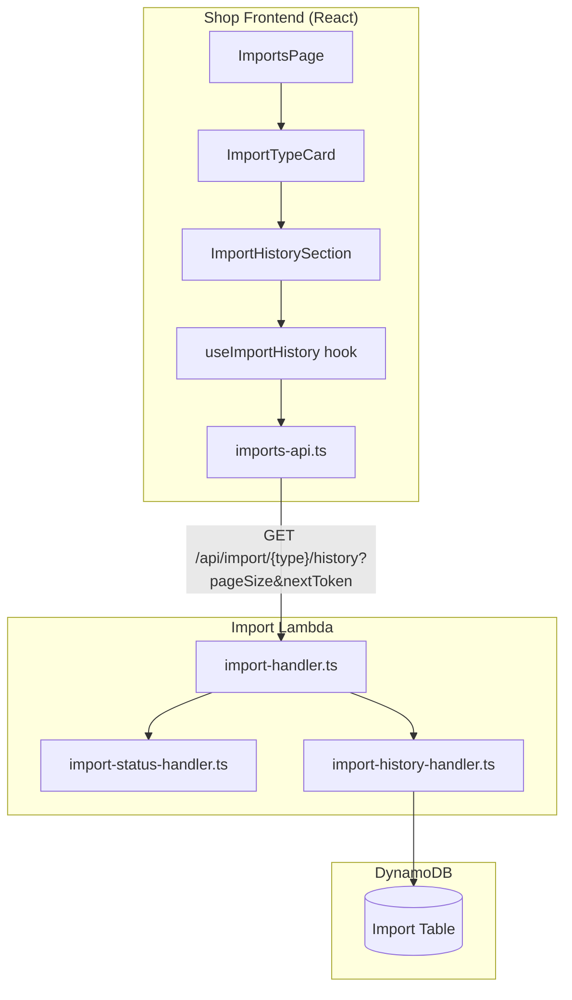
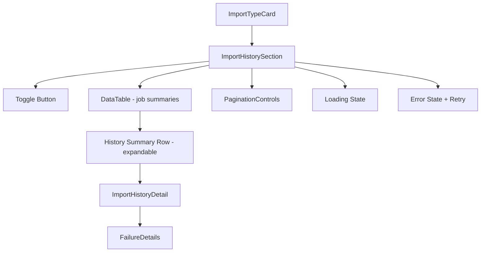

# Design Document: Import History

## Overview

The Import History feature extends the existing Imports page by adding a collapsible history section to each `ImportTypeCard`. When expanded, the section displays paginated historical import jobs for that specific type (items, sales, accounts), with drill-down into full report and failure details for any completed job.

On the backend, a new paginated GET endpoint (`/api/import/{type}/history`) reuses the existing DynamoDB Scan + sort pattern from `import-status-handler.ts`, extended with `ExclusiveStartKey`/`LastEvaluatedKey` cursor-based pagination and configurable page sizes.

The design reuses existing shared components (`DataTable`, `PaginationControls`, `FailureDetails`) and follows the established feature module pattern under `src/features/imports/`.

## Architecture



### Key Architectural Decisions

1. **Per-card history section**: History is embedded within each `ImportTypeCard` rather than a separate page or modal. This keeps the admin's context intact and allows comparing current status with historical trends.

2. **Cursor-based pagination**: Uses DynamoDB's native `ExclusiveStartKey`/`LastEvaluatedKey` mechanism via opaque tokens. This avoids offset-based pagination problems (inconsistency on writes) and works naturally with DynamoDB Scan.

3. **Client-side page stack for "Previous"**: Since DynamoDB cursors are forward-only, the frontend maintains a stack of previously-seen cursors to enable backward navigation. This matches the existing `PaginationControls` component's `hasPrevious`/`hasMore` model.

4. **Report enrichment at query time**: When the backend returns jobs with state `"complete"`, it fetches and attaches the corresponding `Import_Report` in the same response. This avoids N+1 requests from the frontend for detail drill-down.

5. **Independent per-type state**: Each `ImportHistorySection` maintains its own hook instance with isolated toggle, pagination, and loading state. Expanding one type's history does not affect others.

6. **Reuse existing components**: `DataTable` for the tabular job list, `PaginationControls` for navigation, `FailureDetails` for report failure entries, and `sanitizeErrorMessage`/`getStatusColor` from `imports-utils.ts`.

## Components and Interfaces

### New Files

```
src/features/imports/
├── import-history-section.tsx       # Collapsible history UI per import type
├── import-history-section.test.tsx   # Component tests
├── import-history-detail.tsx        # Expanded detail view for a single historical job
├── import-history-detail.test.tsx   # Component tests
├── use-import-history.ts            # Hook managing fetch, pagination, toggle state
├── use-import-history.test.ts       # Hook tests
├── import-history-utils.ts          # Pure functions (pageSize validation, sorting, page stack)
├── import-history-utils.test.ts     # Unit tests
├── import-history-utils.property.test.ts  # Property-based tests
└── (existing files modified:)
    ├── imports-types.ts             # Add history-related interfaces
    ├── imports-api.ts               # Add fetchImportHistory function
    └── import-type-card.tsx         # Integrate ImportHistorySection

projects/shop-api/src/import/
├── import-history-handler.ts        # Backend handler for GET /api/import/{type}/history
├── import-history-handler.test.ts   # Backend handler tests
└── (existing files modified:)
    └── import-handler.ts            # Add route for history endpoint
```

### Component Hierarchy



### Key Interfaces

```typescript
// imports-types.ts — new additions

export interface HistoryJobSummary {
  jobId: string;
  state: JobState;
  phase: ImportPhase;
  startedAt: string;
  lastUpdatedAt: string;
  progress: ProgressCounts;
  error?: string;
  report?: ImportReport;
}

export interface ImportHistoryResponse {
  jobs: HistoryJobSummary[];
  nextToken?: string;
}

export interface ImportHistoryParams {
  type: ImportType;
  pageSize: PageSize;
  nextToken?: string;
}
```

### API Client Addition

```typescript
// imports-api.ts — new function

export async function fetchImportHistory(
  params: ImportHistoryParams,
  options?: { signal?: AbortSignal }
): Promise<ImportHistoryResponse>;
```

### Hook Interface

```typescript
// use-import-history.ts

export interface UseImportHistoryResult {
  expanded: boolean;
  toggle: () => void;
  jobs: HistoryJobSummary[];
  loading: boolean;
  error: string | null;
  retry: () => void;
  hasMore: boolean;
  hasPrevious: boolean;
  pageSize: PageSize;
  setPageSize: (size: PageSize) => void;
  goNext: () => void;
  goPrevious: () => void;
}

export function useImportHistory(type: ImportType): UseImportHistoryResult;
```

### Pure Utility Functions

```typescript
// import-history-utils.ts

import type { PageSize } from "@/lib/pagination-types";
import type { HistoryJobSummary } from "./imports-types";

/**
 * Validates and normalises a pageSize value.
 * Returns the input if it is 20, 50, or 100; otherwise returns 20.
 */
export function normalizePageSize(value: unknown): PageSize;

/**
 * Validates that a type string is a valid ImportType.
 * Returns true if type is "items", "sales", or "accounts".
 */
export function isValidImportType(type: string): boolean;

/**
 * Sorts jobs by lastUpdatedAt descending (most recent first).
 * Returns a new sorted array without mutating the input.
 */
export function sortJobsByDate(jobs: HistoryJobSummary[]): HistoryJobSummary[];

/**
 * Manages a page cursor stack for backward navigation.
 * Push a cursor when moving forward; pop when moving back.
 */
export interface PageStack {
  push: (cursor: string) => void;
  pop: () => string | undefined;
  peek: () => string | undefined;
  size: () => number;
  clear: () => void;
}

export function createPageStack(): PageStack;
```

## Data Models

### Backend Response: GET /api/import/{type}/history

```json
{
  "jobs": [
    {
      "jobId": "uuid-1",
      "state": "complete",
      "phase": "sync",
      "startedAt": "2024-01-15T10:00:00.000Z",
      "lastUpdatedAt": "2024-01-15T10:45:00.000Z",
      "progress": {
        "processed": 1500,
        "imported": 1200,
        "skipped": 250,
        "failed": 50
      },
      "report": {
        "jobId": "uuid-1",
        "totalProcessed": 1500,
        "imported": 1200,
        "skipped": 250,
        "failed": 50,
        "elapsedSeconds": 2700,
        "failures": [
          { "itemId": "ext-123", "error": "Missing required field: amount" }
        ],
        "truncated": false,
        "totalFailures": 50,
        "completedAt": "2024-01-15T10:45:00.000Z"
      }
    },
    {
      "jobId": "uuid-2",
      "state": "failed",
      "phase": "fetch",
      "startedAt": "2024-01-14T08:00:00.000Z",
      "lastUpdatedAt": "2024-01-14T08:02:30.000Z",
      "progress": {
        "processed": 0,
        "imported": 0,
        "skipped": 0,
        "failed": 0
      },
      "error": "Connection timeout to external API"
    }
  ],
  "nextToken": "eyJQSyI6IklURU1fSU1QT1JUIzEyMyIsIlNLIjoiTUVUQURBVEEifQ=="
}
```

### DynamoDB Access Pattern

The history endpoint extends the existing `getMostRecentJob` pattern from `import-status-handler.ts`:

| Operation | Table | Key Pattern | Notes |
|-----------|-------|-------------|-------|
| Scan all jobs for type | Import Table | FilterExpression: `begins_with(PK, :prefix) AND SK = :sk` | `:prefix` = `{TYPE_PREFIX}#`, `:sk` = `METADATA` |
| Paginate results | Import Table | `ExclusiveStartKey` / `LastEvaluatedKey` | Opaque cursor token (base64-encoded) |
| Fetch report for complete job | Import Table | PK: `{TYPE_PREFIX}#REPORT`, SK: `{jobId}` | Only for jobs with state = "complete" |

**Type prefix mapping:**
- items → `ITEM_IMPORT`
- sales → `SALE_IMPORT`
- accounts → `ACCOUNT_IMPORT`

### Backend Handler

```typescript
// import-history-handler.ts

import type { APIGatewayProxyEventV2, APIGatewayProxyResultV2 } from "aws-lambda";

export async function handleImportHistory(
  event: APIGatewayProxyEventV2,
): Promise<APIGatewayProxyResultV2>;
```

The handler:
1. Extracts `type` from path parameters, validates it
2. Extracts `pageSize` and `nextToken` from query parameters
3. Normalizes `pageSize` to a valid value (20, 50, or 100)
4. Scans the import table for job metadata matching the type prefix
5. Sorts results by `lastUpdatedAt` descending
6. Returns at most `pageSize` results with an optional `nextToken`
7. For each complete job in the page, fetches and attaches the report

### Pagination Implementation Detail

Since DynamoDB Scan with a filter does not guarantee `pageSize` results per scan page (filter is applied post-scan), the handler accumulates results across multiple DynamoDB scan pages until it has collected `pageSize` job records or exhausted the table. The `nextToken` returned to the client is the base64-encoded `LastEvaluatedKey` from the final DynamoDB scan page.

**Important**: Because the scan returns items in arbitrary order and sorting happens in-memory, the handler must scan all matching records to produce a correctly sorted result. For the expected data volumes (hundreds of jobs per type, not thousands), this is acceptable. If volumes grow significantly, a GSI with `lastUpdatedAt` as sort key would be the optimization path.

### Route Addition

```typescript
// In import-handler.ts router
if (path.match(/^\/api\/import\/(items|sales|accounts)\/history$/) && method === "GET") {
  return handleImportHistory(event);
}
```

## Error Handling

### Frontend Error Handling

| Scenario | Handling |
|----------|----------|
| History fetch returns non-2xx | Display "Unable to load import history" with retry button inside the history section |
| Network error (TypeError) | Display "Unable to connect to the server. Check your connection." with retry button |
| Timeout (30s) | Display "Request timed out" with retry button |
| Toggle collapse during fetch | Abort the in-flight request via AbortController |

### Backend Error Handling

| Scenario | Response |
|----------|----------|
| Invalid import type | 400: `{ "error": "Invalid import type" }` |
| DynamoDB scan fails | 500: `{ "error": "Failed to fetch import history" }` (log full error server-side) |
| Report fetch fails for a complete job | Include job without report (graceful degradation) |
| Unauthorized | 401 via API Gateway authorizer |

### Error Message Sanitization

The frontend reuses the existing `sanitizeErrorMessage` function from `imports-utils.ts` for any error strings displayed from historical job data.

## Correctness Properties

*A property is a characteristic or behavior that should hold true across all valid executions of a system — essentially, a formal statement about what the system should do. Properties serve as the bridge between human-readable specifications and machine-verifiable correctness guarantees.*

### Property 1: Jobs are sorted by date descending

*For any* array of `HistoryJobSummary` objects with valid ISO 8601 `lastUpdatedAt` timestamps, the `sortJobsByDate` function SHALL return an array where each element's `lastUpdatedAt` is greater than or equal to the next element's `lastUpdatedAt`.

**Validates: Requirements 2.1, 5.2**

### Property 2: History summary contains all required fields

*For any* valid `HistoryJobSummary` (with non-negative progress counters, valid state, and valid ISO timestamp), the formatted summary output SHALL include the start date/time, the job state, and all four progress counter values (processed, imported, skipped, failed).

**Validates: Requirements 2.2**

### Property 3: Expanded report displays all report fields

*For any* valid `ImportReport` (with non-negative counts and a non-empty completedAt timestamp), the detail view SHALL include the elapsed time, all four final progress counts, and any failure entries present in the report.

**Validates: Requirements 3.2**

### Property 4: PageSize normalisation defaults invalid values to 20

*For any* input value that is not exactly 20, 50, or 100, the `normalizePageSize` function SHALL return 20. For any input that is exactly 20, 50, or 100, it SHALL return that value unchanged.

**Validates: Requirements 4.1, 5.8**

### Property 5: Response contains nextToken if and only if more results exist

*For any* set of job records and a valid pageSize, the API response SHALL include a `nextToken` field if and only if the total number of matching jobs exceeds the number returned in the current page.

**Validates: Requirements 4.3, 5.4**

### Property 6: Response never exceeds pageSize items

*For any* set of job records in the database and any valid pageSize (20, 50, or 100), the `jobs` array in the API response SHALL have length less than or equal to pageSize.

**Validates: Requirements 5.3**

### Property 7: Complete jobs include report data

*For any* job in the history response with state `"complete"`, the response SHALL include a non-null `report` field for that job. For any job with state other than `"complete"`, the `report` field SHALL be absent or null.

**Validates: Requirements 5.5**

### Property 8: Invalid import type returns error

*For any* string that is not one of `"items"`, `"sales"`, or `"accounts"`, the `isValidImportType` function SHALL return false, and the API handler SHALL respond with HTTP 400.

**Validates: Requirements 5.7**

### Property 9: Per-type state independence

*For any* sequence of toggle, pagination, or page-size actions performed on one import type's history state, the history state (expanded, page cursor, loading, jobs) of the other two import types SHALL remain unchanged.

**Validates: Requirements 7.1, 7.2**

### Property 10: Page stack maintains navigation integrity

*For any* sequence of forward navigations (push) followed by backward navigations (pop) on the page cursor stack, the `pop` operation SHALL return cursors in reverse order of insertion (LIFO), and the stack size SHALL never go negative.

**Validates: Requirements 4.6**

## Testing Strategy

### Property-Based Tests

Property-based testing is appropriate for the pure utility functions in `import-history-utils.ts` and the backend pagination/sorting logic. These functions have clear input/output behavior with universal properties.

**Library**: fast-check (already used in the project)

**Configuration**: Minimum 100 iterations per property test.

Property test tags:
- `// Feature: import-history, Property 1: Jobs sorted by date descending`
- `// Feature: import-history, Property 2: Summary contains required fields`
- `// Feature: import-history, Property 4: PageSize normalisation`
- `// Feature: import-history, Property 6: Response never exceeds pageSize`
- `// Feature: import-history, Property 8: Invalid import type returns error`
- `// Feature: import-history, Property 10: Page stack navigation integrity`

### Unit Tests

- **import-history-utils.ts**: Test `normalizePageSize`, `isValidImportType`, `sortJobsByDate`, `createPageStack` with representative examples and edge cases (empty arrays, single item, all same timestamp).
- **imports-api.ts** (history addition): Test `fetchImportHistory` handles success, error, timeout, network failure. Mock `fetch`.
- **import-history-section.tsx**: Test toggle expand/collapse, loading state, error state with retry, empty state message.
- **import-history-detail.tsx**: Test rendering of report fields, error display, truncation message.
- **use-import-history.ts**: Test pagination flow (next/previous), toggle triggering fetch, abort on collapse.

### Integration Tests

- **Backend import-history-handler.ts**: Test with mock DynamoDB returning various job sets. Verify correct pagination, sorting, report enrichment, and error responses.

### What Is NOT Tested with PBT

- Component rendering (use example-based component tests)
- API network calls (use mock-based unit tests)
- Toggle UI interactions (use component tests)
- DynamoDB integration (use integration tests with mocks)
