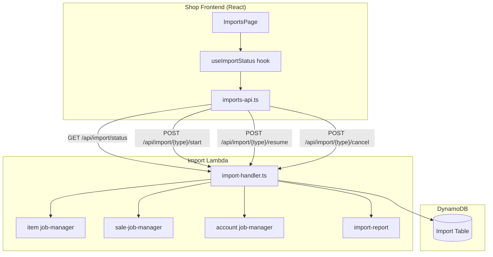
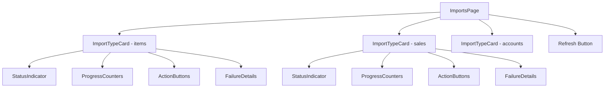

# Design Document: Import Monitor

## Overview

The Import Monitor is a new admin page within the shop frontend that provides real-time visibility into the ConsignCloud import pipeline. It surfaces the status of import jobs (items, sales, accounts), displays progress counters, shows failure details from completed reports, and exposes manual actions (start, resume, cancel).

The design follows the existing feature module pattern established by the employees-page and accounts-page features: a self-contained feature folder under `src/features/imports/` containing types, API client, page component, and supporting hooks.

On the backend, a new aggregated GET endpoint (`/api/import/status`) is added to the existing import lambda handler to return all three import type statuses in a single request, reducing frontend complexity and network calls.

## Architecture



### Key Architectural Decisions

1. **Single aggregated status endpoint**: Rather than making three separate calls (one per import type), the frontend fetches all statuses via a single `GET /api/import/status`. This reduces latency during polling and simplifies the frontend data-fetching logic.

2. **Polling with conditional stop**: The `useImportStatus` hook implements interval-based polling (10s) that automatically disables when all jobs are in terminal states. This avoids unnecessary network traffic while keeping the UI responsive during active imports.

3. **Pure derivation functions for UI state**: Button visibility, status colors, and polling decisions are computed by pure functions from the job state. This makes the logic testable in isolation without rendering components.

4. **Follows existing monolambda routing pattern**: The new GET endpoint is added to the existing `import-handler.ts` router, consistent with how all other import endpoints are structured.

## Components and Interfaces

### Frontend Components

```
src/features/imports/
├── imports-page.tsx            # Main page component
├── imports-page.test.tsx       # Component tests
├── imports-api.ts              # API client functions
├── imports-api.test.ts         # API client tests
├── imports-types.ts            # TypeScript interfaces
├── imports-utils.ts            # Pure derivation functions (status colors, button states, polling)
├── imports-utils.test.ts       # Unit tests for utils
├── imports-utils.property.test.ts  # Property-based tests for utils
├── import-type-card.tsx        # Card component for a single import type
├── import-type-card.test.tsx   # Card component tests
├── failure-details.tsx         # Expandable failure list component
└── use-import-status.ts        # Polling hook
```

### Component Hierarchy



### Key Interfaces

```typescript
// imports-types.ts

export type ImportType = "items" | "sales" | "accounts";

export type JobState = "running" | "paused" | "failed" | "complete";

export type ImportPhase = "fetch" | "sync";

export interface ProgressCounts {
  processed: number;
  imported: number;
  skipped: number;
  failed: number;
}

export interface FailureEntry {
  itemId: string;
  error: string;
}

export interface ImportReport {
  jobId: string;
  totalProcessed: number;
  imported: number;
  skipped: number;
  failed: number;
  elapsedSeconds: number;
  failures: FailureEntry[];
  truncated: boolean;
  totalFailures: number;
  completedAt: string;
}

export interface ImportJobStatus {
  jobId: string;
  state: JobState;
  phase: ImportPhase;
  startedAt: string;
  lastUpdatedAt: string;
  progress: ProgressCounts;
  error?: string;
  report?: ImportReport;
}

export interface ImportStatusResponse {
  items: ImportJobStatus | null;
  sales: ImportJobStatus | null;
  accounts: ImportJobStatus | null;
}

export interface ActionButtonStates {
  startEnabled: boolean;
  resumeVisible: boolean;
  cancelVisible: boolean;
}
```

### API Client Interface

```typescript
// imports-api.ts

export async function fetchImportStatus(
  options?: { signal?: AbortSignal }
): Promise<ImportStatusResponse>;

export async function startImport(
  type: ImportType
): Promise<{ jobId: string; state: string; phase: string }>;

export async function resumeImport(
  type: ImportType,
  jobId: string
): Promise<{ jobId: string; state: string; phase: string }>;

export async function cancelImport(
  type: ImportType,
  jobId: string
): Promise<void>;
```

### Hook Interface

```typescript
// use-import-status.ts

export interface UseImportStatusResult {
  status: ImportStatusResponse | null;
  loading: boolean;
  error: string | null;
  refresh: () => void;
  startImport: (type: ImportType) => Promise<void>;
  resumeImport: (type: ImportType) => Promise<void>;
  cancelImport: (type: ImportType) => Promise<void>;
  actionError: string | null;
  clearActionError: () => void;
}

export function useImportStatus(): UseImportStatusResult;
```

### Pure Utility Functions

```typescript
// imports-utils.ts

export function getStatusColor(state: JobState): string;

export function getActionButtonStates(
  job: ImportJobStatus | null
): ActionButtonStates;

export function shouldPoll(status: ImportStatusResponse | null): boolean;

export function sanitizeErrorMessage(error: string): string;

export function formatElapsedTime(seconds: number): string;
```

## Data Models

### Backend Response: GET /api/import/status

```json
{
  "items": {
    "jobId": "uuid",
    "state": "running",
    "phase": "sync",
    "startedAt": "2024-01-15T10:00:00.000Z",
    "lastUpdatedAt": "2024-01-15T10:05:30.000Z",
    "progress": {
      "processed": 1500,
      "imported": 1200,
      "skipped": 250,
      "failed": 50
    }
  },
  "sales": {
    "jobId": "uuid",
    "state": "complete",
    "phase": "sync",
    "startedAt": "2024-01-15T08:00:00.000Z",
    "lastUpdatedAt": "2024-01-15T08:45:00.000Z",
    "progress": {
      "processed": 500,
      "imported": 480,
      "skipped": 15,
      "failed": 5
    },
    "report": {
      "jobId": "uuid",
      "totalProcessed": 500,
      "imported": 480,
      "skipped": 15,
      "failed": 5,
      "elapsedSeconds": 2700,
      "failures": [
        { "itemId": "ext-123", "error": "Missing required field: amount" }
      ],
      "truncated": false,
      "totalFailures": 5,
      "completedAt": "2024-01-15T08:45:00.000Z"
    }
  },
  "accounts": null
}
```

### DynamoDB Access Patterns (Backend)

The new status endpoint reads from the existing Import DynamoDB table using these access patterns:

| Operation | Table | Key Pattern | Notes |
|-----------|-------|-------------|-------|
| Get active/recent item job | Import Table | Scan with prefix `ITEM_IMPORT#` | Uses existing `getRunningOrPausedJob` + fallback to most recent complete |
| Get active/recent sale job | Import Table | Scan with prefix `SALE_IMPORT#` | Same pattern via sale-job-manager |
| Get active/recent account job | Import Table | Scan with prefix `ACCOUNT_IMPORT#` | Same pattern via account job-manager |
| Get item import report | Import Table | PK: `ITEM_IMPORT#REPORT`, SK: `{jobId}` | Only fetched when job state is complete |
| Get sale import report | Import Table | PK: `SALE_IMPORT#REPORT`, SK: `{jobId}` | Same pattern |
| Get account import report | Import Table | PK: `ACCOUNT_IMPORT#REPORT`, SK: `{jobId}` | Same pattern |

No new tables or GSIs are required. The endpoint uses the existing job manager and report reader functions.

### Backend Handler Addition

A new route is added to `import-handler.ts`:

```typescript
// In import-handler.ts router
if (path === "/api/import/status" && method === "GET") {
  return handleImportStatusAll(event);
}
```

The `handleImportStatusAll` function aggregates status from all three job managers and their reports into a single response.

## Correctness Properties

*A property is a characteristic or behavior that should hold true across all valid executions of a system — essentially, a formal statement about what the system should do. Properties serve as the bridge between human-readable specifications and machine-verifiable correctness guarantees.*

### Property 1: Status color mapping produces distinct values for each state

*For any* valid JobState value, the `getStatusColor` function SHALL return a non-empty string, and no two distinct states SHALL map to the same color value.

**Validates: Requirements 1.4**

### Property 2: Progress counters are always present in rendered output for non-null jobs

*For any* ImportJobStatus with any valid state, phase, and ProgressCounts (where each counter is a non-negative integer), the progress display SHALL render all four counter values (processed, imported, skipped, failed).

**Validates: Requirements 2.1, 2.2, 2.3**

### Property 3: Failure entries are faithfully rendered

*For any* non-empty array of FailureEntry objects, the failure details display SHALL render each entry's itemId and error message.

**Validates: Requirements 3.1**

### Property 4: Polling is active if and only if at least one job is running

*For any* ImportStatusResponse (where each of the three type slots is either null or an ImportJobStatus with any valid state), the `shouldPoll` function SHALL return true if and only if at least one non-null job has state "running".

**Validates: Requirements 4.1, 4.2**

### Property 5: Action button states are correctly derived from job state

*For any* ImportJobStatus or null value, the `getActionButtonStates` function SHALL return:
- `startEnabled: true` when job is null, complete, paused, or failed; `startEnabled: false` when running
- `resumeVisible: true` when state is paused or failed; `resumeVisible: false` otherwise
- `cancelVisible: true` when state is running; `cancelVisible: false` otherwise

**Validates: Requirements 6.4, 7.1, 7.3**

### Property 6: Error messages are sanitized

*For any* string containing stack trace patterns (lines starting with "at ", file path references, or "Error:" prefixed internal details), the `sanitizeErrorMessage` function SHALL return a string that does not contain those patterns while preserving a meaningful user-facing message.

**Validates: Requirements 8.3**

## Error Handling

### Frontend Error Handling

| Scenario | Handling |
|----------|----------|
| Status fetch returns non-2xx | Display "Unable to load import status" with retry button. Do not expose status code to user. |
| Network error (TypeError from fetch) | Display "Unable to connect to the server. Check your connection." with retry button. |
| Start returns 409 | Display "An import is already running for {type}" inline near the button. |
| Resume/Cancel returns error | Display the API error message (sanitized) in a toast or inline alert. Clear on next successful action. |
| Timeout (30s) | Display "Request timed out" with retry option. |
| Auth token unavailable | Rely on existing AuthGuard to redirect to login. |

### Backend Error Handling

| Scenario | Response |
|----------|----------|
| Job manager scan fails | Return 500 with generic message. Log full error server-side. |
| Report not found for complete job | Return job status without report field (graceful degradation). |
| Invalid import type in path | Return 400 with "Invalid import type" message. |
| Unauthorized request | Return 401 via existing API Gateway authorizer. |

### Error Message Sanitization

The `sanitizeErrorMessage` utility strips:
- Stack trace lines (lines containing "at " followed by function/file references)
- File paths (patterns like `/path/to/file.ts:123`)
- Internal error prefixes that expose implementation details

It preserves the first meaningful line of the error as the user-facing message, truncated to 200 characters.

## Testing Strategy

### Unit Tests

- **imports-utils.ts**: Test `getStatusColor`, `getActionButtonStates`, `shouldPoll`, `sanitizeErrorMessage`, `formatElapsedTime` with representative examples and edge cases.
- **imports-api.ts**: Test each API function handles success, error responses, timeouts, and network errors. Mock `fetch` and `fetchAuthSession`.
- **import-type-card.tsx**: Test rendering with various job states, verify correct buttons appear, verify progress counters render.
- **imports-page.tsx**: Test loading state, error state, successful render with mixed job states.
- **use-import-status.ts**: Test polling starts/stops correctly, test action dispatching.

### Property-Based Tests

Property-based testing is appropriate for the pure utility functions in `imports-utils.ts`. These functions map inputs (job states, progress counts, error strings) to outputs (colors, button states, booleans, sanitized strings) with universal properties that hold across all valid inputs.

**Library**: fast-check (already used in the project based on existing `.property.test.ts` files)

**Configuration**: Minimum 100 iterations per property test.

Each property test will reference its design property with a tag comment:
- `// Feature: import-monitor, Property 1: Status color mapping produces distinct values`
- `// Feature: import-monitor, Property 2: Progress counters present for non-null jobs`
- `// Feature: import-monitor, Property 3: Failure entries faithfully rendered`
- `// Feature: import-monitor, Property 4: Polling active iff at least one job running`
- `// Feature: import-monitor, Property 5: Action button states derived from job state`
- `// Feature: import-monitor, Property 6: Error messages are sanitized`

### Integration Tests

- **Backend GET /api/import/status**: Test with mock DynamoDB returning various job/report combinations. Verify response shape and correct aggregation.
- **Backend action endpoints**: Existing tests cover start/resume/cancel. No additional integration tests needed for those.

### What Is NOT Tested with PBT

- Component rendering (use snapshot/example tests instead)
- API calls and network behavior (use mock-based unit tests)
- Polling interval timing (use fake timers in unit tests)
- Navigation and routing (configuration verification)
