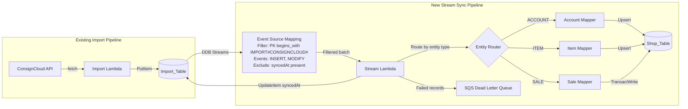
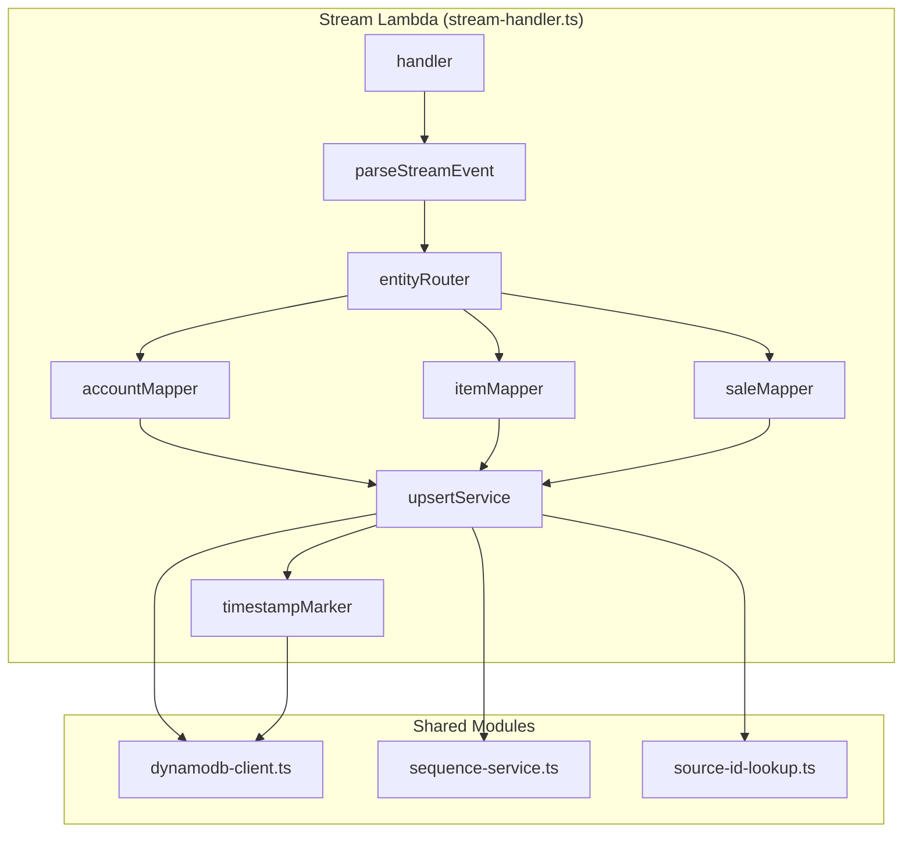
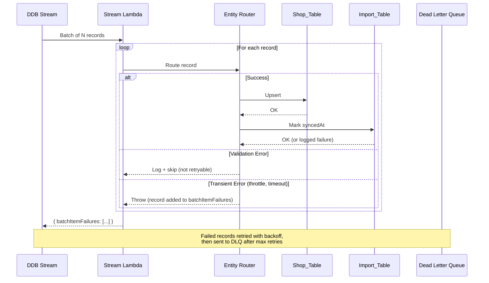
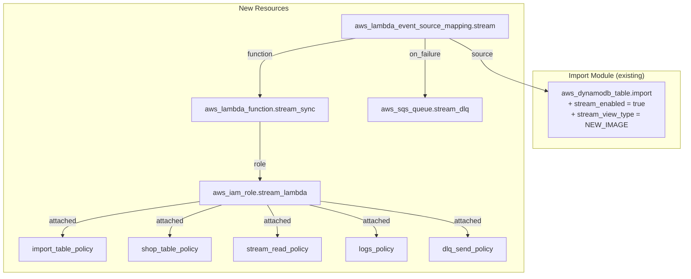
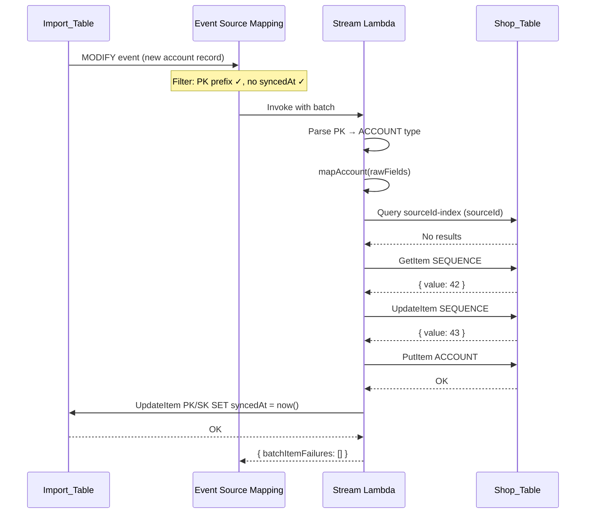
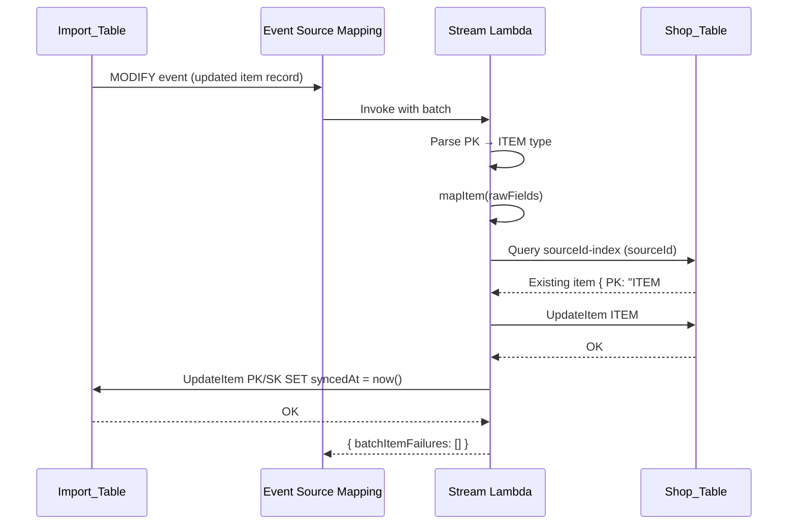
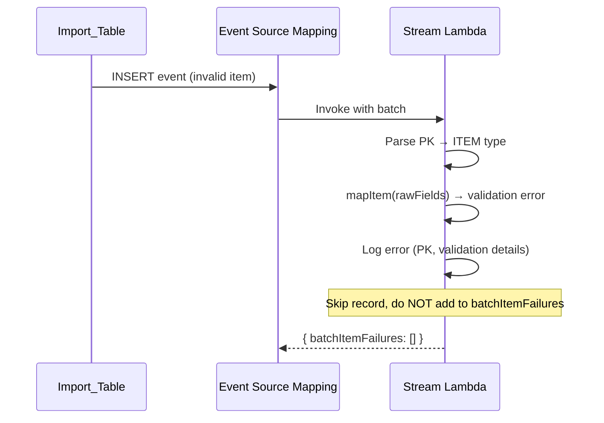
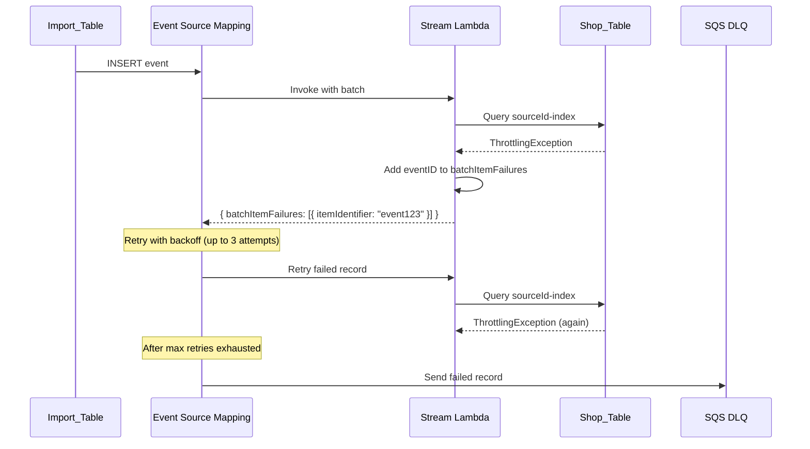

# Design Document: Import Stream Sync

## Overview

This feature replaces the batch-scan sync mechanism (scan Import_Table → transform → write Shop_Table) with a reactive DynamoDB Streams-based pipeline. When records land in the Import_Table via the existing fetch orchestrators, a DynamoDB Stream event fires and a dedicated Lambda maps the record to Shop_Table format in near-real-time.

The design introduces a **separate** Stream Lambda (distinct from the existing import handler) that:

1. Receives filtered DDB Streams events for `IMPORT#CONSIGNCLOUD#` records
2. Routes each record to the appropriate entity mapper (Account, Item, Sale)
3. Performs upsert logic (create-or-update) against the Shop_Table
4. Marks the import record with a `syncedAt` timestamp to prevent re-processing

This approach eliminates the polling/scanning phases, reduces sync latency from ~15 minutes to seconds, and isolates failures per-record rather than per-batch.

## Architecture



### Design Decisions

| Decision | Rationale |
|----------|-----------|
| Separate Lambda from import handler | Different scaling characteristics — import handler is API-triggered with 300s timeout; stream handler is event-driven, short-lived, concurrent |
| Filter at event source mapping level | Reduces Lambda invocations and cost; DDB Streams filtering is free and evaluated before invocation |
| `NEW_IMAGE` stream view type | Only need the current state of the record, not the old image — mappers transform the full record |
| `ReportBatchItemFailures` for partial batch response | Isolates failures per-record; only failed records are retried, not the entire batch |
| `bisectBatchOnFunctionError` enabled | If the whole function errors, the batch is split to isolate the problematic record |
| Conditional writes for new records | Prevents duplicate creation from concurrent stream retries |
| `syncedAt` filter in event source mapping | Prevents infinite loop — writing `syncedAt` triggers a MODIFY event which is filtered out |

## Components and Interfaces

### Component Diagram



### Module Breakdown

#### 1. `src/stream-handler.ts` — Lambda Entry Point

The top-level handler for DynamoDB Streams events.

```typescript
interface StreamHandlerResult {
  batchItemFailures: Array<{ itemIdentifier: string }>;
}

export async function handler(
  event: DynamoDBStreamEvent
): Promise<StreamHandlerResult>;
```

Responsibilities:

- Iterate over `event.Records`
- For each record, extract the `eventID`, unmarshall `NewImage`, and delegate to the entity router
- Catch per-record errors and collect failed `eventID`s
- Return `batchItemFailures` for partial batch response

#### 2. `src/stream/entity-router.ts` — Type-Based Dispatch

Parses the PK to determine entity type and delegates to the appropriate mapper + upsert flow.

```typescript
type EntityType = 'ACCOUNT' | 'ITEM' | 'SALE';

interface ParsedImportRecord {
  entityType: EntityType;
  sourceId: string;
  rawAttributes: Record<string, unknown>;
}

function parseEntityType(pk: string): EntityType | null;
async function routeRecord(record: ParsedImportRecord): Promise<void>;
```

Routing logic:

- `IMPORT#CONSIGNCLOUD#ACCOUNT#<id>` → Account Mapper
- `IMPORT#CONSIGNCLOUD#ITEM#<id>` → Item Mapper
- `IMPORT#CONSIGNCLOUD#SALE#<id>` → Sale Mapper
- Unrecognised → log warning, skip (no error)

#### 3. `src/stream/account-mapper.ts` — Account Field Transformation

Maps ConsignCloud account fields to the Shop_Table account schema defined in the data model.

```typescript
interface MappedAccount {
  firstName: string;
  lastName: string;
  company: string;
  street: string;
  addressLine2: string;
  place: string;
  postcode: string;
  canton: string;
  email: string;
  telephone: string;
  balance: number;
  defaultSplit: number;
  defaultTerms: string;
  defaultInventoryType: string;
  emailNotificationsEnabled: boolean;
  isVendor: boolean;
  taxExempt: boolean;
  tags: string[];
  sourceId: string;
  createdAt: string;
}

function mapAccount(raw: Record<string, unknown>): MappedAccount;
```

#### 4. `src/stream/item-mapper.ts` — Item Field Transformation

Reuses the proven mapping logic from the existing `item-mapper.ts`, adapted for the stream record format.

```typescript
interface MappedItem {
  title: string;
  tagPrice: number;
  quantity: number;
  split: number;
  inventoryType: 'Consignment' | 'Retail';
  terms: 'Return To Consignor' | 'Donate' | 'Discard';
  taxExempt: boolean;
  description?: string;
  brand?: string;
  color?: string;
  size?: string;
  shelf?: string;
  tags?: string[];
  imageKeys?: string[];
  sourceId: string;
  createdAt: string;
}

function mapItem(raw: Record<string, unknown>): MappedItem;
```

#### 5. `src/stream/sale-mapper.ts` — Sale Field Transformation

Reuses the proven mapping logic from the existing `sale-mapper.ts`, adapted for stream records.

```typescript
interface MappedSale {
  sourceNumber: string;
  status: 'finalized';
  subtotal: number;
  total: number;
  storePortion: number;
  consignorPortion: number;
  change: number;
  memo: string | null;
  finalizedAt: string | null;
  voidedAt: null;
  sourceId: string;
  createdAt: string;
}

interface MappedLineItem {
  salePrice: number;
  discount: number;
  consignorPortion: number;
  storePortion: number;
  quantity: number;
  daysOnShelf: number;
}

function mapSale(raw: Record<string, unknown>): { sale: MappedSale; lineItems: MappedLineItem[] } | null;
```

Returns `null` for non-finalized or voided sales (skip).

#### 6. `src/stream/upsert-service.ts` — Create-or-Update Logic

Encapsulates the deduplication and write logic shared across entity types.

```typescript
interface UpsertResult {
  action: 'created' | 'updated' | 'skipped';
}

async function upsertAccount(mapped: MappedAccount): Promise<UpsertResult>;
async function upsertItem(mapped: MappedItem, accountSourceId: string): Promise<UpsertResult>;
async function upsertSale(mapped: MappedSale, lineItems: MappedLineItem[]): Promise<UpsertResult>;
```

Upsert flow for each entity:

1. Query `sourceId-index` GSI to find existing record
2. If exists → update changed fields (or skip for immutable sales)
3. If not exists → generate UUID, get next sequence number, build GSI keys, conditional PutItem

#### 7. `src/stream/source-id-lookup.ts` — Deduplication Queries

```typescript
interface ExistingRecord {
  PK: string;
  SK: string;
  [key: string]: unknown;
}

async function findBySourceId(sourceId: string): Promise<ExistingRecord | undefined>;
```

#### 8. `src/stream/sequence-service.ts` — Atomic Counter Increment

```typescript
async function getNextSequenceNumber(entityType: 'ACCOUNT' | 'ITEM' | 'SALE'): Promise<number>;
```

Uses DynamoDB `UpdateItem` with `ADD` to atomically increment and return the new value.

#### 9. `src/stream/timestamp-marker.ts` — Post-Sync Marking

```typescript
async function markSynced(importTableName: string, pk: string, sk: string): Promise<void>;
```

Writes `syncedAt` to the import record. Logs but does not throw on failure.

## Data Models

### Import Record Format (Input)

Records in the Import_Table follow the PK pattern established by the existing fetch orchestrators:

| Field | Example | Notes |
|-------|---------|-------|
| PK | `IMPORT#CONSIGNCLOUD#ACCOUNT#abc-123` | Entity type embedded in PK |
| SK | `METADATA` | Always METADATA |
| importedAt | `2024-01-15T10:30:00Z` | When fetched from ConsignCloud |
| (raw fields) | `first_name`, `last_name`, etc. | Snake_case ConsignCloud fields |

### Field Mapping: Account

| ConsignCloud (snake_case) | Shop_Table (camelCase) | Transform |
|---------------------------|------------------------|-----------|
| `first_name` | `firstName` | Direct |
| `last_name` | `lastName` | Direct |
| `company` | `company` | Direct |
| `address_line_1` | `street` | Direct |
| `address_line_2` | `addressLine2` | Direct |
| `city` | `place` | Direct |
| `postal_code` | `postcode` | Direct |
| `state` | `canton` | Direct |
| `email` | `email` | Direct |
| `phone_number` | `telephone` | `normalizeSwissPhone()` |
| `balance` | `balance` | Direct (cents) |
| `consignor_split` | `defaultSplit` | Direct (0–1 decimal) |
| `terms` | `defaultTerms` | Map to enum string |
| `inventory_type` | `defaultInventoryType` | Map to enum string |
| `email_notifications_enabled` | `emailNotificationsEnabled` | Direct |
| `id` | `sourceId` | Direct |
| `created` | `createdAt` | Direct (ISO 8601) |
| (derived) | `tags` | `deriveImportTags()` |
| (generated) | `uuid` | `crypto.randomUUID()` (new only) |
| (generated) | `shopUid` | Next sequence number, zero-padded 7 digits (new only) |

### Field Mapping: Item

Follows the existing `item-mapper.ts` pattern:

| ConsignCloud (snake_case) | Shop_Table (camelCase) | Transform |
|---------------------------|------------------------|-----------|
| `title` | `title` | Truncate to 200 chars |
| `tag_price` / `price` | `tagPrice` | Divide by 100 (cents → CHF) |
| `quantity` | `quantity` | Default 0 |
| `split` / `consignor_split` | `split` | Multiply by 100 (0–1 → 0–100) |
| `inventory_type` | `inventoryType` | Map enum |
| `terms` | `terms` | Map enum |
| `tax_exempt` | `taxExempt` | Default false |
| `description` | `description` | Truncate to 2000 chars |
| `brand` | `brand` | Direct |
| `color` | `color` | Direct |
| `size` | `size` | Direct |
| `shelf.name` / `location.name` | `shelf` | Direct |
| `tags` | `tags` | Filter strings, max 20 |
| `images[].url` | `imageKeys` | Direct |
| `account_id` | `accountId` | Resolve via sourceId-index lookup |
| `employee_id` | `createdBy` | Resolve or create Employee |
| `category_id` | `categoryId` | Resolve or create Category |
| `id` | `sourceId` | Direct |

### Field Mapping: Sale

Follows the existing `sale-mapper.ts` pattern:

| ConsignCloud (snake_case) | Shop_Table (camelCase) | Transform |
|---------------------------|------------------------|-----------|
| `number` | `sourceNumber` | Direct |
| (derived) | `status` | Always `"finalized"` |
| `subtotal` | `subtotal` | Direct (cents) |
| `total` | `total` | Direct (cents) |
| `store_portion` | `storePortion` | Direct (cents) |
| `consignor_portion` | `consignorPortion` | Direct (cents) |
| `change` | `change` | Direct (cents) |
| `memo` | `memo` | Nullable |
| `finalized` | `finalizedAt` | Nullable ISO 8601 |
| (derived) | `voidedAt` | Always `null` |
| `id` | `sourceId` | Direct |
| `created` | `createdAt` | Direct (ISO 8601) |
| `cashier_id` | `cashierId` | Resolve or create Employee |
| `line_items[].unit_price` | `lineItems[].salePrice` | Direct |
| `line_items[].applied_discounts` | `lineItems[].discount` | Sum of amounts |
| `line_items[].consignor_portion` | `lineItems[].consignorPortion` | Direct |
| `line_items[].store_portion` | `lineItems[].storePortion` | Direct |
| `line_items[].quantity` | `lineItems[].quantity` | Direct |
| `line_items[].days_on_shelf` | `lineItems[].daysOnShelf` | Direct |
| `line_items[].item_id` | `lineItems[].itemId` | Resolve via sourceId-index |

### DynamoDB Access Patterns

| Operation | Table | Key / Index | Condition |
|-----------|-------|-------------|-----------|
| Find existing record by sourceId | Shop_Table | `sourceId-index` GSI | `sourceId = :id`, Limit 1 |
| Create new entity | Shop_Table | PK/SK | `attribute_not_exists(PK)` |
| Update existing entity | Shop_Table | PK/SK | None (unconditional) |
| Increment sequence counter | Shop_Table | `SEQUENCE#<TYPE>` / `COUNTER` | `ADD #val :inc` |
| Mark import record synced | Import_Table | PK/SK (from stream event) | None |
| Find employee by sourceId | Shop_Table | `sourceId-index` GSI | `sourceId = :id` |
| Find category by sourceId | Shop_Table | `sourceId-index` GSI | `sourceId = :id` |
| Find account by sourceId | Shop_Table | `sourceId-index` GSI | `sourceId = :id` |
| Write sale + line items | Shop_Table | TransactWriteItems | Conditional on sale PK |

## Error Handling

### Per-Record Isolation Strategy



### Error Categories

| Category | Example | Handling |
|----------|---------|----------|
| Validation error | Missing required field, invalid price | Log warning, skip record, do NOT retry |
| Conditional write failure | `attribute_not_exists` condition fails | Treat as success (record already exists) |
| Transient DynamoDB error | Throttling, timeout, 500 | Include in `batchItemFailures` for retry |
| Unrecognised entity type | Unknown PK pattern | Log warning, skip (no error) |
| `syncedAt` marking failure | Update fails after successful sync | Log error, do NOT fail the record |
| Reference resolution failure | Account/Employee/Category not found | For items: log error, fail record (retryable — dependency may sync soon) |

### Dead Letter Queue

Records that fail after all retry attempts are sent to an SQS DLQ. The DLQ message contains:

- The original DDB Stream record
- Error context from the final retry attempt

DLQ records can be investigated manually and redriven.

## Infrastructure

### Terraform Resource Diagram



### Key Terraform Resources

| Resource | Purpose |
|----------|---------|
| `aws_dynamodb_table.import` (modified) | Add `stream_enabled = true`, `stream_view_type = "NEW_IMAGE"` |
| `aws_lambda_function.stream_sync` | New Lambda for stream processing |
| `aws_iam_role.stream_lambda` | Execution role with scoped permissions |
| `aws_lambda_event_source_mapping.stream` | Connects DDB Stream to Lambda with filters |
| `aws_sqs_queue.stream_dlq` | Dead letter queue for permanently failed records |

### Event Source Mapping Configuration

```hcl
resource "aws_lambda_event_source_mapping" "stream" {
  event_source_arn  = aws_dynamodb_table.import.stream_arn
  function_name     = aws_lambda_function.stream_sync.arn
  starting_position = "LATEST"
  batch_size        = 10
  maximum_retry_attempts            = 3
  bisect_batch_on_function_error    = true
  maximum_batching_window_in_seconds = 5
  function_response_types           = ["ReportBatchItemFailures"]

  destination_config {
    on_failure {
      destination_arn = aws_sqs_queue.stream_dlq.arn
    }
  }

  filter_criteria {
    filter {
      pattern = jsonencode({
        eventName = ["INSERT", "MODIFY"]
        dynamodb = {
          NewImage = {
            PK = { S = [{ prefix = "IMPORT#CONSIGNCLOUD#" }] }
            syncedAt = [{ exists = false }]
          }
        }
      })
    }
  }
}
```

### Sequence Diagrams

#### Happy Path — New Account Record



#### Happy Path — Existing Item Record (Update)



#### Error Path — Validation Failure (Non-Retryable)



#### Error Path — Transient Failure (Retryable)



## Correctness Properties

*A property is a characteristic or behavior that should hold true across all valid executions of a system — essentially, a formal statement about what the system should do. Properties serve as the bridge between human-readable specifications and machine-verifiable correctness guarantees.*

### Property 1: Entity routing determinism

*For any* import record PK string containing a valid entity type segment (ACCOUNT, ITEM, or SALE) and any arbitrary ID suffix, the entity router SHALL always return the same entity type classification regardless of the record's field content or the number of times it is invoked.

**Validates: Requirements 3.1, 3.2, 3.3**

### Property 2: Account mapping idempotence

*For any* valid ConsignCloud account record (with non-empty `id` and `created` fields), applying the account mapper function multiple times SHALL produce identical output each time — the mapper is a pure function with no side effects.

**Validates: Requirements 4.1, 4.4**

### Property 3: Item mapping idempotence

*For any* valid ConsignCloud item record (with title or SKU, valid price, valid split), applying the item mapper function multiple times SHALL produce identical output each time.

**Validates: Requirements 5.1**

### Property 4: Sale mapping idempotence

*For any* valid ConsignCloud sale record (with `id`, `number`, `created` present), applying the sale mapper function multiple times SHALL produce identical output each time.

**Validates: Requirements 6.1**

### Property 5: Sale finalization filter correctness

*For any* ConsignCloud sale record, the `isFinalizedSale` filter SHALL return `true` if and only if the record has a non-null `finalized` timestamp AND a null `voided` timestamp. All other combinations SHALL return `false`.

**Validates: Requirements 6.4**

### Property 6: Item price conversion correctness

*For any* valid item `tag_price` integer in cents (0 ≤ tag_price ≤ 99,999,999), the mapped `tagPrice` SHALL equal `tag_price / 100`, and the result SHALL be within the valid range 0–999,999.99.

**Validates: Requirements 5.1**

## Testing Strategy

### Property-Based Testing

This feature is well-suited for property-based testing because the mappers are pure functions with clear input/output behavior and universal properties (idempotence, determinism, arithmetic invariants) that hold across all valid inputs.

**Library**: `fast-check` (already in devDependencies)
**Minimum iterations**: 100 per property test

Each property test references its design document property:

- **Feature: import-stream-sync, Property 1: Entity routing determinism**
- **Feature: import-stream-sync, Property 2: Account mapping idempotence**
- **Feature: import-stream-sync, Property 3: Item mapping idempotence**
- **Feature: import-stream-sync, Property 4: Sale mapping idempotence**
- **Feature: import-stream-sync, Property 5: Sale finalization filter correctness**
- **Feature: import-stream-sync, Property 6: Item price conversion correctness**

### Unit Tests (Example-Based)

| Area | Tests |
|------|-------|
| Entity router | Specific PK patterns route correctly; unknown types log warning |
| Account mapper | Known ConsignCloud payload → expected Shop_Table output |
| Item mapper | Price edge cases (0, max), missing optional fields |
| Sale mapper | Finalized sale passes, voided sale filtered, open sale filtered |
| Timestamp marker | Success path; failure path logs but doesn't throw |
| Stream handler | `batchItemFailures` structure is correct for mixed success/failure batch |

### Integration Tests

| Area | Tests |
|------|-------|
| End-to-end upsert | Insert import record → verify Shop_Table record created |
| Duplicate detection | Insert same sourceId twice → verify no duplicate in Shop_Table |
| Sequence counter | Multiple concurrent creates → verify unique sequential numbers |
| DLQ | Permanently failing record → verify arrives in DLQ |
