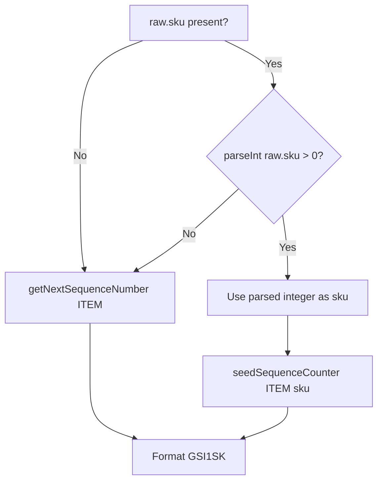
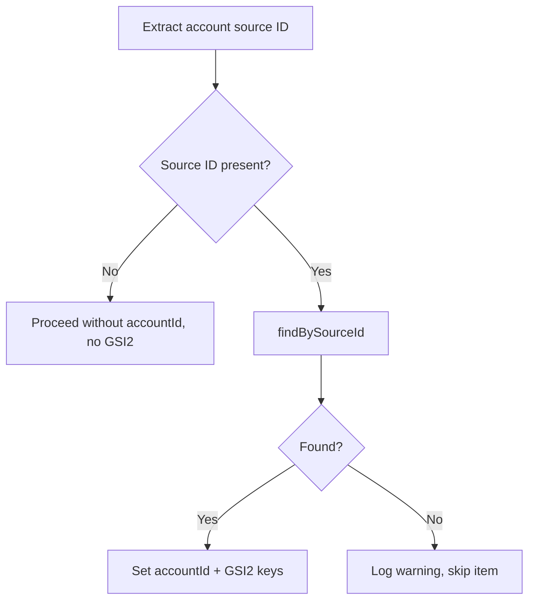

# Design Document: Import Stream Sync — Field Parity & Sync Removal

## Overview

This feature brings the stream Lambda's item processing pipeline to full parity with the import item-mapper, expands the upsert-service to write GSI2/GSI3 keys and all item fields, implements CC SKU passthrough with sequence counter seeding, adds graceful account resolution (skip on missing), and removes the now-redundant sync phase from the item import flow.

The stream path (`entity-router → item-mapper → upsert-service`) already handles the basic item flow. This work extends it to match the richer field set that the batch sync orchestrator currently handles, then removes that orchestrator entirely.

## Architecture

The existing architecture remains unchanged. The stream Lambda is already deployed and processing records. This feature modifies internal modules only:

```
Import_Table (DDB Stream)
  → Stream Lambda
    → entity-router.ts (unchanged — already routes ITEM to mapItem → upsertItem)
      → item-mapper.ts (MODIFIED — add status derivation, new optional fields)
      → upsert-service.ts (MODIFIED — add GSI keys, SKU passthrough, account skip logic)
      → sequence-service.ts (MODIFIED — add seedSequenceCounter function)
```

The import handler flow changes from:

```
[fetch phase] → pause → [sync phase] → complete
```

To:

```
[fetch phase] → complete
```

Items land in Import_Table during fetch, and the stream Lambda processes them reactively.

## Components and Interfaces

### 1. `src/stream/item-mapper.ts` — Enhanced Item Mapping

The existing mapper produces a `MappedItem` with basic fields. This feature expands it to include status derivation and all optional fields from the import mapper.

```typescript
// New types added
export type ItemStatus =
  | "active" | "parked" | "inactive" | "expired" | "to_be_returned"
  | "sold" | "returned_to_owner" | "donated" | "lost" | "stolen" | "damaged";

export const STATUS_PRIORITY: ItemStatus[] = [
  "active", "parked", "inactive", "expired", "to_be_returned",
  "sold", "returned_to_owner", "donated", "lost", "stolen", "damaged",
];

export const SOLD_VARIANTS: Set<string> = new Set([
  "sold", "sold_on_shopify", "sold_on_square", "sold_on_third_party",
]);

// New exported function
export function deriveItemStatus(
  statusObj: Record<string, number> | null | undefined
): ItemStatus;

// Expanded MappedItem interface
export interface MappedItem {
  title: string;
  tagPrice: number;
  quantity: number;
  split: number;
  inventoryType: InventoryType;
  terms: Terms;
  taxExempt: boolean;
  status: ItemStatus;              // NEW
  description?: string;
  brand?: string;
  color?: string;
  size?: string;
  shelf?: string;
  location?: string;              // NEW
  details?: string;               // NEW (max 5000 chars)
  tags?: string[];
  imageKeys?: string[];
  scheduleStart?: string;         // NEW
  expirationDate?: string;        // NEW
  lastSold?: string;              // NEW
  lastViewed?: string;            // NEW
  labelPrintedAt?: string;        // NEW
  daysOnShelf?: number;           // NEW
  deleted?: string;               // NEW
  sourceId: string;
  createdAt: string;
}
```

**Key design decisions:**

- `deriveItemStatus` mirrors the import mapper's logic exactly: normalizes sold variants, then returns the highest-priority status with a non-zero count.
- All field extractions use type guards since input is `Record<string, unknown>`.
- The `status` field in `raw` is expected to be a `Record<string, number>` (status breakdown from ConsignCloud). Type guard: check it's a non-null object, then iterate entries checking values are numbers.

### 2. `src/stream/upsert-service.ts` — GSI, SKU, and Account Expansion

The `upsertItem` function is expanded to handle GSI2/GSI3 keys, CC SKU passthrough, and graceful account resolution.

```typescript
export async function upsertItem(
  mapped: MappedItem,
  raw: Record<string, unknown>,
): Promise<UpsertResult>;
```

**Changes to creation path:**

1. **Account resolution** — Extract account source ID from `raw.account.id` (nested object with type guard) or `raw.account_id` (string). Query `findBySourceId`. If not found and source ID was present: log warning, return `{ action: "skipped" }`.
2. **SKU resolution** — Parse `raw.sku` as integer. If positive integer: use directly. Otherwise: call `getNextSequenceNumber("ITEM")`.
3. **GSI keys** — Write `GSI2PK`/`GSI2SK` when accountId is resolved. Write `GSI3PK`/`GSI3SK` when categoryId is resolved.
4. **New fields** — Write `status`, `location`, `details`, `scheduleStart`, `expirationDate`, `lastSold`, `lastViewed`, `labelPrintedAt`, `daysOnShelf`, `deleted` when present.
5. **sourceSku** — Write `raw.sku` as `sourceSku` when present (preserves original string).
6. **Sequence seeding** — After using a CC SKU directly, call `seedSequenceCounter("ITEM", sku)` to conditionally update the counter.

**Changes to update path:**

- Include `status` in the UpdateExpression.
- Include all new optional fields in the UpdateExpression.
- Update GSI2PK/GSI2SK if account is resolved.
- Update GSI3PK/GSI3SK if category is resolved.

**Account source ID extraction logic:**

```typescript
function extractAccountSourceId(raw: Record<string, unknown>): string | undefined {
  // Try nested object: raw.account.id
  const account = raw.account;
  if (account != null && typeof account === "object" && !Array.isArray(account)) {
    const accountObj = account as Record<string, unknown>;
    if (typeof accountObj.id === "string" && accountObj.id) {
      return accountObj.id;
    }
  }
  // Fallback: raw.account_id (flat string)
  if (typeof raw.account_id === "string" && raw.account_id) {
    return raw.account_id;
  }
  return undefined;
}
```

### 3. `src/stream/sequence-service.ts` — Conditional Seeding

A new export for seeding the counter without overwriting a higher value:

```typescript
export async function seedSequenceCounter(
  entityType: EntityType,
  value: number,
): Promise<void>;
```

Implementation uses `UpdateCommand` with conditional expression:

```typescript
await docClient.send(
  new UpdateCommand({
    TableName: TABLE_NAME,
    Key: { PK: `SEQUENCE#${entityType}`, SK: "COUNTER" },
    UpdateExpression: "SET #val = :newVal",
    ConditionExpression: "attribute_not_exists(#val) OR #val < :newVal",
    ExpressionAttributeNames: { "#val": "value" },
    ExpressionAttributeValues: { ":newVal": value },
  }),
);
```

If `ConditionalCheckFailedException` is thrown, the current value is already higher — that's fine, swallow the error.

**Design decision:** Uses conditional SET rather than atomic ADD. The import sync orchestrator used an unconditional PUT which is unsafe under concurrency. The conditional update ensures the counter only moves forward.

### 4. `src/import/item-import-handler.ts` — Sync Removal

**Removed:**

- `handleItemImportSync` function
- `runSyncPhase` function
- The `else` branch in `handleResumeInternal` (sync path)
- Import of `runSyncLoop` from `item-sync-orchestrator`

**Modified:**

- `handleResumeInternal` only handles `phase === "fetch"` (removes phase parameter branching)

### 5. `src/import/generic-fetch-orchestrator.ts` — Direct Completion

**Modified:**

- When `cursor === null` (fetch exhausted): transition job to `"complete"` instead of `"paused"`
- Write an import report with progress counts at fetch completion
- Return `{ status: "complete" }` so the Step Function reaches the Done state

```typescript
// Current behavior (to be changed):
await jobManager.transitionJob(jobId, "paused", progress);
return { status: "complete", jobId };

// New behavior:
await jobManager.transitionJob(jobId, "complete", progress);
await writeImportReport(jobId, progress, startTime);
return { status: "complete", jobId };
```

### 6. `src/import/item-sync-orchestrator.ts` — Deleted

The entire file is removed. All sync functionality is now handled by the stream Lambda.

### 7. Terraform — Route Removal

Remove from `infrastructure/modules/import/main.tf`:

- `aws_apigatewayv2_route.post_import_items_sync` resource

The Step Function state machine definition remains unchanged — it continues handling the fetch loop.

## Data Models

### Expanded Item Record (Shop_Table)

The item record written by `upsertItem` now includes:

| Field | Source | Notes |
|-------|--------|-------|
| PK | `ITEM#<uuid>` | Generated |
| SK | `METADATA` | Static |
| uuid | Generated | v4 UUID |
| sku | CC SKU or sequence | Numeric |
| sourceSku | `raw.sku` | Raw string, preserved |
| GSI1PK | `ITEMS` | Static |
| GSI1SK | `ITEM#<sku padded 7>` | `formatSkuGsi1sk(sku)` |
| GSI2PK | `ACCOUNT#<accountUuid>` | When account resolved |
| GSI2SK | `ITEM#<createdAt>` | When account resolved |
| GSI3PK | `CATEGORY#<categoryUuid>` | When category resolved |
| GSI3SK | `ITEM#<createdAt>` | When category resolved |
| accountId | Account UUID | From sourceId lookup |
| createdBy | Employee UUID | From resolveOrCreateEmployee |
| categoryId | Category UUID | From resolveOrCreateCategory |
| title | Mapped | Max 200 chars |
| tagPrice | Mapped | CHF (cents / 100) |
| quantity | Mapped | Default 0 |
| split | Mapped | 0–100 percentage |
| inventoryType | Mapped | Enum |
| terms | Mapped | Enum |
| status | **NEW** Mapped | `deriveItemStatus(raw.status)` |
| taxExempt | Mapped | Boolean |
| description | Mapped | Max 2000 chars |
| details | **NEW** Mapped | Max 5000 chars |
| brand | Mapped | Optional |
| color | Mapped | Optional |
| size | Mapped | Optional |
| shelf | Mapped | From shelf.name or location.name |
| location | **NEW** Mapped | From location.name |
| tags | Mapped | Max 20 items |
| imageKeys | Mapped | URLs |
| scheduleStart | **NEW** Mapped | ISO 8601 |
| expirationDate | **NEW** Mapped | ISO 8601 |
| lastSold | **NEW** Mapped | ISO 8601 |
| lastViewed | **NEW** Mapped | ISO 8601 |
| labelPrintedAt | **NEW** Mapped | ISO 8601 |
| daysOnShelf | **NEW** Mapped | Number |
| deleted | **NEW** Mapped | ISO 8601 or undefined |
| sourceId | `raw.id` | CC item UUID |
| createdAt | Mapped | From CC `created` field |
| updatedAt | Generated | Current time |

### SKU Resolution Flow



### Account Resolution Flow



## Error Handling

### Account Not Found — Graceful Skip

When an item references an account that hasn't been synced yet:

- Log a structured warning with item sourceId and account sourceId
- Return `{ action: "skipped" }` from `upsertItem`
- The stream handler does NOT add this to `batchItemFailures`
- The item's import record remains without `syncedAt`, so it will be picked up on the next stream trigger or via a manual retrigger script

This handles the race condition where items arrive before their owning accounts. The DDB Stream will eventually deliver account records, and a re-trigger of the item record will succeed.

### SKU Counter Seeding — Conditional Safety

The `seedSequenceCounter` function uses a conditional update to prevent the counter from going backward:

- If counter doesn't exist or is lower than the new value: update succeeds
- If counter is already higher: `ConditionalCheckFailedException` is caught and swallowed
- This is safe under concurrent execution from multiple stream Lambda invocations

### Validation Errors

Validation errors from `mapItem` (missing title/sku, invalid price, invalid split) are handled as before:

- The entity router catches the `ValidationError`
- The stream handler logs it and does NOT add to `batchItemFailures` (not retryable)

## Correctness Properties

*A property is a characteristic or behavior that should hold true across all valid executions of a system — essentially, a formal statement about what the system should do. Properties serve as the bridge between human-readable specifications and machine-verifiable correctness guarantees.*

### Property 1: Status derivation returns highest-priority non-zero status

*For any* status breakdown object (Record<string, number>) with at least one entry having a positive count, `deriveItemStatus` SHALL return the status that appears earliest in `STATUS_PRIORITY` among all entries with count > 0.

**Validates: Requirements 1.1, 1.2, 1.3**

### Property 2: Sold variant normalization

*For any* status breakdown object where only sold variant keys ("sold", "sold_on_shopify", "sold_on_square", "sold_on_third_party") have positive counts, `deriveItemStatus` SHALL return "sold".

**Validates: Requirements 1.4**

### Property 3: mapItem status integration

*For any* valid raw item record (with title or sku, valid price, valid split) containing a `status` field that is a Record<string, number>, the mapped item's `status` field SHALL equal `deriveItemStatus(raw.status)`.

**Validates: Requirements 1.6**

### Property 4: Optional field passthrough

*For any* valid raw item record where optional fields (`details`, `schedule_start`, `expires`, `last_sold`, `last_viewed`, `printed`, `days_on_shelf`, `deleted`, `location.name`) are present as their expected types, the corresponding mapped fields SHALL be present in the output with correct values.

**Validates: Requirements 1.7, 1.8, 1.9, 1.10, 1.11, 1.12, 1.13, 1.14, 1.15**

### Property 5: Type-safe mapping never throws

*For any* `Record<string, unknown>` input (including arbitrary keys and value types), `mapItem` SHALL either return `{ success: true, mapped }` or `{ success: false, error }` — it SHALL never throw an uncaught exception.

**Validates: Requirements 1.16**

### Property 6: CC SKU passthrough for numeric strings

*For any* string `s` where `parseInt(s, 10)` produces a positive integer and `!isNaN(parseInt(s, 10))`, the SKU resolution logic SHALL use `parseInt(s, 10)` as the item SKU without calling the sequence service.

**Validates: Requirements 3.1**

### Property 7: GSI1SK formatting correctness

*For any* positive integer SKU value (1 to 9,999,999), the formatted `GSI1SK` SHALL equal `"ITEM#"` followed by the SKU zero-padded to exactly 7 digits.

**Validates: Requirements 3.4**

### Property 8: Account source ID extraction

*For any* raw record where `raw.account` is an object with a string `id` property, the extracted account source ID SHALL equal that `id` value. *For any* raw record where `raw.account` is absent but `raw.account_id` is a non-empty string, the extracted account source ID SHALL equal `raw.account_id`.

**Validates: Requirements 4.1**
