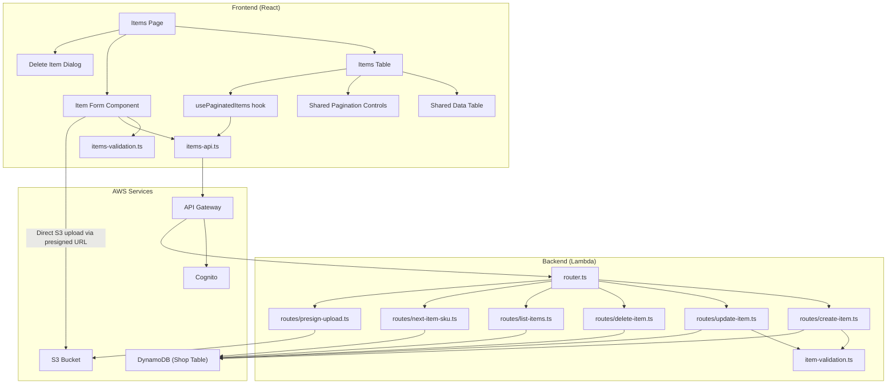
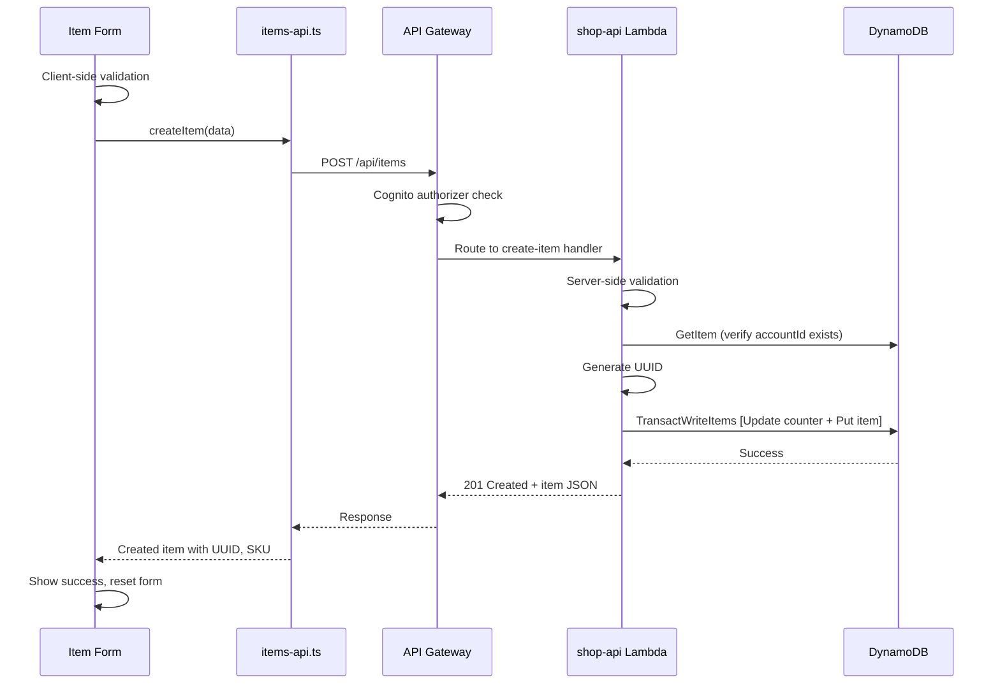
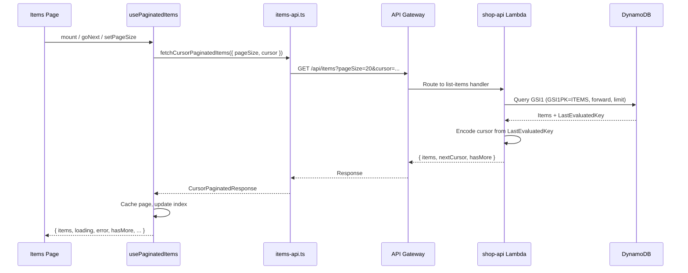
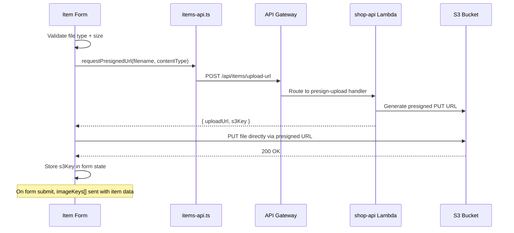

# Design Document: Item Creation

## Overview

This feature adds comprehensive item management (CRUD) to the consignment shop application. Items represent physical goods owned by consignor accounts, sold on their behalf with a revenue split. The system needs to:

1. Persist item records in DynamoDB using the existing single-table design
2. Auto-generate sequential SKUs (shopUid) via an atomic counter — the same concept as Account's shopUid
3. Validate item data on both client and server
4. Provide full CRUD API: create, read (list with pagination), update, delete
5. Handle image uploads to S3 via presigned URLs
6. Present items in a paginated table with edit/delete actions
7. Present a two-column creation/edit form in a dialog
8. Extract shared table and pagination components from the accounts feature

The design follows existing patterns established by the Accounts feature: synthetic UUID primary keys, TransactWriteItems for atomic counter + record creation, GSI1 for listing/sorting, cursor-based pagination with CachedPage pattern, TanStack React Table, and dialog-based forms.

## Architecture



### Request Flow: Create Item



### Request Flow: List Items (Paginated)



### Request Flow: Image Upload



## Components and Interfaces

### Backend Components

| File | Route/Purpose |
|------|---------------|
| `src/routes/create-item.ts` | `POST /api/items` — validate, generate UUID + SKU, TransactWriteItems |
| `src/routes/update-item.ts` | `PUT /api/items/{uuid}` — validate, update attributes, set updatedAt |
| `src/routes/delete-item.ts` | `DELETE /api/items/{uuid}` — remove item record |
| `src/routes/list-items.ts` | `GET /api/items` — paginated query via GSI1, cursor encoding |
| `src/routes/next-item-sku.ts` | `GET /api/items/next-sku` — read counter, return current + 1 |
| `src/routes/presign-upload.ts` | `POST /api/items/upload-url` — generate presigned S3 PUT URL |
| `src/item-validation.ts` | Shared validation for create + update requests |
| `src/pk-utils.ts` (extended) | `buildItemPk(uuid)`, `formatSkuGsi1sk(sku)` helpers |

### Frontend Components

| File | Purpose |
|------|---------|
| `components/shared/data-table.tsx` | Generic typed table component (headers, rows, loading, error, empty states) |
| `components/shared/pagination-controls.tsx` | Shared cursor-based pagination controls (moved from accounts) |
| `features/inventory/items-page.tsx` | Page composing table + add button + form dialog + delete dialog (replaces placeholder) |
| `features/inventory/items-table.tsx` | Items table with column definitions, uses SharedDataTable + SharedPaginationControls |
| `features/inventory/items-columns.tsx` | TanStack Table column definitions for items |
| `features/inventory/item-form.tsx` | Two-column dialog form for create/edit (analogous to account-form.tsx) |
| `features/inventory/delete-item-dialog.tsx` | Confirmation dialog for item deletion (analogous to delete-account-dialog.tsx) |
| `features/inventory/items-api.ts` | API client: create, update, delete, list, fetchNextSku, presigned upload |
| `features/inventory/items-types.ts` | TypeScript interfaces: Item, CreateItemRequest, UpdateItemRequest, result types |
| `features/inventory/items-validation.ts` | Client-side Zod schema for form validation |
| `features/inventory/items-utils.ts` | Formatting helpers (CHF currency, etc.) |
| `features/inventory/use-paginated-items.ts` | Pagination hook (analogous to use-paginated-accounts.ts) |
| `features/inventory/image-upload.tsx` | Image upload sub-component with presigned URL flow |

### Design Decision: Shared Component Extraction

The existing `AccountsTable` renders its own `<table>` markup inline and imports `PaginationControls` from within the accounts feature. To avoid duplication:

1. Extract a generic `DataTable<TData>` component to `components/shared/data-table.tsx` that accepts TanStack column definitions and data, plus loading/error/empty state handling.
2. Move `PaginationControls` to `components/shared/pagination-controls.tsx` with no behavioral changes.
3. Refactor `AccountsTable` to use the shared components (should be a drop-in replacement).
4. `ItemsTable` uses the same shared components from the start.

This keeps both tables visually and behaviorally consistent while eliminating code duplication.

### API Interfaces

```typescript
// --- Items Types ---

interface Item {
  uuid: string;
  sku: number;                // Sequential numeric identifier (shopUid)
  accountId: string;          // UUID of owning account
  title: string;
  tagPrice: number;
  quantity: number;
  split: number;
  inventoryType: "Consignment" | "Retail";
  terms: "Return To Consignor" | "Donate" | "Discard";
  taxExempt: boolean;
  createdAt: string;          // ISO 8601
  updatedAt: string;          // ISO 8601
  // Optional fields (only present if provided):
  description?: string;
  category?: string;
  brand?: string;
  color?: string;
  size?: string;
  shelf?: string;
  details?: string;
  tags?: string[];
  expirationDate?: string;
  imageKeys?: string[];
}

// POST /api/items - Request Body
interface CreateItemRequest {
  accountId: string;          // UUID of owning account (required)
  title: string;              // 1-200 chars (required)
  tagPrice: number;           // 0-999999.99, max 2 decimals (required)
  quantity: number;           // 1-9999, integer (required)
  split: number;              // 0-100, integer (required)
  inventoryType: "Consignment" | "Retail";
  terms: "Return To Consignor" | "Donate" | "Discard";
  description?: string;       // max 2000 chars
  category?: string;
  brand?: string;
  color?: string;
  size?: string;
  shelf?: string;
  details?: string;           // max 5000 chars (rich text)
  tags?: string[];            // max 20 tags, each max 50 chars
  expirationDate?: string;    // ISO 8601, must be future date
  taxExempt?: boolean;        // defaults to false
  imageKeys?: string[];       // S3 keys from presigned uploads, max 10
}

// PUT /api/items/{uuid} - Request Body
interface UpdateItemRequest {
  accountId: string;
  title: string;
  tagPrice: number;
  quantity: number;
  split: number;
  inventoryType: "Consignment" | "Retail";
  terms: "Return To Consignor" | "Donate" | "Discard";
  description?: string;
  category?: string;
  brand?: string;
  color?: string;
  size?: string;
  shelf?: string;
  details?: string;
  tags?: string[];
  expirationDate?: string;
  taxExempt?: boolean;
  imageKeys?: string[];
}

// POST /api/items - 201 Response / PUT /api/items/{uuid} - 200 Response
// Returns the full Item interface

// DELETE /api/items/{uuid} - 200 Response
interface DeleteItemResponse {
  success: true;
}

// GET /api/items - 200 Response
interface CursorPaginatedItemsResponse {
  items: Item[];
  nextCursor: string | null;
  hasMore: boolean;
}

// GET /api/items/next-sku - 200 Response
interface NextSkuResponse {
  nextSku: number;
}

// POST /api/items - 400 Response
interface ValidationErrorResponse {
  error: "validation_error";
  fields: Array<{ field: string; message: string }>;
}

// POST /api/items/upload-url - Request Body
interface PresignUploadRequest {
  filename: string;
  contentType: "image/jpeg" | "image/png" | "image/webp";
}

// POST /api/items/upload-url - 200 Response
interface PresignUploadResponse {
  uploadUrl: string;
  s3Key: string;
}

// --- Frontend Result Types (discriminated unions) ---

type CreateItemResult =
  | { success: true; item: Item }
  | { success: false; error: "validation" | "account_not_found" | "network" | "server" | "timeout"; fields?: Array<{ field: string; message: string }> };

type UpdateItemResult =
  | { success: true; item: Item }
  | { success: false; error: "not_found" | "validation" | "network" | "server" | "timeout"; fields?: Array<{ field: string; message: string }> };

type DeleteItemResult =
  | { success: true }
  | { success: false; error: "not_found" | "network" | "server" | "timeout" };

type PageSize = 20 | 50 | 100;

interface CursorPaginationParams {
  pageSize: PageSize;
  cursor?: string;
}

interface CachedPage {
  items: Item[];
  nextCursor: string | null;
}

interface UsePaginatedItemsResult {
  items: Item[];
  loading: boolean;
  error: string | null;
  hasMore: boolean;
  hasPrevious: boolean;
  pageSize: PageSize;
  goNext: () => void;
  goPrevious: () => void;
  setPageSize: (size: PageSize) => void;
  retry: () => void;
}
```

## Data Models

### DynamoDB Item Record

| Attribute       | Type    | Description                                         |
|-----------------|---------|-----------------------------------------------------|
| PK              | String  | `ITEM#<uuid>`                                       |
| SK              | String  | `METADATA`                                          |
| GSI1PK          | String  | `ITEMS`                                             |
| GSI1SK          | String  | `ITEM#<sku zero-padded to 7 digits>` (e.g., `ITEM#0000042`) |
| uuid            | String  | v4 UUID (synthetic primary identity)                |
| sku             | Number  | Sequential numeric identifier (shopUid) — the operator-facing item reference |
| accountId       | String  | UUID of the owning consignor account                |
| title           | String  | Item title (1-200 chars)                            |
| tagPrice        | Number  | Sale price in CHF (0-999999.99)                     |
| quantity        | Number  | Stock quantity (1-9999)                             |
| split           | Number  | Consignor revenue percentage (0-100)                |
| inventoryType   | String  | `"Consignment"` or `"Retail"`                       |
| terms           | String  | `"Return To Consignor"` or `"Donate"` or `"Discard"` |
| taxExempt       | Boolean | Whether item is tax exempt (default false)          |
| createdAt       | String  | ISO 8601 UTC timestamp                              |
| updatedAt       | String  | ISO 8601 UTC timestamp                              |
| description     | String  | (optional) max 2000 chars                           |
| category        | String  | (optional)                                          |
| brand           | String  | (optional)                                          |
| color           | String  | (optional)                                          |
| size            | String  | (optional)                                          |
| shelf           | String  | (optional)                                          |
| details         | String  | (optional) rich text, max 5000 chars                |
| tags            | List    | (optional) string array, max 20 items               |
| expirationDate  | String  | (optional) ISO 8601 date                            |
| imageKeys       | List    | (optional) ordered array of S3 keys, max 10         |

**Key points:**

- `sku` is stored as a **Number** attribute (not a formatted string). It is the item's shopUid — the same concept as Account's `shopUid`.
- `GSI1SK` stores the SKU zero-padded for lexicographic sort ordering in the GSI (e.g., `ITEM#0000042`), but the `sku` attribute itself is the raw number `42`.
- There is NO separate "itemNumber" field — `sku` IS the sequential item number.
- There is NO formatted SKU string like "ITM-0000042" — the SKU is simply the numeric counter value.

### Sequence Counter Record

| Attribute | Type   | Value              |
|-----------|--------|--------------------|
| PK        | String | `SEQUENCE#ITEM`    |
| SK        | String | `COUNTER`          |
| value     | Number | Current counter    |

### GSI Access Patterns

| GSI   | Access Pattern              | GSI1PK   | GSI1SK               | Use Case                    |
|-------|-----------------------------|----------|----------------------|-----------------------------|
| GSI1  | List all items by SKU order | `ITEMS`  | `ITEM#0000042`       | Paginated item listing      |
| GSI1  | List all accounts           | `ACCOUNTS` | `ACCOUNT#0000001`  | Paginated account listing   |

The existing GSI1 is overloaded (Accounts use `GSI1PK=ACCOUNTS`, Items use `GSI1PK=ITEMS`) which is the correct pattern for single-table design. The `ITEM#<padded-sku>` sort key enables ascending SKU ordering for the list endpoint.

### Cursor Encoding

The pagination cursor is a base64-encoded JSON object containing the DynamoDB `LastEvaluatedKey` from the GSI1 query. This matches the pattern already used by the accounts list endpoint. The cursor is opaque to the client.

### S3 Image Storage

Images are stored under the path: `items/<itemUuid>/<randomId>.<ext>`

The presigned URL endpoint generates this key server-side to prevent client-side path manipulation. Images are uploaded directly to S3 from the browser; the item record stores only the S3 keys array.

## Correctness Properties

*A property is a characteristic or behavior that should hold true across all valid executions of a system — essentially, a formal statement about what the system should do. Properties serve as the bridge between human-readable specifications and machine-verifiable correctness guarantees.*

### Property 1: Item key and GSI1SK construction

*For any* valid UUID string, `buildItemPk(uuid)` SHALL produce a string equal to `"ITEM#"` concatenated with the UUID. *For any* integer `sku` in [1, 9999999], `formatSkuGsi1sk(sku)` SHALL produce the string `"ITEM#"` followed by exactly 7 digits whose numeric value equals `sku`.

**Validates: Requirements 1.1, 1.4**

### Property 2: Sequence counter monotonicity

*For any* sequence of item creation operations starting from counter value 0, each successive SKU SHALL be strictly greater than the previous. Equivalently, for any non-negative integer `current` below the maximum, `computeNextSku(current)` SHALL return a value greater than `current`.

**Validates: Requirements 8.2, 8.4**

### Property 3: Required field validation — accept valid, reject invalid

*For any* input object, the item validator SHALL accept the request if and only if: `title` is a non-empty string ≤200 characters, `tagPrice` is a number in [0, 999999.99] with ≤2 decimal places, `quantity` is a positive integer ≤9999, `split` is an integer in [0, 100], `inventoryType` is one of {"Consignment", "Retail"}, `terms` is one of {"Return To Consignor", "Donate", "Discard"}, and `accountId` is a non-empty string.

**Validates: Requirements 2.1, 2.2, 2.3, 2.4, 2.5, 2.6, 2.7**

### Property 4: Optional field length validation

*For any* item creation or update input: if an optional `description` field is present with length ≤2000 the validator SHALL accept it, if >2000 it SHALL reject; if an optional `details` field is present with length ≤5000 the validator SHALL accept it, if >5000 it SHALL reject; if `tags` is present, the validator SHALL accept it if and only if the array has ≤20 elements and every element has length ≤50 characters; if `expirationDate` is present, the validator SHALL accept it if and only if it is a valid ISO 8601 date string representing a future date.

**Validates: Requirements 2.9, 2.10, 2.11, 2.12**

### Property 5: Validation error completeness

*For any* item creation or update input with N fields that individually fail validation, the validation result SHALL contain exactly N error entries, and the set of `field` names in those entries SHALL equal the set of field names that are invalid.

**Validates: Requirements 2.13**

### Property 6: Optional field normalization

*For any* item creation or update input, if an optional field (`category`, `brand`, `color`, `size`, `shelf`, `details`, `description`, `tags`) is omitted or set to an empty string, the normalized output record SHALL NOT include that attribute. If `taxExempt` is omitted, the normalized output SHALL set it to `false`.

**Validates: Requirements 10.1, 10.2, 10.3, 10.4, 10.5, 10.6, 10.7, 10.8, 10.9, 10.10, 10.11**

### Property 7: Image key order preservation

*For any* ordered array of valid S3 key strings provided as `imageKeys` in a creation or update request, the stored item record's `imageKeys` attribute SHALL contain the exact same elements in the exact same order.

**Validates: Requirements 11.5**

### Property 8: Update immutability of identity fields

*For any* valid update request applied to an existing item, the item's `uuid`, `sku`, and `createdAt` fields SHALL remain unchanged after the update operation. Only mutable attributes and `updatedAt` may differ.

**Validates: Requirements 4.3**

### Property 9: Next-SKU computation

*For any* non-negative integer `currentCounterValue`, the next-sku endpoint SHALL return `currentCounterValue + 1`. If no counter record exists (counter is logically 0), it SHALL return 1.

**Validates: Requirements 9.2, 9.3**

### Property 10: Pagination cursor correctness

*For any* list of N items ordered by SKU and a page size P, fetching page 1 (no cursor) returns the first min(P, N) items. For each subsequent page fetched using the returned cursor, the first item's SKU SHALL be strictly greater than the last item's SKU on the previous page, and no items are skipped or duplicated across consecutive pages.

**Validates: Requirements 6.3, 6.4**

### Property 11: CHF currency formatting

*For any* non-negative number with at most 2 decimal places, `formatChf(value)` SHALL produce a string in the format `"CHF X.XX"` where X.XX is the value with exactly 2 decimal digits, using standard decimal notation (no scientific notation, no trailing zeros beyond 2 decimals).

**Validates: Requirements 12.4**

## Error Handling

### Backend Error Handling

| Scenario | HTTP Status | Response Body | Notes |
|----------|-------------|---------------|-------|
| Invalid JSON body | 400 | `{ "error": "invalid_json" }` | Cannot parse request |
| Validation failure | 400 | `{ "error": "validation_error", "fields": [...] }` | Per-field errors |
| Account not found | 422 | `{ "error": "account_not_found" }` | accountId references non-existent account |
| Item not found (update/delete) | 404 | `{ "error": "not_found" }` | UUID does not exist |
| Not authenticated | 401 | `{ "message": "Unauthorized" }` | API Gateway Cognito authorizer |
| Sequence conflict (exhausted retries) | 500 | `{ "error": "internal_error" }` | Log details to CloudWatch |
| UUID collision (exhausted retries) | 500 | `{ "error": "internal_error" }` | Log details to CloudWatch |
| Unexpected error | 500 | `{ "error": "internal_error" }` | Never expose stack traces |

### Frontend Error Handling

| Scenario | UI Behavior |
|----------|-------------|
| Client validation failure | Inline error messages adjacent to invalid fields |
| Server 400 (validation) | Map field errors to inline messages |
| Server 404 (not_found) | Error banner: "Item not found. It may have been deleted." |
| Server 422 (account_not_found) | Error on account dropdown: "Account not found" |
| Server 500 | Dismissible error banner: "An unexpected error occurred. Please try again." |
| Network error (TypeError) | Dismissible error banner: "Connection failed. Check your internet connection." |
| Request timeout (30s) | Dismissible error banner: "Request timed out. Please try again." |
| Delete failure | Error in dialog: contextual message based on error type |
| Image upload failure | Error indicator on affected thumbnail with retry option |
| Image size exceeded | Error message on thumbnail: "File exceeds 5 MB limit" |
| Image format invalid | Error message on thumbnail: "Unsupported format. Use JPEG, PNG, or WebP" |
| Image count exceeded | Error message: "Maximum 10 images per item" (batch rejected) |

### Retry Strategy

- **UUID collision on item write**: Retry up to 3 times with new UUID (server-side, automatic)
- **Sequence counter conditional check conflict**: Retry up to 3 times (server-side, automatic)
- **Image upload to S3**: User-initiated retry via UI control (no automatic retry)
- **No automatic retries** for validation errors or authentication failures
- **Table data fetch**: User-initiated retry via Retry button in error state

## Testing Strategy

### Property-Based Tests

Property-based testing is appropriate for this feature because it contains substantial pure validation logic, formatting functions, data normalization logic, and pagination logic that operate over large input spaces.

**Library**: `fast-check` (already available in both `shop-api` and `shop` projects)

**Configuration**: Minimum 100 iterations per property test.

**Tag format**: `Feature: item-creation, Property {number}: {property_text}`

Each correctness property from the design maps to a single property-based test:

| Property | Test File | What It Tests |
|----------|-----------|---------------|
| Property 1 | `tests/item-pk-utils.property.test.ts` | `buildItemPk` and `formatSkuGsi1sk` |
| Property 2 | `tests/item-sequence.property.test.ts` | `computeNextSku` monotonicity |
| Property 3 | `tests/item-validation.property.test.ts` | Required field accept/reject |
| Property 4 | `tests/item-validation.property.test.ts` | Optional field length bounds |
| Property 5 | `tests/item-validation.property.test.ts` | Error count matches invalid field count |
| Property 6 | `tests/item-normalization.property.test.ts` | Optional field stripping and defaults |
| Property 7 | `tests/item-normalization.property.test.ts` | Image key array order |
| Property 8 | `tests/item-update.property.test.ts` | UUID/SKU/createdAt immutability on update |
| Property 9 | `tests/item-next-sku.property.test.ts` | Next-SKU = current + 1 |
| Property 10 | `tests/item-pagination.property.test.ts` | Cursor pagination correctness |
| Property 11 | `tests/item-formatting.property.test.ts` | CHF currency formatting |

### Unit Tests (Example-Based)

- **Backend** (`projects/shop-api/tests/routes/`):
  - `create-item.test.ts`: Happy path (201 with full item), account not found (422), sequence conflict (500), UUID retry exhaustion (500), validation errors (400)
  - `update-item.test.ts`: Happy path (200), item not found (404), validation errors (400)
  - `delete-item.test.ts`: Happy path (200), item not found (404)
  - `list-items.test.ts`: First page without cursor, subsequent page with cursor, empty result, response shape
  - `next-item-sku.test.ts`: Counter exists (returns value+1), counter absent (returns 1), read error (500)
  - `presign-upload.test.ts`: Valid request, invalid content type

- **Frontend** (`projects/shop/src/features/inventory/`):
  - `items-page.test.tsx`: Composition (table + button + dialogs), add flow (fetch SKU → open form), edit flow, delete flow, refresh after success
  - `items-table.test.tsx`: Column rendering, loading state, error state with retry, empty state, action button callbacks
  - `item-form.test.tsx`: Create mode (POST), edit mode (PUT with populated fields, read-only SKU), client validation, submit loading state, error banner, form reset on success
  - `delete-item-dialog.test.tsx`: Shows item title + SKU, confirm triggers DELETE, error handling
  - `image-upload.test.tsx`: File selection, size/type validation, upload progress, removal, batch limit
  - `items-api.test.ts`: All API call construction, timeout handling, error mapping to discriminated unions

- **Shared Components** (`projects/shop/src/components/shared/`):
  - `data-table.test.tsx`: Renders headers, renders rows matching data, loading state, error state with retry, empty state, aria-label
  - `pagination-controls.test.tsx`: Button disabled states, page size options, callbacks

### Integration Tests

- **Backend**: TransactWriteItems atomicity (counter + item created together or neither)
- **Pagination**: Multi-page traversal producing complete ordered results
- **Infrastructure**: API Gateway route registration for all item endpoints, Cognito authorizer enforcement

### Accessibility Testing

Full WCAG 2.1 AA compliance validation requires manual testing with assistive technologies and expert accessibility review. Automated tests verify:

- ARIA labels on all form controls and table regions
- Keyboard tab order through form fields
- Focus indicator presence meeting contrast requirements
- Error announcements via `role="alert"`
- Action buttons have descriptive `aria-label` attributes
