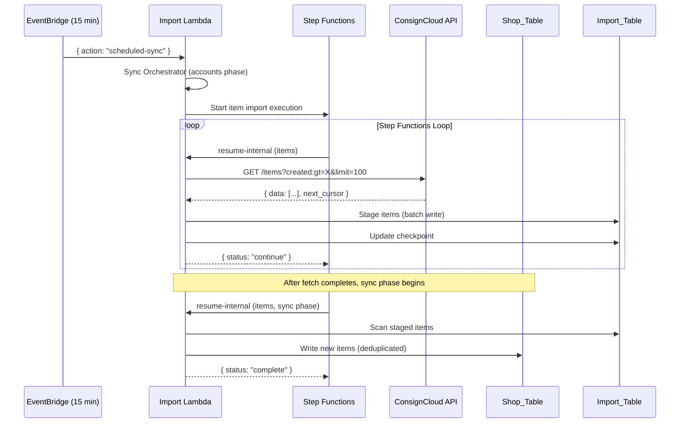

# Design Document: Item Import Rework

## Overview

This design reworks the existing item import to operate as an incremental scheduled sync. The main changes are:

1. **Remove deleted-item filtering** — soft-deleted items are now imported with their `deleted` timestamp
2. **Use CC SKU directly** — instead of generating sequential SKUs, use ConsignCloud's SKU as the item's operator-facing identifier
3. **Expand the field mapping** — add ~10 new fields (status, location, scheduleStart, lastSold, lastViewed, labelPrintedAt, daysOnShelf, deleted, etc.)
4. **Add GSI access patterns** — items queryable by account and by category, both sorted by creation date (newest first)
5. **Enable the items phase in the sync orchestrator** — with a dependency on account import completing first
6. **Seed sequence counter** — after first import, seed the item counter to max(imported SKU)

The existing infrastructure (Step Functions loop, Import Lambda, checkpoint management, rate limiter, page-by-page processing, Import_Table) is reused unchanged. The changes are surgical: mapper updates, sync orchestrator enablement, writeItem changes, Terraform GSI addition.

### Key Design Decisions

1. **Overload GSI2 for account-based item queries**: GSI2 is already an overloaded index (used by employees with `GSI2PK: EMPLOYEES`). Items use `GSI2PK: ACCOUNT#<accountId>` which doesn't collide. No new index needed for this access pattern.

2. **New GSI3 for category-based item queries**: A new GSI3 is required since GSI2's partition key space is now shared between employees and account-items. Category queries need their own clean index: `GSI3PK: CATEGORY#<categoryId>`, `GSI3SK: ITEM#<createdAt>`.

3. **CC SKU used directly (no sequence counter generation)**: ConsignCloud's `sku` field is the natural identifier printed on labels. Generating a new SKU would break label lookup. The sequence counter is seeded post-import to prevent collisions with future locally-created items.

4. **Status derived from priority-based logic**: The CC `status` object maps status names to unit counts (e.g. `{ "active": 1 }`). For items with quantity > 1, multiple statuses may be present. The highest-priority status wins (active > parked > ... > damaged).

5. **Account resolution uses sourceId (not account number)**: The current implementation resolves accounts by CC account number via GSI1. This should be changed to resolve by `account.id` via the `sourceId-index` GSI for correctness — the CC account `id` is the stable identifier, not the number which could theoretically be reused.

6. **Deleted items imported (not skipped)**: The existing `isDeletedItem` filter is removed from the fetch loop. Soft-deleted items are imported with their `deleted` timestamp, allowing the shop to track full item lifecycle.

7. **createdAt uses CC's `created` timestamp**: The item's `createdAt` in the shop table reflects when it was created in ConsignCloud, not when it was imported. This ensures correct chronological sorting via GSI2SK/GSI3SK.

## Architecture

The architecture is unchanged from the existing item import. The flow remains:



### Sync Orchestrator Changes

The sync orchestrator (`sync-orchestrator.ts`) currently disables the items phase:

```typescript
// Current: disabled
phases.items = { status: "skipped", reason: "disabled" };
```

This is replaced with active item import logic that:
1. Waits for account phase Step Function to complete (poll or inline)
2. Checks for existing running/paused item import job
3. Creates a new item import job with `createdAfter` from `lastItemSyncAt`
4. Starts a Step Functions execution
5. Updates `lastItemSyncAt` on success

**Critical ordering constraint**: Since accounts run as a Step Function (async), and items must wait for accounts to complete, the orchestrator must either:
- (A) Run account import inline (synchronous) — the current code already does this via `startStepFunctionForSync` which is async, but the account job completes quickly
- (B) Poll the account Step Function execution status before starting items

Looking at the current implementation, accounts are started via `startStepFunctionForSync` (async). The orchestrator should wait for account completion. The simplest approach: poll the account Step Function execution status with a sleep loop (max ~240s remaining Lambda time after accounts start), checking every 10 seconds.

**However**, reviewing the current sync-orchestrator code more carefully: accounts are already started as a Step Function execution and the orchestrator does NOT wait for them. The `lastAccountSyncAt` is updated immediately after the Step Function starts successfully. This means there's already an assumption that account data may not be fully synced before items start on the same run.

**Revised approach**: For safety (your requirement that accounts complete before items), we change the account phase to run **synchronously within the orchestrator Lambda** rather than via Step Functions. The account dataset is small (~3000 accounts) and completes well within the 300s Lambda timeout. The item and sale phases remain async via Step Functions since they handle 365k+ records.

This means:
1. Account fetch + sync runs inline (synchronous) in the orchestrator
2. Only after accounts complete successfully does the orchestrator start the item Step Function
3. Items and sales continue to run as Step Functions (async, long-running)

## Components and Interfaces

### Modified Components

| Component | File | Changes |
|-----------|------|---------|
| Item Mapper | `src/import/item-mapper.ts` | Add new fields, status derivation, remove inventory_type/terms defaults |
| Item Sync Orchestrator | `src/import/item-sync-orchestrator.ts` | Use CC SKU, add GSI2/GSI3 keys, add new fields to write, change account resolution to sourceId |
| Item Fetch Orchestrator | `src/import/item-fetch-orchestrator.ts` | Remove `isDeletedItem` filter (import all items) |
| Item ConsignCloud Client | `src/import/item-consigncloud-client.ts` | Update `ConsignCloudItem` interface with new fields |
| Sync Orchestrator | `src/import/sync-orchestrator.ts` | Enable items phase, ensure accounts complete before items start |
| Item Filter | `src/import/item-filter.ts` | Remove or deprecate `isDeletedItem` (no longer filtering deleted items) |
| DynamoDB Table (Terraform) | `infrastructure/dynamodb.tf` | Add GSI3 attribute definitions and index |

### New Components

None — all changes are modifications to existing files.

### Component Interfaces

#### Updated `ConsignCloudItem` Interface

```typescript
// item-consigncloud-client.ts
export interface ConsignCloudItem {
  id: string;
  title?: string;
  tag_price?: number;
  price?: number;
  quantity: number;
  split?: number;
  consignor_split?: number;
  inventory_type?: string;
  terms?: string;
  account_id?: string;
  account?: { id: string; number: string } | null;
  created_by?: { id: string; name: string; user_type?: string } | null;
  category?: { id: string; name: string } | null;
  tags?: string[] | Array<unknown>;
  description?: string;
  details?: string | null;
  brand?: string;
  color?: string;
  size?: string;
  shelf?: { name: string } | null;
  location?: { name: string } | null;
  tax_exempt?: boolean;
  images?: Array<{ url: string }>;
  created: string;
  deleted?: string | null;
  sku?: string;
  // New fields
  schedule_start?: string | null;
  expires?: string | null;
  status?: Record<string, number> | null;
  last_sold?: string | null;
  last_viewed?: string | null;
  printed?: string | null;
  days_on_shelf?: number | null;
}
```

#### Updated `MappedItemFields` Interface

```typescript
// item-mapper.ts
export interface MappedItemFields {
  title: string;
  tagPrice: number;
  quantity: number;
  split: number;
  inventoryType: InventoryType;
  terms: Terms;
  taxExempt: boolean;
  status: ItemStatus;
  tags?: string[];
  description?: string;
  details?: string;
  brand?: string;
  color?: string;
  size?: string;
  shelf?: string;
  location?: string;
  imageKeys?: string[];
  scheduleStart?: string;
  expirationDate?: string;
  lastSold?: string;
  lastViewed?: string;
  labelPrintedAt?: string;
  daysOnShelf?: number;
  deleted?: string;
  createdAt: string;
}

export type ItemStatus =
  | "active"
  | "parked"
  | "inactive"
  | "expired"
  | "to_be_returned"
  | "sold"
  | "returned_to_owner"
  | "donated"
  | "lost"
  | "stolen"
  | "damaged";
```

#### Status Derivation Function

```typescript
// item-mapper.ts
const STATUS_PRIORITY: ItemStatus[] = [
  "active",
  "parked",
  "inactive",
  "expired",
  "to_be_returned",
  "sold",
  "returned_to_owner",
  "donated",
  "lost",
  "stolen",
  "damaged",
];

const SOLD_VARIANTS = new Set([
  "sold",
  "sold_on_shopify",
  "sold_on_square",
  "sold_on_third_party",
]);

export function deriveItemStatus(
  statusObj: Record<string, number> | null | undefined,
): ItemStatus {
  if (!statusObj || Object.keys(statusObj).length === 0) {
    return "active";
  }

  // Normalize: collapse sold variants into "sold"
  const normalized = new Map<ItemStatus, number>();
  for (const [key, count] of Object.entries(statusObj)) {
    if (count <= 0) continue;
    const normalizedKey: ItemStatus = SOLD_VARIANTS.has(key) ? "sold" : (key as ItemStatus);
    normalized.set(normalizedKey, (normalized.get(normalizedKey) ?? 0) + count);
  }

  // Return highest priority status with non-zero count
  for (const status of STATUS_PRIORITY) {
    if ((normalized.get(status) ?? 0) > 0) {
      return status;
    }
  }

  return "active";
}
```

#### Updated `writeItem` Function Signature

```typescript
// item-sync-orchestrator.ts
async function writeItem(
  item: ConsignCloudItem,
  mapped: MappedItemFields,
  accountUuid: string | undefined,
  sku: number,
  createdByUuid?: string,
  categoryId?: string,
): Promise<void> {
  const uuid = randomUUID();
  const pk = buildItemPk(uuid);
  const gsi1sk = formatSkuGsi1sk(sku);
  const createdAt = mapped.createdAt; // Use CC's created timestamp

  const record: Record<string, unknown> = {
    PK: pk,
    SK: "METADATA",
    uuid,
    sku,
    GSI1PK: "ITEMS",
    GSI1SK: gsi1sk,
    // GSI2: items by account, sorted by creation date
    ...(accountUuid && {
      GSI2PK: `ACCOUNT#${accountUuid}`,
      GSI2SK: `ITEM#${createdAt}`,
    }),
    // GSI3: items by category, sorted by creation date
    ...(categoryId && {
      GSI3PK: `CATEGORY#${categoryId}`,
      GSI3SK: `ITEM#${createdAt}`,
    }),
    accountId: accountUuid,
    title: mapped.title,
    tagPrice: mapped.tagPrice,
    quantity: mapped.quantity,
    split: mapped.split,
    inventoryType: mapped.inventoryType,
    terms: mapped.terms,
    taxExempt: mapped.taxExempt,
    status: mapped.status,
    sourceId: item.id,
    createdAt,
    updatedAt: new Date().toISOString(),
  };

  // Optional fields
  if (createdByUuid) record.createdBy = createdByUuid;
  if (categoryId) record.categoryId = categoryId;
  if (mapped.brand) record.brand = mapped.brand;
  if (mapped.color) record.color = mapped.color;
  if (mapped.size) record.size = mapped.size;
  if (mapped.shelf) record.shelf = mapped.shelf;
  if (mapped.location) record.location = mapped.location;
  if (mapped.description) record.description = mapped.description;
  if (mapped.details) record.details = mapped.details;
  if (mapped.tags && mapped.tags.length > 0) record.tags = mapped.tags;
  if (mapped.imageKeys && mapped.imageKeys.length > 0) record.imageKeys = mapped.imageKeys;
  if (mapped.scheduleStart) record.scheduleStart = mapped.scheduleStart;
  if (mapped.expirationDate) record.expirationDate = mapped.expirationDate;
  if (mapped.lastSold) record.lastSold = mapped.lastSold;
  if (mapped.lastViewed) record.lastViewed = mapped.lastViewed;
  if (mapped.labelPrintedAt) record.labelPrintedAt = mapped.labelPrintedAt;
  if (mapped.daysOnShelf != null) record.daysOnShelf = mapped.daysOnShelf;
  if (mapped.deleted) record.deleted = mapped.deleted;
  if (item.sku) record.sourceSku = item.sku; // Preserve raw CC SKU string

  await docClient.send(
    new PutCommand({
      TableName: TABLE_NAME,
      Item: record,
      ConditionExpression: "attribute_not_exists(PK)",
    }),
  );
}
```

#### SKU Handling Changes

```typescript
// item-sync-orchestrator.ts — replace getNextSku() call with:

// Use CC SKU directly if present
let sku: number;
if (item.sku) {
  sku = parseInt(item.sku, 10);
  if (isNaN(sku)) {
    // Fallback to sequence counter if SKU is not numeric
    sku = await getNextSku();
  }
} else {
  // No CC SKU — generate from counter
  sku = await getNextSku();
}
```

#### Sequence Counter Seeding (post-import)

After the first full import completes, the sync phase should update the sequence counter to the max SKU encountered:

```typescript
// item-sync-orchestrator.ts — at the end of sync completion
async function seedSequenceCounter(maxSku: number): Promise<void> {
  await docClient.send(
    new PutCommand({
      TableName: TABLE_NAME,
      Item: {
        PK: "SEQUENCE#ITEM",
        SK: "COUNTER",
        value: maxSku,
      },
    }),
  );
}
```

The sync loop tracks `maxSku` during processing and calls `seedSequenceCounter` when the job completes.

#### Account Resolution Change

```typescript
// item-sync-orchestrator.ts — replace resolveAccountByNumber with:
async function resolveAccountBySourceId(
  ccAccountId: string | undefined,
  cache: Map<string, string>,
): Promise<string | null> {
  if (!ccAccountId) return null;

  const cached = cache.get(ccAccountId);
  if (cached) return cached;

  const result = await docClient.send(
    new QueryCommand({
      TableName: TABLE_NAME,
      IndexName: "sourceId-index",
      KeyConditionExpression: "#sid = :sourceId",
      ExpressionAttributeNames: { "#sid": "sourceId", "#uuid": "uuid" },
      ExpressionAttributeValues: { ":sourceId": ccAccountId },
      Limit: 1,
      ProjectionExpression: "#uuid",
    }),
  );

  if (result.Items && result.Items.length > 0) {
    const uuid = result.Items[0].uuid as string;
    cache.set(ccAccountId, uuid);
    return uuid;
  }

  return null;
}
```

### Sync Orchestrator Changes

```typescript
// sync-orchestrator.ts — replace the disabled items phase with:

// ===== Phase 2: Items (async via Step Functions) =====
try {
  const existingItemJob = await itemJobManager.getRunningOrPausedJob();
  if (existingItemJob) {
    phases.items = {
      status: "skipped",
      reason: "Item import already running/paused",
    };
  } else {
    const itemJob = await itemJobManager.createJob({
      createdAfter: syncState?.lastItemSyncAt ?? undefined,
    });
    const itemArn = await startStepFunctionWithRetry(
      {
        jobId: itemJob.jobId,
        phase: "fetch",
        type: "items",
        createdAfter: syncState?.lastItemSyncAt ?? undefined,
      },
      correlationId,
    );
    itemExecutionArn = itemArn;
    phases.items = { status: "success" };
    await updateSyncStateField("lastItemSyncAt", syncTimestamp);
  }
} catch (error) {
  const message = error instanceof Error ? error.message : "Unknown error";
  phases.items = { status: "error", reason: message };
  console.error(
    JSON.stringify({
      level: "ERROR",
      message: "Item import Step Function start failed",
      correlationId,
      error: message,
    }),
  );
}
```

## DynamoDB Schema Changes

### Shop_Table — New GSI3

```hcl
# infrastructure/dynamodb.tf — additions

attribute {
  name = "GSI3PK"
  type = "S"
}

attribute {
  name = "GSI3SK"
  type = "S"
}

global_secondary_index {
  name            = "GSI3"
  hash_key        = "GSI3PK"
  range_key       = "GSI3SK"
  projection_type = "ALL"
}
```

### Key Patterns (Updated)

| Entity | PK | SK | GSI1PK | GSI1SK | GSI2PK | GSI2SK | GSI3PK | GSI3SK |
|--------|----|----|--------|--------|--------|--------|--------|--------|
| Item | `ITEM#<uuid>` | `METADATA` | `ITEMS` | `ITEM#<sku>` | `ACCOUNT#<accountId>` | `ITEM#<createdAt>` | `CATEGORY#<categoryId>` | `ITEM#<createdAt>` |
| Account | `ACCOUNT#<uuid>` | `METADATA` | `ACCOUNTS` | `ACCOUNT#<shopUid>` | — | — | — | — |
| Employee | `EMPLOYEE#<uuid>` | `METADATA` | — | — | `EMPLOYEES` | `EMPLOYEE#<uuid>` | — | — |
| Category | `CATEGORY#<uuid>` | `METADATA` | — | — | — | — | — | — |

### Access Patterns Supported

| Access Pattern | Index | Query |
|---|---|---|
| Get item by UUID | Table | `PK = ITEM#<uuid>, SK = METADATA` |
| Get item by SKU | GSI1 | `GSI1PK = ITEMS, GSI1SK = ITEM#<sku>` |
| List items by account (newest first) | GSI2 | `GSI2PK = ACCOUNT#<accountId>`, ScanIndexForward = false |
| List items by category (newest first) | GSI3 | `GSI3PK = CATEGORY#<categoryId>`, ScanIndexForward = false |
| Check if item exists by sourceId | sourceId-index | `sourceId = <ccItemUuid>` |

## Data Flow

### First Run (Full Import)

1. Sync orchestrator starts with `lastItemSyncAt = null`
2. Item import job created with no `createdAfter` filter
3. Fetch loop pages through all 365k items from CC
4. All items staged in Import_Table (including deleted ones)
5. Sync loop reads staged items, maps fields, resolves accounts/categories/employees
6. Items written to Shop_Table with GSI2/GSI3 keys populated
7. Sequence counter seeded to max(SKU) on completion
8. `lastItemSyncAt` updated to sync timestamp

### Subsequent Runs (Incremental)

1. Sync orchestrator reads `lastItemSyncAt` from Sync_State
2. Item import job created with `createdAfter = lastItemSyncAt`
3. Fetch loop only retrieves items created after that timestamp
4. New items staged and synced as above
5. Existing items (matched by sourceId) skipped during sync
6. `lastItemSyncAt` updated to new sync timestamp

## Validation Rules

| Field | Rule | On Failure |
|---|---|---|
| `title` | Required (fallback to `Untitled (<sku>)` if missing) | Fail item if both title and sku missing |
| `tag_price` | Must be >= 0, converts from cents to CHF | Fail item |
| `quantity` | Allow 0 (sold items), default 0 | Use 0 |
| `split` | 0.0-1.0 decimal, converts to 0-100 percentage | Fail item if out of range |
| `account.id` | Must resolve to shop Account UUID | Fail item (account is required) |
| `category.id` | Should resolve to shop Category UUID | Import with categoryId=null if not found |
| `created_by.id` | Should resolve to shop Employee UUID | Import with createdBy=null if not found |
| `status` | Derive from status object | Default to "active" if empty/null |

## Item Status Enumeration

| Value | Description |
|---|---|
| `active` | Item is available for sale on the shelf |
| `parked` | Item temporarily removed from sale floor |
| `inactive` | Item deliberately deactivated by operator |
| `expired` | Consignment period ended, pending action |
| `to_be_returned` | Item awaiting return to consignor |
| `sold` | Item sold (includes Shopify/Square/third-party sales) |
| `returned_to_owner` | Item returned to the consignor |
| `donated` | Item donated per consignment terms |
| `lost` | Item lost/unaccounted for |
| `stolen` | Item stolen |
| `damaged` | Item damaged and removed from inventory |
