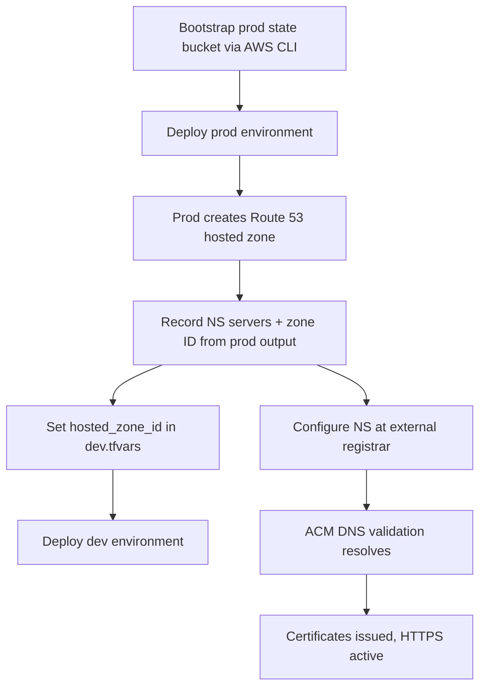

# Design Document: Production Deployment Infrastructure

## Overview

This design refactors the existing single-environment Terraform infrastructure into a multi-environment setup supporting both `dev` and `prod` with isolated state. It adds S3 + CloudFront frontend hosting, Route 53 DNS, ACM certificates, and API Gateway custom domains. The approach uses separate backend configuration files and tfvars (NOT Terraform workspaces) — each environment is a distinct `terraform init` + `terraform apply` run.

The key architectural decision is that the Route 53 hosted zone lives in the **prod state** only. Dev references the zone ID via a variable passed through `dev.tfvars` after prod is deployed first. This avoids duplicate zone management and ensures a single source of truth for DNS.

## Architecture

### Environment Isolation Strategy

Each environment has its own:
- S3 state bucket (bootstrapped externally via AWS CLI, not managed by Terraform)
- Backend config file (`.tfbackend`)
- Variable definitions file (`.tfvars`)
- Full set of AWS resources (DynamoDB tables, Lambdas, API Gateway, etc.)

Environments share:
- The same Terraform source code
- A single Route 53 hosted zone (owned by prod, referenced by dev)

### Deployment Model



### Target File Structure

```
infrastructure/
├── environments/
│   ├── dev.tfbackend          # partial backend config for dev
│   ├── prod.tfbackend         # partial backend config for prod
│   ├── dev.tfvars             # dev-specific variable values
│   └── prod.tfvars            # prod-specific variable values
├── modules/
│   ├── frontend/              # NEW: S3 bucket + CloudFront + OAC
│   │   ├── main.tf
│   │   ├── variables.tf
│   │   └── outputs.tf
│   └── import/                # existing, unchanged
├── backend.tf                 # CHANGED: empty backend "s3" {} (partial config)
├── main.tf                    # MODIFIED: add us-east-1 provider alias
├── variables.tf               # MODIFIED: add new variables
├── outputs.tf                 # MODIFIED: add hosted zone outputs
├── dns.tf                     # NEW: Route 53 hosted zone + DNS records
├── certificates.tf            # NEW: ACM certs + DNS validation
├── frontend.tf                # NEW: module invocation for frontend hosting
├── api-gateway.tf             # MODIFIED: custom domain, CORS from variable
├── s3.tf                      # MODIFIED: remove tfstate bucket resources
├── dynamodb.tf                # unchanged
├── eventbridge.tf             # unchanged
└── lambda.tf                  # unchanged
```

### CLI Usage Pattern

```bash
# Dev deployment
terraform init -backend-config=environments/dev.tfbackend
terraform apply -var-file=environments/dev.tfvars

# Prod deployment
terraform init -backend-config=environments/prod.tfbackend
terraform apply -var-file=environments/prod.tfvars
```

## Components and Interfaces

### 1. Backend Configuration (Partial Config)

**File: `backend.tf`**

Replaces the current hardcoded backend with an empty partial configuration block. The actual bucket, key, and region are supplied at `terraform init` time via `-backend-config` flag.

```hcl
terraform {
  backend "s3" {}
}
```

**File: `environments/dev.tfbackend`**
```
bucket = "thymos-dev-tfstate"
key    = "infrastructure/terraform.tfstate"
region = "eu-central-1"
```

**File: `environments/prod.tfbackend`**
```
bucket = "thymos-prod-tfstate"
key    = "infrastructure/terraform.tfstate"
region = "eu-central-1"
```

### 2. Environment-Specific Variables

**File: `environments/dev.tfvars`**
```hcl
environment      = "dev"
base_domain      = "thymos.cloud"
domain_name      = "dev.thymos.cloud"
api_domain_name  = "dev-api.thymos.cloud"
allowed_origins  = ["*"]
hosted_zone_id   = ""  # populated after prod is deployed
```

**File: `environments/prod.tfvars`**
```hcl
environment      = "prod"
base_domain      = "thymos.cloud"
domain_name      = "app.thymos.cloud"
api_domain_name  = "api.thymos.cloud"
allowed_origins  = ["https://app.thymos.cloud"]
hosted_zone_id   = ""  # empty — prod creates its own zone
```

### 3. Provider Configuration

**File: `main.tf` (additions)**

A provider alias is required for ACM certificates used by CloudFront (must be in `us-east-1`).

```hcl
provider "aws" {}

provider "aws" {
  alias  = "us_east_1"
  region = "us-east-1"
}
```

### 4. New Variables

**File: `variables.tf` (additions)**

| Variable | Type | Default | Description |
|----------|------|---------|-------------|
| `base_domain` | `string` | `"thymos.cloud"` | Base domain for the hosted zone |
| `domain_name` | `string` | — (required) | Frontend CloudFront domain for this environment |
| `api_domain_name` | `string` | — (required) | API Gateway custom domain for this environment |
| `allowed_origins` | `list(string)` | `["*"]` | CORS allowed origins for API Gateway |
| `hosted_zone_id` | `string` | `""` | Route 53 hosted zone ID (empty = create zone, non-empty = use existing) |

### 5. Route 53 DNS (`dns.tf`)

**Hosted zone**: Created only when `var.hosted_zone_id == ""` (i.e., in prod). Dev passes the zone ID from the prod output.

```hcl
resource "aws_route53_zone" "main" {
  count = var.hosted_zone_id == "" ? 1 : 0
  name  = var.base_domain
}

locals {
  zone_id = var.hosted_zone_id != "" ? var.hosted_zone_id : aws_route53_zone.main[0].zone_id
}
```

**DNS records created per environment:**
- A record (alias) → CloudFront distribution (frontend domain)
- A record (alias) → API Gateway custom domain (API domain)

### 6. ACM Certificates (`certificates.tf`)

Two certificates per environment:

| Certificate | Region | Domain | Purpose |
|-------------|--------|--------|---------|
| Frontend cert | `us-east-1` | `var.domain_name` | CloudFront requires certs in us-east-1 |
| API cert | `eu-central-1` | `var.api_domain_name` | API Gateway regional custom domain |

Both use DNS validation with CNAME records created in the Route 53 hosted zone. The `aws_acm_certificate_validation` resource waits for validation to complete.

```hcl
# Frontend cert (us-east-1 for CloudFront)
resource "aws_acm_certificate" "frontend" {
  provider          = aws.us_east_1
  domain_name       = var.domain_name
  validation_method = "DNS"
}

# API cert (eu-central-1 for API Gateway)
resource "aws_acm_certificate" "api" {
  domain_name       = var.api_domain_name
  validation_method = "DNS"
}
```

DNS validation records are created in Route 53 using `for_each` over the certificate's `domain_validation_options`.

### 7. Frontend Module (`modules/frontend/`)

A reusable module encapsulating S3 static hosting + CloudFront distribution + Origin Access Control.

**Module inputs:**

| Variable | Type | Description |
|----------|------|-------------|
| `project_name` | `string` | Resource naming prefix |
| `environment` | `string` | Environment name |
| `domain_name` | `string` | CloudFront alternate domain name |
| `acm_certificate_arn` | `string` | ACM cert ARN (must be us-east-1) |
| `default_root_object` | `string` | Default root object (default: `index.html`) |

**Module outputs:**

| Output | Description |
|--------|-------------|
| `cloudfront_distribution_domain_name` | CloudFront domain for DNS alias |
| `cloudfront_distribution_hosted_zone_id` | CloudFront hosted zone for Route 53 alias |
| `s3_bucket_name` | Bucket name for deployment scripts |
| `s3_bucket_arn` | Bucket ARN for IAM policies |
| `cloudfront_distribution_id` | Distribution ID for cache invalidation |

**Key resources in module:**

1. **S3 Bucket** — Private, no public access, server-side encryption (AES256)
2. **S3 Bucket Policy** — Allow CloudFront OAC to `s3:GetObject`
3. **CloudFront Origin Access Control** — `s3` origin type, `always` signing behavior
4. **CloudFront Distribution** — S3 origin with OAC, HTTPS redirect, custom error responses for SPA routing

**SPA Routing — Custom Error Responses:**
```hcl
custom_error_response {
  error_code         = 403
  response_code      = 200
  response_page_path = "/index.html"
}

custom_error_response {
  error_code         = 404
  response_code      = 200
  response_page_path = "/index.html"
}
```

**CloudFront Configuration:**
- Viewer protocol policy: `redirect-to-https`
- Cache policy: `CachingOptimized` (managed policy)
- Price class: `PriceClass_100` (North America + Europe — sufficient for Swiss-based shop)
- Alternate domain name (CNAME): `var.domain_name`
- SSL certificate: `var.acm_certificate_arn`
- Minimum TLS version: `TLSv1.2_2021`

### 8. API Gateway Custom Domains

**Additions to `api-gateway.tf`:**

```hcl
resource "aws_apigatewayv2_domain_name" "api" {
  domain_name = var.api_domain_name

  domain_name_configuration {
    certificate_arn = aws_acm_certificate.api.arn
    endpoint_type   = "REGIONAL"
    security_policy = "TLS_1_2"
  }
}

resource "aws_apigatewayv2_api_mapping" "api" {
  api_id      = aws_apigatewayv2_api.shop_api.id
  domain_name = aws_apigatewayv2_domain_name.api.id
  stage       = aws_apigatewayv2_stage.default.id
}
```

**CORS change:** Replace hardcoded `["*"]` with `var.allowed_origins`:
```hcl
cors_configuration {
  allow_origins = var.allowed_origins
  ...
}
```

### 9. Outputs (additions)

```hcl
output "hosted_zone_id" {
  description = "Route 53 hosted zone ID (only set in prod)"
  value       = var.hosted_zone_id == "" ? aws_route53_zone.main[0].zone_id : var.hosted_zone_id
}

output "hosted_zone_name_servers" {
  description = "Name servers for the hosted zone (configure at registrar)"
  value       = var.hosted_zone_id == "" ? aws_route53_zone.main[0].name_servers : []
}

output "cloudfront_distribution_id" {
  description = "CloudFront distribution ID for cache invalidation"
  value       = module.frontend.cloudfront_distribution_id
}

output "frontend_bucket_name" {
  description = "S3 bucket name for frontend deployment"
  value       = module.frontend.s3_bucket_name
}

output "frontend_domain" {
  description = "Frontend domain name"
  value       = var.domain_name
}

output "api_domain" {
  description = "API custom domain name"
  value       = var.api_domain_name
}
```

### 10. S3 Changes

Remove these resources from `s3.tf`:
- `aws_s3_bucket.tfstate`
- `aws_s3_bucket_versioning.tfstate`
- `aws_s3_bucket_server_side_encryption_configuration.tfstate`
- `aws_s3_bucket_public_access_block.tfstate`

The items bucket and its associated resources remain unchanged.

**Migration procedure**: Before removing the code, run `terraform state rm` for each tfstate bucket resource so Terraform doesn't attempt to destroy the actual bucket.

## Data Models

No data model changes. This feature is entirely infrastructure configuration.

## Error Handling

### Certificate Validation Timing

ACM DNS validation depends on NS record propagation from the external registrar. If the hosted zone's NS records haven't been configured at the registrar, certificate validation will remain in `PENDING_VALIDATION` state indefinitely.

**Mitigation**: The deployment procedure documents that NS records must be set at the registrar before certificates can validate. The `aws_acm_certificate_validation` resource will block `terraform apply` until validation completes (with a configurable timeout).

### State Migration Errors

Switching from hardcoded backend to partial backend configuration requires `terraform init -reconfigure`. If the state file is corrupted or the bucket is inaccessible, the migration fails.

**Mitigation**: Document the exact migration steps. The dev state bucket already exists with the correct key, so re-init with `-reconfigure` and the dev backend config file should be seamless.

### CloudFront Distribution Creation Time

CloudFront distributions take 10-20 minutes to deploy. Terraform will wait for the distribution to reach `Deployed` status.

**Mitigation**: No action needed — this is expected behavior. Document the expected wait time in deployment notes.

### Dependency on Prod Deployment Order

Dev requires the hosted zone ID from prod. If prod hasn't been deployed yet, dev cannot create DNS records or validate certificates.

**Mitigation**: Document the deployment order: prod first, then dev. The `hosted_zone_id` variable being empty in dev.tfvars serves as a clear indicator that prod output hasn't been captured yet.

## Testing Strategy

This feature is entirely Infrastructure as Code (Terraform). Property-based testing is not applicable.

### Validation Approach

1. **`terraform validate`** — Syntax and reference validation for all `.tf` files
2. **`terraform plan`** — Review planned resource changes for each environment before applying
3. **Manual verification** — After apply:
   - Confirm CloudFront distributions return `index.html` for arbitrary paths
   - Confirm custom domains resolve correctly (`dig` / `nslookup`)
   - Confirm HTTPS works on all custom domains
   - Confirm CORS headers on API responses match expected origins
   - Confirm dev environment is unaffected (existing API URL still works)
4. **State isolation verification** — Confirm dev and prod state files are in separate buckets with correct keys

### Pre-Apply Checklist

- [ ] `terraform fmt -check` passes
- [ ] `terraform validate` passes
- [ ] `terraform plan` shows only expected changes (no unexpected destroys)
- [ ] Prod state bucket has been bootstrapped
- [ ] NS records set at registrar (for certificate validation)

### Rollback Strategy

- State buckets are versioned — state can be recovered from S3 versioning
- If a deployment breaks dev, re-apply with the original dev.tfvars (no custom domain changes)
- CloudFront distributions can be disabled without deletion if issues arise
