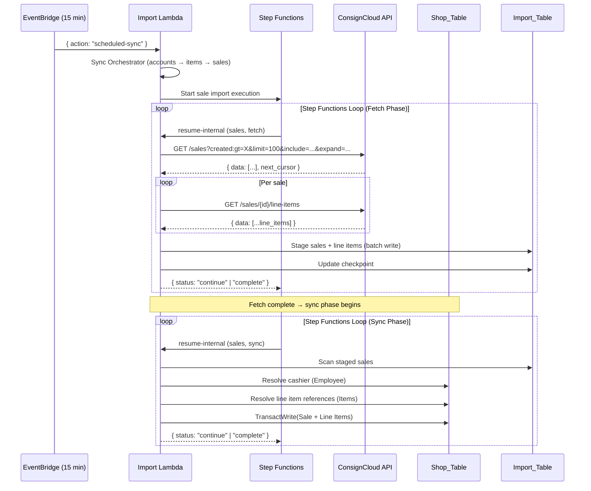

# Design Document: Sale Import Rework

## Overview

This design reworks the existing sale import to operate as an incremental scheduled sync. The main changes are:

1. **Import all sale statuses** — open, finalized, and voided sales are all imported (not just finalized)
2. **Use CC sale number directly** — instead of generating sequential numbers, use ConsignCloud's number as the operator-facing identifier
3. **Replace `consignorPortion` with `cogs`** — cleaner semantic model at the sale level; line items retain `consignorPortion`
4. **Expand the field mapping** — add refundedAmount, cashRoundingAdjustment, lineItemCount, parkedAt, and expanded line item fields (split, taxedPrice, taxExempt, refundedQuantity, totalTax, itemSku, itemTitle, sourceId, createdAt)
5. **Enable the sales phase in the sync orchestrator** — runs after items phase
6. **Seed sequence counter** — after first import, seed the sale counter to max(imported number)
7. **Expand CC API query parameters** — include all available fields (except broken `total_tendered`/`amounts_tendered`)

The existing infrastructure (Step Functions loop, Import Lambda, checkpoint management, rate limiter, separate line item fetching) is reused unchanged.

### Key Design Decisions

1. **COGS replaces consignorPortion at sale level**: The sale-level `consignor_portion` from CC is stored as `cogs`. For consignment items these are identical. When retail items are added later, COGS will represent the shop's purchase cost (not a consignor payment). Line items retain their own `consignorPortion` for per-item granularity.

2. **All statuses imported**: The `isFinalizedSale` filter is removed. Open, voided, and parked sales are imported with their actual status. This gives the shop full visibility into sale lifecycle.

3. **CC sale number used directly**: Same reasoning as item SKU — printed on receipts, operators look up sales by number. The sequence counter is seeded to max(imported number) after first import.

4. **Refund fields as snapshots (tech debt)**: `refundedAmount` on Sale and `refundedQuantity` on Sale_Line_Item are stored as informational fields. A proper Refund entity will be modelled in a future spec — these fields will need migration at that point.

5. **Line item `itemSku` is vital**: This field links the line item to the item by its natural identifier (printed on labels). May be indexed in future for lookup patterns like "show all sales of item X by SKU".

6. **`totalTax` derived from `applied_taxes`**: Rather than storing the full tax breakdown objects, we store a single `totalTax` number (sum of all `applied_taxes[].amount`). Simpler schema, sufficient for reporting.

7. **Employee (cashier) resolved or created on-the-fly**: Same pattern used by item and account imports — lookup by `sourceId-index`, create with conditional write if not found.

## Architecture

The architecture is unchanged from the existing sale import. The flow remains:



### Sync Orchestrator Changes

The sync orchestrator currently disables the sales phase:

```typescript
// Current: disabled
phases.sales = { status: "skipped", reason: "disabled" };
```

This is replaced with active sale import logic (same pattern as items phase):
1. Check for existing running/paused sale import job
2. Create a new sale import job with `createdAfter` from `lastSaleSyncAt`
3. Start a Step Functions execution
4. Update `lastSaleSyncAt` on success

The sales phase runs after items. It does not depend on items completing (items may take longer than one scheduler cycle), but it runs in the same orchestrator invocation after items are started.

## Components and Interfaces

### Modified Components

| Component | File | Changes |
|-----------|------|---------|
| Sale ConsignCloud Client | `src/import/sale-consigncloud-client.ts` | Update `ConsignCloudSale` interface, expand include/expand params |
| Sale Mapper | `src/import/sale-mapper.ts` | Add new fields, remove finalized-only filter, map COGS, derive totalTax |
| Sale Sync Orchestrator | `src/import/sale-sync-orchestrator.ts` | Use CC number directly, add new fields to write, seed counter |
| Sale Fetch Orchestrator | `src/import/sale-fetch-orchestrator.ts` | Remove finalized filter (import all) |
| Sync Orchestrator | `src/import/sync-orchestrator.ts` | Enable sales phase |

### Component Interfaces

#### Updated `ConsignCloudSale` Interface

```typescript
// sale-consigncloud-client.ts
export interface ConsignCloudSale {
  id: string;
  number: string;
  status: string; // "open" | "finalized" | "voided"
  subtotal: number; // cents
  total: number; // cents
  store_portion: number; // cents
  consignor_portion: number; // cents
  cogs: number; // cents
  change: number; // cents
  memo: string | null;
  cashier: { id: string; name: string } | null;
  created: string; // ISO 8601
  finalized: string | null; // ISO 8601
  voided: string | null; // ISO 8601
  parked: string | null; // ISO 8601
  // New fields
  refunded_amount: number; // cents
  cash_rounding_adjustment: number; // cents
  line_item_count: number;
  notes: unknown[]; // not mapped, but fetched for completeness
  gift_cards: unknown[]; // not mapped
  customer: unknown | null; // not mapped
  register: unknown | null; // not mapped
  register_report: unknown | null; // not mapped
  pending_swipe: unknown | null; // not mapped
}
```

#### Updated `ConsignCloudLineItem` Interface

```typescript
// sale-consigncloud-client.ts
export interface ConsignCloudLineItem {
  id: string;
  item: {
    id: string;
    image?: string | null;
    quantity?: number | null;
    title?: string;
    sku?: string;
  };
  unit_price: number; // cents
  consignor_portion: number; // cents
  store_portion: number; // cents
  split_price: number; // cents (not mapped)
  split: number; // decimal 0-1
  quantity: number;
  cost: number; // not mapped
  taxed_price: number; // cents
  tax_exempt: boolean;
  days_on_shelf: number;
  refunded_quantity: number;
  sale: string; // parent sale ID (not mapped, redundant)
  created: string; // ISO 8601
  discounts: string[]; // not mapped
  surcharges: string[]; // not mapped
  taxes: string[]; // not mapped
  applied_discounts: Array<{
    id: string;
    amount: number;
    level: string;
    discount: string;
  }>;
  applied_surcharges: Array<{ id: string; amount: number; surcharge: string }>;
  applied_taxes: Array<{
    id: string;
    amount: number;
    level: string;
    snapshot?: { name: string; percentage: number; tax_type: string; type: string };
    tax: string;
  }>;
}
```

#### Updated `MappedSaleFields` Interface

```typescript
// sale-mapper.ts
export interface MappedSaleFields {
  sourceId: string;
  number: number; // CC sale number, parsed to int
  status: "open" | "finalized" | "voided";
  subtotal: number; // cents
  total: number; // cents
  storePortion: number; // cents
  cogs: number; // cents (cost of goods sold)
  change: number; // cents
  memo: string | null;
  refundedAmount: number; // cents
  cashRoundingAdjustment: number; // cents
  lineItemCount: number;
  finalizedAt: string | null;
  voidedAt: string | null;
  parkedAt: string | null;
  createdAt: string; // ISO 8601
}
```

#### Updated `MappedLineItemFields` Interface

```typescript
// sale-mapper.ts
export interface MappedLineItemFields {
  sourceId: string; // CC line item UUID
  itemSourceId: string; // CC item UUID for resolution
  itemSku: string | null; // CC item SKU (vital)
  itemTitle: string | null; // Item title snapshot
  salePrice: number; // cents (unit_price)
  consignorPortion: number; // cents
  storePortion: number; // cents
  split: number; // decimal 0-1
  quantity: number;
  daysOnShelf: number;
  taxedPrice: number; // cents
  taxExempt: boolean;
  refundedQuantity: number;
  totalTax: number; // cents (sum of applied_taxes amounts)
  discount: number; // cents (sum of applied_discounts amounts)
  createdAt: string; // ISO 8601
}
```

#### Sale Number Handling

```typescript
// sale-sync-orchestrator.ts — use CC number directly
let saleNumber: number;
if (sale.number) {
  saleNumber = parseInt(sale.number, 10);
  if (isNaN(saleNumber)) {
    // Fallback to sequence counter
    saleNumber = await getNextSaleNumber();
  }
} else {
  saleNumber = await getNextSaleNumber();
}
```

#### Sequence Counter Seeding

```typescript
// sale-sync-orchestrator.ts — after sync completes
async function seedSaleSequenceCounter(maxNumber: number): Promise<void> {
  await docClient.send(
    new PutCommand({
      TableName: TABLE_NAME,
      Item: {
        PK: "SEQUENCE#SALE",
        SK: "COUNTER",
        value: maxNumber,
      },
    }),
  );
}
```

#### Updated `writeItem` (Sale Record)

```typescript
// sale-sync-orchestrator.ts — updated sale record structure
const saleRecord: Record<string, unknown> = {
  ...saleKeys, // PK, SK, GSI1PK, GSI1SK
  uuid: saleUuid,
  number: saleNumber,
  status: mapped.status,
  cashierId: cashierId ?? null,
  subtotal: mapped.subtotal,
  total: mapped.total,
  storePortion: mapped.storePortion,
  cogs: mapped.cogs,
  change: mapped.change,
  memo: mapped.memo,
  refundedAmount: mapped.refundedAmount,
  cashRoundingAdjustment: mapped.cashRoundingAdjustment,
  lineItemCount: mapped.lineItemCount,
  finalizedAt: mapped.finalizedAt,
  voidedAt: mapped.voidedAt,
  parkedAt: mapped.parkedAt,
  sourceId: mapped.sourceId,
  createdAt: mapped.createdAt,
  importedAt: now,
};
```

#### Updated Line Item Record

```typescript
// sale-sync-orchestrator.ts — updated line item record
const lineItemRecord: Record<string, unknown> = {
  PK: saleKeys.PK,
  SK: lineItemSk,
  sourceId: mappedLineItem.sourceId,
  itemId: resolvedItemId ?? null,
  itemSku: mappedLineItem.itemSku,
  itemTitle: mappedLineItem.itemTitle,
  salePrice: mappedLineItem.salePrice,
  consignorPortion: mappedLineItem.consignorPortion,
  storePortion: mappedLineItem.storePortion,
  split: mappedLineItem.split,
  quantity: mappedLineItem.quantity,
  daysOnShelf: mappedLineItem.daysOnShelf,
  taxedPrice: mappedLineItem.taxedPrice,
  taxExempt: mappedLineItem.taxExempt,
  refundedQuantity: mappedLineItem.refundedQuantity,
  totalTax: mappedLineItem.totalTax,
  discount: mappedLineItem.discount,
  createdAt: mappedLineItem.createdAt,
};
```

### CC API Query Parameters

```typescript
// sale-consigncloud-client.ts — updated fetchSalePage

const INCLUDE_VALUES: string[] = [
  "cashier",
  "memo",
  "status",
  "consignor_portion",
  "store_portion",
  "refunded_amount",
  "line_item_count",
  "notes",
  "cogs",
  "register",
  "gift_cards",
  "customer",
  "customer.email_notifications_enabled",
  "customer.tax_exempt",
  "customer.address_line_1",
  "customer.address_line_2",
  "customer.city",
  "customer.state",
  "customer.postal_code",
  "customer.tags",
  "register_report",
  "pending_swipe",
  // NOT included: total_tendered, amounts_tendered (cause 500 errors)
];

const EXPAND_VALUES: string[] = [
  "cashier",
  "customer",
  "register",
  "pending_swipe",
];
```

## Data Flow

### First Run (Full Import)

1. Sync orchestrator starts with `lastSaleSyncAt = null`
2. Sale import job created with no `createdAfter` filter
3. Fetch loop pages through all 104k sales from CC (with all includes/expands)
4. For each sale, line items are fetched via separate API call
5. All sales + line items staged in Import_Table
6. Sync loop reads staged sales, maps fields, resolves cashiers/items
7. Sales written to Shop_Table with all line items in a single transaction
8. Sequence counter seeded to max(sale number) on completion
9. `lastSaleSyncAt` updated to sync timestamp

### Subsequent Runs (Incremental)

1. Sync orchestrator reads `lastSaleSyncAt` from Sync_State
2. Sale import job created with `createdAfter = lastSaleSyncAt`
3. Fetch loop only retrieves sales created after that timestamp
4. New sales staged and synced as above
5. Existing sales (matched by sourceId) skipped during sync
6. `lastSaleSyncAt` updated to new sync timestamp

## Validation Rules

| Field | Rule | On Failure |
|---|---|---|
| `id` | Required | Fail sale |
| `number` | Required, parseable to integer | Fallback to sequence counter |
| `created` | Required, valid ISO 8601 | Fail sale |
| `subtotal` | Must be numeric | Fail sale |
| `total` | Must be numeric | Fail sale |
| `cashier.id` | Must resolve or create Employee | Set cashierId to null if creation fails |
| `line_items[].item.id` | Should resolve to shop Item UUID | Set itemId to null, keep itemSku/itemTitle |

## Removed Constraints

- `isFinalizedSale` filter — removed, all statuses imported
- Sequential sale number generation — CC number used directly
- `consignorPortion` at sale level — replaced by `cogs`

## Tech Debt

- `refundedAmount` on Sale and `refundedQuantity` on Sale_Line_Item are stored as CC snapshots. A proper Refund entity (with timestamp, operator, reason, partial quantities) should be modelled in a future spec. Migration of these fields will be required.
