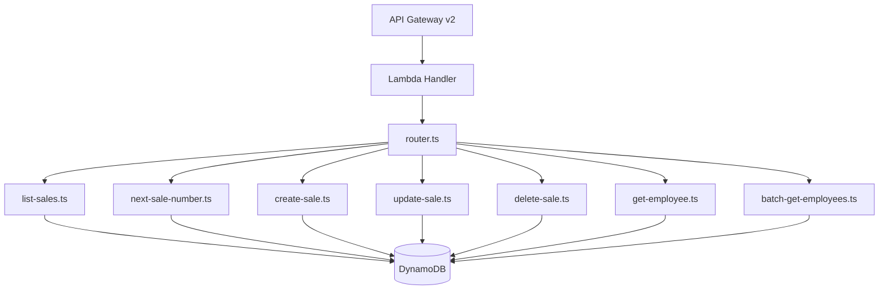

# Design Document: Sales Backend API

## Overview

This feature adds Lambda route handlers for Sales and Employee endpoints to the existing shop-api monolambda. The handlers follow the established patterns in the codebase — same file layout, same DynamoDB client usage, same response utilities, same cursor pagination approach.

Seven new route handlers are added:
- `GET /api/sales` — List sales with cursor pagination (descending by sale number)
- `GET /api/sales/next-number` — Preview next available sale number
- `POST /api/sales` — Create a sale with atomic counter increment
- `PUT /api/sales/{uuid}` — Update mutable sale fields
- `DELETE /api/sales/{uuid}` — Delete a sale and its line items
- `GET /api/employees/{uuid}` — Get a single employee
- `POST /api/employees/batch` — Batch get employees by UUIDs

## Architecture

The architecture mirrors the existing monolambda pattern exactly:



All handlers share:
- `docClient` and `TABLE_NAME` from `dynamodb-client.ts`
- `jsonResponse` / `errorResponse` from `response.ts`
- `encodeCursor` / `decodeCursor` from `cursor-utils.ts`
- New `pk-utils.ts` exports for sale key construction

## Components and Interfaces

### File Structure

```
projects/shop-api/src/
├── routes/
│   ├── list-sales.ts
│   ├── next-sale-number.ts
│   ├── create-sale.ts
│   ├── update-sale.ts
│   ├── delete-sale.ts
│   ├── get-employee.ts
│   └── batch-get-employees.ts
├── sale-validation.ts
├── pk-utils.ts              (add sale helpers)
└── router.ts                (add route registrations)
```

### pk-utils.ts Additions

```typescript
const SALE_PREFIX = "SALE#";
const EMPLOYEE_PREFIX = "EMPLOYEE#";
const PAD_LENGTH = 7;

export function buildSalePk(uuid: string): string {
  return `${SALE_PREFIX}${uuid}`;
}

export function formatSaleGsi1sk(saleNumber: number): string {
  return `${SALE_PREFIX}${String(saleNumber).padStart(PAD_LENGTH, "0")}`;
}

export function buildEmployeePk(uuid: string): string {
  return `${EMPLOYEE_PREFIX}${uuid}`;
}
```

### sale-validation.ts

```typescript
export interface ValidatedSaleInput {
  status: "open" | "finalized" | "voided";
  cashierId: string;
  subtotal?: number;
  total?: number;
  storePortion?: number;
  consignorPortion?: number;
  change?: number;
  memo?: string;
}

export interface SaleValidationError {
  field: string;
  message: string;
}

export type SaleValidationResult =
  | { valid: true; data: ValidatedSaleInput }
  | { valid: false; errors: SaleValidationError[] };

export const ALLOWED_SALE_STATUSES = ["open", "finalized", "voided"] as const;

export function validateSaleInput(body: unknown): SaleValidationResult;
```

Validation rules:
- `status` (required): must be one of `"open"`, `"finalized"`, `"voided"`
- `cashierId` (required): must be a non-empty string
- `subtotal`, `total`, `storePortion`, `consignorPortion`, `change` (optional): must be numbers if provided
- `memo` (optional): must be a string if provided
- Collects all errors (no fail-fast), matching the `item-validation.ts` pattern

### sale-update-validation.ts (partial update)

For the update endpoint, validation is lenient — all fields are optional. Only provided fields are validated:

```typescript
export interface ValidatedSaleUpdate {
  status?: "open" | "finalized" | "voided";
  cashierId?: string;
  subtotal?: number;
  total?: number;
  storePortion?: number;
  consignorPortion?: number;
  change?: number;
  memo?: string;
  finalizedAt?: string;
  voidedAt?: string;
}

export type SaleUpdateValidationResult =
  | { valid: true; data: ValidatedSaleUpdate }
  | { valid: false; errors: SaleValidationError[] };

export function validateSaleUpdate(body: unknown): SaleUpdateValidationResult;
```

### Handler Signatures

Each handler follows the same signature as existing handlers:

```typescript
import type { APIGatewayProxyEventV2, APIGatewayProxyResultV2 } from "aws-lambda";

// list-sales.ts
export async function listSales(event: APIGatewayProxyEventV2): Promise<APIGatewayProxyResultV2>;

// next-sale-number.ts
export function computeNextSaleNumber(currentValue: number): number;
export async function nextSaleNumber(event: APIGatewayProxyEventV2): Promise<APIGatewayProxyResultV2>;

// create-sale.ts
export async function createSale(event: APIGatewayProxyEventV2): Promise<APIGatewayProxyResultV2>;

// update-sale.ts
export async function updateSale(event: APIGatewayProxyEventV2): Promise<APIGatewayProxyResultV2>;

// delete-sale.ts
export async function deleteSale(event: APIGatewayProxyEventV2): Promise<APIGatewayProxyResultV2>;

// get-employee.ts
export async function getEmployee(event: APIGatewayProxyEventV2): Promise<APIGatewayProxyResultV2>;

// batch-get-employees.ts
export async function batchGetEmployees(event: APIGatewayProxyEventV2): Promise<APIGatewayProxyResultV2>;
```

### Router Registration

```typescript
// New imports in router.ts
import { listSales } from "./routes/list-sales.js";
import { nextSaleNumber } from "./routes/next-sale-number.js";
import { createSale } from "./routes/create-sale.js";
import { updateSale } from "./routes/update-sale.js";
import { deleteSale } from "./routes/delete-sale.js";
import { getEmployee } from "./routes/get-employee.js";
import { batchGetEmployees } from "./routes/batch-get-employees.js";

// Added to routes record
"GET /api/sales": listSales,
"GET /api/sales/next-number": nextSaleNumber,
"POST /api/sales": createSale,
"PUT /api/sales/{uuid}": updateSale,
"DELETE /api/sales/{uuid}": deleteSale,
"GET /api/employees/{uuid}": getEmployee,
"POST /api/employees/batch": batchGetEmployees,
```

## Data Models

### DynamoDB Access Patterns

| Operation | Access Pattern | Key/Index | Parameters |
|-----------|---------------|-----------|------------|
| List sales | Query GSI1, descending | GSI1: `GSI1PK = "SALES"`, `ScanIndexForward = false` | Limit, ExclusiveStartKey |
| Get next sale number | GetItem | `PK = "SEQUENCE#SALE"`, `SK = "COUNTER"` | ProjectionExpression: `value` |
| Create sale | TransactWrite (2 items) | Counter: `PK = "SEQUENCE#SALE"`, `SK = "COUNTER"`; Sale: `PK = "SALE#<uuid>"`, `SK = "METADATA"` | ConditionalExpression on both |
| Update sale | GetItem + PutItem | `PK = "SALE#<uuid>"`, `SK = "METADATA"` | ConditionExpression: `attribute_exists(PK)` |
| Delete sale | Query + BatchWrite | Query: `PK = "SALE#<uuid>"`; BatchWrite: delete all returned items | — |
| Get employee | GetItem | `PK = "EMPLOYEE#<uuid>"`, `SK = "METADATA"` | — |
| Batch get employees | BatchGetItem | Keys: `[{PK: "EMPLOYEE#<uuid>", SK: "METADATA"}, ...]` | Max 100 keys |

### Sale Record Schema (DynamoDB)

```typescript
interface SaleDynamoRecord {
  PK: string;           // "SALE#<uuid>"
  SK: string;           // "METADATA"
  GSI1PK: string;       // "SALES"
  GSI1SK: string;       // "SALE#<zero-padded-number>" e.g. "SALE#0000042"
  uuid: string;
  number: number;       // Sequential sale number
  status: "open" | "finalized" | "voided";
  cashierId: string;
  subtotal?: number;
  total?: number;
  storePortion?: number;
  consignorPortion?: number;
  change?: number;
  memo?: string;
  finalizedAt?: string;
  voidedAt?: string;
  sourceId?: string;
  createdAt: string;
  updatedAt?: string;
}
```

### Sale API Response Shape

```typescript
// GET /api/sales response
interface ListSalesResponse {
  sales: SaleResponse[];
  nextCursor: string | null;
  hasMore: boolean;
}

// POST /api/sales response (201), PUT /api/sales/{uuid} response (200)
interface SaleResponse {
  uuid: string;
  number: number;
  status: "open" | "finalized" | "voided";
  cashierId: string;
  subtotal?: number;
  total?: number;
  storePortion?: number;
  consignorPortion?: number;
  change?: number;
  memo?: string;
  finalizedAt?: string;
  voidedAt?: string;
  createdAt: string;
  updatedAt?: string;
}
```

### Employee API Response Shape

```typescript
// GET /api/employees/{uuid} response
interface EmployeeResponse {
  uuid: string;
  name: string;
  sourceId: string;
  createdAt: string;
  updatedAt: string;
}

// POST /api/employees/batch response
interface BatchEmployeesResponse {
  employees: EmployeeResponse[];
}
```

### Transactional Write Pattern (Create Sale)

The create-sale handler uses the same `TransactWriteCommand` pattern as `create-item.ts`:

1. Read current counter value from `SEQUENCE#SALE` / `COUNTER`
2. Compute `nextNumber = currentValue + 1`
3. Execute a transaction with two items:
   - **Counter update**: Conditionally increment the counter (or initialize if absent)
   - **Sale put**: Conditionally put the sale record (fails if PK already exists — UUID collision)
4. On `TransactionCanceledException`:
   - If counter condition failed (index 0): concurrent write, retry
   - If sale put condition failed (index 1): UUID collision, retry with new UUID
5. Max 3 retries before returning 500

### Delete Sale Pattern (Multi-Item)

Unlike items (single METADATA record), sales can have line items. The delete handler must:

1. Verify the sale exists with a GetItem on `PK = "SALE#<uuid>"`, `SK = "METADATA"`
2. Query ALL records under `PK = "SALE#<uuid>"` (returns METADATA + LINE_ITEM# records)
3. BatchWrite delete all returned items
4. Return 204

## Correctness Properties

*A property is a characteristic or behavior that should hold true across all valid executions of a system — essentially, a formal statement about what the system should do. Properties serve as the bridge between human-readable specifications and machine-verifiable correctness guarantees.*

### Property 1: Sale validation completeness

*For any* input object, `validateSaleInput` accepts it if and only if: `status` is one of {"open", "finalized", "voided"} AND `cashierId` is a non-empty string AND all optional numeric fields (if present) are numbers AND `memo` (if present) is a string. Furthermore, when validation fails, the returned `fields` array contains exactly the fields that violate constraints — no false positives and no false negatives.

**Validates: Requirements 3.6, 3.7, 3.9, 4.4**

### Property 2: Page size validation

*For any* value provided as a `pageSize` query parameter, the list-sales handler accepts it if and only if the parsed numeric value is a member of the set {20, 50, 100}. All other values (non-numeric strings, numbers not in the set, negative numbers) result in HTTP 400.

**Validates: Requirements 1.2, 1.4**

### Property 3: Sale key construction round-trip

*For any* valid UUID string `u` and any positive integer `n`, `buildSalePk(u)` produces `"SALE#" + u`, and `formatSaleGsi1sk(n)` produces `"SALE#"` followed by a 7-character zero-padded representation of `n`. Additionally, the GSI1SK sort key preserves numeric ordering: for any two positive integers `a < b`, `formatSaleGsi1sk(a) < formatSaleGsi1sk(b)` under lexicographic comparison.

**Validates: Requirements 3.4**

### Property 4: Next sale number monotonicity

*For any* non-negative integer `n`, `computeNextSaleNumber(n)` returns `n + 1`, ensuring the sequence is strictly monotonically increasing.

**Validates: Requirements 2.2**

### Property 5: Update merge preserves identity

*For any* existing sale record and any valid update payload, applying the update produces a record where: `uuid`, `number`, and `createdAt` are unchanged from the original; only the mutable fields (`status`, `cashierId`, `subtotal`, `total`, `storePortion`, `consignorPortion`, `change`, `memo`, `finalizedAt`, `voidedAt`) take on new values; and `updatedAt` is set to a new timestamp.

**Validates: Requirements 4.2**

### Property 6: Employee response mapping

*For any* DynamoDB employee record containing arbitrary additional attributes (PK, SK, GSI keys, etc.), the response mapper extracts exactly `uuid`, `name`, `sourceId`, `createdAt`, and `updatedAt` — no DynamoDB key attributes leak into the API response.

**Validates: Requirements 6.2, 7.2**

### Property 7: Batch request validation

*For any* input to the batch-get-employees endpoint, validation passes if and only if: the input is a JSON object with a `uuids` field that is an array of strings with length between 0 and 100 (inclusive). Arrays exceeding 100 items are rejected with `"too_many_uuids"`, and non-array or missing `uuids` fields are rejected with `"validation_error"`.

**Validates: Requirements 7.5, 7.7**

## Error Handling

All handlers follow the established error handling patterns in the codebase:

| Scenario | Status | Body |
|----------|--------|------|
| Invalid JSON body | 400 | `{ "error": "invalid_json" }` |
| Validation failure | 400 | `{ "error": "validation_error", "fields": [...] }` |
| Invalid pageSize | 400 | `{ "error": "pageSize must be one of 20, 50, 100" }` |
| Invalid cursor | 400 | `{ "error": "Invalid cursor" }` |
| Missing UUID path param | 400 | `{ "error": "missing_uuid" }` |
| Too many UUIDs in batch | 400 | `{ "error": "too_many_uuids" }` |
| Record not found | 404 | `{ "error": "not_found" }` |
| Unhandled DynamoDB error | 500 | `{ "error": "internal_error" }` |

Error handling principles:
- Never expose DynamoDB error details to the client
- Log errors with `console.error` including error name and message (matching `listAccounts` pattern)
- Use `errorResponse()` helper for all 500 responses
- Validation collects ALL errors before responding (no fail-fast)

## Testing Strategy

### Unit Tests (example-based)

Unit tests cover specific scenarios, edge cases, and integration points:

- **Default page size**: Verify 20 is used when no pageSize param is provided
- **Missing UUID**: Verify 400 response for each handler that requires a UUID path param
- **Empty batch array**: Verify empty `employees` array is returned
- **Invalid JSON**: Verify `invalid_json` error for malformed bodies
- **Counter absent**: Verify `nextNumber` returns 1 when counter doesn't exist
- **Delete with line items**: Verify all records under the PK are deleted

### Property-Based Tests (universal properties)

Property-based testing using `fast-check` (already available in the project ecosystem via vitest). Each property test runs a minimum of 100 iterations.

| Property | Module Under Test | Tag |
|----------|-------------------|-----|
| Property 1: Sale validation completeness | `sale-validation.ts` | Feature: sales-backend-api, Property 1: Sale validation completeness |
| Property 2: Page size validation | `list-sales.ts` | Feature: sales-backend-api, Property 2: Page size validation |
| Property 3: Sale key construction | `pk-utils.ts` | Feature: sales-backend-api, Property 3: Sale key construction round-trip |
| Property 4: Next sale number monotonicity | `next-sale-number.ts` | Feature: sales-backend-api, Property 4: Next sale number monotonicity |
| Property 5: Update merge preserves identity | `update-sale.ts` | Feature: sales-backend-api, Property 5: Update merge preserves identity |
| Property 6: Employee response mapping | `get-employee.ts` | Feature: sales-backend-api, Property 6: Employee response mapping |
| Property 7: Batch request validation | `batch-get-employees.ts` | Feature: sales-backend-api, Property 7: Batch request validation |

### Integration Tests

Integration tests use mocked DynamoDB (via `aws-sdk-client-mock`) to verify the wiring between handlers and DynamoDB:

- List sales: correct GSI1 query with descending order, pagination cursor encoding
- Create sale: TransactWriteCommand structure, retry on collision
- Update sale: GetItem + PutItem with condition expression
- Delete sale: Query all SK records + BatchWriteItem
- Get employee: correct key construction
- Batch get employees: BatchGetItem with correct keys, omission of missing records
