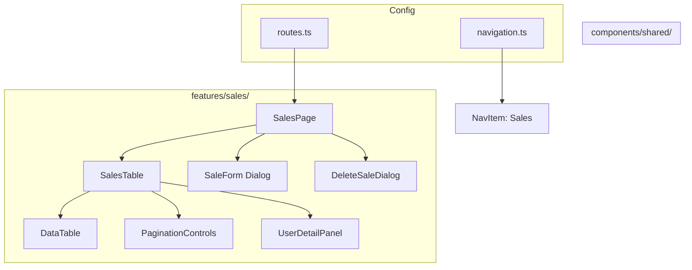
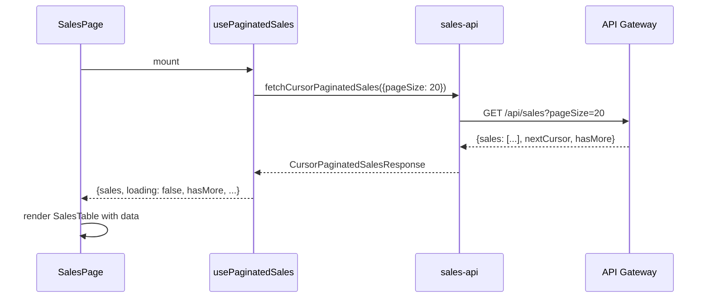
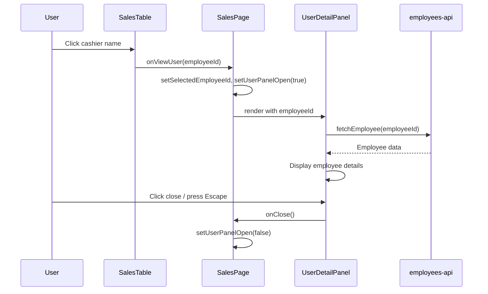

# Design Document: Sales Table Views & User Detail Panel

## Overview

This feature adds the Sales entity table view to the shop application, introduces a shared User Detail Panel (slide-over Sheet) for displaying linked user information, and refactors the existing Accounts/Items features for consistency by extracting the shared `PageSize` type. The design follows the established patterns from the Accounts and Items features to ensure a predictable, maintainable codebase.

Reference: #[[file:../../docs/data-model.md]]

### Key Design Decisions

1. **Slide-over Sheet for user details** — A shadcn/ui Sheet component (Radix Dialog with `side="right"`) is used rather than a modal dialog or tooltip. This keeps the table visible for context, allows quick dismiss, and follows the established admin-panel pattern for "detail preview" interactions.
2. **Shared PageSize type** — Extracted to `@/lib/pagination-types.ts` to eliminate triple-definition across features and pagination controls.
3. **Employee resolution via batch lookup** — When the table loads, employee UUIDs referenced in the data are resolved in a single batch request rather than per-row, avoiding N+1 API calls.
4. **Consistent file naming** — Every feature module follows the same file structure pattern for predictability.
5. **CHF cents to display** — Sales store monetary values in cents (integer). Display formatting divides by 100 and shows two decimal places.

## Architecture

### Feature File Structure

```
src/
├── lib/
│   └── pagination-types.ts              # Shared PageSize, CursorPaginationParams
├── components/
│   └── shared/
│       ├── data-table.tsx               # Existing shared table component
│       ├── pagination-controls.tsx       # Updated to import from shared types
│       └── user-detail-panel.tsx         # NEW: Shared slide-over Sheet for user details
├── features/
│   ├── accounts/                        # Updated: import PageSize from shared
│   ├── inventory/                       # Updated: add createdBy column, import shared PageSize
│   └── sales/                           # NEW
│       ├── sales-types.ts
│       ├── sales-api.ts
│       ├── sales-utils.ts
│       ├── sales-validation.ts
│       ├── sales-columns.tsx
│       ├── sales-table.tsx
│       ├── sales-page.tsx
│       ├── sale-form.tsx
│       ├── delete-sale-dialog.tsx
│       └── use-paginated-sales.ts
```

### Component Hierarchy



## Components and Interfaces

### Shared: User Detail Panel

**File:** `src/components/shared/user-detail-panel.tsx`

A reusable slide-over Sheet that displays details about a linked user (Employee). Uses the shadcn/ui Sheet component (to be added via `npx shadcn@latest add sheet`).

```typescript
export interface UserDetailPanelProps {
  open: boolean;
  onClose: () => void;
  employeeId: string | null;
}

export function UserDetailPanel(props: UserDetailPanelProps): React.ReactNode
```

Internal behavior:
- When `open` is true and `employeeId` is provided, fetches employee data from API
- Shows loading spinner while fetching
- Displays employee name, sourceId, createdAt, updatedAt
- Provides close button and Escape key dismissal
- Traps focus within panel while open
- Returns focus to trigger element on close

### Shared: Pagination Types

**File:** `src/lib/pagination-types.ts`

```typescript
export type PageSize = 20 | 50 | 100;

export interface CursorPaginationParams {
  pageSize: PageSize;
  cursor?: string;
}
```

### Sales Types

**File:** `src/features/sales/sales-types.ts`

```typescript
export interface Sale {
  uuid: string;
  number: number;
  status: "open" | "finalized" | "voided";
  cashierId: string;
  cashierName?: string;  // Resolved from Employee lookup
  subtotal: number;      // CHF cents
  total: number;         // CHF cents
  storePortion: number;  // CHF cents
  consignorPortion: number; // CHF cents
  change: number;        // CHF cents
  memo?: string;
  finalizedAt?: string;
  voidedAt?: string;
  sourceId?: string;
  createdAt: string;
}

export interface SaleLineItem {
  saleId: string;
  itemId: string;
  salePrice: number;     // CHF cents
  discount: number;      // CHF cents
  consignorPortion: number;
  storePortion: number;
}

export interface CreateSaleRequest {
  cashierId: string;
  memo?: string;
  lineItems: Array<{
    itemId: string;
    salePrice: number;
    discount?: number;
  }>;
}

export interface UpdateSaleRequest {
  cashierId?: string;
  memo?: string;
  status?: "finalized" | "voided";
}

export type CreateSaleResult =
  | { success: true; sale: Sale }
  | { success: false; error: "validation" | "network" | "server" | "timeout"; fields?: Array<{ field: string; message: string }> };

export type UpdateSaleResult =
  | { success: true; sale: Sale }
  | { success: false; error: "not_found" | "validation" | "invalid_transition" | "network" | "server" | "timeout" };

export type DeleteSaleResult =
  | { success: true }
  | { success: false; error: "not_found" | "network" | "server" | "timeout" };

export interface CursorPaginatedSalesResponse {
  sales: Sale[];
  nextCursor: string | null;
  hasMore: boolean;
}

export interface CachedPage {
  sales: Sale[];
  nextCursor: string | null;
}

export interface UsePaginatedSalesResult {
  sales: Sale[];
  loading: boolean;
  error: string | null;
  hasMore: boolean;
  hasPrevious: boolean;
  pageSize: PageSize;
  goNext: () => void;
  goPrevious: () => void;
  setPageSize: (size: PageSize) => void;
  retry: () => void;
}
```

### Sales API

**File:** `src/features/sales/sales-api.ts`

```typescript
export function fetchCursorPaginatedSales(params: CursorPaginationParams, signal?: AbortSignal): Promise<CursorPaginatedSalesResponse>
export function createSale(data: CreateSaleRequest): Promise<CreateSaleResult>
export function updateSale(uuid: string, data: UpdateSaleRequest): Promise<UpdateSaleResult>
export function deleteSale(uuid: string): Promise<DeleteSaleResult>
export function fetchNextSaleNumber(): Promise<{ nextNumber: number }>
```

### Sales Columns

**File:** `src/features/sales/sales-columns.tsx`

| Column | Accessor | Display |
|--------|----------|---------|
| Sale # | `number` | Plain integer |
| Status | `status` | Badge/chip with color coding |
| Cashier | `cashierName` | Clickable username link |
| Total | `total` | CHF formatted (cents → display) |
| Finalized At | `finalizedAt` | Formatted date or "—" |
| Actions | — | Edit (Pencil) + Delete (Trash2) icons |

The Cashier column uses a custom cell renderer that renders a button styled as a link. Clicking it calls `meta.onViewUser(sale.cashierId)` which the page component handles by opening the UserDetailPanel.

### Sales Table

**File:** `src/features/sales/sales-table.tsx`

Follows the identical pattern as `AccountsTable` and `ItemsTable`:

```typescript
export interface SalesTableProps {
  data: Sale[];
  loading: boolean;
  error: string | null;
  onRetry?: () => void;
  onEdit?: (sale: Sale) => void;
  onDelete?: (sale: Sale) => void;
  onViewUser?: (employeeId: string) => void;
  hasPrevious: boolean;
  hasMore: boolean;
  pageSize: PageSize;
  onNext: () => void;
  onPrevious: () => void;
  onPageSizeChange: (pageSize: PageSize) => void;
}

export function SalesTable(props: SalesTableProps): React.ReactNode
```

### Sales Page

**File:** `src/features/sales/sales-page.tsx`

Orchestrates the table, form, delete dialog, and user detail panel:

```typescript
export function SalesPage(): React.ReactNode
```

State management:
- `formOpen` / `formMode` / `editSale` — form dialog state
- `deleteDialogOpen` / `deleteSale` — delete dialog state
- `userPanelOpen` / `selectedEmployeeId` — user detail panel state
- Pagination via `usePaginatedSales()` hook

### Sale Form

**File:** `src/features/sales/sale-form.tsx`

```typescript
export interface SaleFormProps {
  open: boolean;
  onClose: () => void;
  onSuccess: () => void;
  mode: "create" | "edit";
  sale?: Sale;
}

export function SaleForm(props: SaleFormProps): React.ReactNode
```

Fields:
- Cashier: Employee searchable dropdown (same pattern as Account selection in item-form)
- Memo: Optional textarea
- Status: Select (only for edit mode, restricted transitions: open→finalized, open→voided)
- Line Items: Dynamic list of item selections with sale price (for create mode)

### Delete Sale Dialog

**File:** `src/features/sales/delete-sale-dialog.tsx`

```typescript
export interface DeleteSaleDialogProps {
  open: boolean;
  sale: Sale | null;
  onClose: () => void;
  onSuccess: () => void;
}

export function DeleteSaleDialog(props: DeleteSaleDialogProps): React.ReactNode
```

### Employee API (for User Detail Panel)

**File:** `src/features/employees/employees-api.ts`

```typescript
export interface Employee {
  uuid: string;
  name: string;
  sourceId: string;
  createdAt: string;
  updatedAt: string;
}

export function fetchEmployee(uuid: string, signal?: AbortSignal): Promise<Employee>
export function fetchEmployeesByIds(uuids: string[]): Promise<Employee[]>
```

### Items Feature Updates

**Updates to:** `src/features/inventory/items-types.ts`
- Add `createdBy?: string` field to `Item` interface
- Add `categoryId?: string` field to `Item` interface

**Updates to:** `src/features/inventory/items-columns.tsx`
- Add "Created By" column with clickable employee name cell
- Column uses `meta.onViewUser(item.createdBy)` callback

**Updates to:** `src/features/inventory/items-table.tsx`
- Add `onViewUser?: (employeeId: string) => void` to props
- Pass through to table meta

**Updates to:** `src/features/inventory/items-page.tsx`
- Add UserDetailPanel state management
- Pass `onViewUser` handler to table

## Data Flow

### Sales Table Load



### User Detail Panel Interaction



## Error Handling

| Scenario | Handling | User Feedback |
|----------|----------|---------------|
| Sales fetch fails (network) | Hook sets error state | Table shows error with retry button |
| Sales fetch timeout (30s) | AbortController cancels | "Request timed out. Please try again." |
| Sale creation fails (validation) | Form shows field errors | Per-field error messages with aria-invalid |
| Sale creation fails (network) | Form shows general error | "Connection failed. Check your internet connection." |
| Sale deletion fails (not_found) | Dialog shows error | "Sale not found. It may have been deleted." |
| Employee lookup fails | Panel shows error | "Unable to load employee details." |
| Employee name unresolved in table | Cell shows fallback | "Unknown" text (not clickable) |
| Invalid status transition | API returns error | "Cannot change sale status from {current} to {target}." |

## Styling

### Status Badge Colors

Using Tailwind utility classes consistent with the design system:

| Status | Background | Text |
|--------|-----------|------|
| open | `bg-muted text-muted-foreground` | Neutral |
| finalized | `bg-green-100 text-green-800 dark:bg-green-900/30 dark:text-green-400` | Success |
| voided | `bg-destructive/10 text-destructive` | Destructive |

### User Detail Panel

- Width: `sm:max-w-md` (448px max)
- Position: Right side (`side="right"`)
- Overlay: Semi-transparent backdrop
- Content: Structured with label/value pairs in a definition list

### Clickable Username Link

- Styled as an inline button with link appearance
- `text-primary underline-offset-4 hover:underline` 
- Focus ring for keyboard navigation
- `cursor-pointer` to indicate interactivity
