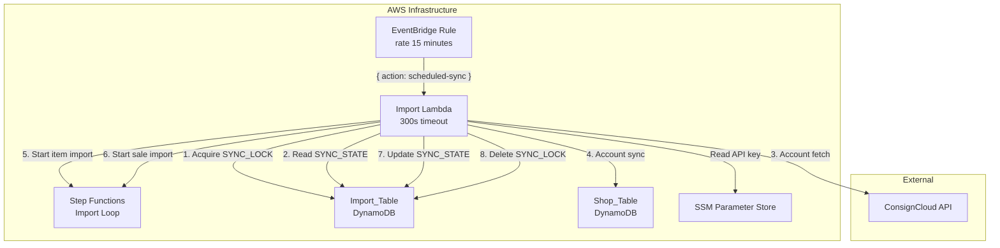
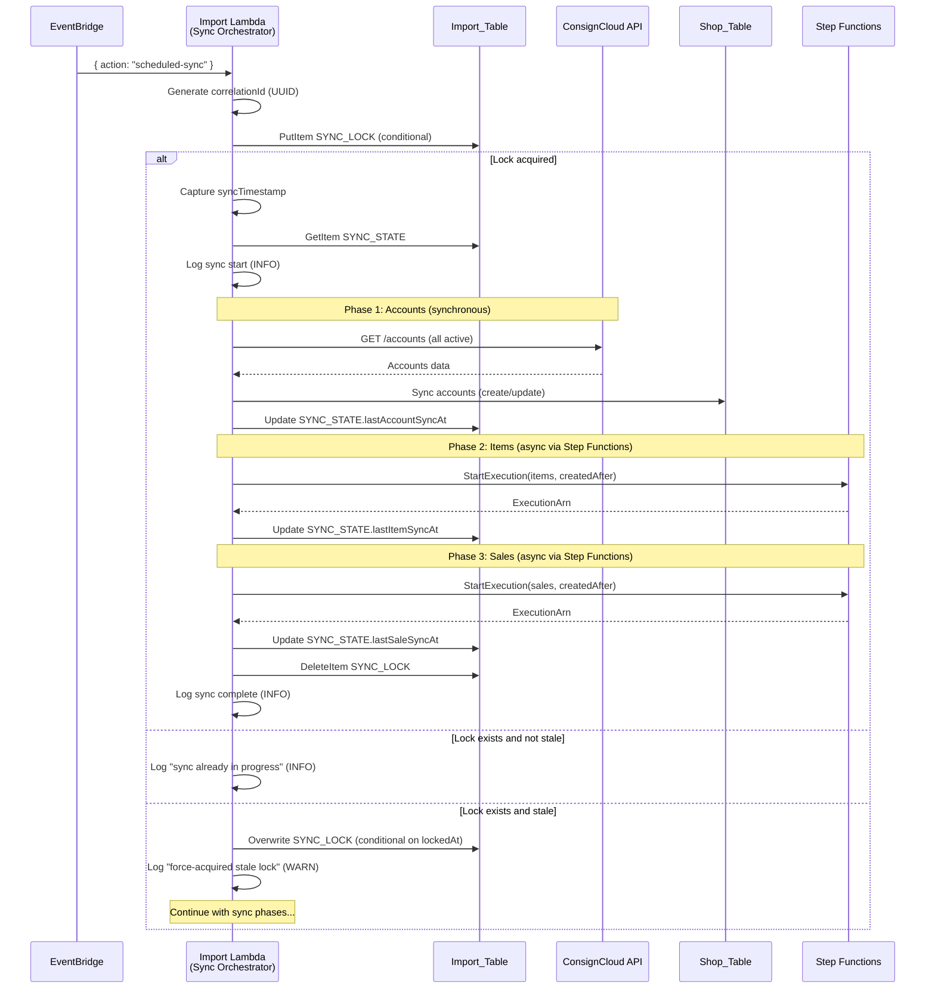
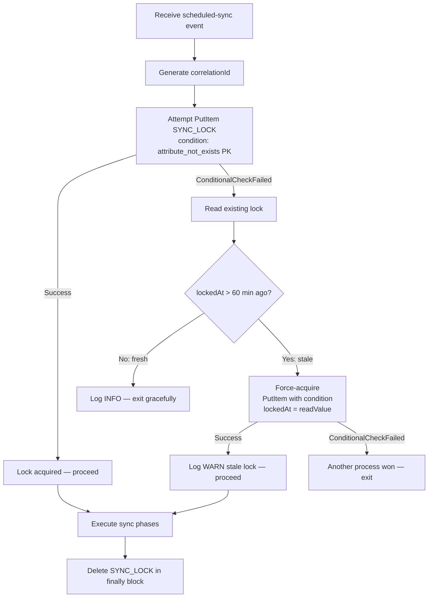

# Design Document: Scheduled ConsignCloud Sync

## Overview

This feature adds an automated scheduled sync that runs every 15 minutes via Amazon EventBridge, triggering the existing Import Lambda to orchestrate a full import cycle: accounts → items → sales. The Sync Orchestrator is a new handler route within the existing Import Lambda that coordinates the sequential execution of all three import types, manages concurrency via a distributed lock, and tracks incremental sync timestamps for efficient fetching.

### Key Design Decisions

1. **New route in existing Lambda (not a separate function)**: The Import Lambda already has the IAM permissions, environment variables, and code for all import operations. Adding a `scheduled-sync` action handler keeps deployment simple and avoids duplicating infrastructure.

2. **EventBridge fixed-rate rule (not cron)**: A `rate(15 minutes)` expression provides consistent intervals without timezone concerns. No retry policy on the target — the next scheduled invocation handles recovery naturally.

3. **DynamoDB-based distributed lock**: Using a conditional write on a `SYNC_LOCK` record prevents concurrent sync runs. A 60-minute TTL with stale lock detection ensures recovery if a sync crashes without releasing the lock.

4. **Accounts synchronous, items/sales asynchronous**: Account import (fetch + sync) runs inline within the Lambda invocation since it completes quickly. Item and sale imports are kicked off as Step Functions executions because they may take longer than the Lambda timeout.

5. **Independent timestamp tracking per phase**: Each import type (`lastAccountSyncAt`, `lastItemSyncAt`, `lastSaleSyncAt`) is updated independently. A failure in one phase doesn't prevent timestamps from being updated for phases that succeed.

6. **Sync timestamp captured before work begins**: The timestamp used for `createdAfter` filtering and for updating state is captured immediately after lock acquisition, before any import phase starts. This prevents gaps where records created during the sync window could be missed.

## Architecture



### Sync Orchestration Flow



### Concurrency Control Flow



## Components and Interfaces

### New File: `sync-orchestrator.ts`

**File:** `projects/shop-api/src/import/sync-orchestrator.ts`

The main orchestration handler for scheduled sync events.

```typescript
export interface SyncRunResult {
  correlationId: string;
  elapsedMs: number;
  phases: {
    accounts: PhaseOutcome;
    items: PhaseOutcome;
    sales: PhaseOutcome;
  };
  itemExecutionArn?: string;
  saleExecutionArn?: string;
}

export type PhaseOutcome =
  | { status: "success"; detail?: string }
  | { status: "skipped"; reason: string }
  | { status: "error"; reason: string };

export async function handleScheduledSync(): Promise<SyncRunResult>;
```

### New File: `sync-lock-manager.ts`

**File:** `projects/shop-api/src/import/sync-lock-manager.ts`

Manages the distributed lock in the Import_Table.

```typescript
export interface SyncLock {
  lockedAt: string;       // ISO 8601 UTC
  correlationId: string;  // UUID of current sync run
  ttl: number;            // Unix epoch seconds (60 min after lockedAt)
}

export type LockAcquisitionResult =
  | { acquired: true }
  | { acquired: false; existingLock: SyncLock; stale: boolean };

export async function acquireLock(correlationId: string): Promise<LockAcquisitionResult>;
export async function forceAcquireStaleLock(
  correlationId: string,
  expectedLockedAt: string,
): Promise<boolean>;
export async function releaseLock(): Promise<void>;
```

### New File: `sync-state-manager.ts`

**File:** `projects/shop-api/src/import/sync-state-manager.ts`

Manages the incremental sync state record.

```typescript
export interface SyncState {
  lastAccountSyncAt: string | null;
  lastItemSyncAt: string | null;
  lastSaleSyncAt: string | null;
  updatedAt: string;
}

export async function getSyncState(): Promise<SyncState | null>;
export async function updateSyncStateField(
  field: "lastAccountSyncAt" | "lastItemSyncAt" | "lastSaleSyncAt",
  value: string,
): Promise<void>;
```

### Modified File: `import-handler.ts`

**Change:** Add detection of EventBridge `scheduled-sync` action in the event dispatch logic, before API Gateway path routing.

```typescript
// At the top of the handler, after resume-internal check:
if (rawEvent.action === "scheduled-sync") {
  const result = await handleScheduledSync();
  return {
    statusCode: 200,
    headers: { "Content-Type": "application/json" },
    body: JSON.stringify(result),
  };
}
```

### Modified File: `step-function-starter.ts`

**Change:** Add a `createdAfter` parameter to the `startStepFunction` function signature so the sync orchestrator can pass incremental timestamps.

```typescript
export interface StartStepFunctionOptions {
  jobId: string;
  phase: ImportPhase;
  type: ImportJobType;
  createdAfter?: string;
}

export async function startStepFunctionForSync(
  options: StartStepFunctionOptions,
): Promise<string>;  // returns execution ARN
```

### Reused Components

| Component | How Used by Sync Orchestrator |
|-----------|------------------------------|
| `fetch-from-consigncloud.ts` | Account fetch logic (internal function call, not HTTP route) |
| `sync-to-shop-table.ts` | Account sync logic (internal function call, not HTTP route) |
| `step-function-starter.ts` | Extended to start item/sale Step Functions with `createdAfter` |
| `rate-limiter.ts` | Used by account fetch during sync |
| `ssm-client.ts` | Get API key for account fetch |
| `import-table-client.ts` | DynamoDB operations on Import_Table |

### Internal Account Import Refactoring

The existing `fetchFromConsignCloud` and `syncToShopTable` functions return HTTP responses. For the sync orchestrator to call them internally, we need thin internal variants:

```typescript
// In fetch-from-consigncloud.ts — new export
export async function fetchAccountsInternal(): Promise<{
  success: boolean;
  report?: { added: number; updated: number; skipped: number; errored: number };
  error?: string;
}>;

// In sync-to-shop-table.ts — new export
export async function syncAccountsInternal(): Promise<{
  success: boolean;
  report?: { added: number; updated: number; skipped: number; errored: number };
  error?: string;
}>;
```

These functions contain the same logic but return structured results instead of API Gateway response objects, allowing the sync orchestrator to call them directly without constructing fake HTTP events.

## Data Models

### Sync Lock Record (Import_Table)

| Attribute | Type | Description |
|-----------|------|-------------|
| PK | String | `SYNC_LOCK` |
| SK | String | `METADATA` |
| lockedAt | String | ISO 8601 UTC timestamp when the lock was acquired |
| correlationId | String | UUID identifying the current sync run |
| ttl | Number | Unix epoch timestamp, 60 minutes after `lockedAt` (DynamoDB TTL) |

**Key:** `PK = "SYNC_LOCK"`, `SK = "METADATA"`

The `ttl` attribute enables DynamoDB's built-in TTL mechanism as a safety net. Even if stale lock detection fails, the record will eventually be garbage collected.

### Sync State Record (Import_Table)

| Attribute | Type | Description |
|-----------|------|-------------|
| PK | String | `SYNC_STATE` |
| SK | String | `METADATA` |
| lastAccountSyncAt | String (nullable) | ISO 8601 UTC of last successful account sync |
| lastItemSyncAt | String (nullable) | ISO 8601 UTC of last successful item Step Function start |
| lastSaleSyncAt | String (nullable) | ISO 8601 UTC of last successful sale Step Function start |
| updatedAt | String | ISO 8601 UTC of last modification |

**Key:** `PK = "SYNC_STATE"`, `SK = "METADATA"`

### EventBridge Event Payload

The EventBridge target passes a fixed JSON input to the Lambda:

```json
{
  "action": "scheduled-sync"
}
```

This is detected by the handler's event dispatch logic (before path-based routing) since EventBridge invokes the Lambda directly, not through API Gateway.

### Step Functions Start Payload (for sync-initiated jobs)

When the sync orchestrator starts item/sale imports via Step Functions:

```json
{
  "action": "resume-internal",
  "jobId": "<generated-uuid>",
  "phase": "fetch",
  "type": "items",
  "createdAfter": "2025-01-15T10:30:00.000Z"
}
```

The `createdAfter` field is optional — omitted on first-ever sync (full import).

### Infrastructure Additions (Terraform)

All new resources are added to `infrastructure/modules/import/main.tf`:

```hcl
# -----------------------------------------------------------------------------
# EventBridge Scheduled Sync
# -----------------------------------------------------------------------------

resource "aws_cloudwatch_event_rule" "scheduled_sync" {
  name                = "${var.project_name}-${var.environment}-scheduled-sync"
  description         = "Triggers ConsignCloud import every 15 minutes"
  schedule_expression = "rate(15 minutes)"
  state               = "ENABLED"

  tags = {
    Environment = var.environment
    Project     = var.project_name
  }
}

resource "aws_cloudwatch_event_target" "scheduled_sync" {
  rule      = aws_cloudwatch_event_rule.scheduled_sync.name
  target_id = "${var.project_name}-${var.environment}-sync-target"
  arn       = aws_lambda_function.import.arn

  input = jsonencode({
    action = "scheduled-sync"
  })

  retry_policy {
    maximum_retry_attempts = 0
  }
}

resource "aws_lambda_permission" "eventbridge_invoke" {
  statement_id  = "AllowEventBridgeInvoke"
  action        = "lambda:InvokeFunction"
  function_name = aws_lambda_function.import.function_name
  principal     = "events.amazonaws.com"
  source_arn    = aws_cloudwatch_event_rule.scheduled_sync.arn
}
```

#### DynamoDB TTL Configuration

The Import_Table needs TTL enabled for the `ttl` attribute (used by the Sync_Lock record):

```hcl
resource "aws_dynamodb_table" "import" {
  # ... existing configuration ...

  ttl {
    attribute_name = "ttl"
    enabled        = true
  }
}
```

No new IAM policies are needed — the existing Lambda role already has full read/write access to the Import_Table, read/write to the Shop_Table, SSM read, CloudWatch Logs, and Step Functions StartExecution permissions.

## Correctness Properties

*A property is a characteristic or behavior that should hold true across all valid executions of a system — essentially, a formal statement about what the system should do. Properties serve as the bridge between human-readable specifications and machine-verifiable correctness guarantees.*

### Property 1: Lock acquisition prevents concurrent execution

*For any* two concurrent sync orchestrator invocations with distinct correlation IDs, at most one SHALL successfully acquire the lock. The other SHALL either skip execution (if the lock is fresh) or compete for force-acquisition (if the lock is stale), but never shall both proceed to execute import phases simultaneously.

**Validates: Requirements 3.1, 3.5**

### Property 2: Stale lock detection uses correct threshold

*For any* existing lock record with a `lockedAt` timestamp, the lock SHALL be classified as stale if and only if the difference between the current time and `lockedAt` exceeds 60 minutes. A lock exactly 60 minutes old or younger SHALL be classified as fresh.

**Validates: Requirements 3.3, 3.4**

### Property 3: Sync state timestamps are only updated on phase success

*For any* sync run where the account phase outcome is "error", the `lastAccountSyncAt` field in the Sync_State record SHALL remain unchanged from its value before the sync run. The same applies independently to `lastItemSyncAt` when item Step Function start fails, and `lastSaleSyncAt` when sale Step Function start fails.

**Validates: Requirements 2.6, 2.7, 2.8, 4.2, 4.3, 4.4**

### Property 4: Sync timestamp is captured before phase execution

*For any* sync run, the timestamp written to `lastAccountSyncAt`, `lastItemSyncAt`, or `lastSaleSyncAt` upon phase success SHALL be the timestamp captured immediately after lock acquisition and before any import phase begins — not the timestamp at phase completion.

**Validates: Requirements 4.2, 4.3, 4.4**

### Property 5: Sequential phase ordering is maintained

*For any* sync run, the account import phase SHALL complete (success or failure) before the item import Step Function is started, and the item import Step Function start SHALL be attempted before the sale import Step Function start is attempted.

**Validates: Requirements 2.1**

### Property 6: Account failure skips subsequent phases

*For any* sync run where the account import phase fails with a non-recoverable error, the item and sale import phases SHALL not be started, no Sync_State timestamp fields SHALL be updated, and the lock SHALL be released.

**Validates: Requirements 2.7, 8.1**

### Property 7: Lock is always released in finally block

*For any* sync run — whether it completes successfully, encounters a phase error, or throws an unhandled exception — the Sync_Lock record SHALL be deleted (or deletion attempted) before the Lambda invocation returns.

**Validates: Requirements 3.6, 3.7, 8.4**

### Property 8: Correlation ID is present in all log entries

*For any* sync run with a generated correlation ID, every structured log entry emitted during that invocation (including skip messages, phase outcomes, and error logs) SHALL include the correlation ID field.

**Validates: Requirements 9.5**

### Property 9: Step Function retry follows defined policy

*For any* Step Functions StartExecution call that fails with a retryable error (service unavailable or throttling), the sync orchestrator SHALL retry exactly once after a 2-second delay. If the retry also fails, the phase SHALL be marked as error without further retries.

**Validates: Requirements 6.4**

### Property 10: First sync omits createdAfter parameter

*For any* sync run where no Sync_State record exists (or the relevant timestamp field is null), the Step Functions execution payload SHALL not include a `createdAfter` parameter, resulting in a full import of all available data.

**Validates: Requirements 2.5**

## Error Handling

### Phase Error Matrix

| Phase | Error Type | Behavior | State Update |
|-------|-----------|----------|--------------|
| Lock acquisition | ConditionalCheckFailed (fresh lock) | Log INFO, exit gracefully | None |
| Lock acquisition | ConditionalCheckFailed (stale, force-acquire race lost) | Log INFO, exit gracefully | None |
| Accounts | Auth failure / API unreachable / SSM failure | Log ERROR, skip items + sales | No timestamps updated |
| Accounts | Individual record write failures | Phase considered success | `lastAccountSyncAt` updated |
| Items | StartExecution retryable error (after 1 retry) | Log ERROR, continue to sales | `lastItemSyncAt` NOT updated |
| Items | StartExecution non-retryable error | Log ERROR immediately, continue to sales | `lastItemSyncAt` NOT updated |
| Sales | StartExecution retryable error (after 1 retry) | Log ERROR, complete sync | `lastSaleSyncAt` NOT updated |
| Sales | StartExecution non-retryable error | Log ERROR immediately, complete sync | `lastSaleSyncAt` NOT updated |
| Sync_State | DynamoDB update fails | Retry 2x, then log ERROR and continue | Field not updated (next run re-fetches) |
| Any | Unhandled exception | Release lock in finally, log ERROR, return response | Partial state may be updated |

### Retry Strategy

| Operation | Max Retries | Delay | Notes |
|-----------|-------------|-------|-------|
| Step Functions StartExecution (retryable) | 1 | 2 seconds | Only for throttling/service unavailable |
| Step Functions StartExecution (non-retryable) | 0 | — | Access denied, invalid ARN, validation error |
| Sync_State DynamoDB update | 2 | 500ms fixed | Per requirement 4.7 |
| Lock release (in finally) | 0 | — | Best-effort; stale lock timeout recovers |

### Error Classification

```typescript
function isRetryableStepFunctionError(error: unknown): boolean {
  // ServiceUnavailableException, ThrottlingException, TooManyRequestsException
}

function isNonRecoverableAccountError(error: unknown): boolean {
  // Auth failure (401/403), SSM GetParameter failure,
  // ConsignCloud API unreachable after 3 retries
}
```

### Lock Recovery Scenarios

| Scenario | Recovery Mechanism |
|----------|-------------------|
| Lambda crashes mid-sync | Stale lock detection (60 min threshold) by next invocation |
| Lambda times out (300s) | Stale lock detection by next invocation |
| Lock delete fails in finally | DynamoDB TTL garbage collection (60 min) + stale detection |
| Two sync runs compete for stale lock | Optimistic locking (conditional write on `lockedAt`) — one wins, one exits |

## Testing Strategy

### Property-Based Tests (fast-check)

The project uses `fast-check` (v4.8.0) for property-based testing. Each property test runs a minimum of 100 iterations.

| Property | Test File | Generator Strategy |
|----------|-----------|-------------------|
| 1: Lock prevents concurrency | `sync-lock-manager.property.test.ts` | Generate pairs of concurrent lock attempts with random correlation IDs |
| 2: Stale lock threshold | `sync-lock-manager.property.test.ts` | Generate random timestamps (0–120 min age), verify classification |
| 3: Timestamps only on success | `sync-orchestrator.property.test.ts` | Generate random phase outcome combinations, verify state updates |
| 4: Timestamp captured before execution | `sync-orchestrator.property.test.ts` | Generate sync runs with varying durations, verify timestamp value |
| 5: Sequential ordering | `sync-orchestrator.property.test.ts` | Generate random phase outcomes, verify execution order invariant |
| 6: Account failure skips phases | `sync-orchestrator.property.test.ts` | Generate account failures, verify no Step Function calls made |
| 7: Lock always released | `sync-orchestrator.property.test.ts` | Generate random error injection points, verify lock deletion |
| 8: Correlation ID in logs | `sync-orchestrator.property.test.ts` | Generate random scenarios, capture log output, verify ID presence |
| 9: Step Function retry policy | `sync-orchestrator.property.test.ts` | Generate retryable/non-retryable errors, verify retry count and delay |
| 10: First sync omits createdAfter | `sync-state-manager.property.test.ts` | Generate null/non-null state combinations, verify payload construction |

**Tag format:** `Feature: scheduled-consigncloud-sync, Property {N}: {description}`

**Configuration:** Each property test uses `fc.assert(fc.property(...), { numRuns: 100 })` minimum.

### Unit Tests (vitest, example-based)

- **Sync orchestrator handler dispatch**: Verify `{ action: "scheduled-sync" }` event routes correctly
- **Lock acquisition**: Concrete scenarios (lock free, lock held fresh, lock held stale, force-acquire race)
- **Sync state read**: No state record (first run), partial state (some nulls), full state
- **Account import internal**: Success path, auth failure, API timeout
- **Step Function start**: Success with execution ARN, retryable error + retry, non-retryable immediate fail
- **Sync state update retry**: 1 failure + success, 3 failures → log and continue
- **Lock release in finally**: Normal release, release when lock never acquired (no secondary error)
- **Observability**: Verify structured log format at each stage (start, skip, complete, force-acquire)
- **EventBridge retry policy**: Verify target configuration has 0 retry attempts

### Integration Tests

- **Full sync lifecycle**: Mock ConsignCloud API + DynamoDB Local, run complete sync with lock acquire → account import → Step Function starts → lock release
- **Concurrent execution prevention**: Start two sync runs, verify only one proceeds
- **Stale lock recovery**: Create a lock record with old timestamp, verify force-acquisition
- **Incremental state tracking**: Run two syncs, verify second uses timestamps from first

### Test File Naming Convention

Following existing project patterns:
- `*.test.ts` — unit tests
- `*.property.test.ts` — property-based tests
- `*.integration.test.ts` — integration tests

All test files located at: `projects/shop-api/src/import/__tests__/`
