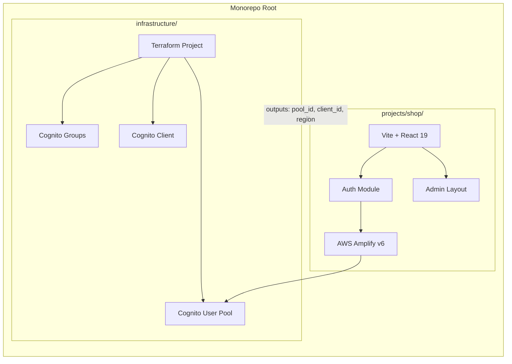
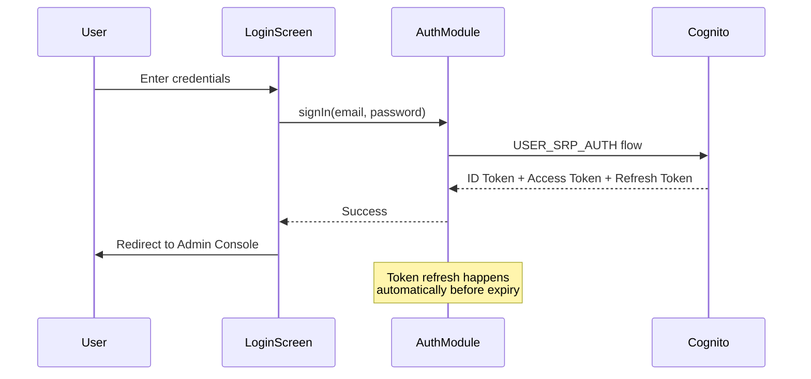
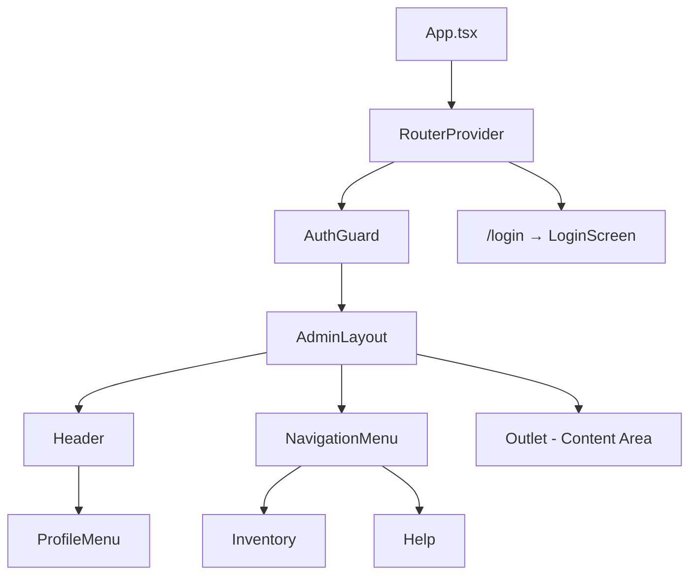

# Design Document

## Overview

This design covers a monorepo containing two projects: a Terraform infrastructure project deploying AWS Cognito for authentication, and a React-based admin console (the "shop" project) that authenticates against that Cognito User Pool. The architecture separates infrastructure concerns from application code while sharing authentication configuration through Terraform outputs.

Key architectural decisions:

- **AWS Amplify v6** for Cognito integration — provides tree-shakeable auth APIs (`signIn`, `signOut`, `fetchAuthSession`) without requiring the Amplify backend tooling
- **React Router v7** for client-side routing with protected route guards
- **shadcn/ui** with the specified preset for consistent, accessible components built on Radix primitives
- **Terraform** directly (no modules) for Cognito resources — keeps infrastructure simple and auditable

## Architecture



### Data Flow



## Components and Interfaces

### Infrastructure Components

| Resource | Terraform Type | Purpose |
|----------|---------------|---------|
| User Pool | `aws_cognito_user_pool` | User directory with email sign-in, self-signup disabled |
| User Pool Client | `aws_cognito_user_pool_client` | App client for shop, no secret, USER_SRP_AUTH |
| Admin Group | `aws_cognito_user_pool_group` | Role-based access group |

### Shop Project Components



#### Component Tree

| Component | File | Responsibility |
|-----------|------|----------------|
| `App` | `src/app.tsx` | Root component, Amplify config, router setup |
| `AuthProvider` | `src/providers/auth-provider.tsx` | React context providing auth state and actions |
| `AuthGuard` | `src/components/auth-guard.tsx` | Route guard redirecting unauthenticated users to login |
| `LoginScreen` | `src/features/auth/login-screen.tsx` | Email/password form, validation, error display |
| `AdminLayout` | `src/components/layout/admin-layout.tsx` | Shell layout with sidebar, header, content outlet |
| `NavigationMenu` | `src/components/layout/navigation-menu.tsx` | Responsive sidebar with navigation entries |
| `ProfileMenu` | `src/components/layout/profile-menu.tsx` | Header dropdown with user info, roles, logout |

#### Auth Module Interface

```typescript
// src/providers/auth-provider.tsx
interface AuthState {
  status: 'loading' | 'authenticated' | 'unauthenticated' | 'error';
  user: AuthUser | null;
  error: string | null;
}

interface AuthUser {
  email: string;
  name?: string;
  groups: string[];
}

interface AuthContextValue {
  state: AuthState;
  signIn: (email: string, password: string) => Promise<void>;
  signOut: () => Promise<void>;
}
```

#### Login Screen Interface

```typescript
// src/features/auth/login-screen.tsx
interface LoginFormData {
  email: string;   // max 254 chars
  password: string; // max 128 chars, masked
}

interface LoginFormErrors {
  email?: string;
  password?: string;
  general?: string;
}
```

#### Navigation Configuration

```typescript
// src/config/navigation.ts
interface NavItem {
  label: string;
  path: string;
  icon: React.ComponentType;
}

const navigationItems: NavItem[] = [
  { label: 'Inventory', path: '/inventory', icon: PackageIcon },
  { label: 'Help', path: '/help', icon: HelpCircleIcon },
];
```

## Data Models

### Terraform Variables

```hcl
# infrastructure/variables.tf
variable "environment" {
  description = "Deployment environment name"
  type        = string
  default     = "dev"
}

variable "project_name" {
  description = "Project name used for resource naming"
  type        = string
  default     = "thymos"
}
```

### Terraform Outputs

```hcl
# infrastructure/outputs.tf
output "cognito_user_pool_id" {
  description = "Cognito User Pool ID for application configuration"
  value       = aws_cognito_user_pool.main.id
}

output "cognito_user_pool_client_id" {
  description = "Cognito User Pool Client ID for the shop application"
  value       = aws_cognito_user_pool_client.shop.id
}

output "aws_region" {
  description = "AWS region where resources are deployed"
  value       = data.aws_region.current.name
}
```

### Amplify Configuration

```typescript
// src/config/amplify-config.ts
interface AmplifyAuthConfig {
  Cognito: {
    userPoolId: string;
    userPoolClientId: string;
  };
}

// Loaded from environment variables at build time:
// VITE_COGNITO_USER_POOL_ID
// VITE_COGNITO_USER_POOL_CLIENT_ID
// VITE_AWS_REGION
```

### Auth Token Structure (from Cognito ID Token)

```typescript
interface CognitoIdTokenPayload {
  sub: string;
  email: string;
  email_verified: boolean;
  'cognito:groups'?: string[];
  'cognito:username': string;
  name?: string;
  iat: number;
  exp: number;
}
```

### Route Configuration

```typescript
// src/config/routes.ts
type AppRoute = '/login' | '/inventory' | '/help';

// Public routes: /login
// Protected routes (require auth): /inventory, /help
// Default redirect after login: /inventory
```

## Correctness Properties

*A property is a characteristic or behavior that should hold true across all valid executions of a system — essentially, a formal statement about what the system should do. Properties serve as the bridge between human-readable specifications and machine-verifiable correctness guarantees.*

### Property 1: Input length validation

*For any* string longer than 254 characters provided as email input, and *for any* string longer than 128 characters provided as password input, the login form SHALL reject the input by truncating or preventing entry beyond the maximum length.

**Validates: Requirements 5.2**

### Property 2: Empty field submission prevention

*For any* combination of email and password values where at least one field is empty or contains only whitespace characters, submitting the login form SHALL produce a validation error for each empty field and SHALL NOT trigger an authentication request.

**Validates: Requirements 5.4**

### Property 3: Auth error message safety

*For any* authentication error returned by the Cognito SDK (including network errors, invalid credentials, service exceptions), the error message displayed to the user SHALL NOT contain AWS request IDs, stack traces, internal endpoint URLs, or Cognito-specific error codes, AND the email field value SHALL be preserved after the error is displayed.

**Validates: Requirements 5.8**

### Property 4: Profile display name resolution

*For any* authenticated user, the profile menu SHALL display the user's `name` attribute if it is a non-empty string, otherwise it SHALL display the user's `email` attribute. The displayed value is never empty.

**Validates: Requirements 8.2**

### Property 5: Roles display completeness

*For any* authenticated user with a `cognito:groups` claim containing zero or more group names, the profile menu SHALL display all group names from the claim. If the groups array is empty, a "no roles assigned" indicator SHALL be shown instead.

**Validates: Requirements 8.3, 8.4**

### Property 6: Configuration validation

*For any* Amplify configuration where the User Pool ID or Client ID is missing, empty, or does not match the expected format (region_poolId pattern for pool ID), the application SHALL display a configuration error message and SHALL NOT attempt any authentication operations.

**Validates: Requirements 9.5**

## Error Handling

### Authentication Errors

| Error Scenario | User-Facing Message | Technical Action |
|---|---|---|
| Invalid credentials | "Incorrect email or password" | Preserve email, clear password, re-enable form |
| Network unavailable | "Unable to connect. Check your internet connection." | Preserve all fields, allow retry |
| Service unavailable | "Service temporarily unavailable. Please try again." | Preserve all fields, allow retry |
| Token refresh failure | Silent redirect to login | Clear local state, navigate to `/login` |
| Unknown error | "Something went wrong. Please try again." | Log error internally, preserve email |

### Configuration Errors

| Error Scenario | User-Facing Message | Technical Action |
|---|---|---|
| Missing Pool ID or Client ID | "Application configuration error. Contact support." | Render error screen instead of login, prevent all auth calls |
| Invalid Pool ID format | Same as above | Same as above |

### Logout Errors

| Error Scenario | User-Facing Message | Technical Action |
|---|---|---|
| Cognito signOut fails | None (silent) | Clear local tokens anyway, redirect to login |
| Network error during signOut | None (silent) | Clear local tokens anyway, redirect to login |

### Error Boundary Strategy

- A top-level `ErrorBoundary` wraps the entire app to catch unhandled React errors
- Auth-specific errors are caught within the `AuthProvider` and surfaced through `AuthState.error`
- Component-level errors in the admin layout are caught by a nested boundary that preserves navigation

## Testing Strategy

### Unit Tests (Example-Based)

Unit tests cover specific scenarios, UI structure, and integration points:

- **Login Screen**: submit button exists, no signup link, loading state disables button, redirect on success
- **Admin Layout**: renders sidebar, header, content area at each breakpoint
- **Navigation Menu**: displays Inventory and Help entries, expanded at ≥1024px, collapsed below
- **Profile Menu**: logout button present, logout clears tokens even on failure
- **Auth Guard**: redirects unauthenticated to login, shows layout when authenticated
- **Route guards**: unauthenticated → login, authenticated → admin layout

### Property-Based Tests

Property tests verify universal invariants across randomized inputs. Use [fast-check](https://github.com/dubzzz/fast-check) as the PBT library.

Configuration:

- Minimum **100 iterations** per property test
- Each test tagged with: `Feature: shop-monorepo, Property {N}: {title}`

| Property | What Varies | What's Verified |
|----------|-------------|-----------------|
| 1: Input length validation | Random strings of length 0–500 | Fields enforce max length |
| 2: Empty field submission prevention | Whitespace-only and empty strings | Validation fires, no auth call |
| 3: Auth error message safety | Various Cognito error types and messages | No internals leaked, email preserved |
| 4: Profile display name resolution | Users with/without name attribute | Correct value displayed |
| 5: Roles display completeness | Arrays of 0–10 random group names | All groups shown or "no roles" indicator |
| 6: Configuration validation | Empty/malformed pool IDs and client IDs | Error screen shown, no auth attempted |

### Integration Tests

Integration tests verify Terraform outputs and end-to-end auth flow (run against real or localstack Cognito):

- Terraform applies without errors and outputs expected values
- User Pool has signup disabled, email as alias
- Admin group exists
- User Pool Client has no secret and USER_SRP_AUTH flow
- Full login → token → session → logout cycle

### Testing Tools

| Tool | Purpose |
|------|---------|
| Vitest | Unit test runner (Vite-native) |
| fast-check | Property-based testing library |
| @testing-library/react | Component testing with accessible queries |
| msw (Mock Service Worker) | Mock Cognito API responses in tests |
| terraform validate + plan | Infrastructure validation |
