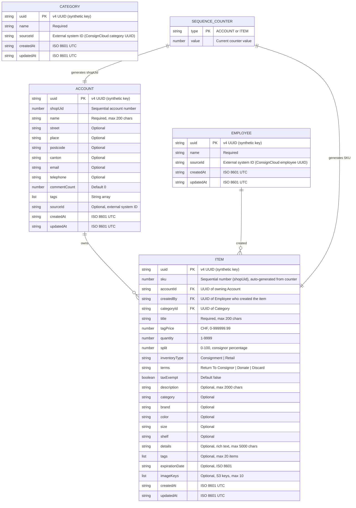

# Data Model

## Entity-Relationship Diagram

An ER diagram is more appropriate than a UML class diagram for this system because:

- There is no class inheritance or polymorphism — these are flat data records
- The relationship is ownership/association (Account owns Items), not inheritance
- DynamoDB single-table design does not map to relational tables or OOP classes
- ER diagrams clearly express cardinality (one Account → many Items)

## DynamoDB Single-Table Mapping

Both entities live in the same DynamoDB table (`thymos-{environment}-shop`). The ER diagram above shows the logical domain model; below is how it maps to physical key patterns:

| Entity           | PK                    | SK         | GSI1PK     | GSI1SK                  |
|------------------|-----------------------|------------|------------|-------------------------|
| Account          | `ACCOUNT#<uuid>`      | `METADATA` | `ACCOUNTS` | `ACCOUNT#<shopUid>`     |
| Employee         | `EMPLOYEE#<uuid>`     | `METADATA` | —          | —                       |
| Category         | `CATEGORY#<uuid>`     | `METADATA` | —          | —                       |
| Item             | `ITEM#<uuid>`         | `METADATA` | `ITEMS`    | `ITEM#<sku>`            |
| Account Counter  | `SEQUENCE#ACCOUNT`    | `COUNTER`  | —          | —                       |
| Item Counter     | `SEQUENCE#ITEM`       | `COUNTER`  | —          | —                       |

### Key Design Principles

- **Synthetic keys only**: UUIDs for identity, never business values (shopUid, SKU) as partition keys
- **Business identifiers as attributes**: shopUid and SKU are queryable via GSI1 but never used as primary keys
- **SKU is the item's shopUid**: The SKU is a sequential number (e.g., `42`) auto-generated from the item sequence counter — the same concept as `shopUid` for accounts. It is the operator-facing identifier for items, labelled "SKU" in the UI.
- **Relationship via attribute**: Items reference their owning Account by storing `accountId` (the Account's UUID), and their creator by storing `createdBy` (the Employee's UUID)
- **Employee lookup**: Employees are looked up by `sourceId` via the `sourceId-index` GSI (same as accounts). No sequential numbering — they're referenced, not browsed.
- **Sequence counters**: Separate counter records for each entity type, atomically incremented via DynamoDB conditional expressions

## Enumerations

### Inventory Type

| Value          | Description                                                                                                                                                                    |
| -------------- | ------------------------------------------------------------------------------------------------------------------------------------------------------------------------------ |
| `Consignment`  | Item remains the property of the consignor account until sold. The shop takes a percentage (100 − split) and the consignor receives the split percentage of the sale price.    |
| `Retail`       | Item is sold by the shop on behalf of a partner retailer. The partner supplies stock and the shop sells it under an agreed arrangement.                                        |

> **Future**: A `Bought` type may be added to represent items the shop has purchased outright from a consignor or supplier. In that case the shop owns the item and the consignor has already been paid.

### Terms

| Value                  | Description                                                                                                             |
| ---------------------- | ----------------------------------------------------------------------------------------------------------------------- |
| `Return To Consignor`  | When the consignment period expires or the item is withdrawn, return the unsold item to the consignor account.          |
| `Donate`               | When the consignment period expires, donate the unsold item rather than returning it.                                   |
| `Discard`              | When the consignment period expires, dispose of the unsold item.                                                        |
