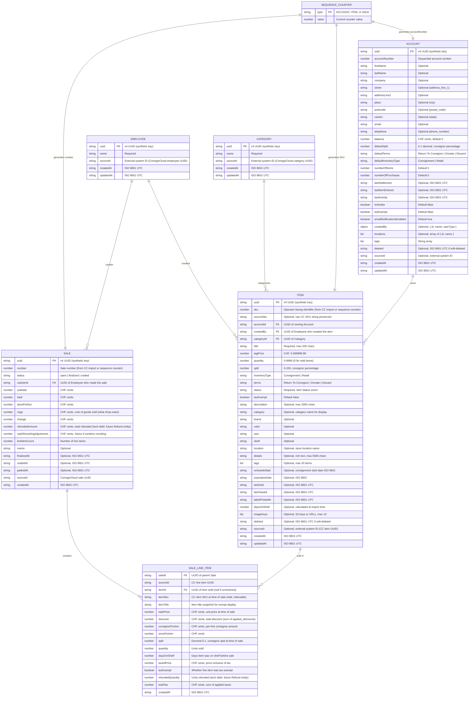

# Data Model

## Entity-Relationship Diagram

An ER diagram is more appropriate than a UML class diagram for this system because:

- There is no class inheritance or polymorphism — these are flat data records
- The relationship is ownership/association (Account owns Items), not inheritance
- DynamoDB single-table design does not map to relational tables or OOP classes
- ER diagrams clearly express cardinality (one Account → many Items)

## DynamoDB Single-Table Mapping

Both entities live in the same DynamoDB table (`thymos-{environment}-shop`). The ER diagram above shows the logical domain model; below is how it maps to physical key patterns:

| Entity           | PK                    | SK                    | GSI1PK     | GSI1SK                  | GSI2PK                      | GSI2SK                  | GSI3PK                        | GSI3SK                  |
|------------------|-----------------------|-----------------------|------------|-------------------------|-----------------------------|-------------------------|-------------------------------|-------------------------|
| Account          | `ACCOUNT#<uuid>`      | `METADATA`            | `ACCOUNTS` | `ACCOUNT#<accountNumber>`| —                           | —                       | —                             | —                       |
| Employee         | `EMPLOYEE#<uuid>`     | `METADATA`            | —          | —                       | `EMPLOYEES`                 | `EMPLOYEE#<uuid>`       | —                             | —                       |
| Category         | `CATEGORY#<uuid>`     | `METADATA`            | —          | —                       | —                           | —                       | —                             | —                       |
| Item             | `ITEM#<uuid>`         | `METADATA`            | `ITEMS`    | `ITEM#<sku>`            | `ACCOUNT#<accountId>`       | `ITEM#<createdAt>`      | `CATEGORY#<categoryId>`       | `ITEM#<createdAt>`      |
| Sale             | `SALE#<uuid>`         | `METADATA`            | `SALES`    | `SALE#<saleNumber>`     | —                           | —                       | —                             | —                       |
| Sale Line Item   | `SALE#<uuid>`         | `LINE_ITEM#<index>`   | —          | —                       | —                           | —                       | —                             | —                       |
| Account Counter  | `SEQUENCE#ACCOUNT`    | `COUNTER`             | —          | —                       | —                           | —                       | —                             | —                       |
| Item Counter     | `SEQUENCE#ITEM`       | `COUNTER`             | —          | —                       | —                           | —                       | —                             | —                       |
| Sale Counter     | `SEQUENCE#SALE`       | `COUNTER`             | —          | —                       | —                           | —                       | —                             | —                       |

### Key Design Principles

- **Synthetic keys only**: UUIDs for identity, never business values (accountNumber, SKU) as partition keys
- **Business identifiers as attributes**: accountNumber and SKU are queryable via GSI1 but never used as primary keys
- **SKU is the item's sequential number**: The SKU is a sequential number (e.g., `42`) — the operator-facing identifier for items, labelled "SKU" in the UI and printed on labels. For imported items, the SKU comes directly from ConsignCloud (not generated). The sequence counter is seeded to max(imported SKU) after the first full import to prevent collisions with future locally-created items.
- **Relationship via attribute**: Items reference their owning Account by storing `accountId` (the Account's UUID), and their creator by storing `createdBy` (the Employee's UUID)
- **Items by account (GSI2)**: Items are queryable by owning account via GSI2 (`GSI2PK: ACCOUNT#<accountId>`, `GSI2SK: ITEM#<createdAt>`). Querying with `ScanIndexForward: false` returns items newest-first. GSI2 is overloaded — employees also use it (`GSI2PK: EMPLOYEES`, `GSI2SK: EMPLOYEE#<uuid>`).
- **Items by category (GSI3)**: Items are queryable by category via GSI3 (`GSI3PK: CATEGORY#<categoryId>`, `GSI3SK: ITEM#<createdAt>`). Querying with `ScanIndexForward: false` returns items newest-first.
- **Employee lookup**: Employees are looked up by `sourceId` via the `sourceId-index` GSI (same as accounts). No sequential numbering — they're referenced, not browsed.
- **Sale line items**: Stored under the same PK as the sale (`SALE#<uuid>`) with SK `LINE_ITEM#<index>`. This allows fetching a sale and all its line items in a single Query. Each line item references the Item UUID and stores the price/portions at time of sale.
- **Sale number**: The operator-facing identifier for sales. For imported sales, the number comes directly from ConsignCloud (not generated). The sequence counter is seeded to max(imported number) after the first full import to prevent collisions with future locally-created sales. Queryable via GSI1 (`GSI1PK: SALES`, `GSI1SK: SALE#<number>`).
- **Sequence counters**: Separate counter records for each entity type, atomically incremented via DynamoDB conditional expressions

## Enumerations

### Inventory Type

| Value          | Description                                                                                                                                                                    |
| -------------- | ------------------------------------------------------------------------------------------------------------------------------------------------------------------------------ |
| `Consignment`  | Item remains the property of the consignor account until sold. The shop takes a percentage (100 − split) and the consignor receives the split percentage of the sale price.    |
| `Retail`       | Item is sold by the shop on behalf of a partner retailer. The partner supplies stock and the shop sells it under an agreed arrangement.                                        |

> **Future**: A `Bought` type may be added to represent items the shop has purchased outright from a consignor or supplier. In that case the shop owns the item and the consignor has already been paid.

### Terms

| Value                  | Description                                                                                                             |
| ---------------------- | ----------------------------------------------------------------------------------------------------------------------- |
| `Return To Consignor`  | When the consignment period expires or the item is withdrawn, return the unsold item to the consignor account.          |
| `Donate`               | When the consignment period expires, donate the unsold item rather than returning it.                                   |
| `Discard`              | When the consignment period expires, dispose of the unsold item.                                                        |

### Sale Status

| Value        | Description                                                                       |
| ------------ | --------------------------------------------------------------------------------- |
| `open`       | Sale is in progress (items added but not yet paid/finalized).                     |
| `finalized`  | Sale is complete — payment received, items marked as sold.                        |
| `voided`     | Sale was cancelled after creation.                                                |

### Item Status

Derived from the ConsignCloud status breakdown object. For items with quantity > 1, the highest-priority status with non-zero units wins. ConsignCloud's `sold_on_shopify`, `sold_on_square`, and `sold_on_third_party` are consolidated into `sold`.

| Value                 | Priority | Description                                                                                           |
| --------------------- | -------- | ----------------------------------------------------------------------------------------------------- |
| `active`              | 1        | Item is available for sale on the shelf.                                                              |
| `parked`              | 2        | Item temporarily removed from the sale floor (e.g., reserved, being photographed).                    |
| `inactive`            | 3        | Item deliberately deactivated by operator.                                                            |
| `expired`             | 4        | Consignment period ended, pending action per terms (return/donate/discard).                           |
| `to_be_returned`      | 5        | Item is queued for return to the consignor.                                                           |
| `sold`                | 6        | Item sold (includes in-store, Shopify, Square, and third-party sales).                                |
| `returned_to_owner`   | 7        | Item has been returned to the consignor.                                                              |
| `donated`             | 8        | Item donated per consignment terms.                                                                   |
| `lost`                | 9        | Item is lost or unaccounted for.                                                                      |
| `stolen`              | 10       | Item reported stolen.                                                                                 |
| `damaged`             | 11       | Item damaged and removed from inventory.                                                              |

## Tech Debt

### Refund Model

The `refundedAmount` field on Sale and `refundedQuantity` field on Sale_Line_Item are stored as informational snapshots from ConsignCloud. They indicate that a refund occurred and the magnitude, but do not capture when, by whom, or why.

A proper Refund entity should be modelled in a future spec with its own lifecycle (timestamp, operator, reason, partial quantities, linked sale). These snapshot fields will need migration when that model is built.
