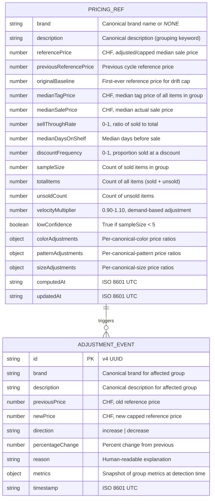

# Data Model

## Entity-Relationship Diagram

An ER diagram is more appropriate than a UML class diagram for this system because:

- There is no class inheritance or polymorphism — these are flat data records
- The relationship is ownership/association (Account owns Items), not inheritance
- DynamoDB single-table design does not map to relational tables or OOP classes
- ER diagrams clearly express cardinality (one Account → many Items)


```mermaid
erDiagram
    ACCOUNT {
        string uuid PK "v4 UUID (synthetic key)"
        number accountNumber "Sequential account number, zero-padded to 7 digits"
        string name "Computed: firstName + lastName"
        string firstName "Optional"
        string lastName "Optional"
        string company "Optional"
        string street "Optional (address_line_1)"
        string addressLine2 "Optional"
        string place "Optional (city)"
        string postcode "Optional (postal_code)"
        string canton "Optional (state)"
        string email "Optional"
        string telephone "Optional (phone_number)"
        number balance "CHF cents, default 0"
        number defaultSplit "0-1 decimal, consignor percentage"
        string defaultTerms "Return To Consignor | Donate | Discard"
        string defaultInventoryType "Consignment | Retail"
        number numberOfItems "Default 0"
        number numberOfPurchases "Default 0"
        string lastSettlement "Optional, ISO 8601 UTC"
        string lastItemEntered "Optional, ISO 8601 UTC"
        string lastActivity "Optional, ISO 8601 UTC"
        boolean isVendor "Default false"
        boolean taxExempt "Default false"
        boolean emailNotificationsEnabled "Default true"
        object createdBy "Optional, { id, name, userType }"
        list locations "Optional, array of { id, name }"
        list tags "String array"
        string deleted "Optional, ISO 8601 UTC if soft-deleted"
        string sourceId "Optional, external system ID"
        string createdAt "ISO 8601 UTC"
        string updatedAt "ISO 8601 UTC"
    }

    EMPLOYEE {
        string uuid PK "v4 UUID (synthetic key)"
        string name "Required"
        string sourceId "External system ID (ConsignCloud employee UUID)"
        string createdAt "ISO 8601 UTC"
        string updatedAt "ISO 8601 UTC"
    }

    CATEGORY {
        string uuid PK "v4 UUID (synthetic key)"
        string name "Required"
        string sourceId "External system ID (ConsignCloud category UUID)"
        string createdAt "ISO 8601 UTC"
        string updatedAt "ISO 8601 UTC"
    }

    ITEM {
        string uuid PK "v4 UUID (synthetic key)"
        number sku "Operator-facing identifier (from CC import or sequence counter)"
        string sourceSku "Optional, raw CC SKU string preserved"
        string accountId FK "UUID of owning Account"
        string createdBy FK "UUID of Employee who created the item"
        string categoryId FK "UUID of Category"
        string title "Required, max 200 chars"
        number tagPrice "CHF, 0-999999.99"
        number quantity "0-9999 (0 for sold items)"
        number split "0-100, consignor percentage"
        string inventoryType "Consignment | Retail"
        string terms "Return To Consignor | Donate | Discard"
        string status "Required, Item Status enum"
        boolean taxExempt "Default false"
        string description "Optional, max 2000 chars"
        string sourceDescription "Optional, original value before canonical mapping"
        string category "Optional, category name for display"
        string brand "Optional"
        string sourceBrand "Optional, original value before canonical mapping"
        string color "Optional, canonical German color name"
        string sourceColor "Optional, original value before canonical mapping"
        string pattern "Optional, canonical German pattern name"
        string sourcePattern "Optional, original value that triggered pattern extraction"
        string size "Optional"
        string shelf "Optional"
        string location "Optional, store location name"
        string details "Optional, rich text, max 5000 chars"
        list tags "Optional, max 20 items"
        string scheduleStart "Optional, consignment start date ISO 8601"
        string expirationDate "Optional, ISO 8601"
        string lastSold "Optional, ISO 8601 UTC"
        string lastViewed "Optional, ISO 8601 UTC"
        string labelPrintedAt "Optional, ISO 8601 UTC"
        number daysOnShelf "Optional, calculated at import time"
        list imageKeys "Optional, S3 keys or URLs, max 10"
        string deleted "Optional, ISO 8601 UTC if soft-deleted"
        string sourceId "Optional, external system ID (CC item UUID)"
        string createdAt "ISO 8601 UTC"
        string updatedAt "ISO 8601 UTC"
    }

    SEQUENCE_COUNTER {
        string type PK "ACCOUNT, ITEM, or SALE"
        number value "Current counter value"
    }

    SALE {
        string uuid PK "v4 UUID (synthetic key)"
        number number "Sale number (from CC import or sequence counter)"
        string status "open | finalized | voided"
        string cashierId FK "UUID of Employee who made the sale"
        string cashierName "Denormalized cashier name snapshot"
        number subtotal "CHF cents"
        number total "CHF cents"
        number storePortion "CHF cents"
        number cogs "CHF cents, cost of goods sold (what shop owes)"
        number change "CHF cents"
        number refundedAmount "CHF cents, total refunded (tech debt: future Refund entity)"
        number cashRoundingAdjustment "CHF cents, Swiss 5-centime rounding"
        number lineItemCount "Number of line items"
        string memo "Optional"
        string finalizedAt "Optional, ISO 8601 UTC"
        string voidedAt "Optional, ISO 8601 UTC"
        string parkedAt "Optional, ISO 8601 UTC"
        string sourceId "ConsignCloud sale UUID"
        string createdAt "ISO 8601 UTC"
        string updatedAt "ISO 8601 UTC, only set on updates"
    }

    SALE_LINE_ITEM {
        string saleId FK "UUID of parent Sale"
        string sourceId "CC line item UUID"
        string itemId FK "UUID of Item sold (null if unresolved)"
        string itemSku "CC item SKU at time of sale (vital, indexable)"
        string itemTitle "Item title snapshot for receipt display"
        number salePrice "CHF cents, unit price at time of sale"
        number discount "CHF cents, total discount (sum of applied_discounts)"
        number consignorPortion "CHF cents, per-line consignor amount"
        number storePortion "CHF cents"
        number split "Decimal 0-1, consignor split at time of sale"
        number quantity "Units sold"
        number daysOnShelf "Days item was on shelf before sale"
        number taxedPrice "CHF cents, price inclusive of tax"
        boolean taxExempt "Whether line item was tax-exempt"
        number refundedQuantity "Units refunded (tech debt: future Refund entity)"
        number totalTax "CHF cents, sum of applied taxes"
        string createdAt "ISO 8601 UTC"
    }

    ACCOUNT ||--o{ ITEM : "owns"
    EMPLOYEE ||--o{ ITEM : "created"
    CATEGORY ||--o{ ITEM : "categorises"
    EMPLOYEE ||--o{ SALE : "cashier"
    SALE ||--|{ SALE_LINE_ITEM : "contains"
    ITEM ||--o{ SALE_LINE_ITEM : "sold in"
    SEQUENCE_COUNTER ||--|| ACCOUNT : "generates accountNumber"
    SEQUENCE_COUNTER ||--|| ITEM : "generates SKU"
    SEQUENCE_COUNTER ||--|| SALE : "generates number"
```

## Pricing Table Entity-Relationship Diagram

The pricing table (`thymos-{environment}-pricing`) stores batch-computed pricing references and adjustment history in a separate DynamoDB table. Grouping is by canonical brand × canonical description. Color, pattern, and size are stored as refinement adjustment ratios within each group.


```mermaid
erDiagram
    PRICING_REF {
        string brand "Canonical brand name or _NONE_"
        string description "Canonical description (grouping keyword)"
        number referencePrice "CHF, adjusted/capped median sale price"
        number previousReferencePrice "Previous cycle reference price"
        number originalBaseline "First-ever reference price for drift cap"
        number medianTagPrice "CHF, median tag price of all items in group"
        number medianSalePrice "CHF, median actual sale price"
        number sellThroughRate "0-1, ratio of sold to total"
        number medianDaysOnShelf "Median days before sale"
        number discountFrequency "0-1, proportion sold at a discount"
        number sampleSize "Count of sold items in group"
        number totalItems "Count of all items (sold + unsold)"
        number unsoldCount "Count of unsold items"
        number velocityMultiplier "0.90-1.10, demand-based adjustment"
        boolean lowConfidence "True if sampleSize < 5"
        object colorAdjustments "Per-canonical-color price ratios"
        object patternAdjustments "Per-canonical-pattern price ratios"
        object sizeAdjustments "Per-canonical-size price ratios"
        string computedAt "ISO 8601 UTC"
        string updatedAt "ISO 8601 UTC"
    }

    ADJUSTMENT_EVENT {
        string id PK "v4 UUID"
        string brand "Canonical brand for affected group"
        string description "Canonical description for affected group"
        number previousPrice "CHF, old reference price"
        number newPrice "CHF, new capped reference price"
        string direction "increase | decrease"
        number percentageChange "Percent change from previous"
        string reason "Human-readable explanation"
        object metrics "Snapshot of group metrics at detection time"
        string timestamp "ISO 8601 UTC"
    }

    PRICING_REF ||--o{ ADJUSTMENT_EVENT : "triggers"
```

## DynamoDB Single-Table Mapping (Shop Table)

Operational entities live in the DynamoDB table (`thymos-{environment}-shop`). The ER diagram above shows the logical domain model; below is how it maps to physical key patterns:

| Entity           | PK                    | SK                    | GSI1PK     | GSI1SK                           | GSI2PK                      | GSI2SK                  | GSI3PK                        | GSI3SK                  |
|------------------|-----------------------|-----------------------|------------|----------------------------------|-----------------------------|-------------------------|-------------------------------|-------------------------|
| Account          | `ACCOUNT#<uuid>`      | `METADATA`            | `ACCOUNT`  | `ACCOUNT#<accountNumber(7)>`     | —                           | —                       | —                             | —                       |
| Employee         | `EMPLOYEE#<uuid>`     | `METADATA`            | —          | —                                | `EMPLOYEES`                 | `EMPLOYEE#<uuid>`       | —                             | —                       |
| Category         | `CATEGORY#<uuid>`     | `METADATA`            | —          | —                                | —                           | —                       | —                             | —                       |
| Item             | `ITEM#<uuid>`         | `METADATA`            | `ITEMS`    | `ITEM#<sku(7)>`                  | `ACCOUNT#<accountId>`       | `ITEM#<createdAt>`      | `CATEGORY#<categoryId>`       | `ITEM#<createdAt>`      |
| Sale             | `SALE#<uuid>`         | `METADATA`            | `SALES`    | `SALE#<number(7)>`               | —                           | —                       | —                             | —                       |
| Sale Line Item   | `SALE#<uuid>`         | `LINE_ITEM#<index(4)>`| —          | —                                | —                           | —                       | —                             | —                       |
| Account Counter  | `SEQUENCE#ACCOUNT`    | `COUNTER`             | —          | —                                | —                           | —                       | —                             | —                       |
| Item Counter     | `SEQUENCE#ITEM`       | `COUNTER`             | —          | —                                | —                           | —                       | —                             | —                       |
| Sale Counter     | `SEQUENCE#SALE`       | `COUNTER`             | —          | —                                | —                           | —                       | —                             | —                       |
| Canonical Color  | `CANONICAL#COLORS`    | `COLOR#<name>`        | —          | —                                | —                           | —                       | —                             | —                       |
| Canonical Pattern| `CANONICAL#PATTERNS`  | `PATTERN#<name>`      | —          | —                                | —                           | —                       | —                             | —                       |

> **Notation**: `(7)` and `(4)` indicate zero-padded width. e.g., `ITEM#0000042`, `LINE_ITEM#0003`.

### Key Design Principles

- **Synthetic keys only**: UUIDs for identity, never business values (accountNumber, SKU) as partition keys
- **Business identifiers as attributes**: accountNumber and SKU are queryable via GSI1 but never used as primary keys
- **Zero-padded sort keys**: GSI1SK values are zero-padded to 7 digits for correct lexicographic ordering (`ITEM#0000042`, `ACCOUNT#0000001`). Line item SK indices are zero-padded to 4 digits (`LINE_ITEM#0003`).
- **SKU is the item's sequential number**: The SKU is a sequential number (e.g., `42`) — the operator-facing identifier for items, labelled "SKU" in the UI and printed on labels. For imported items, the SKU comes directly from ConsignCloud (not generated). The sequence counter is seeded to max(imported SKU) after the first full import to prevent collisions with future locally-created items.
- **Relationship via attribute**: Items reference their owning Account by storing `accountId` (the Account's UUID), and their creator by storing `createdBy` (the Employee's UUID)
- **Account GSI1**: `GSI1PK: "ACCOUNT"` (singular), `GSI1SK: "ACCOUNT#<accountNumber>"`. Enables listing all accounts sorted by account number.
- **Items by account (GSI2)**: Items are queryable by owning account via GSI2 (`GSI2PK: ACCOUNT#<accountId>`, `GSI2SK: ITEM#<createdAt>`). Querying with `ScanIndexForward: false` returns items newest-first. GSI2 is overloaded — employees also use it (`GSI2PK: EMPLOYEES`, `GSI2SK: EMPLOYEE#<uuid>`).
- **Items by category (GSI3)**: Items are queryable by category via GSI3 (`GSI3PK: CATEGORY#<categoryId>`, `GSI3SK: ITEM#<createdAt>`). Querying with `ScanIndexForward: false` returns items newest-first.
- **Employee lookup**: Employees are looked up by `sourceId` via the `sourceId-index` GSI (same as accounts). No sequential numbering — they're referenced, not browsed.
- **Sale line items**: Stored under the same PK as the sale (`SALE#<uuid>`) with SK `LINE_ITEM#<index>`. This allows fetching a sale and all its line items in a single Query. Each line item references the Item UUID and stores the price/portions at time of sale.
- **Sale number**: The operator-facing identifier for sales. For imported sales, the number comes directly from ConsignCloud (not generated). The sequence counter is seeded to max(imported number) after the first full import to prevent collisions with future locally-created sales. Queryable via GSI1 (`GSI1PK: SALES`, `GSI1SK: SALE#<number>`).
- **Sequence counters**: Separate counter records for each entity type, atomically incremented via DynamoDB conditional expressions
- **Canonical lists**: `CANONICAL#COLORS` and `CANONICAL#PATTERNS` store the master list of canonical color and pattern names with their known aliases. Seeded by the color-apply Lambda after applying mappings. Used by the `GET /api/pricing/canonical/colors` and `GET /api/pricing/canonical/patterns` routes.

### Source Field Convention

Items store the **original raw value** from ConsignCloud alongside the canonical (mapped) value for three fields: brand, color, and description. This enables auditing what the original import data was and re-running mappings without data loss.

| Canonical Field | Source Field        | Written By                            | Semantics                                                 |
|-----------------|---------------------|---------------------------------------|-----------------------------------------------------------|
| `brand`         | `sourceBrand`       | Stream item-mapper OR brand-apply Lambda | Original CC brand before canonical mapping             |
| `color`         | `sourceColor`       | Stream item-mapper OR color-apply Lambda | Original CC color before canonical mapping             |
| `description`   | `sourceDescription` | Description-apply Lambda only         | Original CC description before normalization              |
| `pattern`       | `sourcePattern`     | Color-apply Lambda only               | Original value that triggered pattern extraction          |

**Rules:**

- Source fields use `if_not_exists` semantics — once set, they are never overwritten by subsequent mapping runs
- `sourceBrand` and `sourceColor` are only set when the raw value differs from the canonical value (i.e., a mapping was applied)
- `sourcePattern` captures the raw color value that was identified as a pattern rather than a color
- `sourceSku` (on item creation only) preserves the raw CC SKU string when it differs from the parsed numeric SKU

## Pricing Table (`thymos-{environment}-pricing`)

Pricing data lives in a separate DynamoDB table from the operational shop data. This isolates the batch-computed pricing references and adjustment audit trail from the operational CRUD workload.

### Entities

| Entity           | PK                                       | SK         | GSI1PK         | GSI1SK                                   |
|------------------|------------------------------------------|------------|----------------|------------------------------------------|
| Pricing Ref      | `PRICING_REF#<brand>#<description>`      | `METADATA` | `PRICING_REFS` | `PRICING_REF#<brand>#<description>`      |
| Adjustment Event | `ADJUSTMENT#<uuid>`                      | `METADATA` | `ADJUSTMENTS`  | `ADJUSTMENT#<timestamp>`                 |

### Key Design Principles

- **Separate table for pricing**: Pricing data has a different lifecycle (batch-computed by the price computation Lambda) and access pattern (read at item-creation time, queried for reports) than operational data. Isolation prevents compute bursts from contending with shop traffic.
- **Single grouping key — brand × description**: The sole grouping dimension is canonical brand × canonical description. Category is not used for pricing. Description identifies what an item actually is (comparable goods), while category is an organizational convenience for the operator.
- **Description is mandatory**: Items without a description (after mapping) are excluded from price computation entirely. They cannot receive a price suggestion.
- **Brand `_NONE_`**: Items without a brand are grouped under the synthetic brand `_NONE_`. This handles unbranded goods (toys, generic items) that still have a meaningful description.
- **Color, pattern, and size are refinements**: These attributes are NOT grouping dimensions. Using them as grouping dimensions would fragment data into groups too small for statistical significance. Instead, they are computed as adjustment ratios within a brand × description group.
- **Single GSI**: GSI1 supports listing all pricing refs (`GSI1PK: PRICING_REFS`) and querying adjustments by date (`GSI1PK: ADJUSTMENTS`, `GSI1SK: ADJUSTMENT#<timestamp>`).
- **Mappings applied at computation time**: The compute-prices Lambda loads canonical mapping files (brand, description, color, size) from S3 and applies them in-memory when building groups. The shop table is never mutated — raw values are preserved as entered.
- **Adjustment events**: Created when the reference price changes by more than 2% between computation cycles.

### Pricing Ref Attributes

| Attribute              | Type                     | Description                                           |
|------------------------|--------------------------|-------------------------------------------------------|
| `brand`                | string                   | Canonical brand name (or `_NONE_`)                    |
| `description`          | string                   | Canonical description (the grouping keyword)          |
| `referencePrice`       | number (CHF)             | Computed reference price (adjusted/capped median sale price) |
| `previousReferencePrice` | number \| null         | Previous computation's reference price                |
| `originalBaseline`     | number (CHF)             | First-ever reference price for drift cap             |
| `medianTagPrice`       | number (CHF)             | Median tag price of ALL items in group (sold and unsold) |
| `medianSalePrice`      | number (CHF)             | Median actual sale price of sold items                |
| `sellThroughRate`      | number (0–1)             | Ratio of sold to total items                         |
| `medianDaysOnShelf`    | number                   | Median days before sale                              |
| `discountFrequency`    | number (0–1)             | Proportion of items sold at a discount               |
| `sampleSize`           | number                   | Count of sold items in group                         |
| `totalItems`           | number                   | Count of all items in group (sold + unsold)          |
| `unsoldCount`          | number                   | Count of unsold items (totalItems - sampleSize)      |
| `velocityMultiplier`   | number (0.90–1.10)       | Demand-based adjustment                              |
| `lowConfidence`        | boolean                  | True if sampleSize < 5                               |
| `colorAdjustments`     | Record<string, number>   | Per-canonical-color price ratio relative to group median |
| `patternAdjustments`   | Record<string, number>   | Per-canonical-pattern price ratio relative to group median |
| `sizeAdjustments`      | Record<string, number>   | Per-canonical-size price ratio relative to group median |
| `computedAt`           | string (ISO 8601)        | When this ref was last computed                      |
| `updatedAt`            | string (ISO 8601)        | Last write timestamp                                 |

#### Refinement Adjustments

Color, pattern, and size adjustments are stored as maps of `canonicalValue → ratio`:

```json
{
  "colorAdjustments": { "Schwarz": 1.12, "Rot": 0.88, "Blau": 1.03 },
  "patternAdjustments": { "Gestreift": 0.95, "Uni": 1.02 },
  "sizeAdjustments": { "104": 1.0, "110": 1.05, "116": 0.97 }
}
```

Each ratio represents how items with that attribute sell relative to the group median sale price. A ratio of 1.12 means items of that color sell 12% above the group average. These are applied as multipliers when computing a suggested price.

### Adjustment Event Attributes

| Attribute          | Type              | Description                                           |
|--------------------|-------------------|-------------------------------------------------------|
| `id`               | string (UUID)     | Unique identifier                                     |
| `brand`            | string            | Canonical brand for the affected group                |
| `description`      | string            | Canonical description for the affected group          |
| `previousPrice`    | number (CHF)      | Old reference price                                   |
| `newPrice`         | number (CHF)      | New capped reference price                            |
| `direction`        | "increase" \| "decrease" | Direction of change                            |
| `percentageChange` | number            | Percentage change from previous                       |
| `reason`           | string            | Human-readable explanation                            |
| `metrics`          | object            | Snapshot of group metrics at detection time           |
| `metrics.sellThroughRate` | number     | Current sell-through rate                            |
| `metrics.medianDaysOnShelf` | number   | Current median days on shelf                         |
| `metrics.sampleSize` | number          | Current sample size                                  |
| `metrics.discountFrequency` | number   | Discount frequency for the group                     |
| `metrics.priceRatio` | number          | `medianSalePrice / medianTagPrice`                   |
| `timestamp`        | string (ISO 8601) | When the adjustment was detected                     |

### Suggest-Price Fallback Chain

The `suggest-price` route resolves a PRICING_REF using a 4-level fallback chain:

| Level | Tier            | Key Pattern                             | Qualification    |
|-------|-----------------|-----------------------------------------|------------------|
| 1     | Tier 1 (sold)   | `PRICING_REF#<brand>#<description>`     | `sampleSize > 0` |
| 2     | Tier 1 (sold)   | `PRICING_REF#_NONE_#<description>`      | `sampleSize > 0` |
| 3     | Tier 2 (unsold) | `PRICING_REF#<brand>#<description>`     | `unsoldCount > 0` |
| 4     | Tier 2 (unsold) | `PRICING_REF#_NONE_#<description>`      | `unsoldCount > 0` |

- **Tier 1** uses the `referencePrice` (adjusted/capped median sale price) from sold items
- **Tier 2** uses `medianTagPrice × 0.90` (10% discount) from unsold items when no sold data exists
- Level 1 tries the brand-specific group; level 2 falls back to the description group across all brands
- Levels 3–4 repeat the same pattern for unsold items (weak signal)
- `description` is required — if missing, no suggestion is returned
- If no level matches, the response returns `suggestedPrice: null`

### Price Calculation

Once a pricing ref is resolved, the suggested price is computed by composing multipliers:

```
rawPrice = referencePrice × velocityMultiplier × colorAdjustment × patternAdjustment × sizeAdjustment
suggestedPrice = roundToSwiss5(rawPrice)
```

Each adjustment defaults to 1.0 if the item's color/pattern/size is not present in the ref's adjustment map.

## Enumerations

### Inventory Type

| Value          | Description                                                                                                                                                                    |
| -------------- | ------------------------------------------------------------------------------------------------------------------------------------------------------------------------------ |
| `Consignment`  | Item remains the property of the consignor account until sold. The shop takes a percentage (100 − split) and the consignor receives the split percentage of the sale price.    |
| `Retail`       | Item is sold by the shop on behalf of a partner retailer. The partner supplies stock and the shop sells it under an agreed arrangement.                                        |

> **Future**: A `Bought` type may be added to represent items the shop has purchased outright from a consignor or supplier. In that case the shop owns the item and the consignor has already been paid.

### Terms

| Value                  | Description                                                                                                             |
| ---------------------- | ----------------------------------------------------------------------------------------------------------------------- |
| `Return To Consignor`  | When the consignment period expires or the item is withdrawn, return the unsold item to the consignor account.          |
| `Donate`               | When the consignment period expires, donate the unsold item rather than returning it.                                   |
| `Discard`              | When the consignment period expires, dispose of the unsold item.                                                        |

### Sale Status

| Value        | Description                                                                       |
| ------------ | --------------------------------------------------------------------------------- |
| `open`       | Sale is in progress (items added but not yet paid/finalized).                     |
| `finalized`  | Sale is complete — payment received, items marked as sold.                        |
| `voided`     | Sale was cancelled after creation.                                                |

### Item Status

Derived from the ConsignCloud status breakdown object. For items with quantity > 1, the highest-priority status with non-zero units wins. ConsignCloud's `sold_on_shopify`, `sold_on_square`, and `sold_on_third_party` are consolidated into `sold`.

| Value                 | Priority | Description                                                                                           |
| --------------------- | -------- | ----------------------------------------------------------------------------------------------------- |
| `active`              | 1        | Item is available for sale on the shelf.                                                              |
| `parked`              | 2        | Item temporarily removed from the sale floor (e.g., reserved, being photographed).                    |
| `inactive`            | 3        | Item deliberately deactivated by operator.                                                            |
| `expired`             | 4        | Consignment period ended, pending action per terms (return/donate/discard).                           |
| `to_be_returned`      | 5        | Item is queued for return to the consignor.                                                           |
| `sold`                | 6        | Item sold (includes in-store, Shopify, Square, and third-party sales).                                |
| `returned_to_owner`   | 7        | Item has been returned to the consignor.                                                              |
| `donated`             | 8        | Item donated per consignment terms.                                                                   |
| `lost`                | 9        | Item is lost or unaccounted for.                                                                      |
| `stolen`              | 10       | Item reported stolen.                                                                                 |
| `damaged`             | 11       | Item damaged and removed from inventory.                                                              |

### Canonical Patterns

Patterns describe the visual pattern/print of an item, separated from the actual color. The pattern field stores one of the following canonical German values:

| Value         | Description        | Known Variants                                                       |
| ------------- | ------------------ | -------------------------------------------------------------------- |
| `Gestreift`   | Striped            | gestreift, stripes, striped, streifen, geringelt                     |
| `Punkte`      | Dots/Polka         | punkte, dots, gepunktet, polka, tupfen                               |
| `Kariert`     | Checked/Plaid      | kariert, checked, karo, karos, plaid                                 |
| `Bedruckt`    | Printed/Image      | bedruckt, print, motiv, muster, druck, blumen, floral, tiere, animal, sterne, stars, herzen, hearts, leopard, zebra, tiger |
| `Camouflage`  | Camo               | camouflage, camo, tarn, armee                                        |
| `Uni`         | Solid/Plain        | uni, einfarbig, solid, plain                                         |

> **Note**: Blumen (floral), Tiere (animal), Sterne (stars), and Herzen (hearts) are consolidated under `Bedruckt` (printed) since they represent printed imagery rather than distinct repeating patterns.

### Canonical Colors

Colors are normalized to German canonical names. Compound colors use `/` as separator with segments sorted alphabetically (e.g., `Beige/Blau` not `Blau/Beige`). Each segment starts with a capital letter.

**Base colors:**

| Canonical     | English      | Common variants                               |
| ------------- | ------------ | --------------------------------------------- |
| `Blau`        | Blue         | blau, blue, bleu, blu                         |
| `Rot`         | Red          | rot, red                                      |
| `Grün`        | Green        | grün, gruen, green                            |
| `Gelb`        | Yellow       | gelb, yellow                                  |
| `Schwarz`     | Black        | schwarz, black                                |
| `Weiss`       | White        | weiss, weiß, white                            |
| `Braun`       | Brown        | braun, brown, brun                            |
| `Grau`        | Grey         | grau, grey, gray                              |
| `Rosa`        | Pink (soft)  | rosa                                          |
| `Lila`        | Purple       | lila, purple, lilac                           |
| `Orange`      | Orange       | orange                                        |
| `Violett`     | Violet       | violett, violet                               |
| `Pink`        | Pink (hot)   | pink                                          |
| `Beige`       | Beige        | beige, tan                                    |
| `Türkis`      | Turquoise    | türkis, turquoise, teal                       |
| `Weinrot`     | Burgundy     | weinrot, burgundy, bordeaux, maroon           |
| `Silber`      | Silver       | silber, silver, chrome                        |
| `Gold`        | Gold         | gold                                          |
| `Anthrazit`   | Charcoal     | anthrazit, anthracite, charcoal               |
| `Lachs`       | Salmon       | lachs, salmon                                 |
| `Petrol`      | Teal         | petrol                                        |
| `Koralle`     | Coral        | koralle, coral                                |
| `Mint`        | Mint         | mint                                          |
| `Creme`       | Cream        | creme, cream, ivory, off-white                |
| `Khaki`       | Khaki        | khaki                                         |
| `Olive`       | Olive        | olive, oliv                                   |
| `Neon`        | Neon         | neon                                          |
| `Bunt`        | Multi        | bunt, colorful, mehrfarbig                    |

**Prefix modifiers:** `Dunkel` (dark), `Hell` (light) — e.g., `Dunkelblau`, `Hellgrün`

**Compound format:** Colors separated by `/`, segments sorted alphabetically. Example: `Beige/Blau/Rot`

**Null canonical:** Entries that are not colors (sizes, brands, objects, animals) have `canonical: null`.

## Tech Debt

### Refund Model

The `refundedAmount` field on Sale and `refundedQuantity` field on Sale_Line_Item are stored as informational snapshots from ConsignCloud. They indicate that a refund occurred and the magnitude, but do not capture when, by whom, or why.

A proper Refund entity should be modelled in a future spec with its own lifecycle (timestamp, operator, reason, partial quantities, linked sale). These snapshot fields will need migration when that model is built.
